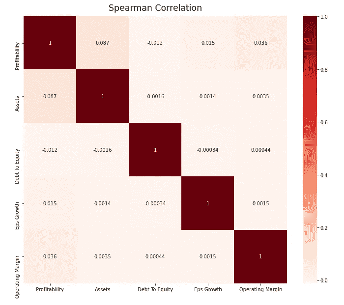

# 机器学习就是股票。建立无监督的公司分类。

> 原文：<https://towardsdatascience.com/machine-learning-is-stocks-pre-processing-for-unsupervised-company-classification-8f35ce8343f?source=collection_archive---------65----------------------->

## 亨尼投资

## 实现有意义的公司集群所需的数据探索和处理

[图片](https://stock.adobe.com/ca/search?filters%5Bcontent_type%3Aphoto%5D=1&filters%5Bcontent_type%3Aillustration%5D=1&filters%5Bcontent_type%3Azip_vector%5D=1&filters%5Bcontent_type%3Avideo%5D=1&filters%5Bcontent_type%3Atemplate%5D=1&filters%5Bcontent_type%3A3d%5D=1&filters%5Bcontent_type%3Aimage%5D=1&filters%5Binclude_stock_enterprise%5D=0&filters%5Bis_editorial%5D=0&k=clusters&order=relevance&safe_search=1&search_page=6&search_type=pagination&limit=100&acp=&aco=clusters&get_facets=0&asset_id=342670068)作者[新非洲](https://stock.adobe.com/ca/contributor/293582/new-africa?load_type=author&prev_url=detail)

这篇文章的想法是建立一个新的，**数据驱动的公司分类**基于他们的财务状况，而不是他们做的业务类型。

这项研究的前提是基于这样一个想法，即值得购买的优秀股票在同行中会更优秀。在这种情况下，我将同行群体定义为具有**相似财务结构**(例如，小市值、大量债务、盈利)的一组公司。

如果你没有读过介绍，我建议你在这里读一下我为这项研究写的前言:

*   [机器学习就是股票。重新定义公司集团](/machine-learning-in-stocks-re-defining-company-groups-1b4872459458)

# 加快速度

在[上一篇文章](/machine-learning-in-stocks-re-defining-company-groups-1b4872459458)中，我选择了 5 个维度来定义公司的财务结构:

*   盈利能力——捕捉公司是否赚钱
*   总资产——捕捉公司规模
*   负债权益比——捕捉融资结构
*   营业利润——捕捉盈利的难度
*   每股收益增长(EPS) —捕捉逐年增长

我还确保了这些维度是独立的。这是一个重要的考虑因素，因为我想衡量一家公司在各个独立领域的表现，而不考虑它在其他领域的表现。这是我之前展示过的 Spearman 相关图:

来自 [Vhinny](https://www.vhinny.com/download) 的财务数据

# 数据探索

在我进入集群之前，让我们评估一下这 5 个特性的分布。理解分布对于选择合适的聚类算法至关重要。它还会显示出我将在预处理过程中处理的数据中的潜在流。

以下是所有**五(5)** 特征在单一图上的分布:

选择功能的分布

**X 轴**显示每个特征的值。 **Y 轴**显示落入每个对应箱的公司数量。对于这项分析，每家公司都在 2019 年报告了一次财务状况。本研究中使用的公司总数约为 4，000 家。

有几个观察可能会引起人们的注意:

*   负**债转股**
*   高得惊人的比例**债务对股权**低于 0.5
*   **资产**和**债转股**的偏态分布

负债转股并不常见，但也是可能的。虽然债务不能为负，但如果总负债超过公司总资产，权益可以为负。

**偏斜分布**也可以，只是我们在选择聚类算法时必须记住这一点。一些算法依赖于正态分布的假设，这在这里不成立。

大多数低于 0.5 的债务权益比率确实令人担忧。许多上市公司严重依赖债务融资，债务融资往往超过股东权益。经过进一步的研究，我在这个特性中发现了许多 0，表明在数据提取过程中存在潜在的流动。纵观我选择的所有特征，除了盈利能力，我认为它们都不为零。

用空值代替所有的 0 后，我们看到**债务与股本**比率发生了显著变化。其他功能没有受到显著影响:

选择功能的分布

该图与之前的图相同，除了**深蓝色**图表仅使用**非零值**构建。将蓝色图表放在红色图表之上，唯一明显的区别是债转股的特征。我会相信蓝色前进，依靠我的商业意识。

# 选择聚类算法

聚类练习一般是一半艺术，一半科学。因为没有一致的度量来评估算法的性能，所以在找到可行的解决方案之前，经常尝试许多算法。虽然一些距离测量可以用于比较，但它仍然是相当抽象的。流行的聚类方法的一个很好的概述可以在[这里](/the-5-clustering-algorithms-data-scientists-need-to-know-a36d136ef68)找到。

我为这项研究选择的方法是 **K-means** 聚类，因为它的计算效率、 **O(n)** 和相对简单的配置。我要做的唯一决定是关于簇的**数量**，它可以通过实验以一种非常简单的方式确定。

# 集群前的最后步骤

在数据探索阶段，我们已经看到了**资产**和**债转股**特征的偏态分布。由于 **K-means** 算法是基于寻找数据中的最优均值，因此偏态分布是危险的，因为异常值可能会不可控地将这些均值拉向自己的方向。

处理这个问题的一个方法是去除异常值。由于 4，000 个示例并不是过多的数据，因此删除数据点是不可取的。相反，我可以在分布中强制执行**最大值**和**最小值**以减小它们与平均值的距离。

一种方法是使用分位数和四分位间距来限定分布中的最小**和最大**值。在这种情况下，我使用了

*   Q1-3 * IQR 封顶**分钟**
*   Q3+3*IQR 到上限**最大值**

其中 **Q1** 和 **Q3** 以及第一个(25%)和第三个(75%)分位数和 **IQR** 是四分位间距。我为 **IQR** 任意选择了 **3** 的倍数，以保持上限相对远离中间值，从而不会显著扰乱原始分布。

下面是此操作的示例代码，以更好地说明这种方法。

此封顶过程应用于数据集中的所有要素。**资产**和**债务对权益**比率的最终分配如下所示:

原始分布尾部封顶的效果

# 后续步骤

本分析的**数据探索**和**预处理**阶段到此结束。在下一篇文章中，我将根据数据确定最佳的集群数量，并确定公司的特征。

顺便说一下…🤚

# 我们连线吧！

我很高兴与那些和我分享通往**财务独立之路的人联系。如果你也在寻求经济独立，或者你想与人合作，交流想法，请联系我们！以下是一些可以找到我的地方:**

*   [www.vhinny.com](http://www.vhinny.com/)—投资研究平台，为您自己的分析提供金融数据
*   [https://www.linkedin.com/company/vhinny](https://www.linkedin.com/company/vhinny)——加入我们 LinkedIn 上的社区，在那里我和其他贡献者分享与投资相关的内容

干杯！