# 深入研究支持向量机

> 原文：<https://towardsdatascience.com/machine-learning-iv-support-vector-machines-kaggle-dataset-with-svms-57d7c885652a?source=collection_archive---------47----------------------->

## 以及用支持向量机求解的 Kaggle 数据集

# 内容

在本帖中，我们将介绍:

(一)支持向量在支持向量机中的作用

(二)支持向量机的成本函数

(iii)支持向量机作为大幅度分类器

(iv)在核的帮助下通过支持向量机的非线性决策边界

(v)使用支持向量机的欺诈性信用卡交易欺诈数据集检测

在[之前的](https://medium.com/analytics-vidhya/contents-9b2e49f49fe9)帖子中，我们仔细研究了机器学习中的高偏差和方差问题，并讨论了正则化以及其他一些技术如何在解决这些问题中发挥重要作用。在本帖中，我们将详细了解另一种被称为支持向量机的监督学习算法。在本帖的后面，我们将解决一个 Kaggle 数据集，以检测使用 SVM 的欺诈性信用卡交易。

# 支持向量机(SVM)

SVM 是一种受监督的机器学习方法，解决回归和分类问题。然而，它主要用于分类问题，其中它在 n 个特征维度中构造超平面。n 维特征空间有一个 n-1 维的超平面。例如，在具有两个特征的数据集中(二维特征空间)，由 SVM 构建的超平面是曲线(直线、圆等)。)如果我们正在解决两个类的分类问题，那么 SVM 分类器的工作是找到使两个类之间的间隔最大化的超平面。在我们了解支持向量机的工作原理之前，我们先来了解一下支持向量机这个名字的由来。

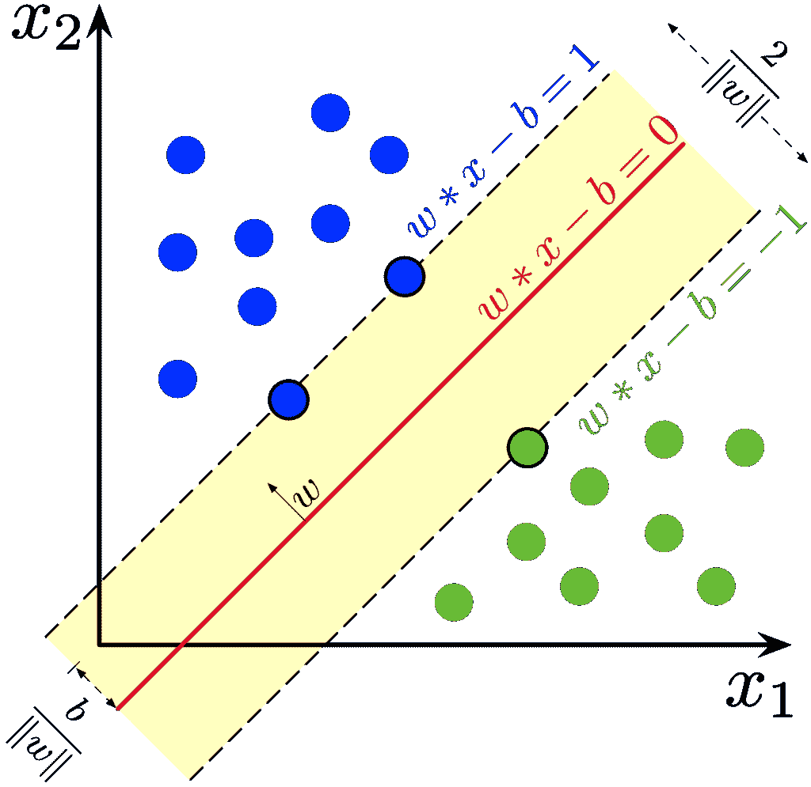

SVM 在行动([来源](https://en.wikipedia.org/wiki/Support_vector_machine#/media/File:SVM_margin.png)

# 什么是支持向量？

我们知道 SVM 分类器为分类构建超平面。但是 SVM 分类器是如何构造超平面的呢？让我们通过只考虑两个类来发展直觉。我们知道超平面必须从两个类中间的某个地方通过。这些类之间的良好分离通过超平面来实现，该超平面与来自两个类的最近训练数据点具有最大距离。在旁边的图中，标记每个类的极端的 2 条虚线构成了每个类的支持向量。这些支持向量有助于在它们的支持向量的帮助下找到最大化超平面与两个类别中的每一个的距离(余量)的超平面。

# 支持向量机的工作原理

支持向量机可以拟合线性和非线性决策边界作为分类器，并且与逻辑回归相比，支持向量机的主要优势之一是，由于成本函数大大简化，它们可以快速计算训练参数。

价值函数

让我们回忆一下逻辑回归中用于二元分类的二元交叉熵代价函数。这里，为了简化起见，我们将忽略偏差项，因此我们通过逻辑回归对总共“m”个训练示例中的第 I 个训练示例进行的最终预测将表示为 h(x(i)) = sigmoid(W * x(i))

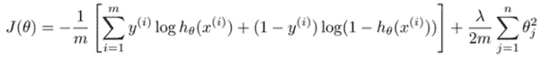

这个成本函数可以分为两部分:当 y(i) = 1 时，项(1-y(I))* log(1-h(x(I)))变为 0，当 y(i) = 0 时，项 y(i)*log(h(x(i))变为 0。这些方程(成本对 W * x)的对应图表(不包括正则项，因为它对两者都是通用的)是:

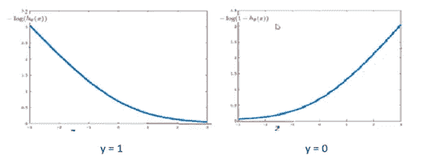

SVM 使用了这个成本函数的轻微修改，这提供了它比逻辑回归计算的优势。对于 y = 1 的情况，我们看到，当 W * x >= 1 时，成本函数的所有值都更接近于 0，当 W * x < 1, the -log(h(x)) function values are approximated by a straight line by calculating the derivative of the cost function when W * x = 0\. Similarly for the case y = 0, we see that the cost function has all its values closer to 0 when W * x <= -1 and when W * x > 1 时，通过计算 W * x = 0 时成本函数的导数，log(1-h(x))值由直线近似。

现在，由于我们不再使用对数成本函数，让我们将逻辑回归成本函数中的对数部分重命名。我们把 **-log(h(x))换成 cost1(h(x))** ，把 **-log(1 — h(x))换成 cost0(h(x))** 。我们在这里忽略常数(1/m ),因为它不影响我们的最小化目标，并有助于我们简化计算。因此，支持向量机的最终成本函数如下所示:

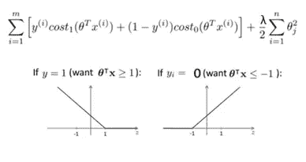

这导致成本函数的以下数学等式:

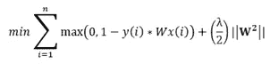

与输出概率值的逻辑回归不同，支持向量机输出 0/1。当 h(x) >=1 时，SVM 输出 1，当 h(x) <= -1, the SVM outputs 0\. In logistic regression, we saw that when h(x) > 0 时，输出为概率> 0.5，四舍五入为 1，当 h(x) < 0, the output was a probability < 0.5 which was rounded-off to 0\. The range of (-1, 1) is an *时，额外的安全系数*允许支持向量机做出比逻辑回归更有把握的预测。

现在让我们稍微重新参数化一下成本函数。目前，我们的成本函数是 A + λ*B 的形式，其中 A 是成本函数，B 是正则项。我们把它转换成 C*A + B 的形式吧，这里 C 的作用类似于 1/λ。

# SVM 作为一个大幅度分类器

前面，我们读到了支持向量在寻找一个超平面中的作用，该超平面作为一个分类器，与两个类中的每一个都有最大的距离。这种分类器被称为**大幅度分类器**。大范围分类器是以更大的置信度预测给定数据点的类别的分类器。逻辑回归的情况并非如此。让我们看看为什么这种情况会发生在 SVM 身上。

我们将 SVM 成本函数重新参数化为 **C*A + B** ，其中 **A** 是与 SVM 输出(成本分量)相关联的损失， **B** 是正则化项(正则化分量)，并且 **C** 起到类似于 1/λ的作用。当我们选择 **C** 非常大的时候，那么我们的模型就容易过拟合。为了应对这一点，我们希望 **A** 应该接近零，否则将会有不希望的巨大成本。由于 **A** 的值与参数 W(在图中用‘θ’表示)成正比，这意味着参数本身将具有非常小的值。因此，在 C 较大的情况下，优化目标只是找到 **B** 中出现的训练参数的最小值。正式定义，这种情况下的最小化目标是:

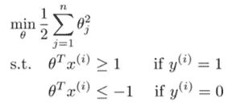

在 SVMs 的实现中，使用向量化，并且计算向量 W(图中的“θ”)和特征向量(X)的点积。从矩阵乘法的知识中，我们知道当计算两个向量(假设 **u** 和 **v** 的点积时，我们得到向量 **u** 在向量 **v** 上的投影。同样，当计算 W 和 X 的点积时，我们得到矢量 X 在 W 上的**投影，并且投影的长度( **P** )等于**

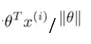

其中||thetha||是θ的 L2 范数。这个等式可以表示为:

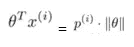

因此，最小化目标可以重新表述如下:

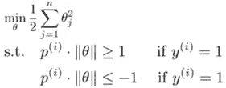

现在让我们举个例子来看看这个最小化目标是如何在 SVM 产生大幅度分类器的。

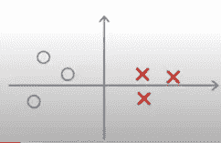

考虑下面的二元分类问题，其中“X”表示特征 x1,“O”表示特征 x2。根据我们当前的优化目标，我们知道只有当 p.||theta|| <= -1 for y = 0 (x1) and p.||theta|| > = 1 且 y = 1 (x2)时，SVM 才能最小化成本函数，即训练样本的投影和参数向量之间的角度分别在 900–1800°和 2700–3600°之间。

在下图中，考虑左图(绿色)中的决策边界。参数向量(θ向量)与其垂直，因为参数向量右侧的区域具有 900–1800°的角度，而决策边界左侧的区域具有 2700–3600°的角度。对于这个决策边界，我们看到训练样本(用红色和粉红色表示)的投影长度相当小。在这种情况下，为了满足 p . | |θ| |<= -1 for y = 0 (x1) and p.||theta|| >= 1(x2)的条件，θ需要具有大的值。因此，成本函数的值并未最小化，因此左侧图像中以绿色表示的决策边界不会被 SVM 选择。

现在，考虑下图右边的决策边界(绿色)。对于相同的训练示例，我们看到它们在参数向量上的投影与之前的决策边界相比更大。现在为了满足 p.||theta|| <= -1 for y = 0 (x1) and p.||theta|| > = 1 (x2)的条件，我们已经有了一个很大的投影向量值‘p’。这意味着小的θ值就足够了，这反过来也最小化了成本函数。因此，右图所示的决策边界最有可能被 SVM 选择用于二元分类任务，通过比较两个决策边界，我们可以清楚地看到，SVM 选择的分类器确实是一个大间隔分类器。


让我们记住，当 SVM 方程 **C*A + B** 中的参数 **C** 非常大时，证明了我们上面得出的结论。当 **C** 的值很小时，我们可以得到类似的结果，因此我们推广了这一说法。我鼓励读者思考这个问题。这将有助于进一步阐明 SVM 背后的数学原理。

# 非线性决策边界的 SVM

到目前为止，我们已经看到了 SVM 被用作具有线性决策边界的分类器的场景。SVM 使用内核方法来完成这项任务。在讨论核方法之前，让我们理解为什么复杂的多项式特征不适用于非线性 SVM 分类。让我们借助线性回归对它有一个直观的认识。

在线性回归中，对于具有“n”个输入特征的训练数据，我们将输出表示如下:

y = W1x1 + W2x2 + W3x3 + ………+ Wnxn。

对于“m”个训练示例，我们得到的输出是一条直线。那么，我们怎样才能得到一个非线性的决策边界呢？我们知道，次数大于 1 的多项式会产生非线性输出。但是使用这些多项式作为输入特征存在以下问题:

(I)对于小至 5 个特征的数量，有无数种选择特征的可能性。输出的示例表示可以是 y = w1x 1+w2x 2 x3+w3x 1 x4 X5+w4x2x 4+………(可能有几吨)。请记住，5 次多项式不需要具有 5 次多项式的所有特征。

(ii)对于如此复杂的特征表示，不能直观地确定决策边界，这使得难以调整特征以获得更好的结果。

(iii)此外，计算这些复杂的特征在计算上非常昂贵，因此是不期望的。

## 核心方法

由于上述非线性分类器的多项式特征向量的所有缺点，SVMs 通过结合使用[核方法](https://en.wikipedia.org/wiki/Kernel_method)提供了一种非常智能和有效的方法来生成非线性决策边界。内核的神奇之处在于找到一个函数，避免了高维计算所隐含的所有麻烦。在机器学习中，核方法是一类用于模式分析的算法，其最著名的成员是支持向量机。内核方法需要用户指定的内核，即原始表示中成对数据点的**相似性函数**。核方法优于特征向量，因为它们在计算复杂的非线性决策边界时大大减少了计算时间。内核方法的输出是一个标量。

在这里，虽然我们将核的使用限制在 SVM，但需要注意的一件重要事情是，可以使用点积表示的每个机器学习算法都可以用核来代替。然后，我们可以使用这些带有内核的机器学习算法中的任何一种，这两种算法都能提供更快、更好的结果。尽管有[不同类型的内核方法](https://data-flair.training/blogs/svm-kernel-functions/)，我将使用高斯内核做进一步说明。

## 生成非线性决策边界

如果内核不进行如此复杂的计算，那么它们是如何生成如此好的非线性决策边界的呢？为训练示例定义一些**界标**，并且使用相似性函数(内核)使用每个定义的界标来计算每个示例的相似性。训练样本 *xi* 和地标 *lj* 的**高斯核**或高斯相似度函数表示为 **exp(-||xi — lj||2 / 2σ2)** 。由此，我们可以看到，对于靠近地标的训练示例 *xi* ，其特征值 *fi* 接近 1，而对于远离地标的训练示例 *xi* 其特征值接近 0，这似乎是相似性的良好度量。

使用高斯核计算的相似性值被认为是各个训练示例的新特征值，然后可以将其与它们的权重参数(W/θ)相联系，以计算最终的输出类别。在帖子的前面，我们看到最小化目标受制于权重向量和输入特征向量的点积> =1 或<= -1\. After computing the new feature values using kernels, the conditions of the optimization objective change a bit. Although the inequality values remain the same, the dot product is now computed between the weight vector and the new feature vector computed using Gaussian kernel. Just to clarify, although the output of the kernel method is a scalar value, that scalar value is computed against a single landmark. Against L landmarks, L values are computed which then form a feature vector for a given training example.

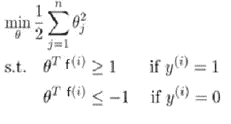

Minimization objective when C > > 1 的条件，并且使用了核方法

考虑一个训练数据集(具有 2 个仅用于演示目的的要素),该数据集具有 2 个没有线性决策边界的输出类。让我们看看在训练集上定义几个界标(假设 3 个)如何帮助解决非线性决策边界。在下图中，我们看到，对于粉红色的训练示例 X，与地标 L2 和 L3 相比，它非常接近地标 L1。对于这个例子，使用高斯核计算相似性，我们得到对应于 L1 的特征值 f1 接近 1，对应于 L2 和 L3 的特征值(f2 和 f3)接近 0。根据上面的等式，我们预测一个当θ* f > = 1 时。现在，如果对应于这些特征的θ值是 2、0.5 和 1，则 2*1 + 0.5*0 +1*0 = 2 即> = 1。对多个训练示例执行相同的步骤给我们提供了具有高精度的适当的非线性决策边界。

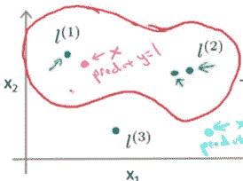

## 选择地标

我们看到了界标结合核方法如何帮助定义支持向量机中复杂的非线性决策边界。现在，选择地标的明显问题出现了。选择标志的一种方式是将所有训练示例转换为标志，然后通过使用高斯核计算训练示例和每个标志之间的相似性来计算每个训练示例的特征向量。

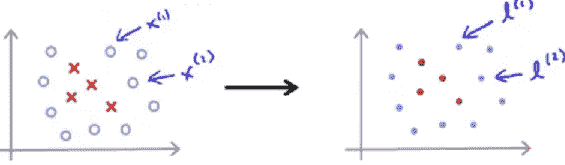

地标测绘训练示例

一旦选择了这些标志并且计算了这些新的特征向量，最终的优化目标被修改为:

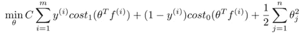

其中 f(i)表示使用高斯核计算的新特征向量。这里要注意的一点是，特征向量的数量(n)将等于训练样本的数量(m ),因为每个训练样本都是地标。

## 计算权重参数

在线性和逻辑回归中，我们看到了如何使用梯度下降来计算权重。我们不能使用原始形式的梯度下降来计算支持向量机的最优权重参数，因为 SVM 中的成本函数在所有点上都不可微。因此，为了计算 SVM 的权重参数，使用了梯度下降的一些变体，如亚梯度下降，甚至各种复杂的算法。次梯度下降中的权重更新看起来像:

W = W — alpha * subgradient_wrt_W(J)，其中“alpha”是学习率。

求解次导数不像偏导数那么简单，需要我们很好地理解极限和不等式。斯坦福大学的这份 pdf 文件的前 2 页是一个很好的资源，它会给你一个如何计算次导数的直觉。

一旦计算出分类任务的最佳权重参数，我们就可以运行 SVM 分类器，计算训练和测试精度，以评估模型的性能。

在这篇文章中，我在 coursera 上教授支持向量机时使用了 Andrew NG sir 的各种例子，以及我提供直觉的能力。如果你有时间的话，我推荐你去看看他开设的[机器学习课程](https://www.coursera.org/learn/machine-learning)。

到目前为止，我们已经了解了很多关于支持向量机的知识。我们从支持向量的作用开始，然后深入理解 SVM 的成本函数如何隐含地倾向于大间隔分类器，随后使用核技巧来计算非线性决策边界，通过各种示例使事情易于理解。最后，我们了解到普通(普通)梯度下降在计算权重参数时是如何不起作用的，因此需要使用次梯度下降。学了这么多之后，现在是时候将我们的注意力转移到信用卡交易 Kaggle 数据集上，以巩固我们的概念并了解 SVM 的运行情况。

# 问题陈述

在本节中，我们将使用 SVM 来确定欺诈性信用卡交易。这个问题的数据集可以在[这里](https://www.kaggle.com/mlg-ulb/creditcardfraud)找到。这里需要注意的一点是，该数据集的特征已经作为 PCA(主成分分析，我们将在后面的帖子中看到)转换的结果进行了计算。它有两方面的帮助:

(I)维护用户数据的机密性。

(ii)由于 PCA 变换，数据集中的特征相互独立。

让我们从将数据集作为数据帧加载到内存开始。

```
import numpy as np
import pandas as pd
import matplotlib.pyplot as pltfrom sklearn import preprocessing, svm
from sklearn.metrics import confusion_matriximport os
for dirname, _, filenames in os.walk(‘/kaggle/input’):
  for filename in filenames:
    print(os.path.join(dirname, filename))
```

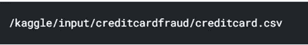

```
df = pd.read_csv(“/kaggle/input/creditcardfraud/creditcard.csv”)
df.head()
```

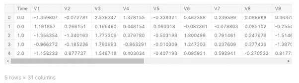

数据集有 31 个列/特征，其中 28 个是通过 PCA 变换计算的，其他特征只是数字特征。现在让我们看看欺诈性和非欺诈性交易在数据集中是如何分布的。

```
print(df[‘Class’].value_counts())
```

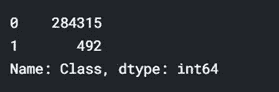

与 284315 笔非欺诈性(0)交易相比，有 492 笔欺诈性(1)交易，这是一个很大的偏差。显然，我们需要对我们的数据进行重新采样，否则我们可以通过简单地将每个交易预测为 0(非欺诈性)来实现高准确性。

```
print(“Accuracy by predicting all transactions as non-fraudulent: “ + str((284315 / (284315 + 492)) * 100) + “%”)
```


因为所有的欺诈交易都被忽略了，所以这样的系统没有用。我们需要等量的欺诈性和非欺诈性交易进行训练，以便更好地捕捉这两种交易的特征。首先，让我们从“时间”和“金额”两个方面来分析欺诈交易数据。

```
df_fraud = df[df[‘Class’] == 1]
plt.figure(figsize=(15, 12))
plt.scatter(df_fraud[‘Time’], df_fraud[‘Amount’])
plt.title(“Fraudulent transactions”)
plt.xlabel(“Time”)
plt.ylabel(“Amount”)
plt.show()
```

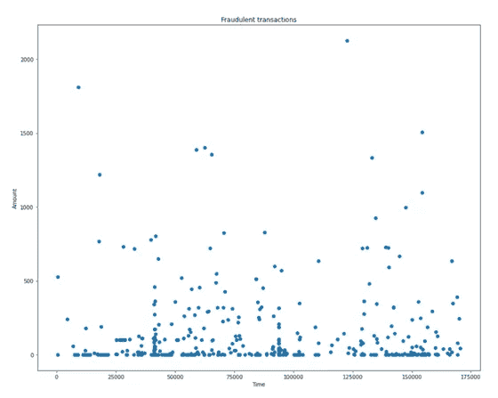

在任何时候，我们都有一些欺诈性交易，在预测它们时，时间是一个不相关的因素。此外，从上图可以看出，大多数欺诈交易的金额都非常小。

```
df_huge_fraud_amounts = df_fraud[df_fraud[‘Amount’] > 1000]print(“Number of fraudulent transactions over the amount of 1000 are: “ + str((df_huge_fraud_amounts.shape[0])))
```

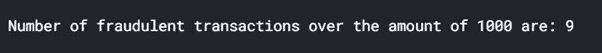

给定的数据集表明这些特征是使用 PCA 变换计算的，因此它们应该是相互独立的。让我们通过计算特征之间的相关性来检查是否是这种情况。

```
import seaborn as snsplt.figure(figsize = (15, 12))
df_correlation = df.corr()
sns.heatmap(df_correlation)
plt.title(“Heatmap representing correlations”)
plt.show()
```

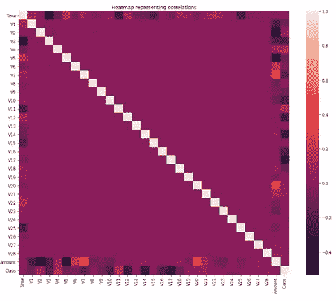

热点图的对角线代表最高的相关性(接近 1.0)，即要素与其自身的相关性。其他特征对之间的相关性具有-0.2 到 0.2 之间的值，这对应于非常小的相关性。这表示所提到的特性实际上是相互独立的，因此没有一个特性可以基于它们之间的依赖关系而被删除。

由于与非欺诈性交易相比，欺诈性交易的总数太小，我们需要对数据集进行重新采样。通过应用**过采样**，我们重复欺诈交易，直到它们在数量上接近非欺诈交易。通过应用**欠采样**，我们消除了一些非欺诈性交易，因此非欺诈性交易的最终数量与数据集中的欺诈性交易大致相同。通过对此数据集应用过采样，训练数据集将变得巨大(284315 个非欺诈性交易，相比之下只有 492 个欺诈性交易)，因此我们使用欠采样。

```
df_train = df[:200000]
df_train_fraud = df_train[df_train[‘Class’] == 1]
df_train_not_fraud = df_train[df_train[‘Class’] == 0]print(df_train_fraud.shape[0]) # 385
```

由于有 385 个欺诈交易，我们将把非欺诈交易减少到这个数字左右，以使每种交易的训练示例数量相等。

```
df_sample = df_train_not_fraud.sample(400)
df_train_final = df_train_fraud.append(df_sample)
df_train_final = df_train_final.sample(frac = 1).reset_index(drop = True)df_train_final.head()
```

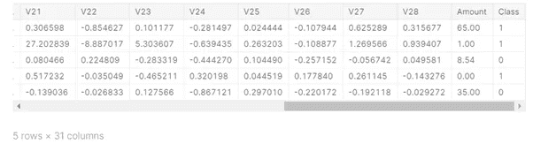

我们现在可以看到“Class”列既有 0 也有 1。我们从数据集中抽取了前 200，000 个样本，并从总共 284，315 笔非欺诈交易中随机选择了 400 笔(接近 385 笔)非欺诈交易。因此，我们已经成功地实现了欠采样，并且我们的最终训练集包括 785 个训练样本。欠采样会导致数据中一些重要特征的丢失。但是首先，让我们看看应用 SVM 分类器得到的结果。现在让我们将数据分成训练集和测试集。

```
X_train = df_train_final.drop([‘Time’, ‘Class’],axis=1)
y_train = df_train_final[‘Class’]X_train = np.asarray(X_train)
y_train = np.asarray(y_train)df_test = df[200000:]
X_test = df_test.drop([‘Time’, ‘Class’],axis=1)
y_test = df_test[‘Class’]X_test = np.asarray(X_test)
y_test = np.asarray(y_test)print(df_test[‘Class’].value_counts())
```

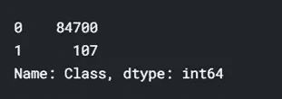

我们看到测试数据集包含 107 个欺诈交易。如果 SVM 分类器在非欺诈性交易上表现相当好，并且还可以检测到许多这些欺诈性交易，我们可以说我们的模型做得相当好。

```
classifier = svm.SVC(kernel=’linear’)
classifier.fit(X_train, y_train)
```


```
predictions = classifier.predict(X_test)
```

现在，我们已经对训练数据集应用了 SVM 分类器，并将测试数据集的预测结果存储在“预测”变量中。为了评估模型的性能，让我们绘制混淆矩阵并确定以下内容:

(i) **真正**:原始输出类为**正例**(此处为非欺诈交易)，预测输出类也为**正例**(此处为非欺诈交易)。

(ii) **误报** : 原始输出类是**正例**(此处为非欺诈交易)，但预测输出类是**负例**(此处为欺诈交易)。

(iii) **假阴性**:原输出类为**负例**(此处为欺诈交易)，但预测输出类为**正例**(此处为非欺诈交易)。

(iv) **真否定**:原始输出类**是否定示例**(此处为欺诈交易)，预测输出类**也是否定示例**(此处为欺诈交易)。

对于一个银行系统来说，如果一些非欺诈性交易被检测为欺诈性交易，他们会进行调查，但如果欺诈性交易被标记为非欺诈性交易，那么这可能会导致巨大的损失。因此，我们的目标是尽可能地减少假阴性的总数，同时也尽量降低假阳性的数量。现在，让我们画出混淆矩阵。

```
import itertoolsclasses = np.array([‘0’,’1'])def plot_confusion_matrix(cm, classes,title=’Confusion matrix’, cmap=plt.cm.Blues):
  plt.imshow(cm, interpolation=’nearest’, cmap=cmap)
  plt.title(title)
  plt.colorbar()
  tick_marks = np.arange(len(classes)) plt.xticks(tick_marks, classes, rotation=45)
  plt.yticks(tick_marks, classes) fmt = ‘d’
  thresh = cm.max() / 2. for i, j in itertools.product(range(cm.shape[0]),    range(cm.shape[1])):
    plt.text(j, i, format(cm[i, j], fmt),
    horizontalalignment=”center”,
    color=”white” if cm[i, j] > thresh else “black”)plt.tight_layout()
plt.ylabel(‘True label’)
plt.xlabel(‘Predicted label’)cm = confusion_matrix(y_test, predictions)
plot_confusion_matrix(cm,classes)
```


混淆矩阵有

(一)81746 真阳性

㈡3224 次误报

㈢11 次假阴性

㈣96 张真正的底片

由此，我们可以得出结论，大多数欺诈性交易都已被捕获，只有 11 个交易被错误分类，这比我们之前在解决此问题时讨论的产生极高准确性但没有捕获任何欺诈性交易的模型要好得多。

```
print(‘Total fraudulent transactions detected: ‘ + str(cm[1][1]) + ‘ / ‘ + str(cm[1][1]+cm[1][0]))
print(‘Total non-fraudulent transactions detected: ‘ + str(cm[0][0]) + ‘ / ‘ + str(cm[0][1]+cm[0][0]))print(‘Probability to detect a fraudulent transaction: ‘ + str(cm[1][1]/(cm[1][1]+cm[1][0])))
print(‘Probability to detect a non-fraudulent transaction: ‘ + str(cm[0][0]/(cm[0][1]+cm[0][0])))print(“Accuracy of the SVM model : “+str(100*(cm[0][0]+cm[1][1]) / (sum(cm[0]) + sum(cm[1]))) + “%”)
```

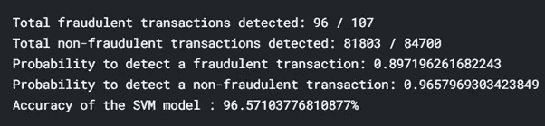

这篇文章的完整代码可以在[这里](https://www.kaggle.com/vardaanbajaj/credit-card-fraud-svm?scriptVersionId=38180580)找到。

我们的主要关注点是尽可能多地捕获欺诈交易，鉴于我们在整个数据集中只有大约 800 个欺诈案例，我们通过检测 96/107 欺诈交易完成了出色的工作。

这个帖子到此为止。我们深入研究了支持向量机的概念，我确保为每一部分都提供了直觉，以便读者更好地快速理解。我们唯一没有详细讨论的主题是次梯度下降，但是相信我，所有实现 SVM 的 python 包，只要你知道 SVM 是如何工作的，有了它们的所有参数，次梯度下降在这些包中是自动实现的。在下一篇文章中，我们将深入研究随机森林和决策树，并使用它们解决一个 Kaggle 数据集。