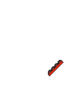
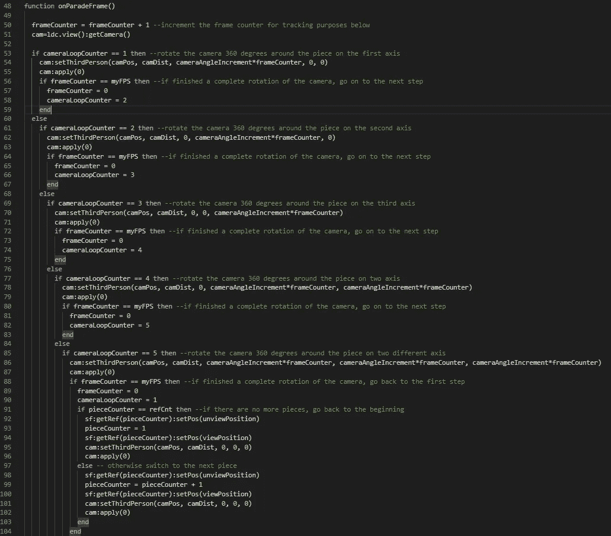
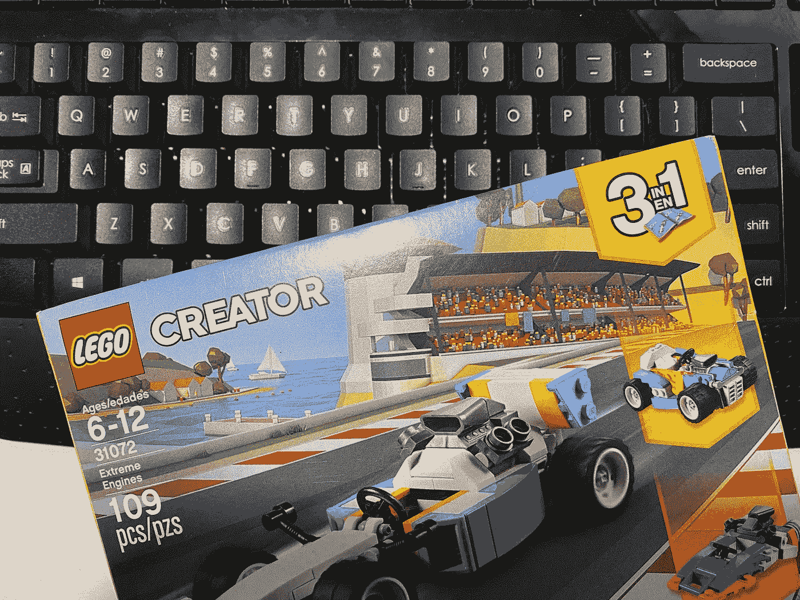
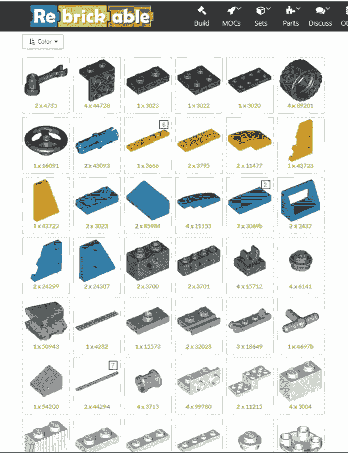
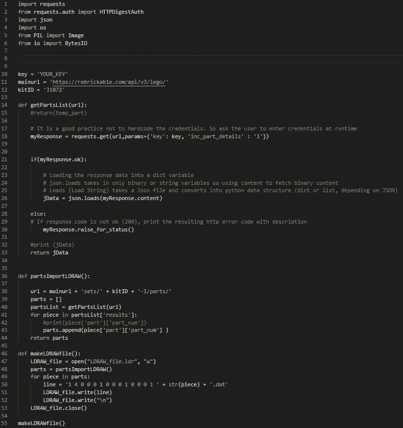
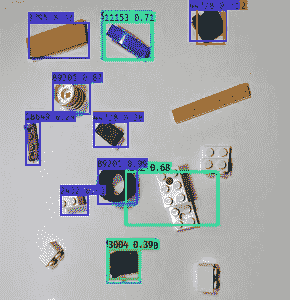

# 机器学习乐高图像识别:使用虚拟数据和 YOLOv3

> 原文：<https://towardsdatascience.com/machine-learning-lego-image-recognition-using-virtual-data-and-yolov3-f12e0544012?source=collection_archive---------9----------------------->

我最近一直在做乐高和 3D 模型。对于我目前的项目，我希望建立一个乐高图像识别程序。我的理想场景是抓起一把乐高，把它们扔在桌子上，拍张照片，然后让程序给它们分类。

*(乐高是乐高集团的注册商标，乐高集团并不赞助、认可或授权此事。登陆乐高官方网站*[*【http://www.lego.com】*](http://www.lego.com/)*。)*

我在任何机器学习项目中遇到的最大挑战是收集和格式化训练数据。我很确定这是每个人在机器学习中遇到的最大挑战。以正确的格式获得正确的数据总是交易杀手。

因此，我将使用乐高积木的虚拟 3D 模型来创建训练数据。

# 乐高分拣机

有几个很酷的例子，人们用乐高图像识别和机器学习来建造乐高分拣机。我的场景有点不同，因为我想从一张图片中同时识别多个 LEGO。不然我的场景和分拣机很像。第一个例子是这里的[和](https://jacquesmattheij.com/sorting-two-metric-tons-of-lego/)。他们似乎采取了暴力手段。手动标记一堆部件，训练算法，在乐高部件上重新运行…清洗，重复…直到你有工作解决方案。这是一个不错的方法，我以前在其他项目中使用过！但我一直在玩几个乐高 3D 建模程序，我在想它可能会创建虚拟数据。我最近遇到了一台[通用乐高分拣机](https://www.theverge.com/2019/12/11/21011792/lego-ai-universal-sorting-machine)，它引用了“虚拟”的积木，所以我猜他们的想法和我类似。[注:在我完成这个项目后，我发现了一个丹尼尔·韦斯特的精彩视频，他解释说他确实使用了[合成乐高数据](https://www.youtube.com/watch?v=-UGl0ZOCgwQ)用于他的通用分类机。]

# **虚拟训练数据**

好的，那么我需要哪些训练数据呢？我们需要大量的乐高图片，并标上乐高编号。我想从多个角度拍摄每件作品的照片。当我把一组乐高积木扔到桌子上时，它们会以不同的方向落地。正面朝上、颠倒、不同的旋转等。通常我会希望在一张图片中有多个乐高玩具的训练图片，每个图片上都有边界框。但是我要做几个简化的假设来开始。

正如我提到的，我花了很多时间在乐高建模软件上。有一些令人惊讶的开源和免费软件程序。我从 LDRAW.org 下载了一套这样的软件包。LDRAW 是一种被广泛接受“砖块”格式。(砖块是乐高，和乐高兼容的，塑料部件。)你真的应该花点时间探索一下 LDRAW 社区的创作，超级有创意！

我最终选定了 [LDCad](http://www.melkert.net/LDCad) ，这是罗兰·梅尔克特的一个很棒的程序。保养得很好。伟大的工具。我首先考虑使用其他开源的选项。我最初计划弄清楚一个命令行工具，最好是 python，它将从 LDRAW LEGO 模型自动生成图像。WebGL 的东西看起来很有前途。但是最终我意识到投资去真正理解底层脚本将会花费比我所能得到的更多的时间。LDCad 使用 LUA，这是一种脚本格式，有很多可用的脚本示例。这使得快速学习变得容易多了。

# **使用 LDCad**

让我们保持简单。我编写了一个 LUA 脚本，它遍历 LDRAW 文件中的一系列片段。对于每一个乐高积木，脚本通过一系列角度旋转相机来捕捉整个积木的图像。动画实际上看起来像作品本身在旋转，但它实际上是相机。

让我们来看看这是如何实现的。

LDCad 将脚本称为“动画”。我把我的动画游行叫做。为了方便起见，我将动画放在 LDCad 提供的 samples.lua 脚本文件中。

剧本分为两个主要部分:onParadeStart()和 onParadeFrame()。LDCad 中脚本的结构让我想起了微控制器状态机。基本上，onParadeStart()在用户启动动画时运行一次。并且 onParadeFrame()在动画的每一帧上运行。

所以在 onParadeStart()中，我初始化了 LDRAW 文件并定义了像 unViewPosition 和 ViewPosition 这样的常量。我还初始化了计数器，用于循环显示作品和相机视角。

onParadeStart()

在 onParadeFrame()中，我构建了一系列 if … else … if 来充当 switch 语句。它循环遍历所有的片段。循环所有动画模式。循环通过所有的摄像机视角。递增计数器并随着它的进行更新摄像机位置。

onParadeFrame()

我将每秒帧数(FPS)设置为 8，因为这给了我 8 张不同的图片，每张图片来自不同的相机视角，用于每个相机观察循环。动画的长度基于片段的数量乘以相机观察循环的数量。当你为机器学习训练阶段提取图片时，你将需要所有这些信息。

一旦设置并注册了游行脚本，它将作为一个菜单选项出现在 LDCad 程序中。您可以在 LDCad 中打开 LDRAW 文件，然后运行游行动画。LDCad 允许您将动画导出为一系列 png 图像文件。不错！

# 制作乐高图像

我拿了一个我在家里没有打开过的小乐高玩具。**31072-极限引擎。**

**31072 —极限引擎**

这是一个较小的套件，共有 109 件，49 个独特的作品。我认为这将是一个很好的项目测试。我使用了一个 python 脚本和 rebrickable.com 的[API](https://rebrickable.com/api/v3/docs)来下载这个特定套件的零件清单。

rebrickable.com

在 API 返回的 JSON 部件列表中，是 LEGO 部件 id 和相应的 LDRAW 部件 id。可重新点击 api 文档表明可重新点击零件号“主要”基于 LDRAW。深入研究 api 调用的 JSON 输出，我发现可重复调用的部分 id 是比 external_ids:LDraw 下面列出的 id 更可靠的 LDRAW id。不是 100%确定为什么，但它对这个项目来说已经足够好了。我编写了创建 LDRAW 文件的脚本，每个唯一的 LDRAW 部件 id 对应一行。

LDRAW 格式要求每行上的每个片段都有一个位置和方向。尽管这些坐标对我们的动画来说并不重要，但格式确实需要符合“子文件参考线”的 [LDRAW 文件格式](https://www.ldraw.org/article/218.html)

> 1 <color>x y z a b c d e f g h i</color>

*   1 表示“子文件参考线”
*   x y z 是位置坐标
*   a b c d e f g h i 是标准 4x4 齐次变换矩阵的左上 3×3 矩阵。
*   我选了 4(红色)作为颜色。(颜色不应该影响识别。)
*   例如……1 4 0 0 0 1 0 0 1 0 0 0 0 0 0 1 3023 . dat

一旦构建了 LDRAW 文件，我就在 samle.lua 脚本的注册函数中将动画长度设置为 245 秒。因为时长应该是(件数)*(相机循环次数)

> 49 * 5 = 245

在 LDCad 程序中，我加载了我的 LDRAW 文件，并运行动画来检查它。然后我选择会话->动画->OpenGL 导出选项。我设置了 300X300 的图像尺寸。也许比需要的要大，但是我想要足够的像素来适应不同的尺寸。我把背景设置为#FFFFFF(白色)。并导出到我选择的文件夹中。

导出动画后，我有了 1960 张图片。49 件独特作品各 40 张图片。这可能有些矫枉过正。或者它可能在角度和照明方面没有足够的变化。创新和实验将是反复的。

现在我们有了一些图像，让我们转向机器学习！

# **YOLOv3 物体检测**

我将使用 YOLOv3 算法进行训练。尽管 YOLO 特别限制“小对象”被“紧密地”组合在一起，但我认为这种实现方式会很好。小和靠在一起是相对的。如果我们试图在一张桌子上辨认出乐高积木，并且在图像中有更大的物体，这些限制将会是一个问题。但是如果整张图片是一个类似大小的乐高积木的集合，那么就没问题了。仅供参考——YOLO 绝对是矫枉过正。

YOLO(你只看一次)是速度优化。最常见的应用是实时或近实时视频分析。我们可以为这个项目选择 fast-CNN 或其他单镜头探测器。但是我想用 YOLOv3，因为我没用过，尝试新事物很好玩！

我找到了一个关于“[如何从头开始训练自己的 YOLOv3 探测器](https://blog.insightdatascience.com/how-to-train-your-own-yolov3-detector-from-scratch-224d10e55de2)”的快速演练。

让我们试一试吧！

# 培训数据格式

YOLOv3 需要一组带有边界框的带标签的训练图像。以及描述训练数据和图像的文本文件。文本文件所需的格式要求每个训练图像占一行，包含…绝对文件路径、xmin、ymin、xmax、ymax、label_id。x 和 y 坐标是要识别的对象的边界框。label_id 是对 data_classes 的引用。最终，label_id 将是每个 LEGO 块的部件 id 的引用。但是我们将把零件 id 放在 Data_classes.txt 文件中。

所以我构建了一个简短的 python 脚本，从部分 id 列表中创建 Data_classes.txt 文件。并将该文件放在“**数据- >模型 _ 权重- >数据 _ 类. txt** ”中

我有图像文件路径，可以从用于构建 Data_classes.txt 文件的零件号数组中获取 label_id。但是我也需要边界框。我确信有许多有效的方法来完成这项任务。但是我用了 PIL 的图片。这是一种作物用途。并且由于训练数据是人工的并且包含统一的背景，裁剪图像提供了与紧密边界框相同的坐标。

我创建了一个 python 脚本，将所有这些信息放在一个 data_train.txt 文件中。然后把那个文件放到“**Training _ Images->vott-CSV-export->data _ train . txt**”中。

在 YOLOv3 这样的模型上，可以尝试无数的调整和优化。如果您从上面链接的参考实现开始，设置这两个文件将允许您训练第一次迭代。

现在可以从命令行运行 Train_YOLO.py。

# 结果！

所以模型训练了很久。102 个时代。在我的家庭服务器上呆了 48 个小时。再说一次，我相信还有很多很多的优化要做。

我打开我的乐高盒子，抓了一把积木，扔在桌子上，拍了张照片，然后进行推理。

推理检测

我的天啊。不算太坏。在第一次训练中，它就答对了几道题！

正如所料，灯光和阴影扮演了重要角色。零件的方向也被考虑在内。越是独特的部分，比如车轮，越能被准确、频繁地挑选出来。

我认为这是一个很好的开始！没有任何模型调整，并使用简单的虚拟数据相机旋转动画程序。在这个项目快结束的时候，我发现了一段丹尼尔·韦斯特的视频，他解释说他确实在他的通用分类机器中使用了[合成乐高数据](https://www.youtube.com/watch?v=-UGl0ZOCgwQ)。他谈到了虚拟数据的挑战以及通过混合一些真实数据来改善结果的技巧。也许我会尝试一下。但是我也想到了另一个利用乐高和机器学习的酷项目。一天的时间永远不够。