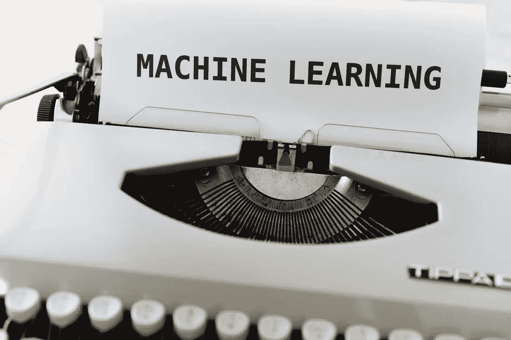
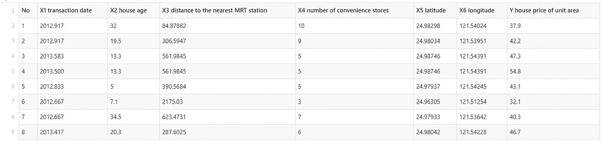
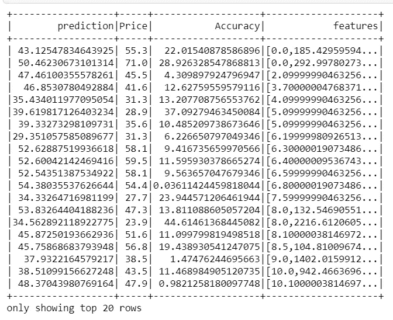

# 机器学习:使用 Pyspark 的线性回归

> 原文：<https://towardsdatascience.com/machine-learning-linear-regression-using-pyspark-9d5d5c772b42?source=collection_archive---------7----------------------->



[https://unsplash.com](https://unsplash.com)

**简介**:

PySpark 是用 Python 编写的 Python API，用于支持 Apache Spark。Apache Spark 是一个分布式框架，可以处理大数据分析。Spark 是用 Scala 写的，可以和 Python，Scala，Java，R，SQL 语言集成。Spark 基本上是一个计算引擎，通过并行和批处理系统处理大量数据。当你下载 spark 二进制文件时，会有单独的文件夹来支持上述语言。

基本上有两种主要类型的算法-转换器:转换使用输入数据集，并使用转换()将其修改为输出数据集。

估计器是采用输入数据集并使用 fit()生成经过训练的输出模型的算法。

在这一节，我将展示使用 [Spark](https://spark.apache.org/docs/latest/api/python/index.html) 和 Python 的机器学习实现。我将在这里重点介绍在 Spark 环境中实现的基本 ML 算法线性回归。该程序已在独立服务器中执行。

首先，如下所示导入库。最重要的是给出 Spark 二进制文件在系统中的路径。否则，您可能会在执行代码时遇到问题。

**火花时段**:

这是 Dataframe API & dataset 编程火花的入口点。它允许您使用 spark 执行各种任务。spark 上下文、hive 上下文、SQL 上下文，现在所有这些都封装在会话中。在 spark 2.0 之前，sparkContext 用于访问所有 spark 功能。spark 驱动程序使用 sparkContext 通过资源管理器连接到集群。sparkConf 创建 sparkContext 对象，该对象存储配置参数，如 appName(用于标识 spark 驱动程序)、应用程序、内核数量以及在 worker 节点上运行的执行器的内存大小。从 spark 2.0 开始，这两个特性被封装在 spark 会话中。因此，每次您想使用 spark 执行任务时，您都需要创建一个会话，并且在执行之后，您必须结束该会话。

现在使用 read.csv()读取数据集，您可以允许 spark 读取数据集并在需要时执行。这里我使用了一个 r[real estate dataset](http://Real estate.csv)used。



在这里，您可以注意到诸如 No 和 X1 交易日期之类的列与房屋价格无关，并且在数据集中没有正确给出交易日期。因此，我们将删除这些列

```
colm = ['No','X1 transaction date']
df = dataset.select([column **for** column **in** dataset.columns **if** column **not** **in** colm])
```

有一个很酷的 spark 语法可以做到这一点。如果您在 select()中应用列表理解，您将获得所需的数据框。此数据框不同于熊猫数据框。嗯，和《星火》和《熊猫》里创造的物体有关。

> Spark 数据帧是分布式的，因此在处理大型数据集时，您将获得并行处理和处理速度的优势。
> 
> Spark 确保容错。因此，如果您的数据处理在处理之间中断/失败，spark 可以从沿袭中重新生成失败的结果集。

```
df.printSchema()#outputroot
 |-- X2 house age: string (nullable = true)
 |-- X3 distance to the nearest MRT station: string (nullable = true)
 |-- X4 number of convenience stores: string (nullable = true)
 |-- X5 latitude: string (nullable = true)
 |-- X6 longitude: string (nullable = true)
 |-- Y house price of unit area: string (nullable = true)
```

如果您查看数据集的模式，它是字符串格式的。让类型转换浮动。

```
**from** **pyspark.sql.functions** **import** coldf = df.select(*(col(c).cast('float').alias(c) **for** c **in** df.columns))
```

让我们检查空值。

```
df.select([count(when(col(c).isNull(), c)).alias(c) **for** c **in** df.columns]).show()
```

太好了！不存在空值。但是列名有点长。所以我们现在将用我们自己的自定义名称来替换它们。重命名列名有几种技术，我使用 reduce()来实现。你可以用另一种方式表演。

```
**from** **functools** **import** reduce

oldColumns = df.schema.names
newColumns = ['Age','Distance_2_MRT','Stores','Latitude','Longitude','Price']

df = reduce(**lambda** df, idx: df.withColumnRenamed(oldColumns[idx], newColumns[idx]),range(len(oldColumns)), df)
```

> 尝试不同的技术，也让我知道。
> 
> 分享就是关爱: )

现在，我们将进行分割以获得要素和标签列。

**向量汇编器:**

[VectorAssembler](https://spark.apache.org/docs/latest/ml-features#vectorassembler) 是一个转换器，它将给定的列列表合并成一个向量列。这对于将原始特征和由不同特征转换器生成的特征组合成单个特征向量以训练 ML 模型是有用的。

```
**from** **pyspark.ml.feature** **import** VectorAssembler
*#let's assemble our features together using vectorAssembler*
assembler = VectorAssembler(
    inputCols=features.columns,
    outputCol="features")

output = assembler.transform(df).select('features','Price')
```

这将转换目标和功能列。现在我们将它分成训练和测试数据集。

```
train,test = output.randomSplit([0.75, 0.25])
```

现在让我们应用一个线性回归模型

```
**from** **pyspark.ml.regression** **import** LinearRegression
lin_reg = LinearRegression(featuresCol = 'features', labelCol='Price')
linear_model = lin_reg.fit(train)print("Coefficients: " + str(linear_model.coefficients))
print("**\n**Intercept: " + str(linear_model.intercept))#Output 
Coefficients: [-0.2845380180805475,-0.004727311005402087,1.187968326885585,201.55230488460887,-43.50846789357342]

Intercept: 298.6774040798928
```

我们得到的每一列和截距的系数。

```
trainSummary = linear_model.summary
print("RMSE: **%f**" % trainSummary.rootMeanSquaredError)
print("**\n**r2: **%f**" % trainSummary.r2)#Output
RMSE: 9.110080

r2: 0.554706
```

用于测试数据集

```
**from**  **pyspark.sql.functions** **import** abs
predictions = linear_model.transform(test)
x =((predictions['Price']-predictions['prediction'])/predictions['Price'])*100
predictions = predictions.withColumn('Accuracy',abs(x))
predictions.select("prediction","Price","Accuracy","features").show()
```



r-测试数据集的平方值

```
**from** **pyspark.ml.evaluation** **import** RegressionEvaluatorpred_evaluator = RegressionEvaluator(predictionCol="prediction", \
                 labelCol="Price",metricName="r2")
print("R Squared (R2) on test data = **%g**" % pred_evaluator.evaluate(predictions))#output
R Squared (R2) on test data = 0.610204
```

现在让我们检查调整后的 R 平方。

**调整后的 R-square:**

**调整的 R 平方**是 **R 平方**的修改版本，已经针对模型中预测器的数量**进行了**调整。只有当新项对模型的改进超过偶然预期时，**调整后的 R 平方**才会增加。当预测者对模型的改进小于预期时，它会减少。我们使用调整后的 R2 值来惩罚与输出数据不相关的此类特征的过度使用。

```
 r2 = trainSummary.r2
n = df.count()
p = len(df.columns)
adjusted_r2 = 1-(1-r2)*(n-1)/(n-p-1)
```

我们得到调整后的 r 平方值 0.54 用于训练和测试。

现在，让我们进一步探索 spark 中的 LinearRegression()。

```
lin_reg = LinearRegression(featuresCol = 'features', labelCol='Price',maxIter=50, regParam=0.12, elasticNetParam=0.2)
linear_model = lin_reg.fit(train)
```

在这里你可以应用套索，山脊，弹性网正则化，阿尔法值你可以修改。有一篇关于这些概念的非常好的文章。这是一个用于[学习 Apache Spark Notes](https://github.com/runawayhorse001/LearningApacheSpark) 的共享存储库。这个共享存储库主要包含文强在 [IMA 数据科学奖学金](https://www.ima.umn.edu/2016-2017/SW1.23-3.10.17#)期间的自学和自学笔记。感谢[乔治·冯](https://www.linkedin.com/in/wenqiang-feng-ph-d-51a93742/)，ML 实验室的高级数据科学家。

我将在未来的故事中分享其他 spark 实现的 ML 算法。

*对于建议，我将在*[*LinkedIn*](https://www.linkedin.com/in/somesh-kumar-routray/)*[*Gmail*](http://somesh.routray11@gmail.com/)*[*Twiiter*](https://twitter.com/RoutraySomesh)*&关注我在*[*GitHub*](https://github.com/someshkr)*的工作。***