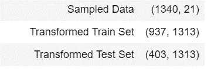
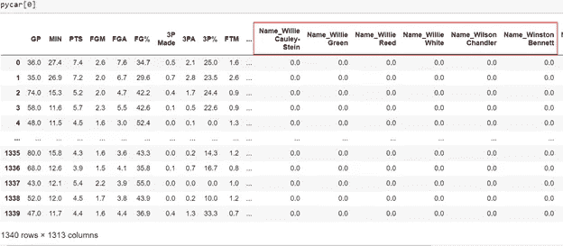

# PyCaret 简化了机器学习

> 原文：<https://towardsdatascience.com/machine-learning-made-easier-with-pycaret-907e7124efe6?source=collection_archive---------15----------------------->

## PyCaret 的工作

我们经常被困在时间紧迫的场景中，无法完成任务。在机器学习中，在这种情况下非常有用的库是 *PyCaret* 。

PyCaret 是 Python 中的一个开源库，对于一些机器学习活动非常有用。它可以帮助你从数据预处理到模型的部署。PyCaret 如此有用和方便的原因是，任何事情都可以用很少几行代码实现，并且代码非常容易理解。我们可以更专注于对数据进行实验，而不是写几行代码。除了有助于数据预处理、编码分类特征之外，PyCaret 还通过考虑尽可能少的性能指标(如准确性、F1 分数、召回率等)来了解哪个模型更好。


在 [Unsplash](https://unsplash.com?utm_source=medium&utm_medium=referral) 上 [Prateek Katyal](https://unsplash.com/@prateekkatyal?utm_source=medium&utm_medium=referral) 拍摄的照片

让我们深入 PyCaret 的工作。

# 1.安装:

PyCaret 的安装非常容易。它就像任何其他 python 库一样。可以通过在命令行中运行以下命令来安装它:

```
pip install pycaret
```

如果您使用的是 Google Collab，那么 PyCaret 可以通过以下方式安装:

```
!pip install pycaret
```

安装 PyCaret 将自动为您安装以下所有依赖项。


如果您不知道这些依赖性，您不必担心，因为 PyCaret 会处理这些依赖性。

一旦你安装了 PyCaret，你可以使用 **import pycaret** 将它导入到你的 jupyter 笔记本中

```
import pycaret
```

# 2.准备好数据

一旦 PyCaret 被导入，我们必须为构建模型准备好数据。我们可以通过以下两种方式加载数据:

*1。熊猫数据框*

*2。来自 PyCaret 存储库的数据*

让我们首先讨论如何使用 Pandas dataframe 加载数据。Pycaret 支持 pandas dataframe，可以通过使用“read_csv”和文件路径轻松加载数据。

```
import pandas as pd
data = pd.read_csv("data/train.csv")
data.head()
```


*以类似的方式，我们可以加载 pandas 支持的所有其他类型的数据。*

加载数据的另一种方法是使用 PyCaret 的存储库。它由可以非常容易地导入的数据集组成。如果您想了解 PyCaret 存储库中的数据集，请点击此处。

```
from pycaret.datasets import get_data
nba = get_data('nba')
```


# 3.环境设置

在设置环境之前，我们必须为数据集导入适当的模块。PyCaret 支持 6 个模块，这些模块中的任何一个都可以用一行代码导入。

PyCaret 支持以下 6 个模块。


Pycaret 环境的核心设置在于一个名为 setup()的函数。

setup()函数启动环境和管道来处理用于建模和部署的数据。在 PyCaret 中执行其他函数之前，必须启动该函数。

大约有 *50 个参数*被输入到 setup()函数中，但是我们不必担心，因为大多数参数都被设置为默认值，并且是可选的。只有*两个强制参数*需要输入，它们是 dataframe {类似数组的稀疏矩阵}和目标列。

setup()函数在后台自动进行 ***数据预处理和*** 数据采样。它在默认参数下运行，但是这些参数可以根据个人需求进行更改。

*在我们的例子中，我们取一个名为****【NBA】****的数据集，其中目标变量为****【TARGET _ 5Yrs】****，这是一个二元分类问题。因此，我们使用*导入分类模块

```
from pycaret.classification import *
pycar = setup(nba, target = 'TARGET_5Yrs')
```

一旦您运行上面的命令，您的数据集就被设置为一个分类模型，并且您可以看到输出消息声明 ***“设置成功完成！”*** 你会看到一组参数及其*描述*和与之对应的*值*。


## 现在让我们来看看 setup()函数的功能:

setup()函数对输入数据帧执行数据预处理。在任何 ml 模型中，数据预处理在构建 ml 模型中起着至关重要的作用。所以在 setup()函数中，PyCaret 为机器学习准备了超过 20 个特征的数据。机器学习管道是基于 setup()函数中定义的参数构建的。现在，我将详细解释 setup()函数中涉及的预处理步骤。如果你不知道这些，不要惊慌，因为我们的朋友 PyCaret 为我们做了这些。

PyCaret 为您处理的预处理功能有:

*—取样和分割*

*—缩放和变换*

*—数据准备*

*—特征工程*

*—无人监管*

让我详细阐述一下 PyCaret 能够完成的预处理步骤。

*   **取样和分割**

*(一)列车试分裂:*

机器学习中的任何数据集都被分成训练和测试数据集。这样做是因为当给定一个看不见的数据时，知道机器学习模型的工作是很重要的。在 PyCaret 中，默认情况下，70%的数据属于训练数据集，30%的数据属于测试数据集。

```
from pycaret.classification import *
reg1 = setup(data = nba, target = 'TARGET_5Yrs')
```

输出:



但是，只需在函数中传递 train_size 参数，就可以改变这些数据集的大小。

> 参数:*列车尺寸*

```
from pycaret.classification import *
reg1 = setup(data = nba, target = 'TARGET_5Yrs', train_size = 0.6)
```

分割后的数据(分割= 60%):

输出:


*(二)采样:*

如果数据集的样本/数据点很大，即超过 25，000 个样本，则 PyCaret 会自动进行采样。构建了具有各种样本大小的基本估计量，并获得了显示每个样本的性能度量的图。然后，可以在文本框中输入所需的样本大小。Sampling 是一个布尔参数，默认值为 True。

取样示例:

```
from pycaret.datasets import get_data
income = get_data('income')
from pycaret.classification import *
model = setup(data = income, target = 'income >50K')
```


此功能仅在 pycaret.classification 和 pycaret.regression 模块中可用。

*   **数据准备**

在执行机器学习流水线时，拥有正确的数据非常重要。很多时候，数据可能会损坏，可能会有一些丢失的值，或者应该对数据进行分类。所有这些在构建模型中起着至关重要的作用，需要在使用数据本身之前解决。

*(一)缺失值插补:*

数据中缺少记录是非常常见的，默认情况下，机器学习算法无法处理这个问题。PyCaret 自动进行缺失值插补。用于数字特征的缺省插补技术是“平均值”,用于分类特征的缺省值是“常数”。setup()函数中的参数名称是

> 参数:
> 
> 数值 _ 插补:字符串，默认= '均值'
> 
> 分类 _ 插补:字符串，默认值= '常量'

只要在 setup()函数中给出参数，就可以根据问题改变这些参数。

```
#import the hepatitis dataset from PyCaret repository
from pycaret.datasets import get_data
nba = get_data('hepatitis') 
```

启动设置( )之前:


启动安装程序( )后:


㈡改变数据类型:

PyCaret 自动检测数据集中存在的要素的数据类型。这些值有时可能是错误的。因此，这个问题可以通过给定一个参数来解决，例如

> 参数:
> 
> numeric_features = ['列名']
> 
> category _ features =[' column _ name ']或 date _ features = ' date _ column _ name
> 
> ignore _ features =[' column _ name ']

这些参数可用于覆盖 PyCaret 检测到的数据类型。当我们不想考虑任何特性时，可以使用另一个参数 **ignore_features** 。

示例:如果特性“GP”是分类的，但是 PyCaret 将其解释为数字，那么它可以被覆盖。


代码片段(从数字到分类):

```
from pycaret.classification import *
pycar = setup(nba, target = 'TARGET_5Yrs', categorical_features = ['GP'])
```

输出:


ignore_features 的示例:

这里我们将忽略数据帧的 ***MIN*** 列。


代码段(忽略数据集中的“MIN”列):

```
from pycaret.classification import *
pycar = setup(nba, target = 'TARGET_5Yrs', ignore_features = ['MIN'])
```

输出(“MIN”列已被忽略):


㈢一个热编码:

分类特征不能直接用于机器学习算法。必须使用一次性编码对它们进行分类。PyCaret 使用一键编码自动对分类特征进行编码。

示例:

在这里，名称是一个分类特征。因此 PyCaret 对其进行编码。


输出(' Name '列已被一键编码):



㈣序数编码:

与其他分类特征相比，遵循“差、好、优”等顺序的分类特征应进行不同的编码。这是由 PyCaret 通过发送一个参数来完成的

> 参数:序数 _ 特征:字典

默认值为无。

代码:

```
from pycaret.datasets import get_data
emp = get_data('employee')
```


```
from pycaret.classification import *
model = setup(data = emp, target = 'left', ordinal_features = {'salary' : ['low', 'medium', 'high']})
```

输出:

```
model[0]
```


㈤基数编码:

通过使用一键编码，可以为邮政编码或国家等特征获得非常大的稀疏向量。因此，我们可以使用基数编码来解决这个问题。Pycaret 在 setup()中有一个参数，它为您进行基数编码。参数是

> 参数:high_cardinality_features:字符串，默认值=无

代码:

```
from pycaret.datasets import get_data
inc = get_data('income')
```


```
from pycaret.classification import *
model = setup(data = inc, target = 'income >50K', high_cardinality_features = ['native-country'])
```

输出:


㈥处理未知水平:

我们多次遇到这样的情况，测试数据具有新的级别，而这些级别在训练数据中并不存在。这由 PyCaret 通过给定“最频繁”或“最不频繁”的值来自动处理。setup()函数中的参数是

> 参数:
> 
> handle _ unknown _ categorical，default = True
> 
> unknown _ category _ method:string，default = ' least _ frequent '

*   **缩放和变换**

比例和变换非常重要，因为有时数据可能会有很大的变化范围或不同的比例。

( *i)正常化:*

归一化是一个非常重要的预处理步骤，它将确保数值不会分布得太广。当参数 **normalize** 设置为 true 时，PyCaret 进行归一化。有几种方法可以标准化数据。参数 **normalize_method** 的默认值是 z 值，其中平均值为 0，标准差为 1。其他值包括 min-max(值的范围为 0 到 1)、maxabs(确保每个要素的最大绝对值为 1)、robust(根据四分位数范围进行归一化，如果存在异常值，则更好)。

> 参数:规格化，normalize_method

归一化示例(使用默认的 normalize_method: Z-score):


代码:

```
from pycaret.classification import *
pycar = setup(nba, target = 'TARGET_5Yrs', normalize = True)
```

输出:


normalize_method 的示例:

代码(使用“最小最大”方法进行标准化):

```
from pycaret.classification import *
pycar = setup(nba, target = 'TARGET_5Yrs', normalize = True, normalize_method = 'minmax')
```

输出:

```
pycar[0]
```


㈡转型:

转换用于将数据转换为高斯或近似高斯分布。当参数**转换**设置为 true 时，PyCaret 进行规范化。有几种方法可以转换数据。参数 **transformation_method** 的默认值是 **yeo-johnson。**transformation _ method 的另一个值是分位数。

> 参数:转换，转换方法

示例:

```
from pycaret.classification import *
pycar = setup(nba, target = 'TARGET_5Yrs', transformation = True)pycar[0]
```

输出:


*   **特征工程**

特征工程是机器学习的创造性方面。特征工程是利用乘法、三角函数、对数函数等特征的组合，将数据转换到另一个空间。

(一)特色互动:

PyCaret 允许通过使用现有功能创建新功能。两个要素可以彼此相乘或相除以形成新的要素。使用的参数有 ***特征 _ 交互(乘法)，特征 _ 比率(除法)*** 。默认情况下，这两个参数都设置为 false。这些参数可在 setup()功能中更改，以获得特征交互。

> 参数:
> 
> feature_interaction: bool，default = False
> 
> feature_ratio: bool，default = False
> 
> interaction_threshold: bool，默认值= 0.01

示例:

从 PyCaret 存储库导入“血液”数据集


代码:

```
from pycaret.classification import *
model = setup(data, target = 'Class',feature_interaction = True, feature_ratio = True)
model[0]
```

输出:


㈡多项式特征:

就像在特征交互中一样，新特征是使用多项式次数(a)创建的。使用的参数是**多项式 _ 特征**，默认设置为假，**多项式 _ 次数**是一个整数，默认设置为 2。这些参数可以在 setup()函数中更改，以获得多项式特征。

> 参数:
> 
> 多项式 _features: bool，default = False
> 
> 多项式次数:int，默认值= 2
> 
> 多项式 _ 阈值:浮点，默认值= 0.1

示例:

从 PyCaret 存储库导入“血液”数据集


代码:

```
from pycaret.classification import *
model = setup(data, target = 'Class', polynomial_features = True)
model[0]
```

输出:


(三)三角学特征:

这与多项式特征非常相似。使用的参数是**trigon metric _ features**，默认设置为 false。可以在 setup()函数中更改该参数，以获得三角函数特征。

> 参数:三角学 _features: bool，default = False

(四)群体特征:

当特征彼此相关时，可以使用 setup()函数中的 group_features 参数对这些特征进行分组。使用该参数可以获得平均值、中位数等信息。特性列表在参数 group_features 中传递。

> 参数:
> 
> group_features:列表或列表列表，默认值=无
> 
> group_names: list，默认值= None

(五)Bin 数字特征:

有时，连续要素可以有很大范围的值。在这种情况下，我们使用特征宁滨。setup()函数中使用的参数是 **bin_numeric_features** ，用于对数字特征进行绑定。

> 参数:bin_numeric_features: list，默认值= None

㈥结合稀有水平:

前面我们已经看到了一种热编码，其中像国家这样的特征在编码成数值时会生成一个稀疏矩阵。在这种情况下，模型的计算时间会随着要素数量的增加而增加。在这种情况下，特性中具有高基数的罕见级别被组合在一起。

> 参数:
> 
> combine_rare_levels: bool，default = False
> 
> 稀有级别阈值:浮点型，默认值= 0.1

*   **功能选择**

选择好的和有用的特征是非常重要的，因为它有助于模型的解释。

(一)特征重要性:

它用于确定在预测目标变量时最重要的特征。setup()函数中使用的参数是 **feature_selection** ，默认为假。另一个名为**的参数 feature_selection_threshold** 存在，需要使用，尤其是在使用多项式或特征交互时。默认值为 0.8。

> 参数:
> 
> feature_selection: bool，default = False
> 
> feature _ selection _ threshold:float，默认值= 0.8

㈡消除多重共线性:

当一个要素与另一个要素高度相关时，就存在多重共线性。这将导致模型不稳定。因此，可以通过使用参数**移除多重共线性**将其移除，该参数在 setup()函数中默认设置为 false。可使用参数**多重共线性 _ 阈值**设置阈值以删除特征的数量，默认设置为 0.9。

> 参数:
> 
> remove_multicollinearity: bool，default = False
> 
> 多重共线性 _threshold: float，默认值= 0.9

(三)主成分分析:

这主要用于降维。当数据集由许多维度组成时使用它。但是当使用 PCA 时，存在信息损失。这里使用的参数是 **pca_method** ，其默认值是线性的。其他可以使用的方法是 RBF 和增量。下一个参数是 **pca_components** ，它可以接受 int 和 float 值。如果给定一个整数值，那么它意味着要出现的特征的数量，如果存在浮点值，那么它意味着要保留的信息的百分比。

> 参数:
> 
> pca: bool，default = False
> 
> pca_method: string，default = 'linear '
> 
> pca_components: int/float，默认值= 0.99

㈣忽略低方差:

在多分类特征具有偏斜分布并且一个或两个特征相对于其他特征占优势的情况下，模型获得的方差将非常低。在这种情况下，我们可以忽略该功能。

*在忽略特征之前，应满足以下标准* [(参考)](https://pycaret.org/ignore-low-variance/) *:*

—特征/样本大小中唯一值的计数< 10%

— Count of most common value / Count of second most common value > 20 次。

> 参数:ignore_low_variance: bool，default = False

*   **无人监管**

㈠创建集群:

聚类对于无监督学习非常重要。通过将 create_cluster 值设置为 true，数据集中的每个点都被分配给一个特定的聚类，并且每个聚类都被用作一个新要素。Cluster_iter 参数用于控制用于形成一个聚类的迭代次数。

> 参数:
> 
> create_clusters: bool，default = False
> 
> cluster_iter: int，默认值= 20

㈡消除异常值:

离群值会影响模型的性能，因此需要移除。PyCaret 使用 SVD 通过 PCA 去除异常值。可以通过将参数 **remove_outliers** 设置为 true 来移除离群值。异常值的百分比可以由参数 **outlier_threshold** 控制，其默认值为 0.5。

> 参数:
> 
> remove_outliers: bool，default = False
> 
> outliers_threshold: float，默认值= 0.05

> 设置使用所有 belowinput 参数，但请记住，只需输入两个强制参数，即数据和目标，其余所有值均设置为默认值/可选值。

> **设置** ( ***data，target，*** *train_size = 0.7，sample_estimator = None，categorical _ features = None，category _ attraction = ' constant '，ordinal_features = None，high_cardinality_features = None，high _ cardinality _ method = ' frequency '，numeric_features = None，numeric _ attraction = ' mean '，date_features = None，ignore_features = None，normalize = False，normalize rare_level_threshold = 0.10，bin_numeric_features = None，remove_outliers = False，outliers_threshold = 0.05，remove _ multi 共线性= False，multi 共线性 _threshold = 0.9，create_clusters = False，cluster_iter = 20，polynomial_features = False，polynomial_degree = 2，trigonometry _ features = False，多项式 _threshold = 0.1，group_features = None，group_names = None，feature_selection = False，feature _ sel*

简而言之，你可以只使用下面的代码，而不是给出所有这些参数。

> 设置(数据、目标)

# 4.比较模型

PyCaret 的一个主要用途就是可以用来比较几种基于性能指标的机器学习模型。因此可以确定最佳模型。*这些模型通过使用 10 倍交叉验证进行计算。*这对于了解模型的行为以及哪个模型更适合非常有用。比较模型的代码非常简单。

> 比较模型()

```
compare_models()
```


*结果:*该函数返回一个分数网格，指定每个性能指标的最佳模型。

用于分类的性能度量是准确度、AUC、召回率、精确度、F1、Kappa。

用于回归的性能指标有 MAE、MSE、RMSE、R2、RMSLE、MAPE

该表按精度排序，但可以通过在排序参数中给定不同的值来修改。默认情况下，折叠值为 10。这可以根据我们正在解决的问题而改变。

# **5。创建模型**

一旦我们了解了哪个模型更好，就该创建模型了。创建模型的代码非常简单。

> create_model('模型名称')

输出是一个 knn 模型和一个分数网格，它说明了准确性、AUC、召回率、精确度、F1 和 kappa 值。

```
knn_model = create_model('knn')
```

结果:


我在 create _ model(‘KNN’)函数中使用‘KNN’表示构建了一个 K-NN 模型。同样，您可以通过在 create_model('model name ')中使用以下任一表示来构建其他模型。


默认情况下，模型是使用 10 倍 CV 创建的。相反，我们可以通过使用*折叠*参数来改变它。

***创建模型(使用 7 折 CV):***

> knn_model = create_model('knn '，fold = 7)

```
knn_model = create_model('knn',fold = 7)
```


输出:获得的结果 knn_model 将在 7 折交叉验证上训练。

***创建模型(四舍五入到小数点后两位):***

我们可以在创建模型功能中使用舍入参数来舍入性能指标。

> knn_model = create_model('knn '，round = 2)

```
knn_model = create_model('knn',round = 2)
```


结果:分数网格中的指标将四舍五入到两位数。

# 6.调整模型

顾名思义，我们可以使用 tune_model()函数来优化模型，在 create_model()函数中，模型是使用默认的超参数创建的。tune_mode()函数的功能是，它将自行调整模型的超参数，并生成一个分数网格作为输出。

*调谐前:*

```
knn_model = create_model('knn')
```


*调谐后:*

```
tuned_knn = tune_model('knn')
```


*Tuning_model(使用优化):*

使用的默认优化方法是 accuracy，但是我们可以通过使用 tuned_model()函数的优化参数来更改它。

> tuned_knn = tune_model('knn '，optimize='AUC ')

```
tuned_knn = tune_model('knn',optimize='AUC')
```


以类似的方式，我们可以使用其他优化措施，如“召回”、“精度”、“F1”。

*结果:*绩效评估值的得分有所提高。

# 7.集合一个模型

PyCaret 还执行模型的集合。由于集成提高了模型的性能(在大多数情况下)，我们可以在 PyCaret 中使用打包、提升、混合和堆叠来集成我们的模型。

> 集合 _ 模型(模型 _ 名称)

示例:对于这个示例，我们将构建一个简单的决策树，并在其上执行集成。

*创建一个简单的决策树:*

代码:

```
dt = create_model('dt')
```


*组装后:*

代码:

```
bag_dt = ensemble_model(dt)
```


我们可以看到组装后的显著差异。装袋是默认技术。

以类似的方式，我们可以执行增强、混合和堆叠。点击此处获取更多信息。

# 8.绘制和评估模型:

在一个模型被创建之后，绘制模型的性能度量并对其进行分析是非常容易的。使用 plot_model 可以实现不同类型的可视化，如 AUC、精度-召回曲线、决策边界等。

> plot_model(model_name，plot = "type ")

绘图代码:

```
logreg = create_model('lr')
plot_model(logreg, plot = 'boundary')
```


我们在代码中使用了 plot = "boundary ",它表示决策边界。以类似的方式，我们可以使用其他图使用他们的字符串类型。下表是 PyCaret 支持的绘图类型。


此外，对于包含概率的模型，我们可以在校准的分类器的帮助下使用模型校准来预测结果的真实概率。提供概率值增加了可解释性并减少了不确定性。

> 校准型号(型号名称)

代码:

```
#Create a simple decision tree
dt = create_model('dt')#Calibrate the model
calib_dt = calibrate_model(dt)
```

除此之外，还有一个非常有用的函数 **evaluate_model(model)** ，用于显示所有的可视化效果。这只适用于 jupyter 笔记本界面。它提供了一个交互式用户界面，我们可以在其中选择我们需要的可视化类型。

代码:

```
evaluate_model(logreg)
```


以下是 evaluate_model 工作方式的视频演示。


这些可视化对于不同的机器学习模块是不同的。[点击此处](https://pycaret.org/plot-model/)了解更多可视化信息。

# 9.解释模型

在 PyCaret 中也可以对模型进行解释。使用 shap 值来确定特征的重要性。形状值中的图形由 x 轴和 y 轴组成。x 轴由 shap 值组成，这些值以积极或消极的方式显示功能的影响。y 轴由特征值组成。

```
model = create_model('xgboost')
interpret_model(model)
```


shap 值主要用于确定某个要素对于预测分类标注的重要性。右侧的红色表示该功能做出了积极的贡献。

# 10.预测模型

到目前为止，所有的结果都是基于 k 倍交叉验证(训练数据集)。现在，我们将在测试数据集上预测模型的性能。

代码:

```
rf_holdout_pred = predict_model(rf)
```

创建模型后的输出:


在测试数据集上预测模型后的输出:


# 11.保存模型

PyCaret 使我们能够使用 save_model(name，model_name = ' ')将整个模型管道保存到二进制 pickle 文件中。一旦保存了模型，我们就可以使用 load_model()随时加载它。我们将保存在步骤 9 中创建的 xgboost 模型，命名为‘py caret _ model’。

代码:

```
save_model(model, 'pycaret_model')
```

我们可以通过使用 load_model()函数简单地加载这个保存的模型。

代码:

```
load_saved_model = load_model('pycaret_model')
#Now our previous model is loaded into **saved_model** and is ready to predict/classify. 
```

除了只保存模型，还可以使用 save _ experiment(experiment _ name = ' py caret _ experiment ')以类似于保存模型的方式保存整个实验。通过这样做，您可以保存所有的模型及其输出。

```
load_experiment(experiment_name='pycaret_experiment'
```

也可以实现实验的加载。

```
load_saved_exp = load_experiment(‘pycaret_experiment’)
```

这就是了，你最终训练好的模型/实验可以用一行代码调用和使用。我们还可以在 AWS 中[部署](https://pycaret.org/deploy-model/)构建好的模型。因此，我们可以使用非常少的代码行构建一个完整的管道模型。

# 结论

总之，PyCaret 是一个非常有用的库，可以帮助您节省大量的时间，因为您已经基本了解了机器学习中的概念，如算法如何工作、性能指标、数据预处理等。PyCaret 在很短的时间内产生显著的结果。我肯定会建议探索 [PyCaret](https://pycaret.org/) ，因为这是值得的！

我要感谢 [Moez Ali](https://medium.com/u/fba05660b60f?source=post_page-----907e7124efe6--------------------------------) 和 PyCaret 的团队提供了这个库。

*感谢阅读到最后。如果有任何错误或建议，请不吝赐教。*

如果你想联系我，请通过 LinkedIn 联系我。

## **参考文献:**

[](/announcing-pycaret-an-open-source-low-code-machine-learning-library-in-python-4a1f1aad8d46) [## 宣布 PyCaret:一个用 Python 编写的开源低代码机器学习库

### Python 中的开源低代码机器学习库。

towardsdatascience.com](/announcing-pycaret-an-open-source-low-code-machine-learning-library-in-python-4a1f1aad8d46)  [## 预处理- PyCaret

### PyCaret 是一个部署就绪的 Python 库，这意味着当您执行一个实验时，所有步骤都会自动…

pycaret.org](https://pycaret.org/preprocessing/)  [## 函数- PyCaret

### 函数是 PyCaret 中按顺序执行任务的一组操作。PyCaret 中的所有函数都接受一个输入…

pycaret.org](https://pycaret.org/functions/)