# PyCaret 让机器学习变得简单

> 原文：<https://towardsdatascience.com/machine-learning-made-easy-by-pycaret-5be22394b1ac?source=collection_archive---------40----------------------->

## 10 行代码的整个机器学习管道。


[PyCaret](https://pycaret.org/) 是由 [Moez Ali](https://www.linkedin.com/in/profile-moez/?originalSubdomain=ca) 创建的 python 开源低代码机器学习库，于 2020 年 4 月发布。它实际上是一个低代码库，允许用很少几行代码创建一个完整的机器学习管道。PyCaret 本质上是一个基于常见 python 机器学习库(如 scikit-learn、XGBOOST 等等)的包装器。

PyCaret 实现的是一个非常简单的函数式语法。例如，我们可以用一行代码比较 18 个分类模型。在本文中，我将使用 PyCaret 带您完成一个分类任务，并解释每个步骤的细节。

让我们从安装 PyCaret 开始:

```
!pip install pycaret
```

如果您使用 google colab 作为您的 IDE，并计划在笔记本中呈现交互式可视化，则需要执行以下代码:

```
from pycaret.utils import enable_colab
enable_colab()
```

我们将使用的数据集是 kaggle 上提供的“[电信客户流失](https://www.kaggle.com/blastchar/telco-customer-churn)”数据集。导入 numpy 和 pandas 后，我们可以将数据集读入 pandas 数据帧:

```
import numpy as np
import pandas as pddf = pd.read_csv("/content/Customer-churn.csv")
df.shape
(7043, 21)
```

数据集有 7043 个观察值(行)和 21 列。以下是列的列表:

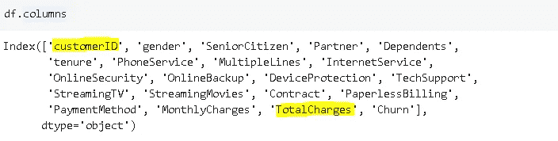

“CustomerID”没有任何提供信息的能力，因为它只是分配给每个客户的随机消息。“总费用”列是“任期”和“每月费用”列的乘积，因此我们也不需要此列。我们只删除这两列:

```
df.drop(['customerID','TotalCharges'], axis=1, inplace=True)
```

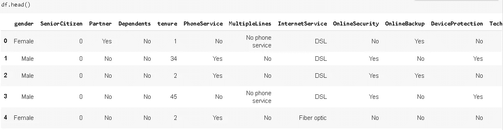

任务是使用提供的功能预测客户是否会流失(即离开公司)。我将跳过 EDA 过程，因为这篇文章的重点是如何使用 PyCaret。先来导入 PyCaret 的分类模块:

```
from pycaret.classification import *
```

# **设置**

PyCaret 工作流总是从`setup`函数开始，该函数为整个机器学习流水线准备环境。因此，`setup`必须在任何其他功能之前执行。

值得一提的是，setup 函数会推断数据类型，如果推断的数据类型正确，它会提示您按 enter 键。如果推断的数据类型有错误，您可以键入“quit”。有两个选项可以确定正确的数据类型:

*   使用 pandas 函数和方法手动更改数据类型
*   使用设置功能的**数字特征**和**分类特征**参数

```
exp_clf = setup(data = df, target = 'Churn', session_id=111)
```

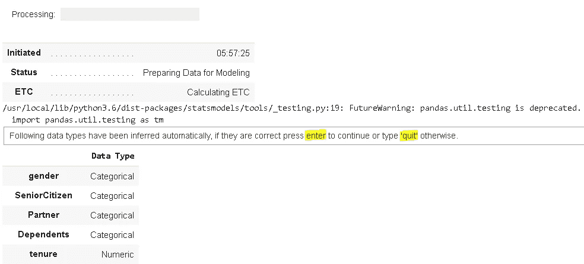

在我的例子中，数据类型是正确的，所以我按 enter 键。设置功能所需的参数有:

*   数据:数据帧的名称
*   Target:目标列的名称(因变量)
*   Session_id:一个随机数，用作以后再现的种子

执行设置功能后，我们会得到一个关于环境和参数设置的长长的信息列表。

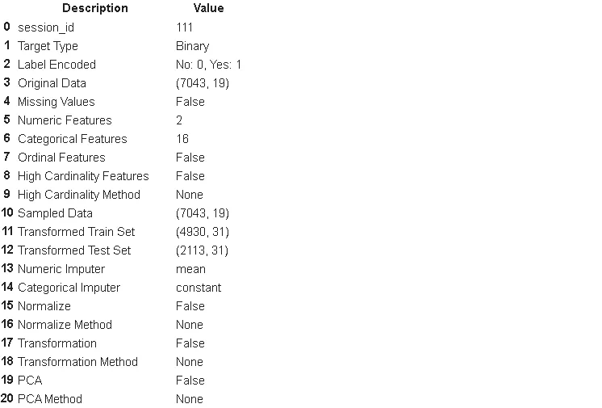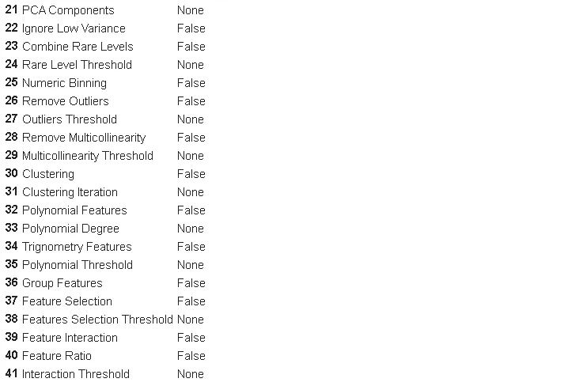

从列表中可以看出，这些参数允许您处理数据预处理步骤。它还将数据分成训练集和测试集。

# **对比车型**

一旦设置被执行，我们可以使用`compare_models`来简单评估 PyCaret 模型库中所有模型的性能。有 18 个分类器可用。Compare_models 函数训练所有模型，并在 6 个常用分类指标下评估它们的性能。

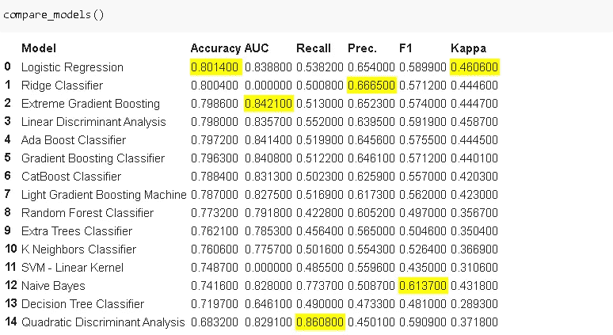

> 用一行(实际上是两个单词)代码，我们能够在 6 个不同的度量下比较 18 个模型。

最佳的 15 个被显示。排序基于“准确性”指标，但可以使用**排序**参数进行更改。分数通过 10 倍分层交叉验证来计算。使用**折叠**参数可以改变折叠次数。

我们刚刚做了一个粗略的评估。下一步是从这个列表中挑选一些算法来进一步改进。我们选择什么取决于手头的任务。为了简单起见，我将根据精确度指标选择最佳算法，即逻辑回归。

请记住，最佳评估指标可能会因任务和数据而异。准确度可能不是分类任务的最佳选择，尤其是当我们有不平衡的数据集时。

# **创建模型**

下一步是用选择的算法使用`create_model`函数创建一个模型。我们只需要传入模型的缩写。您可以检查函数的 docstring 来查找缩写。

```
help(create_model)
```

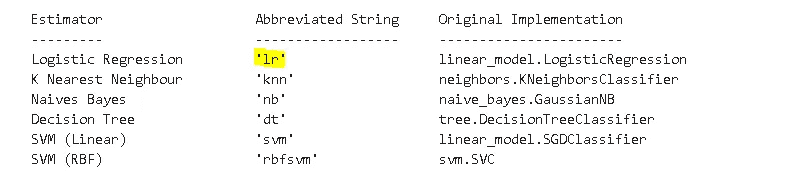

是时候创建一个逻辑回归模型了。

```
logreg = create_model('lr')
```

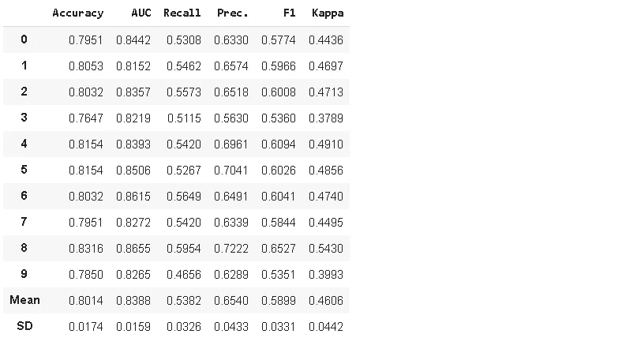

它返回一个数据框架，其中包含 10 重交叉验证的结果和 6 个不同的指标。平均值是我们从`compare_models`函数中得到的值。

**tune _ model**vs**create _ model**

模型性能的一个关键因素是调整超参数。对于某些模型，超参数对模型的精度影响很大。此外，它们在防止模型过拟合或欠拟合方面起着关键作用。 **Create_model** 函数使用超参数的默认设置。PyCaret 提供了 **tune_model** 函数，该函数在预定义的搜索空间内调整超参数。tune_model 函数有两个要点:

*   与 create_model 函数一样，Tune_model 将模型名称作为输入。它不需要您首先训练一个模型，然后调整它。
*   默认情况下，tune_model 试图优化精度指标，但可以使用**优化**参数进行更改。

可以按如下方式创建优化的逻辑回归模型:

```
tuned_logreg = tune_model('lr')
```

# **剧情模式**

Plot_model 函数提供了进一步分析模型性能的工具。它将经过训练的模型作为输入，并返回指定的绘图。让我们复习一些例子。

```
plot_model(logreg, plot='auc')
```

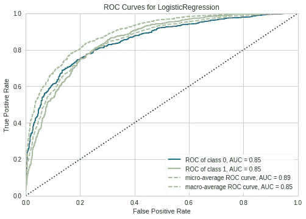

这是一个接收器工作特性(ROC)曲线，它通过组合所有阈值的混淆矩阵，总结了不同阈值下的模型性能。ROC 曲线的 x 轴是真阳性率(灵敏度)，ROC 曲线的 y 轴是假阳性率(1-特异性)。

我们只是提供了一个估计器(一个训练过的模型)和一种类型的图给`plot_model` ，它产生了一个信息可视化。有 15 种不同的地块可供选择。让我们也创建混淆矩阵和特征重要性图:

```
plot_model(logreg, plot='confusion_matrix')
```

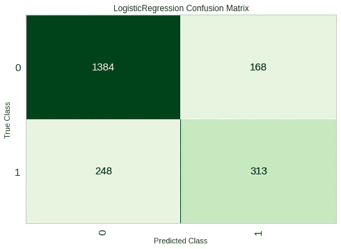

```
plot_model(logreg, plot='feature')
```

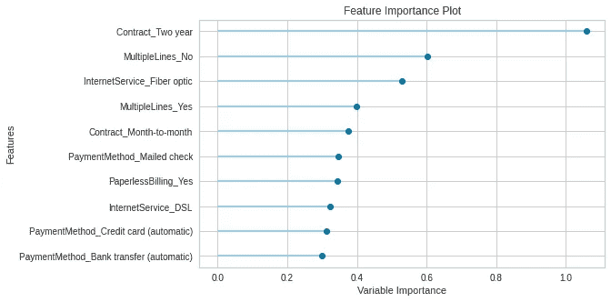

**注意:Evaluate_model** 函数产生一个用户界面，其中包含给定模型的所有可用图。它只需要一个估计器(一个训练好的模型)作为输入。

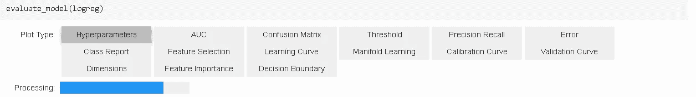

# **预测并最终确定模型**

**Predict_model** 函数用于对测试集进行预测。回想一下，我们在开始时运行的 setup 函数将数据集分为训练集和测试集。

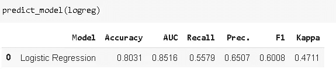

除了测试集上的评估指标之外，`predict_model`还返回带有两个新列的 dataframe:

*   标签:预测
*   得分:预测的概率

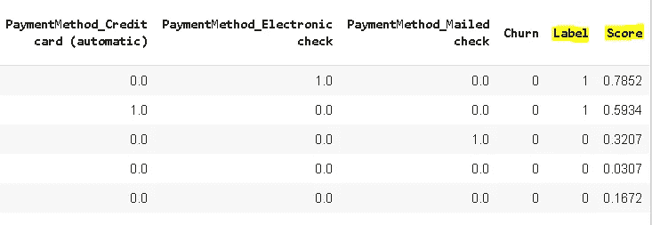

默认情况下，预测是在测试集上进行的，但是我们可以使用**数据**参数提供要预测的新观察值:

```
predict_model(logreg, data=new_data)
```

一旦我们对训练集和测试集的性能感到满意，我们就可以使用带有 **finalize_model** 函数的整个数据集(训练+集)来重新训练模型。目的是在部署模型之前利用整个数据集。请注意，在执行 finalize_model 函数之后，评估测试集的性能是没有意义的，因为模型已经看到了训练集和测试集中的所有观察值。确保在最终确定模型之前使用 predict_model。

```
final_logreg = finalize_model(logreg)
```

# **保存和加载模型**

**Save_model** 函数，顾名思义，将训练好的模型与整个管道一起保存。

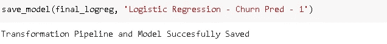

我们可以使用 **load_model** 函数加载已保存的模型。

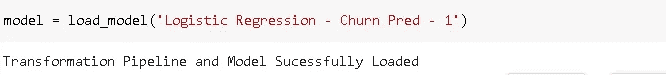

# **结论**

我们已经讨论了整个机器学习管道，并实验了 PyCaret 如何简化编码。我们能够用大约 10 行代码创建和评估一个体面的模型。使用 PyCaret 的典型管道可以按顺序使用以下函数创建:

*   设置()
*   比较模型()
*   create_model()或 tune_model()
*   绘图模型()
*   预测模型()
*   save_model()和 load_model()

感谢您的阅读。如果您有任何反馈，请告诉我。

# **参考文献**

*   pycaret.org