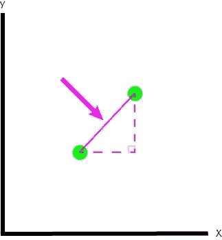
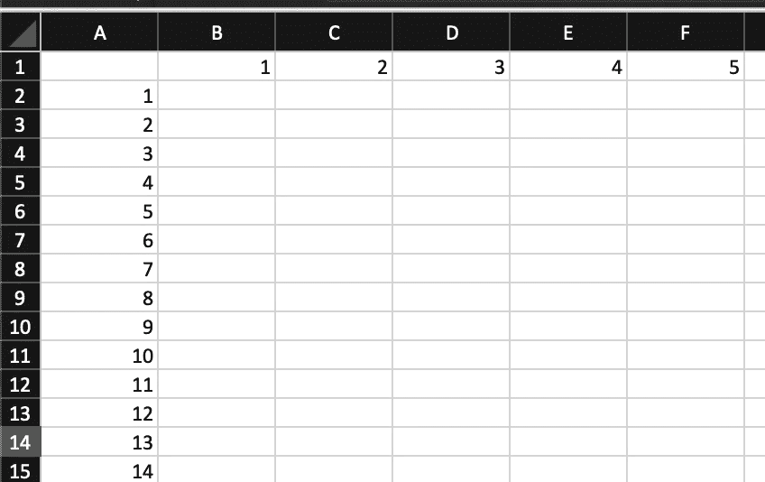
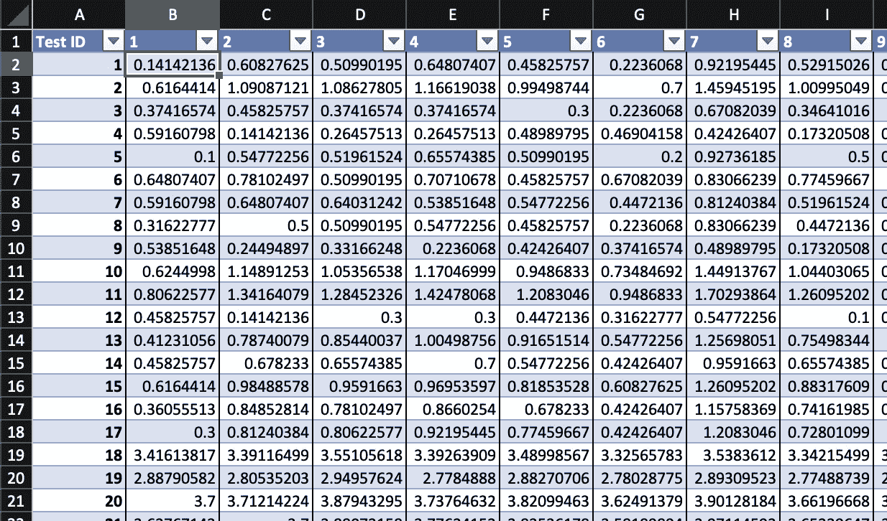
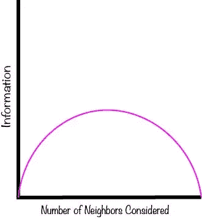
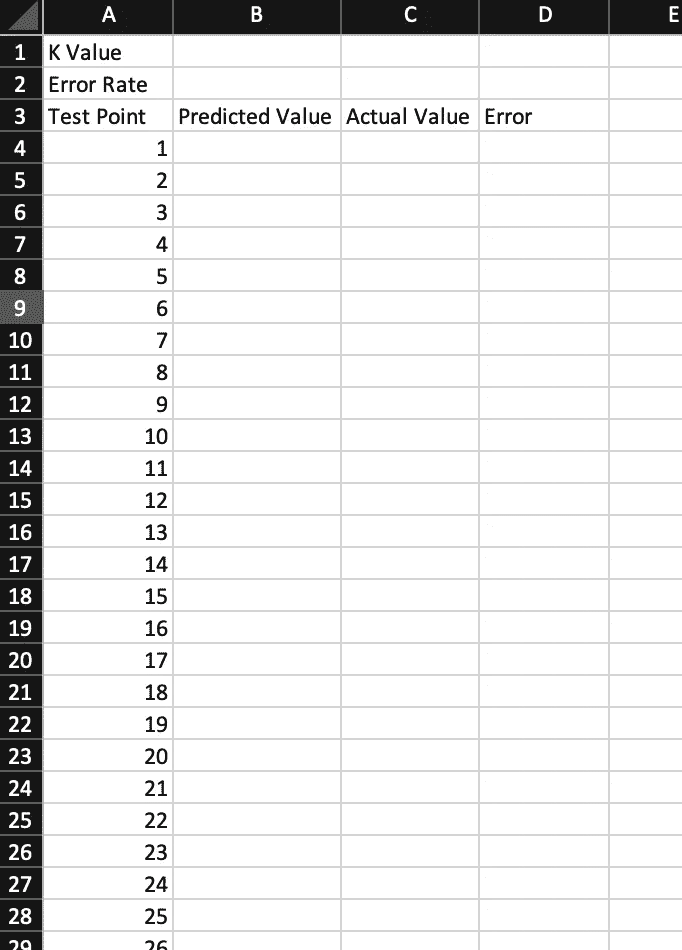
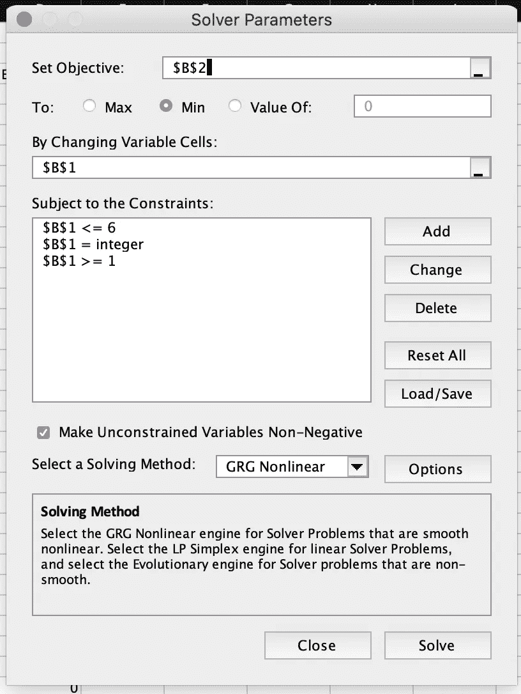
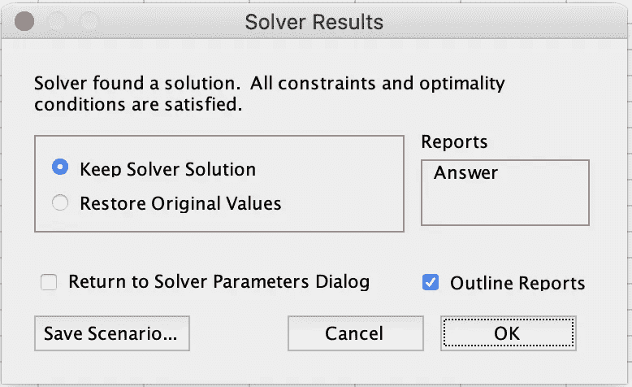

# 用 Excel 简化机器学习

> 原文：<https://towardsdatascience.com/machine-learning-made-simple-with-excel-1bffd7901502?source=collection_archive---------3----------------------->

## 对 ML 的简单介绍——不需要编程或数学。


照片由[像素](https://www.pexels.com/)上的 [Pixabay](https://www.pexels.com/@pixabay) 拍摄

到本教程结束时，您将已经实现了您的第一个算法，而无需接触一行代码。您将使用机器学习技术，通过 Excel 中的基本函数对真实数据进行分类。你不必成为天才或程序员才能理解机器学习。尽管自动驾驶汽车、杀手机器人和面部识别的应用已经普及，但机器学习(ML)的基础非常简单。这是一个尝试并了解这些新技术力量的机会。

# 关于 Excel 的免责声明

所有的数据科学家可能都对本教程的标题感到畏缩。对于严肃的数据分析来说，Excel 通常被认为是一个糟糕的工具。它无法处理我们在现实世界中处理的大型数据集，并且缺乏编程语言和机器学习库的一些关键功能。你会看到本教程中给出的许多公式都很复杂，以适应 Excel 的不足和特性。我使用 Excel 的原因是为了让非程序员也能理解这个介绍，因为我们大多数人都有这个工具的基本知识。那些选择更认真地追求机器学习和数据科学的人最终会升级到使用 Python 或 R，但从简单开始没有坏处。

# 我们的最终目标

本教程的最终目标是使用机器学习，通过实现 k-最近邻(KNN)算法，在一组真实数据上构建分类模型。不要不知所措，让我们一点一点地分解那是什么意思。

## 机器学习

机器学习是优化模型的技术集合。换句话说，机器学习采用我们建立的模型，并使用真实世界的数据来“学习”如何根据训练数据微调模型的参数，使其在真实世界的场景中最有用。在本教程中，我们将把机器学习应用于分类模型。如果你现在还不完全清楚，不要担心，在本教程结束时，你会确切地知道我在说什么。

## 训练集与测试集

机器学习算法基于一组训练数据来调整模型。训练数据是一个数据集，它包含我们所有可用的变量以及正确的分类。训练集可以用多种方式开发，但在本教程中，我们将使用由人类专家分类的训练集。重要的是要记住，机器学习模型只和训练数据一样好。你的训练数据越准确，越多越好。换句话说，垃圾进，垃圾出。

测试集通常是训练数据的子集，因为它还包含所有变量和正确的分类。区别在于我们如何使用它。虽然训练集有助于开发模型，但测试集会在真实世界场景中对其进行测试，并观察其效果如何。有很多复杂的方法来测量误差和测试模型，但是只要你掌握了基本的概念，我们就可以继续下去。

## 分类模型

分类模型只是一种数学工具，它根据一组变量或输入来确定您正在处理的事物的类别。例如，如果我想对一种动物是猫还是鱼进行分类，我可能会使用诸如该动物是否游泳、是否有皮毛以及是否进食等变量来确定它属于哪个类别。你会注意到两件事。首先，变量越多越好。有了更多的信息，你就可以更加确信你的分类是正确的。其次，有些变量比其他变量更有用或更有预测性。以最后一个例子为例，无论动物是否进食。不经意的观察者知道鱼和猫都吃，所以拥有这些数据对确定动物的种类没有用处。在这种情况下，机器学习的目标是在给定可用数据的情况下创建最有用的分类模型，并剔除不会提高模型有效性的输入。

## k 个最近邻居

k 近邻(KNN)是一种特定类型的分类模型。直觉很容易理解。该模型获取关于未知数据点的所有可用数据，并将其与数据的*训练集*进行比较，以确定该训练集中未知点最相似或最接近的点。其思想是未知数据点将最有可能与它最相似的已知数据点属于同一类。KNN 只是一种确定两个数据点之间相似性的数学方法。

## 虹膜数据集

对于本教程，我们将使用一个用于教授机器学习的经典数据集，称为[虹膜数据集](https://en.wikipedia.org/wiki/Iris_flower_data_set)。这是一个关于三种鸢尾花的数据集合和关于它们的四个数据片段:萼片长度、萼片宽度、花瓣长度和花瓣宽度。数据集已经准备好了，让初学者很容易直接进入。您可以通过点击右上角的“下载 zip”并在 excel 中打开内容，在此链接下载兼容 Excel 格式的数据[。](https://gist.github.com/netj/8836201#file-iris-csv)

# 准备我们的数据

正如我提到的，这个数据集应该易于使用。前 4 列(A-D)中的每一列都是数据的一个维度或特征。第五列 E 是花的种类。每一行都有自己的记录或数据点。如你所见，我们有 150 个已知的数据点要处理。

我们需要做出一个重要的决定:我们如何将这个数据集分成一个训练集和一个测试集。给定一个更大的数据集，我们可以使用优化技术来做出这个决定。因为这个数据集很小，而且是为初学者设计的，所以按照惯例，我们将把它分成 70/30。换句话说，我们将使用 70%的数据，即 105 个数据点作为训练集，剩余的 45 个数据点作为测试集。

我们现在将使用 Excel 随机抽取 70%的数据。首先，在工作表中添加一个名为“Random Value”的列，并使用 RAND()函数在 0 和 1 之间随机选择一个值。请记住，每次工作表重新计算时，RAND()函数都会重新选择一个新数字。为了避免这种情况，在生成我的数字后，我将复制它们(Ctrl+C ),然后将它们作为值(Ctrl+Shift+V)进行特殊粘贴，以便它们保持固定。我们将从单元格 F2 开始，向下拖动到最后一个数据点。

```
=RAND()
```

接下来，我将使用 Excel 的 rank()函数对它们进行 1 到 150 的排序，从如下所示的单元格 G2 开始，一直拖动到最后一个数据点。确保通过点击 F4 或手动添加$符号来锁定参考框架，否则这个公式不会像我们预期的那样工作。

```
=RANK(F2, $F$2:$F$15)
```

现在，每个数据点都有一个介于 1 和 150 之间的唯一值。因为我们希望我们的训练集有 105 个值，所以我们将再添加一列，并使用快速 IF()函数为我们的训练集选择从 1 到 105 的值。否则，我们将把这个值添加到我们的测试集中。同样，我们将从 H2 开始，向下拖动到最后一个数据点。

```
=IF(G2<=105,”Training”, “Test”)
```

此时，您的数据集应该像屏幕截图一样设置好了。请记住，因为我们每个人都采取了不同的随机样本，所以 F-H 列中的特定值对您来说会有所不同。您还应该花点时间为我们的下一步添加过滤器。


作者截图

接下来，我们将把两组数据分解到各自的工作表(或标签)中，以保持有序。创建一个名为“Training Set”的新工作表，并在原始工作表中筛选“Training”数据。将这些数据与标题一起复制并粘贴到您的“训练集”中您应该有 106 行(105 个值+标题行)。对工作表“测试集”执行相同的操作您应该有 46 行(45 个值+标题行)。

此时，您可以删除“Iris”工作表，并删除其余两个工作表中的 F-H 列，因为我们已经分离了数据。最后，我将在每个工作表的开头添加一个“ID”列，并通过简单地键入数字来分别标记每个数据点 1-105 和 1-45(向下拖动填充柄将是您的朋友，以节省您的工作)。这将有助于我们在下一节中进行计算。确保你的每一套都按照下面的例子来安排。


作者截图

# 构建模型

我们的数据现在已经准备好了，我们可以继续构建我们的模型。提醒一下，该模型通过将我们希望分类的未知数据点与其最近或最相似的邻居进行比较来工作。要做到这一点，我们需要在测试集中取每个点，并计算它到训练集中每个点的*距离*。

## 距离的概念

距离是数学家确定 n 维空间中哪些点最相似的方法。直觉告诉我们，两点之间的距离越小，它们就越相似。我们大多数人习惯于在二维空间中计算距离，例如 x，y 坐标系或使用经度和纬度。有几种方法可以计算距离，但为了简单起见，我们将使用欧几里德距离。下面是二维空间中欧几里得距离公式的可视化。如您所见，该公式的工作原理是在两点之间创建一个直角三角形，并确定斜边的长度，斜边是三角形的最长边，如箭头所示。



作者的图解

我们的数据集是四维的。我们很难想象超过 3 维的空间，但是不管你是否能想象，我们仍然可以用同样的方法计算两点之间的距离，不管维数是多少。欧几里德距离的通用公式如下:


知识共享许可下的维基百科截图

简单地说，这意味着两点之间的欧几里德距离 q & p 可以通过对每个点取每个维度来确定，从第一维开始，迭代求它们之间的差的平方，直到对所有维度都这样做，并将差加在一起。然后我们求这个和的平方根，就得到欧几里德距离。这听起来很复杂，但是一旦我们回到数据中，你会发现它实际上非常简单。

## 计算距离

在我们的工作簿中，创建一个名为“距离”的新工作表我们的目标是创建一个 45X105 矩阵，表示测试集和训练集中每个数据点之间的距离。在我们的例子中，每一行对应于测试集中的一个数据点，每一列对应于训练集中的一个数据点。从 A2 开始，逐行向下，直到到达 A46，用数字 1-45 填充每个单元格。同样，填充柄在这里很有用，所以你不必一个接一个地输入数字。现在，从 B1 开始，然后一列一列地横向排列，直到你到达 DB1，用数字 1-105 填充每一列。你的矩阵应该看起来像下面的截图，其中显示了一小部分。



作者截图

在继续之前，您需要将您的矩阵转换为表格，以便我们可以保持事情有组织。选择整个矩阵并按 Ctrl+T，然后将表格命名为“Distance_Table ”,并选择创建带有标题的表格。接下来，您需要将第一列命名为“Test ID ”,方法是在单元格 A1 中键入该名称。

既然桌子已经摆好，我们可以开始计算了。我们将从单元 B2 开始，它将计算训练集中的第一个点(ID #1)和测试集中的第一个点(ID #1)之间的距离。我们可以使用 excel 中的 VLOOKUP 函数来快速应用欧几里德距离公式，找到每个维度的值，然后根据需要进行计算。最好将此公式复制并粘贴到单元格 B2 中的编辑栏，因为它可以处理 Excel 中表格功能的一些特性，但请确保您理解此公式所做的一切是应用我们之前讨论的欧几里德距离公式。如前所述，您可以拖动它来填充整个表格。

```
=SQRT(((VLOOKUP(NUMBERVALUE(Distance_Table[[#Headers],[1]]), ‘Training Set’!$A$1:$F$106, 2, FALSE)-VLOOKUP(Distance_Table[@[Test ID]:[Test ID]], ‘Test Set’!$A$1:$F$46, 2, FALSE)) ^ 2+(VLOOKUP(NUMBERVALUE(Distance_Table[[#Headers],[1]]), ‘Training Set’!$A$1:$F$106, 3, FALSE)-VLOOKUP(Distance_Table[@[Test ID]:[Test ID]], ‘Test Set’!$A$1:$F$46, 3, FALSE)) ^ 2+(VLOOKUP(NUMBERVALUE(Distance_Table[[#Headers],[1]]), ‘Training Set’!$A$1:$F$106, 4, FALSE)-VLOOKUP(Distance_Table[@[Test ID]:[Test ID]], ‘Test Set’!$A$1:$F$46, 4, FALSE)) ^ 2+(VLOOKUP(NUMBERVALUE(Distance_Table[[#Headers],[1]]), ‘Training Set’!$A$1:$F$106, 5, FALSE)-VLOOKUP(Distance_Table[@[Test ID]:[Test ID]], ‘Test Set’!$A$1:$F$46, 5, FALSE)) ^ 2))
```

您应该会得到这样的结果:



作者截图

## 查找最近的邻居

在这个阶段，我们已经计算了测试集中的每个点和训练集中的每个点之间的距离。现在，我们需要确定测试集中每个点的最近邻居。创建一个名为“Nearest Neighbors”的新工作表，从 A2 开始逐行向下，用数字 1-45 填充单元格，以对应我们测试集中的点。我们的专栏不会像在以前的表单中那样代表训练集。相反，这些将代表 6 个最近的邻居，从第一最近的开始，然后是第二最近的，依此类推。第一个最近的邻居距离最小，第二个最近的邻居距离第二小，依此类推。您的工作表应该如下所示:


作者截图

正如我们之前所做的，我们将在 B2 单元格中编写一个公式，可以拖动它来填充矩阵的其余部分。我们的方法是识别距离表中对应行(2)中的最小值，找到该值的列号，然后返回列名，因为这将为我们提供定型集中该值的 ID。我们将使用索引[和匹配](https://www.excel-easy.com/examples/index-match.html)函数的组合来实现这一点。请注意，我们能够使这个公式变得简单，因为我们有先见之明，将距离矩阵设置为 Excel 中的一个表格，因此我们可以轻松地获取标题。

```
=INDEX(Distance_Table[#Headers], MATCH(SMALL(Distance!$B2:$DB2, **1**), Distance!2:2, FALSE))
```

拖动此公式以填充最近邻矩阵的第一行。您需要手动调整 SMALL()函数中的粗体值来表示我们正在寻找的邻居。例如，要找到第二个最近的邻居，公式如下。

```
=INDEX(Distance_Table[#Headers], MATCH(SMALL(Distance!$B2:$DB2, **2**), Distance!2:2, FALSE))
```

请记住，您的值将是不同的，因为您用来形成测试集的随机样本与我的不同。


作者截图

在这个阶段，我通常会花一分钟时间，在可行的情况下手动仔细检查其中一行，以确保我的公式按预期运行。在大规模测试中，你会想要使用自动化测试，但是现在我们保持简单。

我们还有最后一步:我们需要确定每个最近邻居的分类。我们将回到 B2 的公式，并对其进行修改，以在训练集中对 ID 进行 VLOOKUP，并返回分类。然后我们将拖动它来填充矩阵。

```
=VLOOKUP(NUMBERVALUE(INDEX(Distance_Table[#Headers], MATCH(SMALL(Distance!$B2:$DB2, 1), Distance!2:2, FALSE))), ‘Training Set’!$A$1:$F$106, 6, FALSE)
```

## 后退一步

让我们后退一步，看看我们已经完成了什么。现在，您已经为测试集中的每个点确定了 6 个最近邻的分类。您可能会注意到，对于所有或几乎所有的数据点，6 个最近的邻居都属于相同的分类。这意味着我们的数据集是高度聚集的。在我们的例子中，我们的数据高度聚集有两个原因。首先，正如我们在教程开始时所讨论的，数据集被设计成易于使用。其次，这是一个低维数据集，因为我们只处理 4 个维度。当您处理现实世界中的数据时，您通常会发现数据的聚集程度要低得多，尤其是随着维度数量的增加。数据的聚类越少，构建有用模型所需的训练集就越大。

# 利用机器学习进行优化

如果我们的数据总是像 Iris 数据集一样整齐地聚集在一起，就不需要机器学习了。我们将简单地使用我们的公式找到最近的邻居，并使用它来确定每个未知数据点的分类。由于通常情况下不会这样，机器学习通过一次查看多个邻居来帮助我们更准确地预测未知数据点的分类。但是我们应该看多少邻居呢？这就是 K-最近邻中的“K”出现的地方。k 描述了在预测未知数据点的分类时我们将考虑的邻域数。

## 邻居太少或太多

直觉上，理解这个问题为什么棘手很重要。可能看的邻居太少，也可能看的邻居太多。特别是当维数增加时，最近邻可能并不总是正确的分类。查看太少的邻居会限制模型可用于做出决定的信息量。考虑太多的邻域实际上会降低模型用作输入的信息的质量。这是因为随着更多邻居的引入，数据中也引入了噪声。试想一下，在我们的示例中考虑所有 104 个邻居是没有意义的！请参见下面这个概念的可视化表示。



作者提供的图片

因此，这成为一个经典的优化问题，我们试图找到 K 值，给出最多的信息，而不是太高或太低。

## 使用您的测试集

对于本教程，我们将使用一个非常简单的试错过程来确定最佳 K 值。在我们继续之前，我建议看看你的最近邻工作表，猜测一下最佳 k 值可能是多少，只是为了好玩。我们很快就会知道你是否正确！

## 设置算法

算法只是计算机根据一组定义好的规则反复重复的一组步骤。在这种情况下，我们将告诉计算机尝试不同的 K 值，使用我们的测试集计算每个值的错误率，然后最终返回产生最低错误率的值。为此，我们需要创建一个名为“KNN 模型”的新工作表我们将如下设置它，用 1–45 为每个测试数据点标记 A4 到 A48 行。



作者截图

让我们从 b 列的预测值开始。我们需要这个公式根据 K 值进行调整。在 K 值为 1 的情况下，公式很简单，我们只取最近的邻居。

```
=’Nearest Neighbors’!B2
```

在 K 值大于 1 的情况下，我们将采用最常见的邻居。如果邻居的出现是平均分布的，例如当 K=6 时，如果 3 个邻居是 Setosa，3 个邻居是 Virginica，我们将支持最近邻居的分类。K=2 的公式如下。我们使用 IFERROR 是因为对于给定的 K 值，当有两个邻居出现相同次数时，该公式会返回错误。

```
=IFERROR(INDEX(‘Nearest Neighbors’!B2:C2,MODE(MATCH(‘Nearest Neighbors’!B2:C2,’Nearest Neighbors’!B2:C2,0))), ‘Nearest Neighbors’!B2)
```

您将需要在单元格 B4 中使用下面的扩展公式，该公式允许您使用 K 值，最大为 K=6。不需要担心这个公式的细节，只需复制并粘贴它。顺便说一下，不得不使用复杂、挑剔、难以理解的公式是我前面提到的 Excel 的局限性之一。这在 Python 中是小菜一碟。请注意，如果 K 中没有值或值不在 1 和 6 之间，此公式将返回错误。你应该把这个公式从单元格 B4 复制到 b 列。

```
=IFS($B$1=1, 'Nearest Neighbors'!B2, $B$1=2, IFERROR(INDEX('Nearest Neighbors'!B2:C2,MODE(MATCH('Nearest Neighbors'!B2:C2,'Nearest Neighbors'!B2:C2,0))), 'Nearest Neighbors'!B2), $B$1=3, IFERROR(INDEX('Nearest Neighbors'!B2:D2,MODE(MATCH('Nearest Neighbors'!B2:D2,'Nearest Neighbors'!B2:D2,0))), 'Nearest Neighbors'!B2), $B$1=4, IFERROR(INDEX('Nearest Neighbors'!B2:E2,MODE(MATCH('Nearest Neighbors'!B2:E2,'Nearest Neighbors'!B2:E2,0))), 'Nearest Neighbors'!B2), $B$1=5, IFERROR(INDEX('Nearest Neighbors'!B2:F2,MODE(MATCH('Nearest Neighbors'!B2:F2,'Nearest Neighbors'!B2:F2,0))), 'Nearest Neighbors'!B2),$B$1=6, IFERROR(INDEX('Nearest Neighbors'!B2:G2,MODE(MATCH('Nearest Neighbors'!B2:G2,'Nearest Neighbors'!B2:G2,0))), 'Nearest Neighbors'!B2))
```

接下来，我们想要引入每个测试点的实际的、已知的分类，这样我们就可以确定我们的模型是否正确。为此，我们在 C 列中使用快速 VLOOKUP，从 C4 单元格开始向下拖动。

```
=VLOOKUP(A4, ‘Test Set’!$A$1:$F$46, 6, FALSE)
```

然后，我们将在 D 列中设置一个公式，如果预测不正确或出错，则返回 1，如果预测正确，则返回 0。您将从 D4 单元格开始，向下拖动公式。

```
=IF(B4=C4, 0, 1)
```

最后，我们将使用单元格 B2 中的公式，通过将错误数除以数据点总数来计算错误率。按照惯例，我们将把它格式化为一个百分比。

```
=SUM(D4:D48)/COUNT(D4:D48)
```

## 运行算法

我们现在准备好运行不同 K 值的算法。因为我们只测试 6 个值，所以可以手工测试。但是这一点也不好玩，更重要的是不可扩展。在我们继续之前，您需要按照本文中的说明启用 Excel 的规划求解加载项[。](https://engineerexcel.com/how-to-enable-the-excel-solver-add-in/)

现在，导航到数据功能区并单击求解器按钮。求解器按钮根据我们的指令自动为我们试错。您将看到一个参数或说明对话框，您需要按照如下所示进行设置。我们对它进行了设置，以便它在测试 1 到 6 之间的值时，只测试[整数](https://www.dictionary.com/browse/integer)值，从而寻求最小化错误率。



作者截图

Excel 将旋转一分钟，在出现此对话框之前，您可能会看到它在屏幕上闪现一些值。您应该单击“确定”以保留规划求解解。



作者截图

## 解释错误率和求解器解决方案

由于数据具有多个最小值或最大值，许多优化算法具有多个解。这发生在我身上。事实上，在我的特殊情况下，从 1 到 6 的所有整数值都代表误差率约为 2%的最小值。那我们现在怎么办？

一些事情在我脑海中闪过。首先，这个测试集不是很好。该模型没有从测试集中获得任何优化好处，因此，我可能会重新进行测试，并再次尝试，看看我是否会得到不同的结果。我也会考虑使用更复杂的测试方法，比如交叉验证。

在我的测试集中，错误率如此之低，我也开始担心过度拟合。过度拟合是机器学习中出现的一个问题，当一个模型*太*适合特定训练或测试数据集的细微差别时。当一个模型过度拟合时，当在野外遇到新数据时，它就不那么有预测性或有效了。当然，对于这样的学术数据集，我们希望我们的错误率相当低。

接下来要考虑的是，如果我已经确定了几个最小值，选择哪个值。虽然在这个特定的例子中测试并不有效，但通常我会选择最少数量的邻居，这是为了节省计算资源。如果我的模型必须考虑更少的邻居，它将运行得更快。对于小数据集来说，这不会有什么不同，但是像这样的决策可以节省大量的资源。

# 结论

太棒了。您已经学习了机器学习的基础知识，并且实现了 KNN 算法，所有这些都没有脱离 Excel 的限制。请记住，Excel 仅仅是一个工具，重要的是您理解使这种方法起作用的直觉和概念。当你更深入地钻研数据科学和机器学习并开始开发自己的模型时，理解这些基础知识将有助于你。