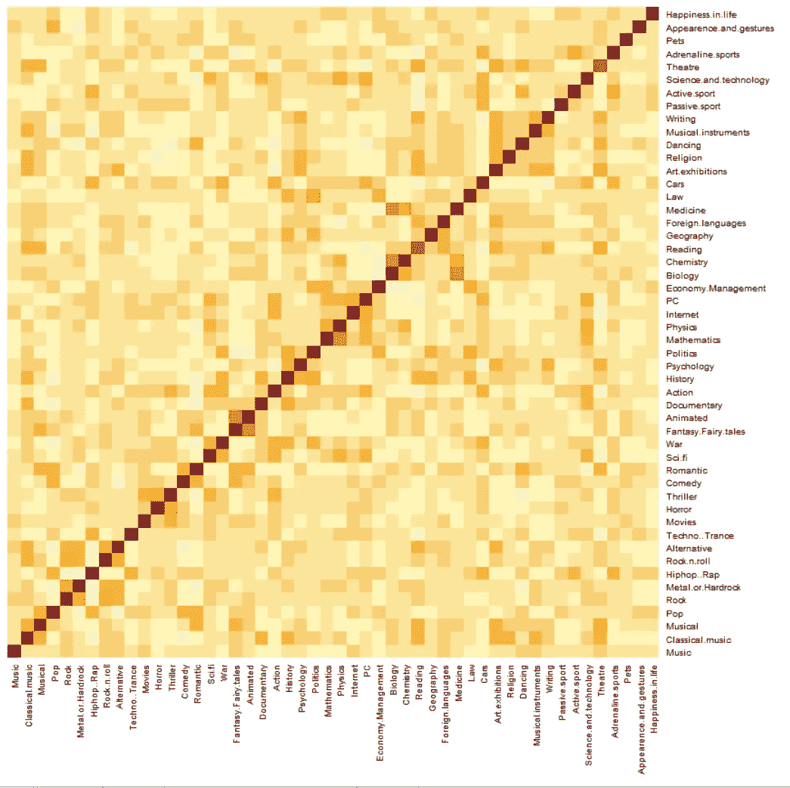
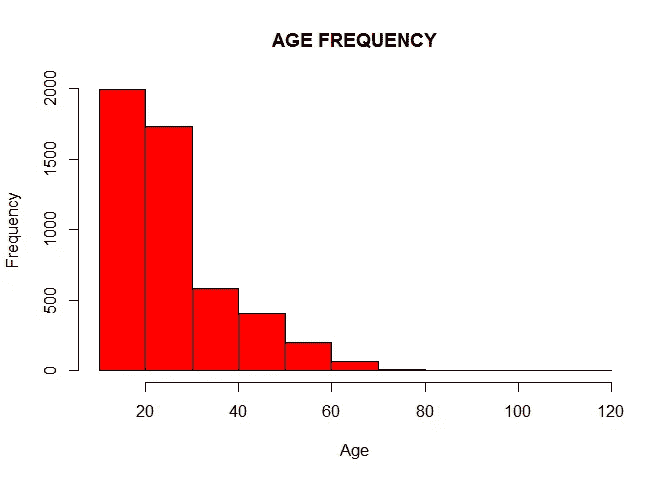
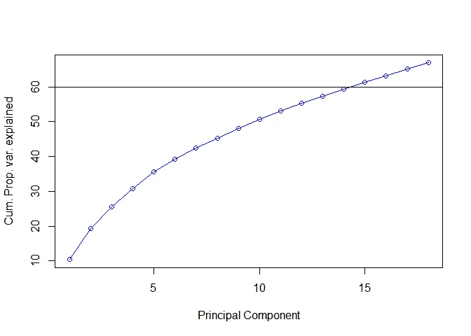
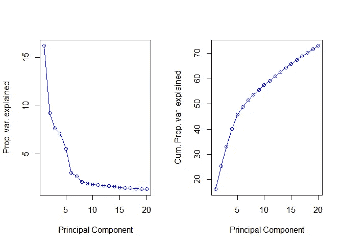
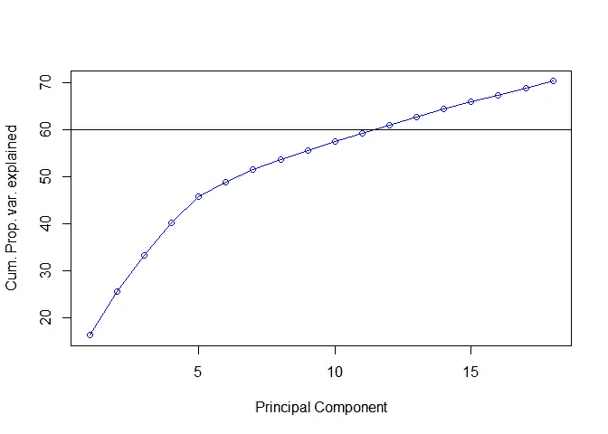
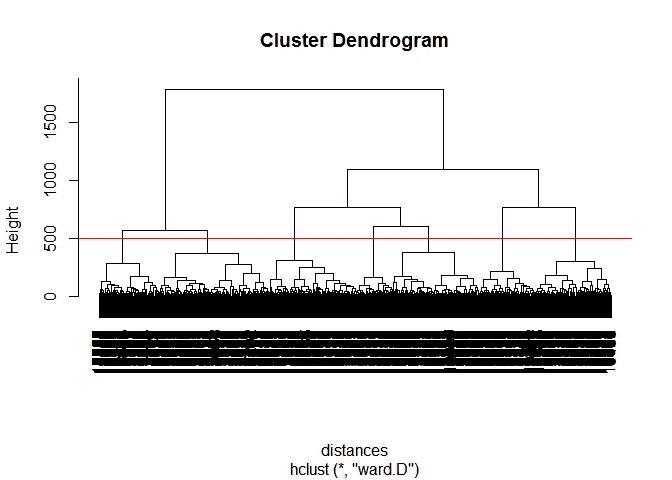
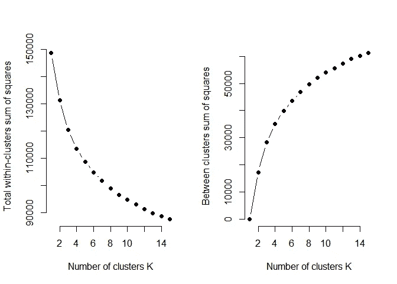

# 机器学习匹配

> 原文：<https://towardsdatascience.com/machine-learning-matchmaking-4416579d4d5e?source=collection_archive---------30----------------------->

## **利用机器学习寻找与 R 相容的伙伴**

[金智秀](https://unsplash.com/@soologue?utm_source=medium&utm_medium=referral)在 [Unsplash](https://unsplash.com?utm_source=medium&utm_medium=referral) 上的照片

一个简单的问题，比如“你如何找到合适的伴侣？”是什么促使我尝试做这个项目，以便为人群中的任何人找到一个兼容的伴侣，这篇博客帖子背后的动机是以尽可能清晰的方式解释我对这个问题的方法。

**你可以在这里** **找到项目笔记本** [**。**](https://github.com/ShariqAhmed007/MLmatchmaking/blob/master/MLmatchmaking.md)

如果我让你找一个搭档，你下一步会怎么做？如果我让你找一个合适的合作伙伴呢？这会改变事情吗？

一个简单的词如**兼容**可以让事情变得棘手，因为显然人类是复杂的。

# 数据

由于我们找不到任何可以涵盖人物角色变化的单一数据集，我们求助于使用[大五个性数据集](https://github.com/ShariqAhmed007/MLmatchmaking/blob/master/data.csv)、[兴趣数据集](https://github.com/ShariqAhmed007/MLmatchmaking/blob/master/interests.csv)(也称为年轻人调查数据集)和[婴儿名字数据集](https://github.com/ShariqAhmed007/MLmatchmaking/blob/master/baby-names.csv)。

**Big5 个性数据集**:我们选择 Big5 数据集的原因仅仅是因为它通过 Big5/OCEAN 个性测试提供了一个关于任何个人的**个性**的想法，该测试向受访者提出了 50 个问题，每个问题有 10 个关于开放性、尽责性、外向性、宜人性&神经质的问题，以 1-5 为尺度进行衡量。你可以在这里阅读更多关于 Big5 [的内容](https://www.theworldcounts.com/happiness/the-big-five-personality-factors-include)。

**兴趣数据集:**，它通过要求人们对 50 个不同的兴趣领域(如艺术、阅读、政治、体育等)进行评分，涵盖了一个人的**兴趣&爱好**。)在 1-5 的范围内。

婴儿名字数据集:帮助分配一个真实和独特的名字给每个回答者

这个项目是用 R 语言(版本 4.0.0)
在 dplyr 和集群包的帮助下完成的

# 处理

加载 Big5 数据集，该数据集有 19k+个观察值，57 个变量，除了个性问题外，还包括种族、年龄、性别、国家。

删除那些没有回答一些问题的回答者&一些年龄值模糊的回答者，例如:412434，223，999999999

以 5000 名受访者的健康样本为例，因为当我们希望找到数千个观察值之间的欧几里德距离以进行聚类时，我们不想让笔记本电脑去度假:)

加载婴儿姓名数据集，并添加 5000 个唯一的真实姓名，以将每个观察结果识别为一个人，而不仅仅是一个数字。

加载兴趣数据集，数据集有 50 个变量，每个变量都是兴趣或爱好

*热图向我们展示了一些领域，如医学、化学；戏剧、音乐剧；和政治、历史表现出某种关联。这个观察很重要，因为我们将在前面使用这个知识。*

加载完所有数据集后，我们将它们合并到一个主数据帧中，并将其命名为 **train，**，此处显示了 107 个变量:

一些图表来看看我们的数据是如何按照年龄和性别排列的

我们可以看到大多数受访者是年轻人，女性受访者多于男性

# **主成分分析**

还记得我们在热图中看到了很少的相关性吗？这就是**主成分分析**发挥作用的地方。PCA 将一些相似变量的影响组合成一个主成分列或 PC。

对于不知道什么是主成分分析的人；
PCA 是一种降维技术，它专注于通过一个方程从所有变量中创建一个全新的变量或主成分(简称 PC ),以从数据中抓住最大可能的变化。

简单地说，主成分分析将帮助我们只使用几个考虑到最重要和最易变的变量的成分，而不是使用所有 50 个变量。你可以在这里了解更多关于 PCA [的知识。](/a-one-stop-shop-for-principal-component-analysis-5582fb7e0a9c)

***重要*** *:我们分别对兴趣变量和 Big5 变量运行 PCA，因为我们不想混合兴趣&个性。*

在对利息变量进行主成分分析后，我们得到的是 50 个。现在有趣的部分来了，**我们不会使用所有的变量**，原因如下:第一台 PC 将是最强的，即一个变量将掌握我们数据中的大部分变化，第二台 PC 将较弱，将掌握较小的变化，以此类推，直到第 50 台 PC。

我们的目标是找到使用 0 到 50 个 PCs 之间的最佳点，我们将通过绘制 PCs 解释的方差来实现:

这些图向我们展示了每个 PC 解释的变化比例。左图:显示了每台电脑的单独性能(例如，第一台电脑解释了我们数据中约 10%的变化，但第 15 台电脑仅解释了 2%)
右图:左侧图表的累积版本。

*我们看到，10 件之后，个人贡献非常低。
但是我们会稍微延伸一下，以覆盖 60%的差异&取出 14 件。*

**结果呢？**我们刚刚将变量数量从 **50 个缩减到 14 个**，这解释了原始利息变量中 60%的变化。

同样，我们对五大变量进行主成分分析:

*我们再次看到第一个 PC 是最强的，并且解释了超过 16%的方差。*

*当斜率在第 8 个 PC 后开始变平时，我们将使用 12，以掌握大约 60%的方差。*

既然我们已经将 **Big5 中的变量从 50 个减少到 14 个**，将**中的变量从 50 个减少到 12 个**，我们将它们组合成一个不同于 train 的数据框架。我们称之为 **pcatrain。**

带有变量名的 pcatrain 数据帧一瞥

# 使聚集

作为一个好的实践，我们首先使用层次聚类来找到一个好的 k 值(聚类的数量)

## 分层聚类

**什么是层次聚类？这里有一个例子:想象一个 100 人的家庭聚会，现在我们从每个人代表一个人的集群开始。下一步？我们将站得最近的两个人/群组合成一个群，然后我们将另外两个最近的群标记为一个群，等等。最后，我们从 100 个集群发展到 1 个集群。分层聚类所做的是根据聚类之间的距离形成聚类，然后我们可以在[树形图](https://uc-r.github.io/hc_clustering)中看到该过程。**

红线可能是一个分界点

*在进行了层次聚类之后，我们可以在这里看到我们自己的聚类树状图，当我们从底部到顶部时，我们看到每个聚类都在收敛，每个聚类离另一个聚类越远，收敛所需的步骤就越长；你可以通过观察垂直连接看到。*

根据距离，我们用红线将一个健康的群体分为 7 个不同的集群。7 后面的原因是，7 个集群需要更长的步骤来收敛，即集群是遥远的。

## k 均值聚类

*我们使用 K-Means 中的* [*肘方法*](https://www.linkedin.com/pulse/finding-optimal-number-clusters-k-means-through-elbow-asanka-perera) *来确保取 7 个左右的聚类是一个好的选择，我们不会深入研究它，但是总结一下:个体之间的聚类内距离的边际总和&聚类中心之间的边际距离在 6 个聚类中最好* *。*

## 具有 6 个聚类的 k-均值聚类

我们运行 K 均值聚类，K = 6；检查每个群集的大小；前 10 个人被分配到哪个组。最后，我们将这个**集群变量**添加到我们的 **pcatrain** 数据帧中，现在我们的数据帧有 33 个变量。

# 最后的步骤

既然我们已经分配了聚类，我们可以开始为任何个体寻找接近的匹配。

我们选择 **Penni** 作为随机个体，我们将从她的集群(即集群 2)中为其找到匹配

在左边，我们首先从 Penni 的集群中找到人，然后过滤掉那些与 Penni 在同一个国家、性别相反、属于 Penni 年龄类别的人。

有些人和彭尼属于同一个群体，同一个国家，同一个年龄组

好了，现在我们已经过滤掉了人，是吗？

不记得我们一开始问的问题吗？

“你如何找到一个合适的伴侣？”

即使我们已经找到了有相同兴趣和年龄组的人，我们也必须找到与 Penni 个性最相似的人。

这就是五大性格变量派上用场的地方。

通过 Big5，我们将能够找到与 Penni 具有相同开放、尽责、外向、随和和神经质水平的人。

我们在这里所做的是为每个人格变量找到 Penni 的反应和过滤后的人的反应之间的**差异，然后将所有变量的差异相加。**

例如:Brody 的 sumdifference = 8.9，即在 Big5 的 50 个问题中，Brody 的回答与 Penni 的回答仅相差 8.9 分。

所以现在我们知道了，如果 **Penni** 正在寻找伴侣，她应该首先设法与 **Brody** 见面。

## 我们为 Penni 寻找合适人选所做工作的总结:

1.  根据兴趣把人们聚集在一起。
2.  找到了和 Penni 兴趣相投、年龄相仿的人。
3.  根据他们的个性与 Penni 的个性的匹配程度对那些被过滤的人进行了排名。

**谢谢你坚持到最后！**

您可以通过以下方式与我联系:

[**Github**](https://github.com/ShariqAhmed007)

[领英 ](https://www.linkedin.com/in/shariq06ahmed)