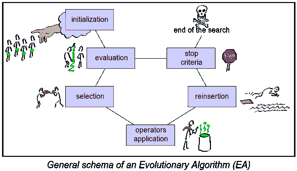
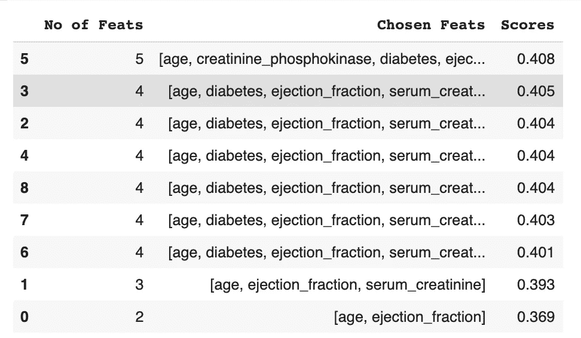
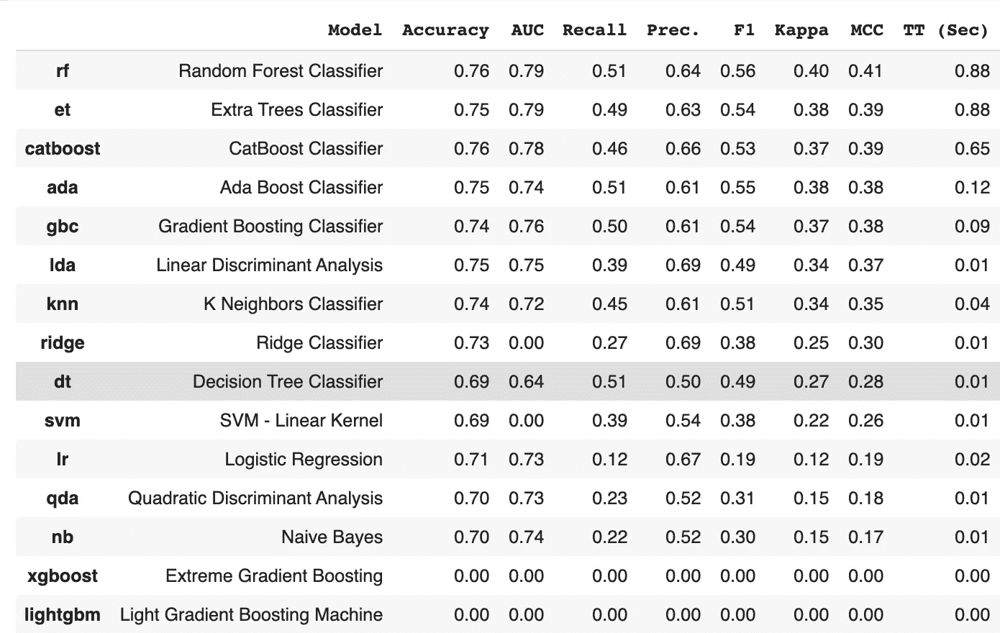
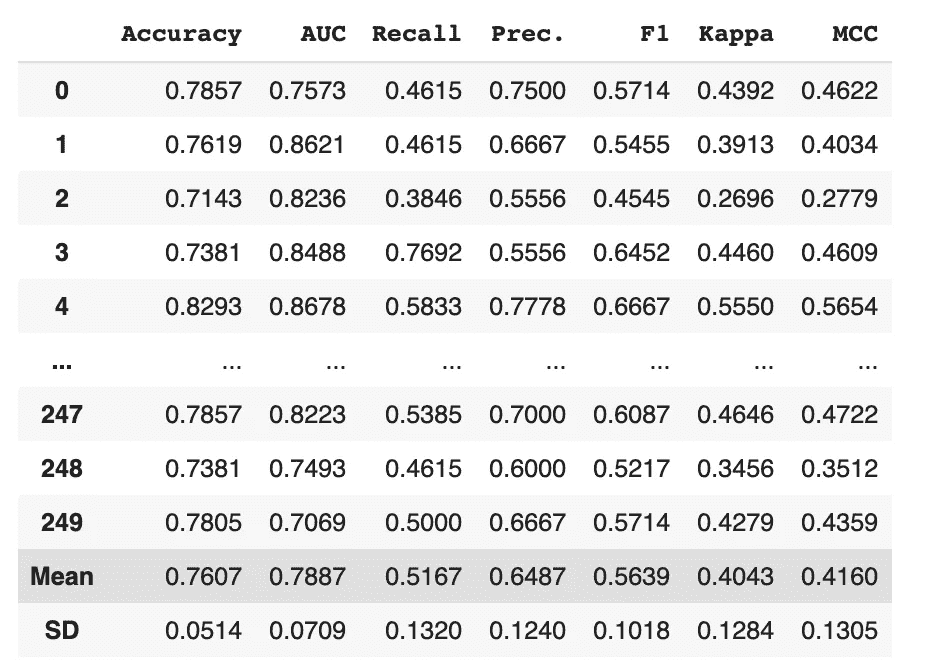
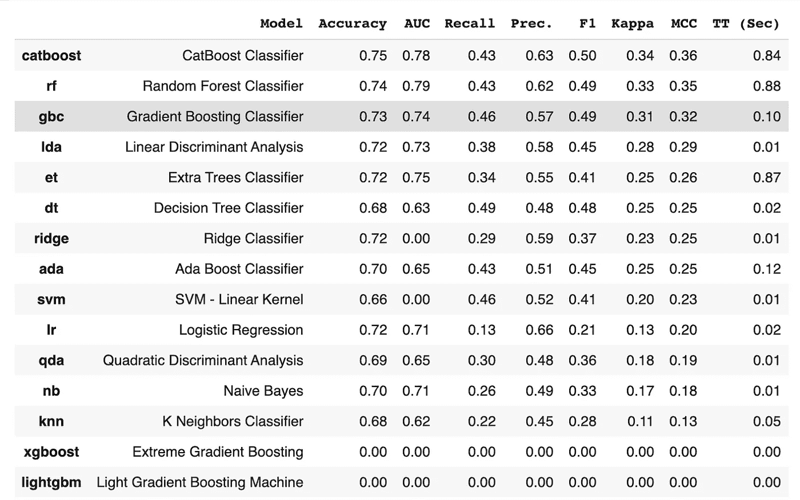
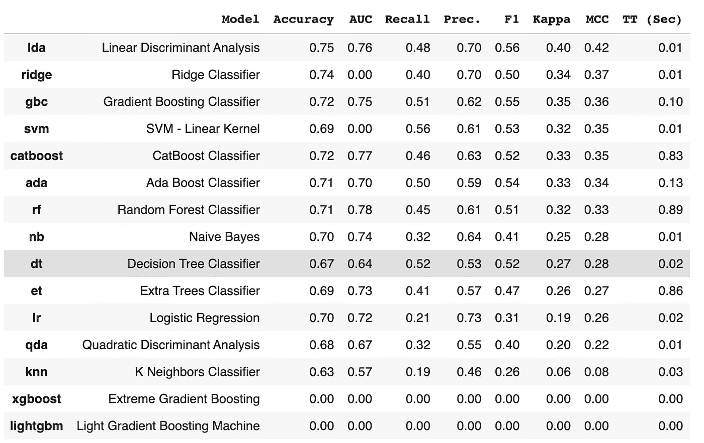
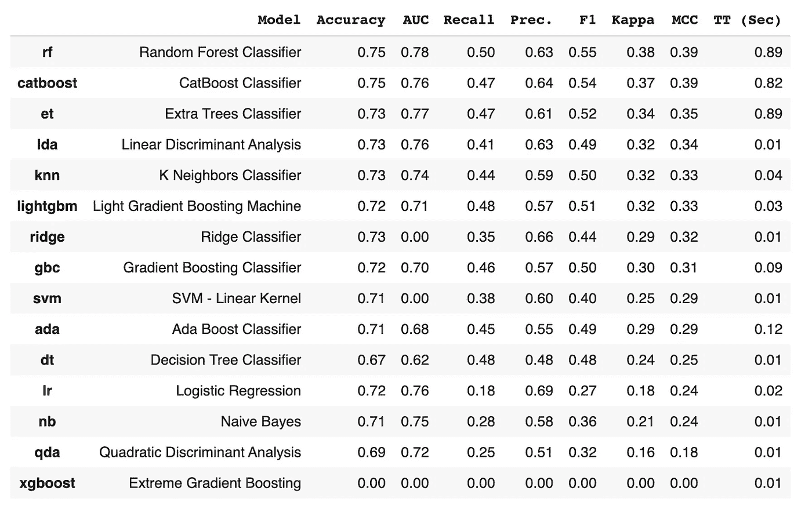
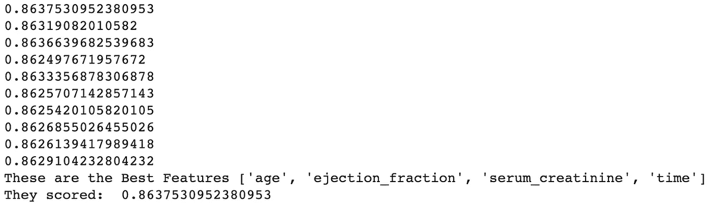

# 使用遗传算法寻找重要特征

> 原文：<https://towardsdatascience.com/machine-learning-mini-project-4-finding-important-features-using-genetic-algorithms-for-heart-d069e205305f?source=collection_archive---------10----------------------->

## [机器学习迷你项目](http://towardsdatascience.com/tagged/mini-projects)

## (用于心力衰竭存活预测)

[国立癌症研究所](https://unsplash.com/@nci?utm_source=medium&utm_medium=referral)在 [Unsplash](https://unsplash.com?utm_source=medium&utm_medium=referral) 上拍摄的照片

原文如下:

> 机器学习可以仅从血清肌酐和射血分数预测心力衰竭患者的存活率。 *BMC Med 通知 Decis Mak* **20，** 16 (2020)。[https://doi.org/10.1186/s12911-020-1023-5](https://doi.org/10.1186/s12911-020-1023-5)

这个数据集有 12 个特征，你可以从 [UCI 机器学习库](https://archive.ics.uci.edu/ml/datasets/Heart+failure+clinical+records)下载。它是一个二元分类、监督学习问题，以“死亡 _ 事件”为目标变量，1 表示死亡，0 表示幸存。

***问题来了:寻找最佳学习者(算法)和最佳特征子集的最高效方法是什么？有时，令人惊讶的是，一小部分功能比全部功能表现得更好。找到那个集合的最好方法是什么？***

首先，让我们把最好的学习者的问题放在一边。我们知道的一件事是，有些学习者比其他人训练得更快。如果您想测试用于特征选择的遗传学习算法，您会发现使用逻辑回归是最快的方法，而像 Random Forest 或 LightGBM 这样基于树的方法需要更长的时间，甚至可能无法正常工作，这取决于您使用的库。

## 纸质结果

奇克和朱尔曼的发现是:

*   随机森林是最好的算法
*   统计和机器学习方法都表明**射血分数**和**血清肌酸酐**是最重要的特征之一，你可以仅仅根据这些特征建立一个模型。

## 这个实验的结果

*   遗传算法可以挑选各种特征子集
*   由此得出的结果取决于您为算法选择的超参数，但这也需要您使用某种形式的交叉验证评分来仔细审查每个候选项。甚至您的交叉验证参数(折叠次数和重复次数)也会改变结果。
*   **血清肌酸酐**和**射血分数**，正如他们所说，非常重要。该论文的第一个实验没有使用**时间**特征，这是随访后几个月的时间，因为它本身不是一个临床特征。然而，在他们论文的第二个实验中，他们确实包括了它。对于这个项目，我是 ***排除*** 的时间特性。

**安装库**

大多数情况下， **sklearn-genetic** 用于遗传算法(GA)方法，如果你想使用一些 autoML 类型的方法，安装 **pycaret** 。除此之外，我们只需要熊猫和熊猫。

## 什么是遗传算法？

来自[维基媒体](https://commons.wikimedia.org/wiki/File:Evolutionary_Algorithm.svg)

基本上，在我们的例子中，我们将一个特性的包含或排除视为一个二进制字符串，即一个由 1 和 0 组成的字符串，其中 1 表示该特性被包含，0 表示它不被包含。这意味着，由于我们有 12 个特性，显然有 2 种可能性或整个特性集的子集需要考虑。遗传算法的要点不是测试所有这些，而是考虑几个子集——让我们称之为几个“个体”——然后评估它们的“适应度”值，这当然意味着一个数学函数。因此，让我们说，我们不是使用 2 个“个体”，而是使用大约 20 或 50 个个体，找到那些具有更大“适应度”值的个体，让它们“繁殖”，并产生具有其父母某些特征的后代，同时还允许随机突变——生物学 101！当然，多少混合和变异是你可以控制的，这是随机的，但概率是你可以调整的算法的超参数。你还可以决定你想要多少代——显然，你的代数越多，你找到全局最优解的机会就越大，这是一个基因“最适合”的群体。你还需要考虑一些提前停止的标准，这样这个过程就不会陷入局部极小值或者比需要的时间更长。下图解释了一般过程:

**交叉率**决定了基因如何传递给后代——也就是说，后代在什么点上，以什么概率从父母那里获得基因。换句话说，它决定了父母和后代之间的“混合”程度或基因相似程度。显然，你不希望后代成为他们父母的副本——你可能也希望有一些突变的后代，只是为了在混合物中加入更多的遗传多样性，希望在某个时候，不屈不挠的适应性的完美突变出现，随之而来的是你无法超越的机器学习模型。所以你也有**突变率**作为超参数。

你可以在这里阅读对遗传算法[的更好的解释。让我们来看一个简单的方法来解决这个监督学习问题。](http://Introduction to Genetic Algorithms — Including Example Code ...towardsdatascience.com › introduction-to-genetic-algor...)

## 逻辑回归+遗传算法

这是遗传算法的代码，它将为我们选择一个特征子集:

代码中需要注意的事项:

*   学习者的选择:这件事可能需要很长时间。为了节省时间，首先要做的是:*使用逻辑回归(LR)* ，因为它总是训练速度最快的方法之一。论文的作者提到随机森林模型是好的，但是如果你在这个 GA 过程中使用 RF，你会发现它比 LR 花费更多的时间。然而，基于树的模型可以考虑功能交互和其他可能影响功能选择的因素。因此，您可能希望在特性选择过程中包括 RF，以确保不会遗漏任何东西。
*   *交叉验证方案*。开始的时候少尝试劈叉，意思是 5 折交叉，开始的时候不要做那么多重复。当然，你最好能重复 100 或 1000 次，但也许一开始做 1 次、5 次或 20 次会让你充分意识到哪些特性是重要的。
*   *人口*设定为 50。你可以更高，比如 100，200，500。变异率——变异率越高，你获得多样性的机会就越多，但这并不能保证你会得到最佳选择。这取决于需要多少代的变异和交叉来创造更多合适的候选者。
*   每个实验的分数来自 selector.generation_score，它是每一代分数(Matthews 相关系数)的列表，通常分数会在每一代中提高，所以我只使用最后一个分数作为模型的最终分数(selector.generation_score[-1])

长话短说——摆弄参数。这张表格显示了我的最终结果:

GA 算法发现 4 或 5 个特征子集工作良好。

这个算法的“赢家”:基数为 5 的特征子集，具有**{年龄，肌酸酐 _ 磷酸激酶，糖尿病，射血分数，血清肌酸酐}** 作为特征。我们可以预计 MCC 值约为 0.40。现在让我们使用 ***pycaret*** 更彻底地测试一下，这是一个 autoML 类型的包，让一切都变得容易。

**比较模型**函数向我们展示了这一点:

因此，你可以看到，正如论文作者所声称的那样，随机森林分类器是最好的。这是使用 5 折 20 次重复的方案。让我们看看当我们创建一个随机森林模型时会发生什么，但是有 5 个分裂和 50 个重复，即 250 个训练模型:

随机森林模型，5 重 CV 和 50 次重复。

您可以看到 ***标准差为 0.1305，相当高*** 。它表明，虽然 RF 比大多数更好，但在给定的 train/val 集合上，它可能并不总是表现得更好。

在学习者对比表中可以看到，XGBoost 和 LightGBM 似乎全线 0。我不确定这是为什么，但我只是使用常规的 sklearn 和相同的 cross-val 方案进行了实验。**在本次实验中，XGBoost 得分为 0.359，LGBM 得分为 0.378** ，处于群体中间。

## **基线—无特征选择**

没有任何特性选择，pycaret 向我们展示了这一点

这是针对所有特征的，没有特征选择。整体性能下降。还有，CatBoost 和 RF 一样好。

我们可以看到，整体的 MCC 分数低于遗传特征选择时的分数。这也与论文中所声称的一致。

当您这样做，但是 py caret“feature _ selection”参数设置为 True(它执行自己的特征选择)时，我们会发现

pycaret，但 feature_selection = True。艾达绕过这个。

这有点令人惊讶，因为不仅 LDA 是最好的模型，而且 RF 和其他 GBM 也不如它们通常的表现。

## 从模型中选择

从模型中选择是 sklearn 内置的特征选择方法之一。我们用它作为与气体比较的手段。它选择的特征是:{ **'年龄'，'肌酐 _ 磷酸激酶'，'射血分数'，'血小板'，'血清肌酐'，'血清钠' }** 。然后，我们将这个特性集再次通过 pycaret 运行，下面是我们的发现:

使用“从模型中选择”功能比较模型

所以这个特征子集也不错，但是比来自遗传算法的更小的子集略胜一筹。有一点是清楚的:有特征选择倾向于提高分数。更多详情，请看我打开的 [Google Colab 笔记本](https://colab.research.google.com/drive/17NqqAoSm24N9a6nXLN2vzPxXkP8AlygM?usp=sharing)。

因此，您可以看到，虽然在 GA 算法评分过程中，特征子集是按性能排序的，但这并不意味着当 cross_val 更改为 100 次重复时，它们会按该顺序评分。最高分来自第 6 个候选人，其选择的特征为 **{“年龄”、“肌酐 _ 磷酸激酶”、“射血分数”、“血清肌酐”、“吸烟”、“时间”}** ，得分为 a **0.868 *。***

也就是说，除了最后一个都在 0.86 以上。其实倒数第二个的分数是 **0.863** ，只有特征 **{“射血分数”、“血清肌酐”、“性别”、“时间”}** 。这意味着，如果您正在尝试或需要一个更简洁的模型，那么使用这个特性子集是合理的。这些模型中的任何一个即使不比具有所有特性的基线模型更好，也一样好，所以没有压倒性的理由将所有特性保留在模型中。

## 逻辑回归+从模型中选择

这是 sklearn 中的 SelectFromModel:

从这个过程来看，胜出者是 **{“年龄”、“射血分数”、“血清 _ 肌酐”、“时间”}** ，得分 **0.864。**

从各种功能组合的模型得分结果中进行选择。

## 逻辑回归+顺序浮动特征选择(SFSS)

这种方法有点贵，涉及一种测试各种功能组合的算法，尽管与 GA 不同，它不涉及任何交叉或变异过程，它基本上是，找到一个好的功能，再添加一个，看看是否有帮助，如果有帮助，就保留它并添加另一个，当添加更多功能似乎没有帮助时停止。这种算法的“浮动”版本允许您去掉它们没有帮助的功能，这允许您通过替换可能看起来不错但后来发现不“玩得好”的功能来测试更多的组合，添加更新的功能。这有点像在团队运动中进行替换或交易——有时你必须移除一名优秀的球员，因为没有这名球员可能会有更好的组合。

你可以从 sklearn 的一个[实验版本中得到 SFSS，但是我刚刚从](https://scikit-learn.org/dev/modules/generated/sklearn.feature_selection.SequentialFeatureSelector.html) [mlxtend](http://rasbt.github.io/mlxtend/) 中得到它，这对我来说更容易。这里有一个链接，链接到我的 [Colab 笔记本中有我的代码](https://colab.research.google.com/drive/17NqqAoSm24N9a6nXLN2vzPxXkP8AlygM#scrollTo=gH6CKF5A5HU8&line=3&uniqifier=1)的单元格。