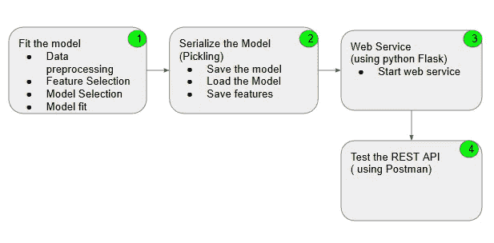
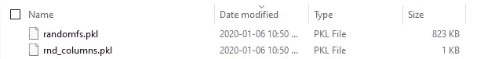
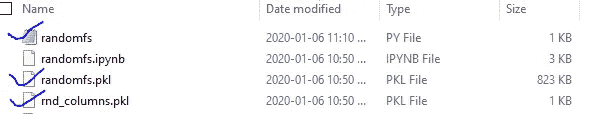
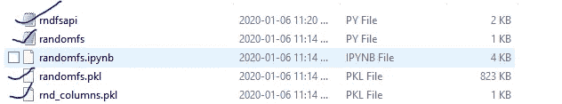
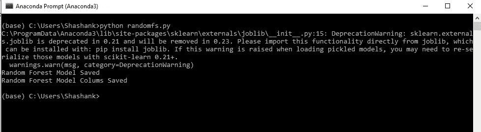
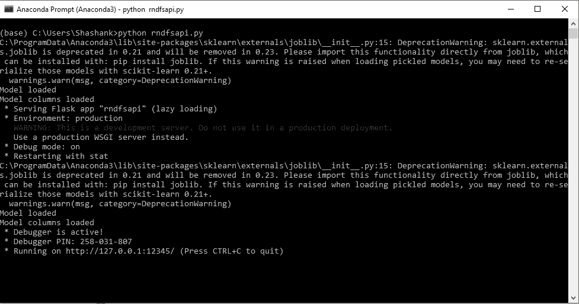
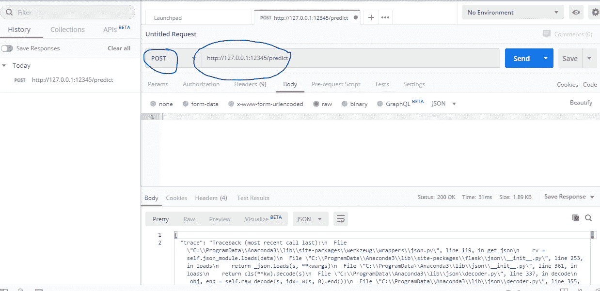
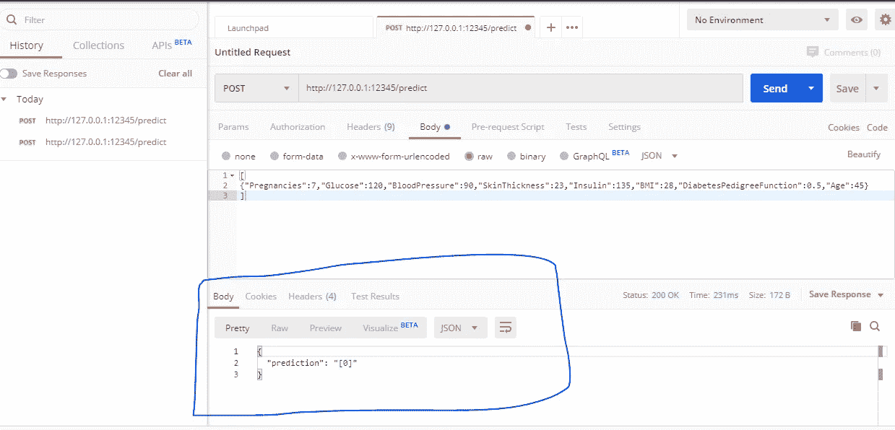

# 通过四个简单的步骤将机器学习模型部署为 REST API

> 原文：<https://towardsdatascience.com/machine-learning-model-deployment-as-rest-api-in-four-easy-steps-e65764f7c5c?source=collection_archive---------6----------------------->

## 分四步部署您的机器学习模型

在我之前关于机器学习集成建模的博客中，我们开发了一个分类模型，根据病史和诊断，如患者的怀孕次数、身体质量指数、胰岛素水平、年龄等，将患者分类为糖尿病或非糖尿病患者。

下面是文章的链接:

[](https://medium.com/sanrusha-consultancy/ensemble-learning-bagging-f9329e07fc22) [## 集成学习

### 集成技术在通过 bagging 减少方差、通过 boosting 减少偏倚和提高预测精度方面具有强大的功能

medium.com](https://medium.com/sanrusha-consultancy/ensemble-learning-bagging-f9329e07fc22) 

以下是该博客中创建最佳模型的数据来源和练习摘要:

数据源:

[](https://www.kaggle.com/uciml/pima-indians-diabetes-database/data) [## 皮马印第安人糖尿病数据库

### 基于诊断方法预测糖尿病的发病

www.kaggle.com](https://www.kaggle.com/uciml/pima-indians-diabetes-database/data) 

下面是模型的 Python 代码:

```
import pandas as pd
import numpy as np
from sklearn.ensemble import RandomForestClassifier# Read data into pandas dataframe
df=pd.read_csv(r'C:\Machinelearning\diabetes.csv')
#Define Feature Matrix (X) and Label Array (y)
X=df.drop(['Outcome'],axis=1)
y=df['Outcome']lr=RandomForestClassifier(n_estimators=53, n_jobs=1,random_state=8)
lr.fit(X,y)
```

好了，我们准备好模型了。现在是时候部署它了。

在现实生活的项目中，机器学习模型被其他应用程序使用。这些应用程序可以是任何东西，可以是面向客户的运营应用程序(如公司网站)或后台应用程序(如 ERP ),也可以是数据分析应用程序。这些应用程序应该能够向模型发送特征变量值并获得预测。

虽然有各种各样的方法来实现它，但在这篇博客中，我将带你经历通过 REST API 部署机器学习模型的步骤。一旦模型可以通过 REST API 进行交互，任何应用程序都可以通过 API 调用传递特征值来寻求模型的预测。

下图显示了我们将要遵循的步骤。步骤 1 已经完成。



## 步骤 2:序列化模型

运行下面的 Python 代码行来完成步骤 2。

```
#Serialize the model and save
from sklearn.externals import joblib
joblib.dump(lr, 'randomfs.pkl')
print("Random Forest Model Saved")#Load the model
lr = joblib.load('randomfs.pkl')# Save features from training
rnd_columns = list(X_train.columns)
joblib.dump(rnd_columns, 'rnd_columns.pkl')
print("Random Forest Model Colums Saved")
```

输出:

```
Random Forest Model Saved
Random Forest Model Colums Saved
```

现在，您应该会发现在您的系统上创建了以下两个文件。如果你使用的是 Windows 操作系统，并且没有设置 Python 路径到别的地方，你会在 C:\Users\ <your userid="">文件夹中找到这些文件。</your>



到目前为止一切顺利！

确保将步骤 1 和步骤 2 中的 python 代码组合在一个文件中，并存储在与上面相同的目录中。让我们将这个文件命名为 randomfs.py



总之，下面是文件 randomfs.py 的内容

```
import pandas as pd
import numpy as np
from sklearn.ensemble import RandomForestClassifier# Read data into pandas dataframe
df=pd.read_csv(r'C:\Machinelearning\diabetes.csv')
#Define Feature Matrix (X) and Label Array (y)
X=df.drop(['Outcome'],axis=1)
y=df['Outcome']lr=RandomForestClassifier(n_estimators=53, n_jobs=1,random_state=8)
lr.fit(X,y) #Serialize the model and save
from sklearn.externals import joblib
joblib.dump(lr, 'randomfs.pkl')
print("Random Forest Model Saved")#Load the model
lr = joblib.load('randomfs.pkl')# Save features from training
rnd_columns = list(X_train.columns)
joblib.dump(rnd_columns, 'rnd_columns.pkl')
print("Random Forest Model Colums Saved")
```

**第三步:网络服务**

如果你想知道什么是 web 服务，这里有一个来自[维基百科](https://en.wikipedia.org/wiki/Web_service)的简短解释

*web 服务是运行在计算机设备上的服务器，在网络上的特定端口监听请求，提供 Web 文档(HTML、JSON、XML、图像)，并创建 Web 应用服务，用于解决 web (www、internet、HTTP)上的特定领域问题。*

如果你现在更困惑，我会说，现在不要太担心它。就当是网站运行的服务器吧。网站可以通过这些称为 Web 服务的服务与其他应用程序对话。

好了，现在我们已经完成了这一部分，让我们来了解一下第三步需要做什么。

Python 有一个非常有用的库 Flask，这是一个 web 服务开发框架。如果您使用的是 Anaconda 发行版，Flask 已经为您安装好了。

现在真正的行动开始了。在您选择的记事本中写下代码行，并将其保存为. py 文件。不要使用 Jupyter 笔记本进行此操作。如果你使用 Jupyter 笔记本来做这件事，你可能会得到错误。

```
#Install Libraries
from flask import Flask, request, jsonify
from sklearn.externals import joblib
import traceback
import pandas as pd
import numpy as npapplication = Flask(__name__)@application.route(‘/prediction’, methods=[‘POST’])#define functiondef predict():
 if lr:
 try:
 json_ = request.json
 print(json_)
 query = pd.get_dummies(pd.DataFrame(json_))
 query = query.reindex(columns=rnd_columns, fill_value=0)predict = list(lr.predict(query))return jsonify({‘prediction’: str(predict)})except:return jsonify({‘trace’: traceback.format_exc()})
 else:
 print (‘Model not good’)
 return (‘Model is not good’)if __name__ == ‘__main__’:
 try:
 port = int(sys.argv[1])
 except:
 port = 12345 lr = joblib.load(“randomfs.pkl”) 
 print (‘Model loaded’)
 rnd_columns = joblib.load(“rnd_columns.pkl”) # Load “rnd_columns.pkl”
 print (‘Model columns loaded’)app.run(port=port, debug=True)
```

我将它作为 rndfsapi.py 保存在存储其他三个文件的同一目录中。



现在打开 Anaconda 提示符并运行命令 python rndsfapi.py，这将编译文件并在提到的端口 12345 启动 Web 服务。



我们已经完成了这一步的活动。让我们进入下一步。

## 步骤 4:测试 REST API

对于这一步，您将需要一个像 Postman 这样的 REST API 测试工具。你可以从下面的链接下载邮差。

[](https://www.getpostman.com/tools) [## 邮递员|工具

### 为您的 API 创建详细的、可通过 web 查看的文档，设置为公共或私有。帮助开发人员使用您的 API…

www.getpostman.com](https://www.getpostman.com/tools) 

下载完成后，启动 postman。在发布操作旁边输入显示 URL，然后单击发送按钮。您将看到如下所示的内容。



现在，在 body 部分输入以下特征值。这就是调用应用程序发送需要预测的特征值的方式。

```
[
{“Pregnancies”:7,”Glucose”:120,”BloodPressure”:90,”SkinThickness”:23,”Insulin”:135,”BMI”:28,”DiabetesPedigreeFunction”:0.5,”Age”:45}
]
```

在正文中输入这些特征值，然后单击发送按钮。



您可以在突出显示的正文部分查看下面的预测。这个病人没有糖尿病。

恭喜你！

现在您知道如何将机器学习模型部署为 REST API。

参考资料:

[](https://www.udemy.com/course/applied-machine-learning-hands-on-course/?referralCode=00F08274D257B06E3201) [## 机器学习实践课程

### 加入最全面的机器学习实践课程，因为现在是开始的时候了！从基础…

www.udemy.com](https://www.udemy.com/course/applied-machine-learning-hands-on-course/?referralCode=00F08274D257B06E3201) [](https://www.youtube.com/c/endtoendmachinelearning) [## 端到端机器学习

### Sanrusha 是基于机器学习和人工智能的解决方案的领先提供商。我们努力通过使用人工智能让生活变得更美好。

www.youtube.com](https://www.youtube.com/c/endtoendmachinelearning)