# 解释 ML 黑盒模型

> 原文：<https://towardsdatascience.com/machine-learning-model-from-local-explanation-to-global-understanding-fd7fd06d7677?source=collection_archive---------36----------------------->

## 机器学习模型的可解释性

## 部分相关图和 SHapley 加法解释


作者图片

[https://sarit-maitra.medium.com/membership](https://sarit-maitra.medium.com/membership)

T 对现代最大似然法最大的批评是关于它的黑箱性质——输入数据，输出预测/预报，简单来说，这就是最大似然算法的工作方式。复杂性来了——当我们有一个高度非线性的相互作用的模型时，我们怎么可能希望对这个模型正在做什么有一个简单的理解呢？随着机器学习的成熟和广泛采用，建立用户能够理解的模型变得越来越重要。这在医疗保健等高风险应用以及银行&金融等高数据敏感领域非常普遍。

让我们再来回顾一下我们的保险索赔欺诈数据:*欺诈索赔概率*。我们这里的数据来自汽车保险。是/否之间的答案是一个二元分类任务。因此，此处的报告将使用分类算法来检测欺诈交易。

# 数据摄取和探索

该数据集有 1000 行和 40 列，有许多独特的变量，如下所示。

```
*#load & view raw data*
data = pd.read_csv('insurance_claims.csv')
data.shapeOut:(1000, 40)data.columns
```

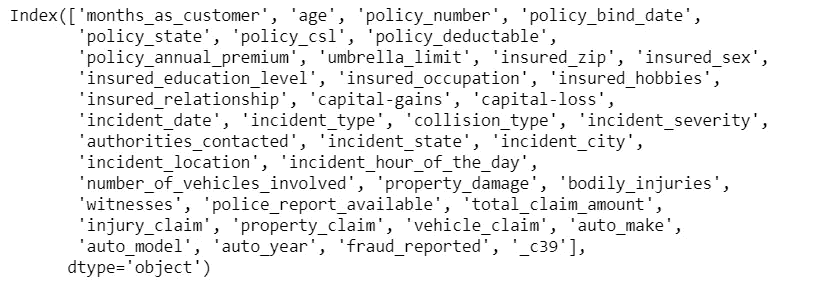

不幸的是，在一些应用的最大似然应用中，平衡的数据极其罕见，由于数据代表性不足和严重的类别分布偏斜，需要各种形式的外推。

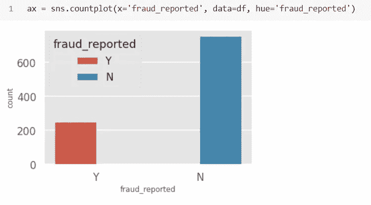

从上图来看，像大多数欺诈数据集一样，标签分布是偏斜的。近 25%的数据集被报告为欺诈。

## 数据处理和特征工程:

让我们执行一些基本的转换，然后在训练和测试中将它们分开。在这里，我们并没有过多关注数据分析和建模部分；相反，我们将把重点放在解释部分，这是 ML / AI 工作中最困难的任务。

```
# feature engineering
data['fraud_reported'].replace(to_replace='Y', value=1, inplace = True)
data['fraud_reported'].replace(to_replace='N',  value=0, inplace = True)
data['csl_per_person'] = data.policy_csl.str.split('/', expand=True)[0]
data['csl_per_accident'] = data.policy_csl.str.split('/', expand = True)[1]
data['vehicle_age'] = 2020 - data['auto_year'] 
# Deriving the age of the vehicle based on the year value
bins = [-1, 3, 6, 9, 12, 17, 20, 24]  
# Factorize according to the time period of the day.
names = ["past_midnight", "early_morning", "morning", 'fore-noon', 'afternoon', 'evening', 'night']
data['incident_period_of_day'] = pd.cut(data.incident_hour_of_the_day, bins, labels = names).astype(object)# dropping unimportant columns
data = data.drop(columns = ['policy_number', 'policy_csl', 'insured_zip','policy_bind_date','incident_date','incident_location,'_c39','auto_year','incident_hour_of_the_day'], axis=1)
data.head(2)
```

这里我们将把分类特征转换成数值。通常最好将这些类型的分类值转换为虚拟值，因为它们在大小上没有关系，但由于它们太多，特征的大小将会增长，这将需要永远训练。然而，为了保持简单，我使用了下面的过程。

```
# turning object columns type to categorical for easing the transformation process
categorical = data.select_dtypes(include= ['object']).columns
for col in categorical:
data[col] = data[col].astype('category')# categorical values ==> numeric values
data[categorical] = data[categorical].apply(lambda x: x.cat.codes)
data._get_numeric_data().columns
```

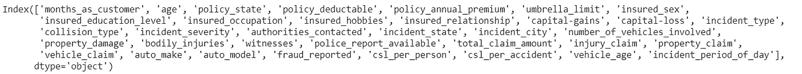

# 建模:

我们在这个实验中使用了 XGBoostXGBoost 以其在分类任务上的出色性能而闻名，但另一方面，它的输出非常复杂且难以解释。

```
X = data.drop(columns = ['fraud_reported'], axis=1)  # predictor variables
y = pd.DataFrame(data['fraud_reported'])  # target variable
X_train, X_test, y_train, y_test = train_test_split(X, y, train_size=0.8, random_state=7)
print('length of X_train and X_test: ', len(X_train), len(X_test))
print('length of y_train and y_test: ', len(y_train), len(y_test))
```

我们使用额外的维持数据进行训练/测试分割，以防止任何过度拟合。让我们使用 10 重交叉验证快速检查模型的性能。我们将训练一个基本的 XGBoost 分类器，不需要太多的超参数调整。

```
print("Training XGB Classifier...")
tic = time()
model = XGBClassifier(early_stopping=True)
model.fit(X_train, y_train)
print("done in {:.3f}s".format(time() - tic))
print('Model trained')
AccuracyScore = cross_val_score(model, X_train, y_train, cv=10)
print('Accuracy score:', format(round(AccuracyScore.mean(),2)))
BalancedScore = cross_val_score(model, X_train, y_train, cv=10, scoring="balanced_accuracy")
print('Accuracy balance:', format(round(BalancedScore.mean(),2)))
print("done in {:.3f}s".format(time() - tic))
```

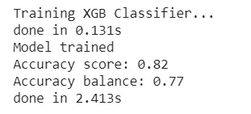

传统上，最大似然模型的质量是通过交叉验证测试数据的准确性来衡量的。有趣的是，准确度分数给出了 82%的 10 倍平均准确度，而准确度平衡给出了 77%。我们意识到我们的目标变量是不平衡的。

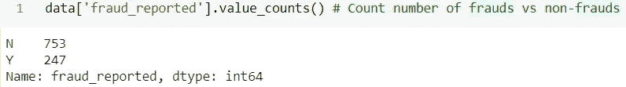

在这种情况下，正确的验证方法非常重要，因为它可能会错误地指出一个好的模型。然而，由于 ML 模型容易受到过于自信的外推的影响，因此具有健壮的验证度量只能部分解决问题。

现在我们已经创建了模型，接下来将解释它到底做了什么。

## 功能重要性:

知道哪些特性是重要的是有用的。

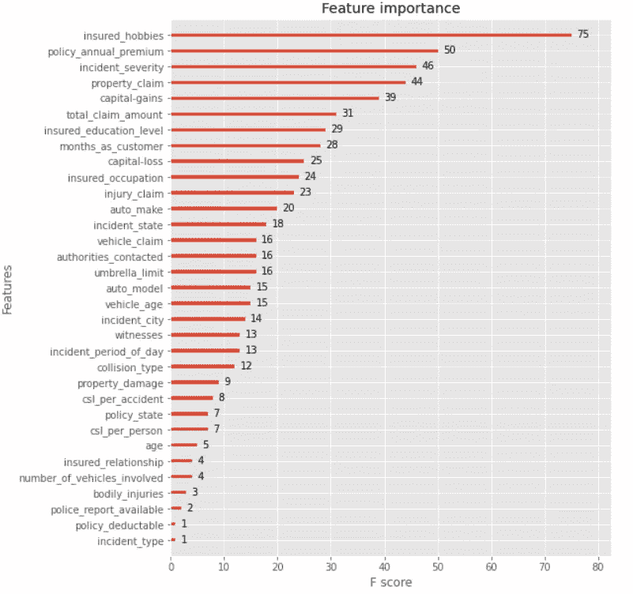

在这里，我们看到前 3 个特征是*被保险人 _ 爱好、保单 _ 年度 _ 保费、事故 _ 严重性*。虽然特征重要性可以让我们了解模型发现哪些变量有价值，但它们不会告诉我们这些特征如何影响我们的模型预测。除了知道重要的特征，我们还想知道不同的值是如何影响预测结果的。

## 模型的可解释性意味着什么？

理解为什么 ML 模型做出某种预测或建议是至关重要的，因为它提供了做出决定的信心，这将导致新的假设和最终新的科学见解。为了可靠的使用，我们需要严格量化 ML 性能的能力。

## 排列重要性(PI):

PI 是在拟合模型上计算的。我们使用 PI 来计算特性的重要性，方法是测量当一个特性不可用时分数是如何降低的。这是在测试数据上完成的，并通过随机改变一个特性的值，同时保持其他值不变，来打破特性和目标变量之间的依赖关系。它非常直观，并且与模型无关。

```
perm_train = PermutationImportance(model, scoring='accuracy',
n_iter=100, random_state=1)
# fit and see the permuation importances
perm_train.fit(X_train, y_train)
eli5.explain_weights_df(perm_train, feature_names = X_train.columns.tolist()).head()
# top 5 important features
```

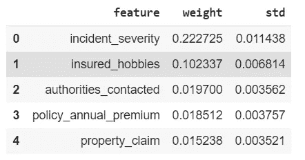

因此，简单地说，如果改变某个特征会增加模型误差，那么它就是重要的。在这种情况下，模型很大程度上依赖于这个特征来做出正确的预测。我们看到置换已经把*事件 _ 严重程度&投保 _ 爱好*作为两个最重要的特征，这与 XGBoost 特征重要性不同。

```
perm_train_df = pd.DataFrame(data=perm.results_, columns=X.columns)
(sns.boxplot(data=perm_train_df).set(title='Permutation Importance Distributions (training data)', ylabel='Importance'));
plt.xticks(rotation=90)
```

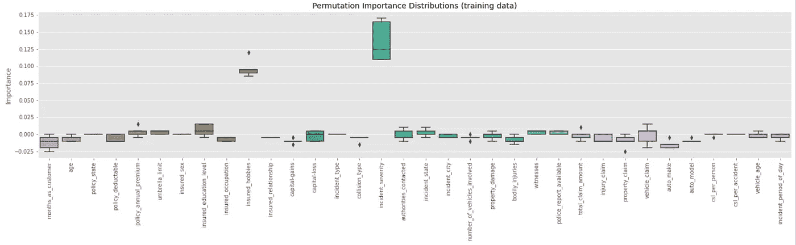

这里我们可以看到，*事件 _ 严重程度* & *被保险人 _ 爱好*是*欺诈 _ 报告*的两个最重要的变量

```
perm = PermutationImportance(model, random_state = 0).fit(X_test, y_test)
eli5.show_weights(perm, feature_names = X_test.columns.tolist())
```

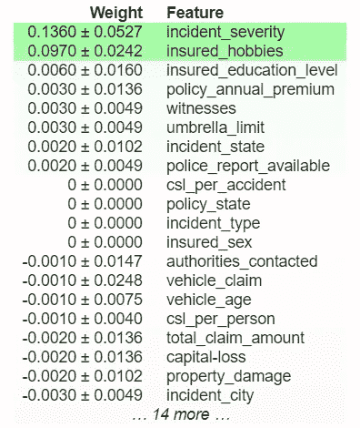

这里，最重要的特性是 *incident_severity* 。每行中的第一个数字显示了随机洗牌后模型性能下降的程度(在本例中，使用“准确性”作为性能度量)。我们通过多次洗牌重复这个过程来测量随机性。

在确定了最相关的变量之后，下一步是试图理解近似值对其联合值的依赖性的性质。

## 缺点:

在这里，我们不确定是使用训练集还是测试集来衡量特性的重要性。此外，由于排列的原因，在重复计算时，处理结果可能变化很大。然而，我认为，我们不能根据训练集上的性能来判断特征的重要性，因为重要性与错误有着内在的联系。最终，这一切都归结为我们是否想知道模型依靠什么特征来进行预测，或者每个特征对看不见的数据的预测能力？

# 部分相关性图(PDP):

由于基于树的梯度增强模型通常能够捕捉非线性关系，这些图形成了一种有用的方法来识别预测值上升或下降的要素中的热区。

PDP 显示特性对基于预测的模型的结果的影响。它将特征分布上的模型输出边缘化，以提取感兴趣特征的重要性。PDP 可以捕捉目标变量和感兴趣的特征之间的线性、单调和复杂的关系。让我们从连续变量开始分析。

## 假设:

这种重要性计算基于一个重要的假设，即感兴趣的特征与所有其他特征(除了目标)不相关。这样做的原因是它将显示很可能是不可能的数据点。

## 相关性:

让我们检查特性之间的相关性，以确保没有问题。

```
# Checking Correlation of "fraud_reported" with other variables on a different plot
sns.set(style='darkgrid', context='talk', palette='Dark2')
plt.figure(figsize=(15,5))
data.corr()['fraud_reported'].sort_values(ascending = False).plot(kind='bar')
```

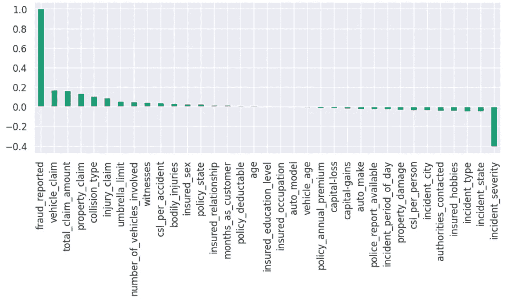

让我们首先从连续变量‘month _ as _ customer’对目标的影响开始。

```
fig, axes, summary_df = info_plots.target_plot(\
df=data, feature='months_as_customer',
feature_name='months_as_customer', target='fraud_reported',
show_percentile=True)
```

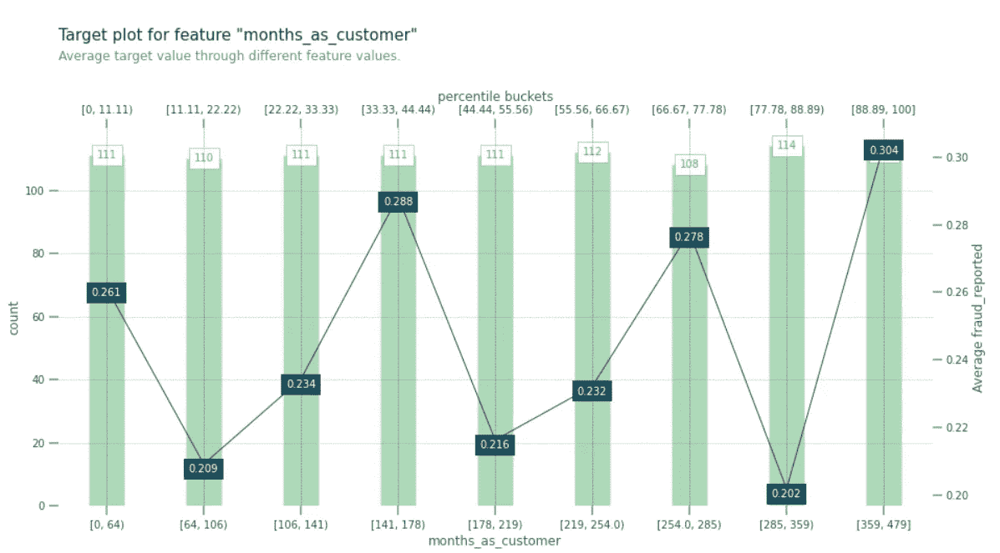

该图显示，在原始数据中，在 141–178、254–285 和 359–479 个月期间，客户似乎有更高的欺诈索赔概率。

```
fig, axes, summary_df = info_plots.actual_plot(\
model, X_train, feature='months_as_customer', feature_name = 'MonthsAsCustomer',predict_kwds={})
```

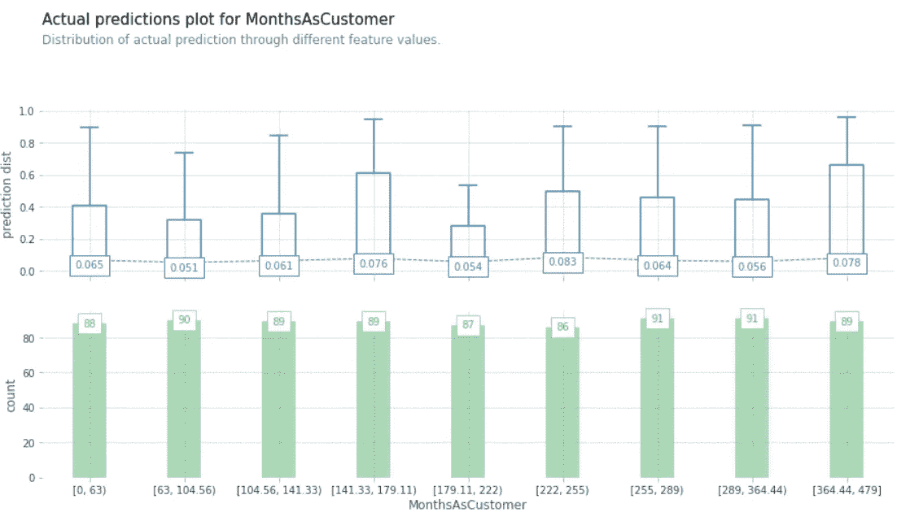

这个数字证实了前一个的发现。这一发现表明，我们的拟合模型能够捕捉数据模式，并且应该能够很好地概括测试数据。

## 实际预测图:

实际预测图通过 2 个预测的不同特征值显示实际预测的中间值。

```
fig, axes, summary_df = info_plots.target_plot_interact(\
df=data, features=['insured_education_level', 'age'],
feature_names=['insured_education_level', 'age'],
target='fraud_reported')
```

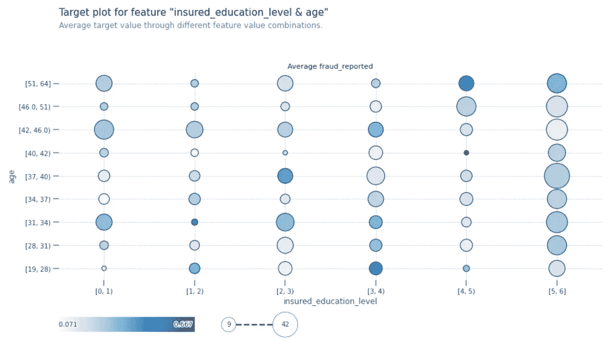

这里，气泡的颜色提供了两个自变量如何影响因变量的深刻见解。颜色越深意味着举报欺诈的可能性越大。

```
fig, axes, summary_df = info_plots.target_plot_interact(\
df=data,
features=['vehicle_age', 'months_as_customer'],
feature_names=['vehicle_age', 'months_as_customer'],
target='fraud_reported')
```

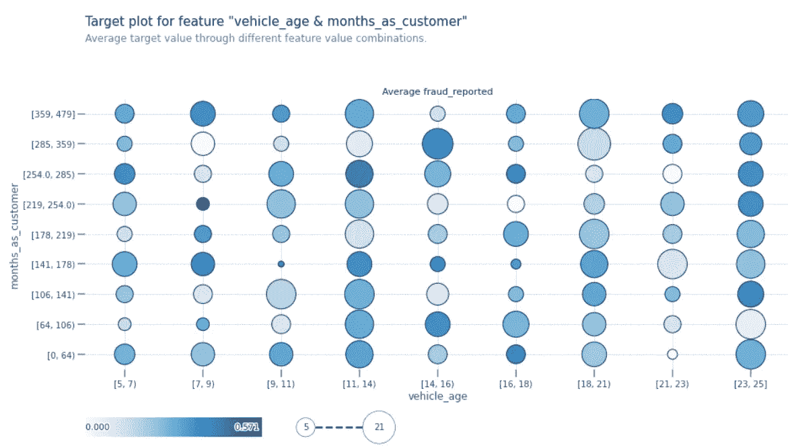

现在，我们可以创建一个 PDP 来分析不同特征对欺诈索赔概率的影响。

```
pdp_limit = pdp.pdp_isolate(\
model, dataset=X_test,model_features=X_test.columns, feature = 'months_as_customer')
fig, axes = pdp.pdp_plot(\
pdp_limit, 'months_as_customer', frac_to_plot=0.2, plot_lines=True, x_quantile=True, show_percentile=True, plot_pts_dist=True)
plt.tight_layout()
```

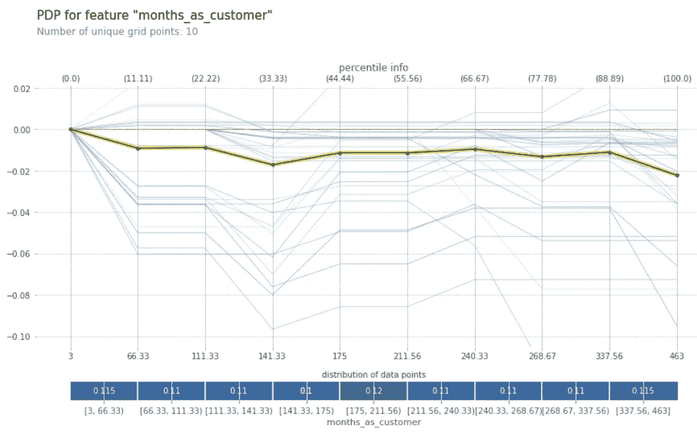

黄色和黑色的线给出了预测的平均效果(欺诈案例),具体取决于作为客户的月份。通过查看这条线，我们可以看到，作为客户的月份可能不会对目标变量产生影响。

然而，看下面的图，我们可以清楚地看到事件的严重性

```
pdp_limit = pdp.pdp_isolate(\
model, dataset=X_test, model_features=X_test.columns, feature='incident_severity')
fig, axes = pdp.pdp_plot(\
pdp_limit, 'incident_severity', frac_to_plot=0.2, plot_lines=True, x_quantile=True, show_percentile=True, plot_pts_dist=True)
```

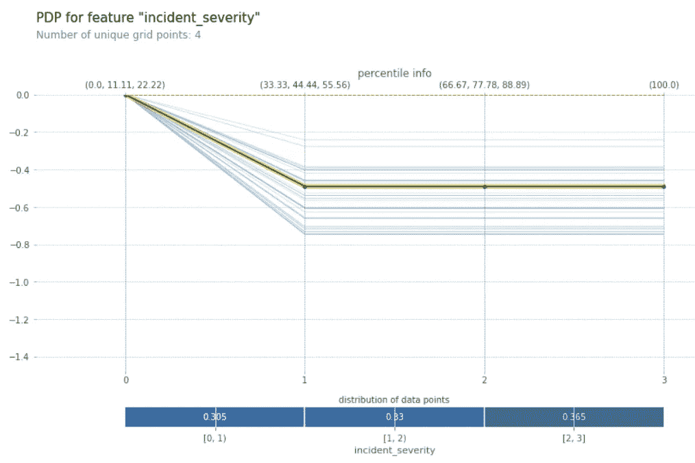

在这里，通常我们应该检查两个训练/测试分割，以进行完整的分析。训练数据揭示了模型所获得的洞察，而检查测试集的结果则揭示了这些模式的可概括程度。

## 沙普利添加剂解释(SHAP):

Shapley 值形成了标准特征重要性机制的更好的替代方案。SHAP 价值观通过在全球和地方层面提供可解释性来增加模型的透明度。总体而言，他们估计每个变量对目标变量的贡献，无论是正面还是负面的。在局部上，它们解释了为什么一个给定的观察值被指定为属于一个类，以及变量的贡献。

## 汇总图:

柱状图是通过获取每个特征的 SHAP 值的平均绝对值绘制的。

```
shap_values = shap.TreeExplainer(model).shap_values(X_test)
shap.summary_plot(shap_values, X_test, plot_type="bar")
```

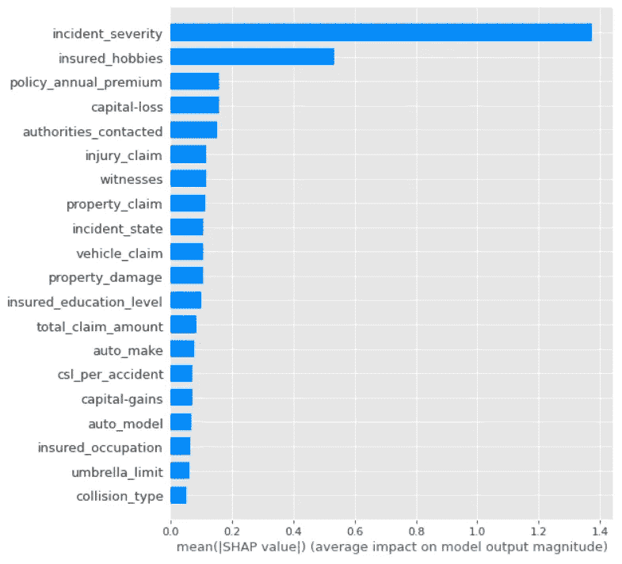

*事故严重程度和被保险人爱好*是*理赔*最重要的两个特征

```
shap.initjs()
j = 1 # j will be the record we explain
explainerXGB = shap.TreeExplainer(clf)
shap_values_XGB_test = explainerXGB.shap_values(X_test)
shap.force_plot(explainerXGB.expected_value, shap_values_XGB_test[j], X_test.iloc[[j]])
```

如果我们只是将所有正面的特征重要性堆叠在左边，而将所有负面的特征重要性堆叠在右边，就可以得到最终的模型预测值-2.84，如下所示。由于大多数目标都是 0，所以看到基值为负并不奇怪。将预测值推高的要素显示为红色，将预测值推低的要素显示为蓝色。

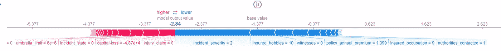

我们可以清楚地看到对这个实例的最终输出贡献最大的特性。请注意，这与我们基于上述置换特征进行的分析是一致的。将图上方旋转 90 度，并排堆叠所有可能的值，我们得到图下方。

```
shap.initjs()
shap.force_plot(explainerXGB.expected_value, shap_values, X_test)
```

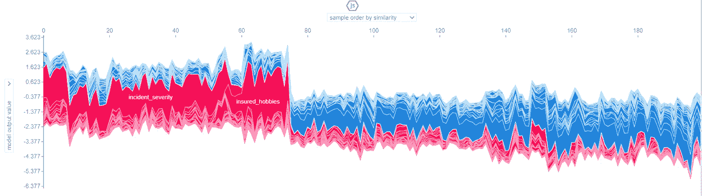

上图显示了所有可能数据点的全局视图及其相对于总体平均值(-2.37)的 SHAP 贡献。该图实际上是交互式的，我们可以滚动每个数据点并检查 SHAP 值。

## 汇总图:

该图显示了所有要素上 SHAP 值分布的另一个全局汇总。对于每个特性(水平行)，我们可以鸟瞰特性的重要性以及驱动它的因素。在下图中，X 轴表示 Shapley 值，其中正值表示较高的默认概率，负值表示较低的默认概率，而 Y 轴具有按要素重要性排序的要素；最后，使用从蓝色(较低的特征值)到红色(较高的特征值)的渐变为这些点着色。因此，如果特征在水平轴上呈现从蓝色到红色的变化，则 Shapley 值增加，然后存在关于欺诈 _ 报告风险的单调增加的关系。

显示了所有要素的 SHAP 值分布的另一个全局汇总。对于每个特性(水平行)，您可以看到特性重要性的分布。

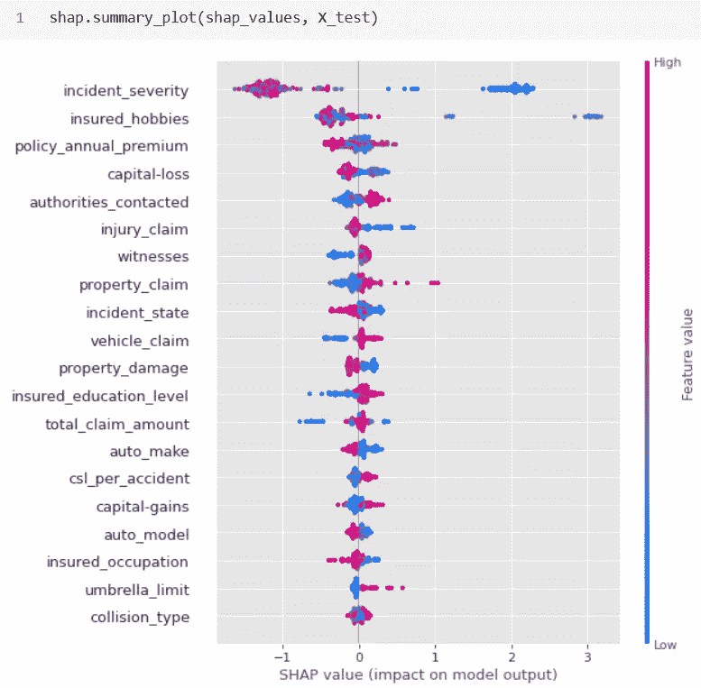

对于事件严重性和被保险人爱好，我们可以找到一个外围的红点，它打破了单调性，表示严重事件增加了欺诈索赔的风险。令人惊讶的是，被保险的爱好与欺诈索赔联系在一起。其余特征对模型的预测能力有轻微影响。

# 关键要点:

模型可解释性，其中线性模型可解释性很容易，但是提供最高准确性的复杂模型很难解释。基于特征重要性的可解释的 ML 方法仍然需要领域知识来理解模型/决策解释，这可能受到人为偏见的影响。然而，我们可以看到，SHAP 值是非常有用的，并有一些明显的优势，如公平分布，对比解释，坚实的理论基础，全球模型解释和快速实施。特别是对于 XGBoost，SHAP 进行了优化，实现起来非常快。

**我这里可以连接**[](https://www.linkedin.com/in/saritmaitra/)*。*