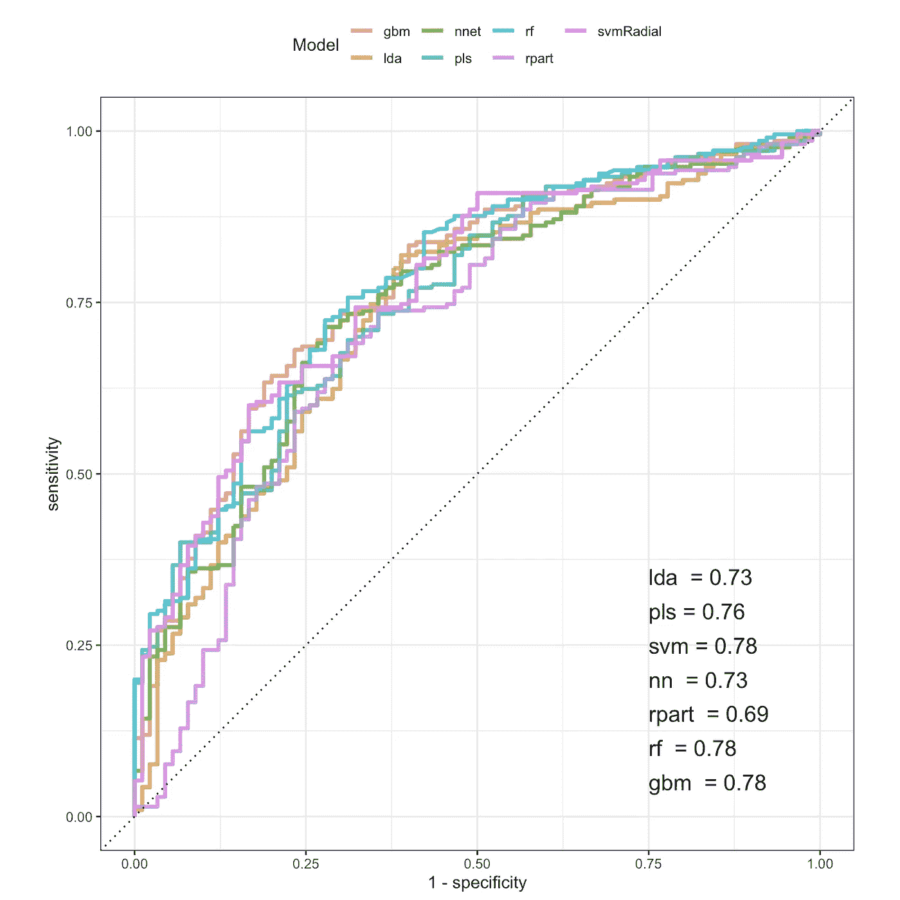
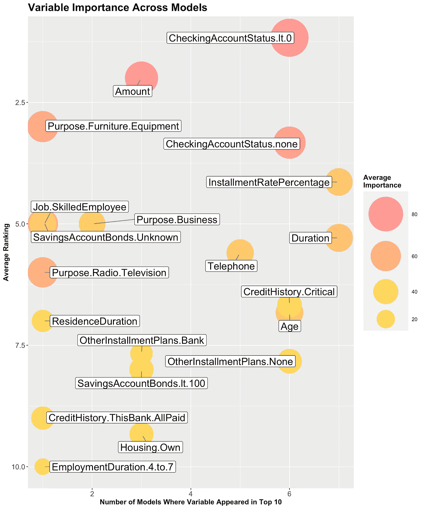

# 机器学习模型实现:评估模型间的可变重要性

> 原文：<https://towardsdatascience.com/machine-learning-model-implementation-assessing-variable-importance-across-models-30c282d143ec?source=collection_archive---------36----------------------->

## 实践中的机器/深度学习模型系列的第 1 部分

太好了！因此，您完成了您的机器学习(ML)管道，希望通过仔细的验证程序为每个模型选择您的调整参数，并且已经收敛到您认为每个策略的最终模型。下一步是什么？在本系列的第一部分中，我将讨论 ROC 曲线下区域之外的一些度量和图形，它们有助于实现我们的项目目标。有时候，作为数据科学家，我们对数据和建模的狭隘看法，或者至少是其他人对我们的这种看法，会限制我们作为沟通者和战略家的潜在效力。我将在这些文章中演示的元素将帮助你通过你的合作者的眼睛看到你工作中的问题，并为你提供具体的方法来解决他们的关注和你的 ML 工作的目标。具体来说，在本文中，我们将:

1.  讨论为什么探索机器学习中可变重要性的统一框架很重要！
2.  显示 R 代码，使用一组 ML 模型的结果生成一个可变重要性图。

# 可变重要性的重要性

希望你已经明白了在处理预测问题时尝试不同方法的重要性。拟合不同复杂程度的模型(例如线性和非线性)可以确定最简洁的模型，为我们正在处理的数据提供良好的预测性能。然而，应用不同模型带来的好处的另一面可能是比较这些不同策略的结果的明显困难。用于拟合模型的预测因素如何呢——如何评估这些预测因素以确定什么是重要的？作为一名数据科学家，我要求你找到一名主题专家，尽管你可能会提供一个预测相当好的模型，但他对幕后发生的事情没有好奇心！您的最终模型可能对参数系数有直接的解释，例如对于线性模型，但对于更复杂的非线性策略，情况并非总是如此。幸运的是，尽管模型有不同的参数化和优化策略，但相对变量重要性是一个统一的概念，可以允许对模型之间的特性进行比较。关于如何计算不同模型的重要性的更多细节可以在 Max Kuhn 和 Kjell Johnson 的应用预测建模([http://appliedpredictivemodeling.com](http://appliedpredictivemodeling.com))中找到，并且可以在 r

基本上，这种统一是这样实现的:尽管变量的重要性对于每个模型来说是不同的，但对于每个策略来说，最重要的变量被赋予了 100 分，就像“100%”，因此将这些重要性分数描述为相对分数是最准确的。然后，下一个重要变量被赋予一个 0 到 100 之间的相对值，其接近 100 表示其重要性与第一个变量的接近程度。这在整个预测器中进行，除了在相对少量的模型的情况下，这些模型通过模型拟合程序执行它们自己的变量选择。对于这些模型，对于模型中不包括的任何特征，变量重要性为零。

关于相对变量重要性，需要注意的一个重要警告是，它最好被认为是绝对值的指标，而不是效果的符号或方向。重要预测值可能与结果正相关或负相关。

# 数据

在本文中，我将使用 7 ML 模型的结果来分析 R caret 包中可用的德国信用分类数据。它由 1000 个被确定为信用良好(n=700)或信用不良(n=300)的个人的观察结果组成。有 61 个预测因子，涵盖了可能与信贷有关的各种因素，如贷款特征、银行信息、人口统计、就业等。数据被分成 70% — 30%的训练测试部分，保留了两者中 70%的良好信用频率。注意，计算变量重要性仅涉及来自训练集的数据，该训练集被分成 5 个 CV 集，重复 5 次，以确定最佳调整参数。建模是使用 r 中的 caret 包完成的。

*线性判别分析(LDA)
*偏最小二乘(PLS)
*支持向量机(SVM，带径向核函数)
*神经网络(NN)
*递归分割(Rpart，单树)
*随机森林(RF)
*梯度推进机(GBM)

在本系列的下一篇文章中，我将更多地讨论这些模型的表现。为了我们的目的，现在模型显示了交叉验证性能中的合理信号，因此有理由查看相对变量重要性。



在 R 中，可以使用 varImp()函数从 caret 模型对象中提取可变的重要性度量。不过，在这里，我们将从一个. csv 文件的代码中选取一些内容，该文件包含每个模型的前 10 个重要变量，以及它们的重要性值，因此，如果您从其他来源有这样的文件，可以在 R 中加入这些代码。

```
require(tidyverse)
require(ggplot2)
require(ggrepel)varImp_all <- read_csv('varImp.csv')
varImp_all## # A tibble: 70 x 3
##    model imp_vars                   Importance
##    <chr> <chr>                           <dbl>
##  1 lda   CheckingAccountStatus.lt.0      100  
##  2 lda   CheckingAccountStatus.none       87.8
##  3 lda   InstallmentRatePercentage        54.3
##  4 lda   Duration                         49.9
##  5 lda   CreditHistory.Critical           47.4
##  6 lda   Telephone                        42.2
##  7 lda   SavingsAccountBonds.lt.100       38.7
##  8 lda   OtherInstallmentPlans.None       38.3
##  9 lda   Age                              36.5
## 10 lda   Housing.Own                      34.8
## # … with 60 more rows
```

在接下来的步骤中，对数据进行处理，以获得图中捕捉的 3 个维度:

1.  该功能出现在前 10 位的型号数量
2.  该功能在模型中的平均排名
3.  跨模型的特征的平均相对重要性值

```
# Variable importance figure
# create rankings for important variables in each model
varImp_all$rank <- sequence(rle(as.character(varImp_all$model))$lengths)
# compute average importance and ranking for all variables
varImpSummary <- aggregate(varImp_all[,3:4], list(varImp_all$imp_vars), mean)
colnames(varImpSummary) <- c('var','avg_imp','avg_rank')
varImpSummary <- varImpSummary %>%
  mutate(avg_imp = round(avg_imp,2),
         avg_rank = round(avg_rank,2))# count frequency of important variable across models
varImpTable <- data.frame(table(varImp_all$imp_vars))
varImpOrder <- varImpTable[order(varImpTable$Freq, decreasing = T),]
colnames(varImpOrder) <- c("var", "num_models")varImp_dat <- merge(varImpSummary,varImpOrder)
varImp_dat <- varImp_dat[order(varImp_dat$avg_imp, decreasing = TRUE),]
```

下面是 ggplot2 代码。可能最棘手的部分是在一个图例中同时获得尺寸和颜色。此外，我们将反转 y 轴的正常方向，这样一来，排名 1 将位于顶部。这将在图表的右上角创建一个最佳位置，在这里多个模型中排名最高的特性将聚集在一起。同样，左下角将代表最不重要的变量。

```
p <- ggplot(varImp_dat, aes(x = num_models, y = avg_rank)) + 
  geom_point(aes(color = avg_imp, size = avg_imp)) + 
  scale_size_continuous(range = c(1,30)) +
  scale_color_gradient(low = "yellow", high = "hotpink", na.value = NA, guide = 'legend') +
  guides(color=guide_legend(reverse = TRUE), size = guide_legend(reverse = TRUE)) +
  scale_y_continuous(trans = "reverse") + 
  labs(title = "Variable Importance Across Models", 
       x = "Number of Models Where Variable Appeared in Top 10", 
       y = "Average Ranking", color = "Average\nImportance", size = "Average\nImportance")
```

这部分绘图代码标记了预测值。ggrepel 包中的 geom _ label _ repel()函数有助于战略性地放置标注(即不要一个放在另一个上面)。

```
p <- p + geom_label_repel(aes(label = var),
                          box.padding   = 0.35, 
                          point.padding = 0.5,
                          segment.size = 0.5,
                          size = 6,
                          segment.color = 'grey50')
```

最后是一些主题调整:

```
p <- p + 
  theme(plot.title = element_text(color="black",face="bold",size=18,hjust=0),
        axis.title = element_text(color="black",face="bold",size=12),
        legend.title = element_text(color="black",face="bold",size=12),
        legend.position = "right",
        axis.text=element_text(size=12))
```

最后，我们直观地总结了本分析中模型所指示的重要变量。可能不足为奇的是，拥有一个余额小于零的支票账户，或者根本没有支票账户是多种模型中的重要因素。此外，贷款本身的特征，包括分期付款率和期限，似乎在所有模型中都很重要。在发现它的模型中，出现频率较低但很重要的是贷款的数量。只有一个模型(碰巧是神经网络)将贷款的目的选择为提供家具和设备，但它显示了相对较高的重要性值。也许神经网络正在获取像餐馆这样有较高失败倾向的商业贷款。这些类型的见解有可能简化数据收集，并提出改进贷款审批流程以减少违约的方法。



总之，如果您建模的目的是确定改进流程性能的方法，而不仅仅是监控和预测，那么对结果的驱动因素有一些了解将是非常有价值的。能够显示相对变量重要性可能会激起对模型效用的兴趣，并允许更具战略性的实现。