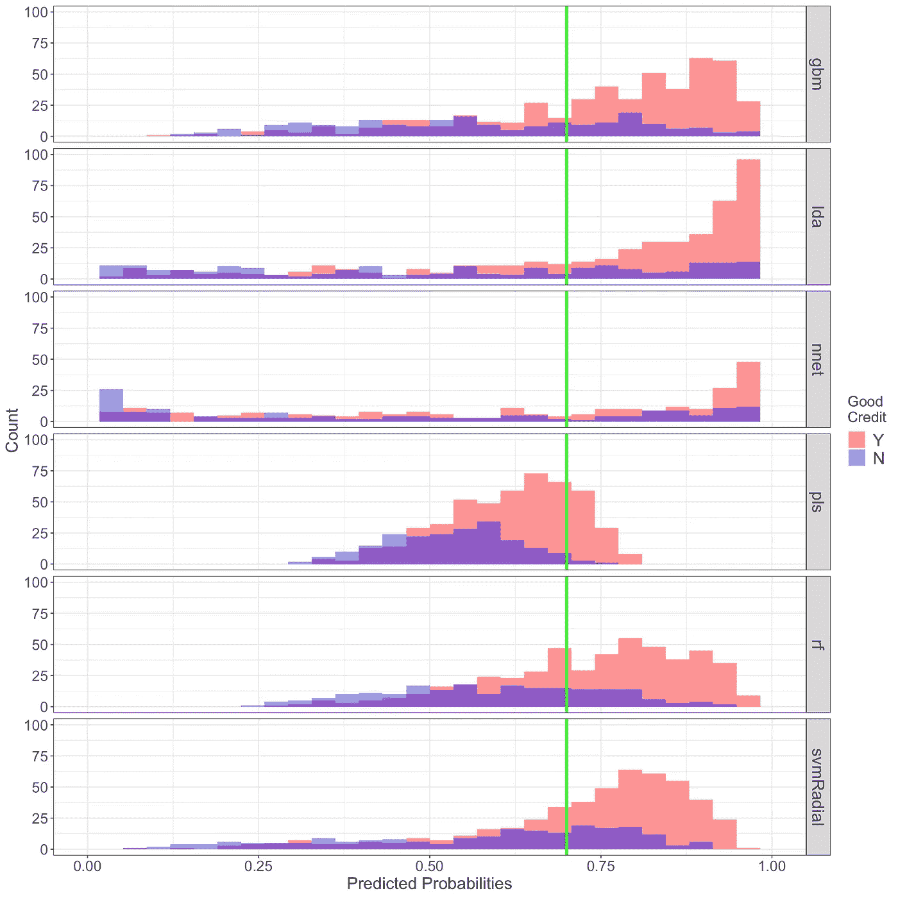

# 机器学习模型实现:精度/召回率和概率截止值

> 原文：<https://towardsdatascience.com/machine-learning-model-implementation-precision-recall-and-probability-cut-offs-49429ed644c5?source=collection_archive---------36----------------------->

## 实践中的机器/深度学习模型系列的第 2 部分

祝贺您完成机器学习(ML)管道！在本系列的第二部分中，我将讨论 ROC 曲线下区域之外的一些度量标准和图形，这些度量标准和图形有助于选择我们希望向前发展并在实践中实现的模型，同时牢记我们项目的目标。具体来说，在本文中，我们将:

1.讨论为什么精确度/召回率的权衡可能是许多问题的最佳框架，以及
2。展示图形和摘要，这些图形和摘要可以将预测性建模练习转化为对实践中的决策非常有影响的东西。

# 什么是精准和召回(我以前见过吗)？

如果你一直在处理分类问题，你可能以前见过回忆，因为它也被称为敏感性。回顾一下，假设我们有兴趣预测一个 2 级事件，赢或输。那么回忆=灵敏度=一个真实的胜利被预测为胜利的概率；本质上，它是我们在预测的成功案例中成功捕获的真实成功案例的比例。接下来，Precision 也称为正预测值(PPV ),我觉得它更具描述性。对于 PPV，我们把事情颠倒过来，说:好吧，在我预测的胜利中，哪些是真正的胜利。当然，这两者都很重要:我们希望在我们的预测成功桶中捕获所有真正的成功，并且所有预测的成功都变成真正的成功。但是正如你所预料的，这两者之间会有一些冲突，它们之间的权衡体现在精确召回(PR)曲线中。我们可以计算这条曲线下的面积(AUC ),就像我们计算 ROC 曲线的 AUC 一样。ROC 曲线有一条从 0 到 1 的参考斜线，表示模型性能相当于掷硬币，而 AUC PR 曲线的参考线是一条水平线，表示真正获胜的频率。

既然我们已经了解了精确召回的权衡，为什么它会如此重要呢？在许多分类问题中，有一个事件比另一个结果更令人感兴趣，或者与更大的成本或回报相关联。因此，虽然 AUC ROC 曲线很重要，但 AUC PR 曲线可能与许多预测问题的模型性能和选择更密切相关。此时你可能会说，“你一直在谈论交易，但我该如何进行这些交易呢？”正是通过改变概率截止水平，我们需要称之为“赢”该级别设置得越低，敏感度/召回率就越高(“我们已经正确地将大多数真正的成功捕获为预测的成功”)，但可能会有许多误报。截止值越高，精确度/PPV 越高(“大多数预测的成功实际上是真实的成功”)，但是大量真实的成功不会被归类为真实的成功(假阴性)。好了，在这个讨论变得太抽象之前，让我们继续一个例子。

# 数据

在本文中，我将使用 7 个机器学习(ML)模型的结果，这些模型分析了 R caret 包中可用的德国信用分类数据。它由 1000 个被确定为信用良好(n=700)或信用不良(n=300)的个人的观察结果组成。有 61 个预测因子，涵盖了可能与信贷有关的各种因素，如贷款特征、银行信息、人口统计、就业等。数据被分成 70%-30%的训练-测试部分，保留了两者中 70%的良好信用频率。将训练集分成 5 个 CV 集，重复 5 次，以确定最佳调谐参数。建模是使用 r 中的 caret 包完成的。

*线性判别分析(LDA)
*偏最小二乘(PLS)
*支持向量机(SVM，带径向核函数)
*神经网络(NN)
*递归分割(Rpart，单树)
*随机森林(RF)
*梯度推进机(GBM)

以下是应用于保留测试集的七个 ML 学习拟合的 AUC ROC 和 AUC PR 曲线(即不涉及模型交叉验证)。除了单个树 Rpart 模型之外，测试集中的模型性能在 fits 之间是相似的。看一下实际的精确-回忆曲线，权衡变得明显:当我们的回忆或敏感度较低时，我们不能正确预测许多良好的信用主体，但我们归类为良好的信用主体实际上大多是良好的。这相当于使用高值作为“好”的概率截止值。随着我们降低截止概率，敏感度/召回率提高，但以精确度/PPV 为代价(许多预测的良好信用主体实际上具有不良信用)。

德国信贷问题中的数据是一个不平衡的分类惩罚结构的例子。在这种情况下，更糟糕的是，当一个主体的信用实际上很差时，将其归类为信用良好。这可能导致有人收到贷款或信用卡，他们很可能会拖欠。另一方面，向那些有能力履行信贷条件的人发放贷款和发放信贷是有利可图的，但成功的贷款所带来的损失不如不成功的贷款所带来的损失多。

另一个直观的方法是，通过它们的基本事实来检查我们的测试数据的预测概率的分布。下面是一个例子:Rpart 模型已被删除，以改善数字缩放，垂直的绿线代表一个潜在的临界值，可用于确定模型预测的阳性(此处为 0.7)。这种类型的图形允许以易于理解的方式显示真阳性和假阳性区域。从图中可以清楚地看出，这些模型将需要不同的概率截止值来实现相同的性能。例如，PLS 模型需要较低的临界值，以实现与其他模型相似的灵敏度和 PPV。该图的另一个启示是，除了最高的截止值之外，所有的截止值都会保留一些假阳性，并且对于一些模型来说，它们可能无法完全消除。

在我们有了大图之后，我们可以更深入地研究细节，检查模型以找到满足我们目标的最佳点。例如，如果 76%的 PPV 值是可容忍的(即 24%的假阳性)，RF 模型表明这可以使用 0.5 的截止值在 93%的灵敏度下实现。(请注意，这些值应被视为取自一个测试样本的估计值。另一种方法是为每个 CV 维持样本计算这些值，并检查它们的分布。然而，这个假阳性率可能太高了，如果我们不太担心错过真正的阳性，我们可能更喜欢光谱的另一端。截止值为 0.7 的 PLS 模型将仅捕获 22%的真阳性，但是 95%被分类为阳性的真阳性。我们的风险函数的性质以及与我们的模型实现相关联的实际约束可以引导我们做出最佳选择。在信贷示例中，可以假设好的和坏的信贷的美元(或欧元)预期收益和损失，并为每个截止选项进行计算。

总之，战略性地考虑精确召回、预测的概率分布和不同截止点的模型性能分析，以及我们开发的模型将如何在实践中使用，将导致机器学习管道，这些管道有真正的机会影响更大的商业目标和目的。