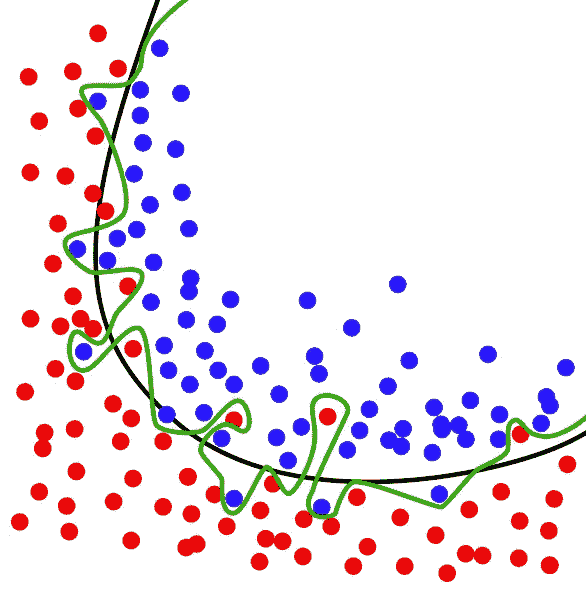
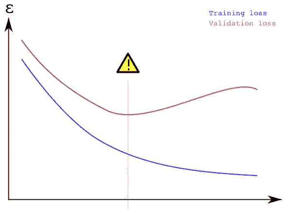
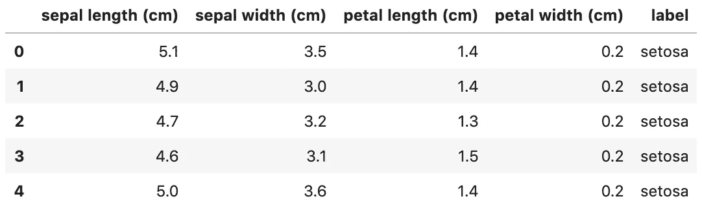
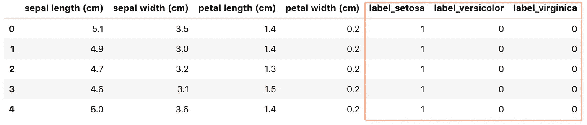
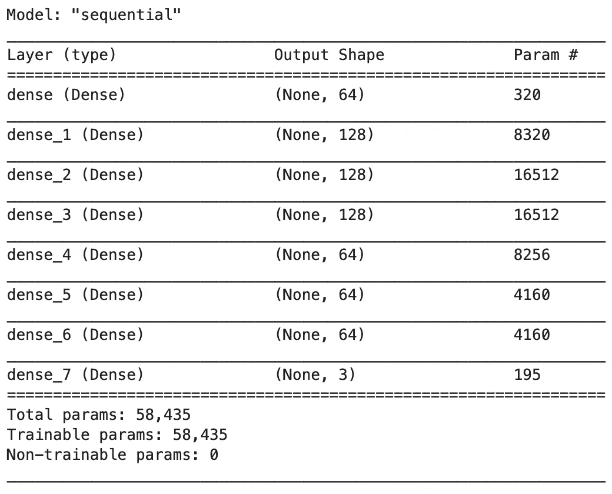
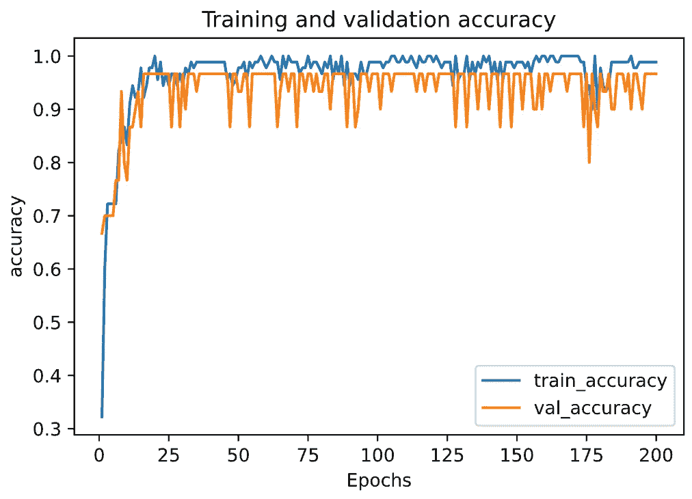
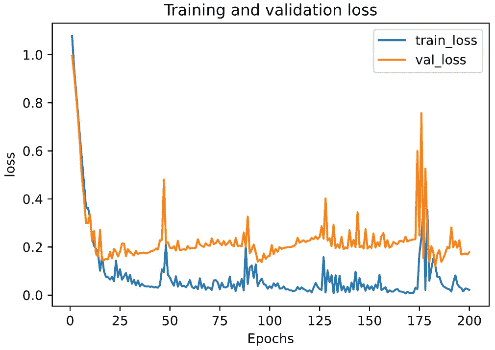
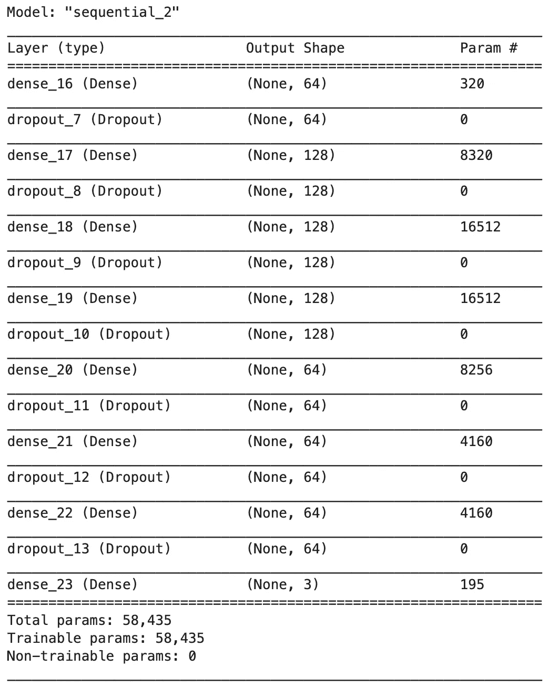
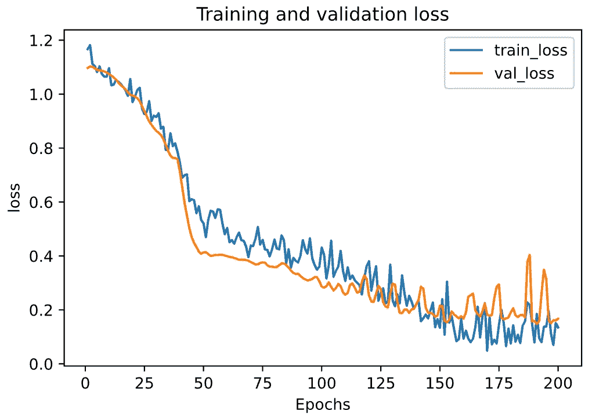

# 实践中的机器学习模型正则化:以 Keras 和 TensorFlow 2.0 为例

> 原文：<https://towardsdatascience.com/machine-learning-model-regularization-in-practice-an-example-with-keras-and-tensorflow-2-0-52a96746123e?source=collection_archive---------15----------------------->

## 一步一步的教程，使用 L2 正则化和辍学，以减少过度拟合的神经网络模型。


[摇滚猴子](https://unsplash.com/@rocknrollmonkey?utm_source=unsplash&utm_medium=referral&utm_content=creditCopyText)在 [Unsplash](https://unsplash.com/s/photos/artificial-intelligence?utm_source=unsplash&utm_medium=referral&utm_content=creditCopyText) 上的照片

在本文中，我们将重点关注将正则化纳入我们的机器学习模型，并查看一个示例，说明我们如何在 Keras 和 TensorFlow 2.0 的实践中做到这一点。

# 正规化的简明介绍

> 事实证明，许多人害怕数学，尤其是初学者和将职业道路转向数据科学的人。

让我们避开数学，试着用更温和的方式解释正则化。如果你正在寻找正规化的完整解释(带有大量数学表达式)，你可能会发现以下文章很有用:

*   [机器学习中的正则化](/regularization-in-machine-learning-76441ddcf99a)
*   [正则化:机器学习中的一个重要概念](/regularization-an-important-concept-in-machine-learning-5891628907ea)

正则化是一种对抗机器学习中 ***过拟合*** 问题的技术。 ***过拟合*** ，也称为 ***高方差，*** 指的是对训练数据学习得太好，但未能推广到新数据的模型。例如，下面的绿线是过度拟合的模型，黑线代表正则化的模型。



绿线代表过度拟合的模型，黑线代表正则化的模型。来源于[维基百科](https://en.wikipedia.org/wiki/Overfitting)

***过拟合*** 可以通过标图训练和验证损失来诊断。例如，在下图中，训练错误显示为蓝色，验证错误显示为红色，两者都是训练时期数的函数。如果验证误差增加，而训练误差稳定减少，则可能出现过拟合的情况。



过度拟合可以通过绘制训练和验证损失来诊断。来源于[维基百科](https://en.wikipedia.org/wiki/Overfitting)

一旦诊断出过度拟合，就应该尝试不同的正则化技术和参数，看看它们是否有帮助。最广泛使用的正则化技术有:

*   ***L1 正则化*** 给损失函数增加了*绝对值*作为惩罚项。有人说 L1 可以帮助压缩模型。但在实践中，L1 正则化使你的模型稀疏，只有一点点帮助。L2 正则化只是用得更多。
*   ***L2 正则化*** (也称为权重衰减)将*平方量级*作为惩罚项添加到损失函数中，它比 L1 使用得更频繁。
*   ***Dropout*** 是深度学习中广泛使用的正则化技术。它在每次迭代中随机关闭一些神经元。
*   ***数据增加*** 增加额外的假训练数据。更多的训练也有助于减少过度配合。
*   ***提前停止*** 是深度学习中另一种广泛使用的正则化技术。当泛化误差增加时，它停止训练。

在下面的文章中，我们将结合 L2 正则化和辍学，以减少神经网络模型的过度拟合。

# 环境设置、源代码和数据集准备

为了运行本教程，您需要安装

> *TensorFlow 2，numpy，pandas，sklean，matplotlib*

它们都可以直接安装在 vis PyPI 上，我强烈建议创建一个新的虚拟环境。关于创建 Python 虚拟环境的教程

*   [使用“virtualenv”创建虚拟环境，并将其添加到 Jupyter 笔记本中](/create-virtual-environment-using-virtualenv-and-add-it-to-jupyter-notebook-6e1bf4e03415)
*   [使用“conda”创建虚拟环境，并将其添加到 Jupyter 笔记本中](https://medium.com/analytics-vidhya/create-virtual-environment-using-conda-and-add-it-to-jupyter-notebook-d319a81dfd1)

## 源代码

这是一个循序渐进的教程，所有的说明都在这篇文章中。源代码请查看我的 Github [机器学习报告](https://github.com/BindiChen/machine-learning)。

## 数据集准备

本教程使用[安德森鸢尾花(iris)](https://en.wikipedia.org/wiki/Iris_flower_data_set) 数据集进行演示。该数据集包含五个属性下的一组 150 条记录:*萼片长度*、*萼片宽度*、*花瓣长度*、*花瓣宽度、*和*类别*(从 sklearn 数据集称为*目标*)。

首先，让我们导入库并从 ***scikit-learn*** 库中获取虹膜数据集。你也可以从 [UCI 虹膜数据集](https://archive.ics.uci.edu/ml/datasets/iris)下载。

```
import tensorflow as tf
import pandas as pd
import numpy as np
import matplotlib.pyplot as plt
from sklearn.datasets import load_iris
from sklearn.model_selection import train_test_split**iris = load_iris()**
```

为了研究数据，让我们将数据加载到一个数据帧中

```
# Load data into a DataFrame
**df = pd.DataFrame(iris.data, columns=iris.feature_names)** # Convert datatype to float
**df = df.astype(float)** # append "target" and name it "label"
**df['label'] = iris.target** # Use string label instead
**df['label'] = df.label.replace(dict(enumerate(iris.target_names)))**
```

并且`df`应该如下所示:



我们注意到 ***标签*** 列是一个分类特征，需要将它转换成[一次性编码](/what-is-one-hot-encoding-and-how-to-use-pandas-get-dummies-function-922eb9bd4970)。否则，我们的机器学习算法将无法直接将其作为输入。

```
# label -> one-hot encoding
**label = pd.get_dummies(df['label'], prefix='label')**
**df = pd.concat([df, label], axis=1)**
# drop old label
df.drop(['label'], axis=1, inplace=True)
```

现在，`df`应该是这样的:



接下来，让我们创建`X`和`y`。Keras 和 TensorFlow 2.0 只接受 Numpy 数组作为输入，所以我们必须将 DataFrame 转换回 Numpy 数组。

```
# Creating X and y**X = df[['sepal length (cm)', 'sepal width (cm)', 'petal length (cm)', 'petal width (cm)']]**
# Convert DataFrame into np array
**X = np.asarray(X)****y = df[['label_setosa', 'label_versicolor', 'label_virginica']]** # Convert DataFrame into np array
**y = np.asarray(y)**
```

最后，让我们使用来自 **sklearn** 库中的`**train_test_split()**` 将数据集拆分成训练集(80%)和测试集(20%)。

```
X_train, X_test, y_train, y_test = **train_test_split**(
  **X,
  y,
  test_size=0.20**
)
```

太好了！我们的数据已经准备好建立一个机器学习模型。

# 1.建立非正则化神经网络模型

在应用正则化之前，**让我们建立一个没有正则化的神经网络，看看过拟合问题**。

用 Keras 和 Tensorflow 2 创建机器学习模型有 [3 种方法。由于我们正在构建一个简单的全连接神经网络，为了简单起见，让我们使用最简单的方法:带有`Sequential()`的顺序模型。](/3-ways-to-create-a-machine-learning-model-with-keras-and-tensorflow-2-0-de09323af4d3)

让我们继续创建一个名为`create_model()`的函数来返回一个序列模型。

```
from tensorflow.keras.models import Sequential
from tensorflow.keras.layers import Densedef **create_model()**: 
    model = Sequential([
        Dense(64, activation='relu', **input_shape=(4,)**),
        Dense(128, activation='relu'),
        Dense(128, activation='relu'),
        Dense(128, activation='relu'),
        Dense(64, activation='relu'),
        Dense(64, activation='relu'),
        Dense(64, activation='relu'),
        **Dense(3, activation='softmax')**
    ])
    return model
```

注意到

*   第一层(也称为输入层)有`input_shape`来设置输入大小`(4,)`
*   输入层有 64 个单元，接着是 3 个密集层，每个层有 128 个单元。然后还有 3 个密集层，每个层有 64 个单元。所有这些层都使用 ReLU 激活功能。
*   输出密集层有 3 个单元和 softmax 激活功能。

通过跑步

```
model = create_model()
model.summary()
```

应该打印出模型摘要。



## 1.1 培训模型

为了训练一个模型，我们首先必须使用`compile()`配置我们的模型，并传递以下参数:

*   使用 Adam ( `adam`)优化算法作为优化器
*   对于我们的 ***多类分类*** 问题，使用分类交叉熵损失函数(`categorical_crossentropy`
*   为简单起见，使用`accuracy`作为我们在训练和测试期间评估模型的评估指标。

```
model.compile(
    **optimizer='adam', 
    loss='categorical_crossentropy', 
    metrics=['accuracy']**
)
```

之后，我们可以调用`model.fit()`来使我们的模型适合训练数据。

```
history = model.fit(
    X_train, 
    y_train, 
    **epochs=200, 
    validation_split=0.25, 
    batch_size=40,** 
    verbose=2
)
```

如果一切顺利，我们应该得到如下输出

```
Train on 90 samples, validate on 30 samples
Epoch 1/200
90/90 - 1s - loss: 1.0939 - accuracy: 0.4333 - val_loss: 1.0675 - val_accuracy: 0.5333
Epoch 2/200
90/90 - 0s - loss: 1.0553 - accuracy: 0.6556 - val_loss: 1.0160 - val_accuracy: 0.7000
......
......
Epoch 200/200
90/90 - 0s - loss: 0.0624 - accuracy: 0.9778 - val_loss: 0.1874 - val_accuracy: 0.9333
```

## 1.2 模型评估

一旦训练完成，就该看看模型是否适合模型评估了。模型评估通常包括

1.  绘制**损失**和**准确性**指标的进度
2.  用从未用于训练的数据来测试我们的模型。这就是我们之前搁置的测试数据集`X_test`发挥作用的地方。

让我们创建一个函数`plot_metric()`来绘制度量标准。

```
%matplotlib inline
%config InlineBackend.figure_format = 'svg'def **plot_metric(history, metric)**:
    train_metrics = history.history[metric]
    val_metrics = history.history['val_'+metric]
    epochs = range(1, len(train_metrics) + 1)
    plt.plot(epochs, train_metrics)
    plt.plot(epochs, val_metrics)
    plt.title('Training and validation '+ metric)
    plt.xlabel("Epochs")
    plt.ylabel(metric)
    plt.legend(["train_"+metric, 'val_'+metric])
    plt.show()
```

通过运行`plot_metric(history, 'accuracy')`绘制精度进度。



通过运行`plot_metric(history, 'loss')`绘制损失进度。



从上面的图表中，**我们可以看到，模型过度拟合了训练数据，因此它的表现优于验证集。**

在测试集上评估模型

```
# Evaluate the model on the test set
model.**evaluate**(**X_test**, **y_test**, verbose=2)
```

我们应该得到如下所示的输出

```
30/1 - 0s - loss: 0.0137 - accuracy: 1.0000
[0.01365612167865038, 1.0]
```

# 2.添加 L2 正规化和辍学

首先，让我们从 TensorFlow Keras 包中导入****L2***转正*

```
*from tensorflow.keras.**layers** import **Dropout**
from tensorflow.keras.**regularizers** import **l2***
```

*然后，我们创建一个名为`create_regularized_model()`的函数，它将返回一个类似于我们之前构建的模型。但是，这次我们将添加 ***L2 正则化*** 和 ***辍学*** 层，所以这个函数需要 2 个参数:一个 L2 正则化`factor`和一个辍学`rate`。*

*   *让我们添加 ***L2 正则化*** 在所有层除了输出层[1]。*
*   *让我们在每两个密集层之间添加*层。**

```
**def **create_regularized_model**(**factor**, **rate**):
    model = Sequential([
        Dense(64, **kernel_regularizer=l2(factor)**, activation="relu", input_shape=(4,)),
        **Dropout(rate),**
        Dense(128, **kernel_regularizer=l2(factor)**, activation="relu"),
        **Dropout(rate),**
        Dense(128, **kernel_regularizer=l2(factor)**, activation="relu"),
        **Dropout(rate),**
        Dense(128, **kernel_regularizer=l2(factor)**, activation="relu"),
        **Dropout(rate),**
        Dense(64, **kernel_regularizer=l2(factor),** activation="relu"),
        **Dropout(rate),**
        Dense(64, **kernel_regularizer=l2(factor),** activation="relu"),
        **Dropout(rate),**
        Dense(64, **kernel_regularizer=l2(factor),** activation="relu"),
        **Dropout(rate),**
        Dense(3, activation='softmax')
    ])
    return model**
```

**让我们使用参数 L2 因子 0.0001 和辍学率 0.3 来创建模型**

```
**model = create_regularized_model(1e-5, 0.3)
model.summary()**
```

****

## **2.1 培训**

**正则化模型可以像我们构建的第一个模型一样被训练。**

```
**# First configure model using model.compile()
model.compile(
    **optimizer='adam', 
    loss='categorical_crossentropy', 
    metrics=['accuracy']**
)# Then, train the model with fit()
history = model.fit(
    X_train, 
    y_train, 
    **epochs=200, 
    validation_split=0.25, 
    batch_size=40,** 
    verbose=2
)**
```

**如果一切顺利，我们应该得到如下输出**

```
**Train on 90 samples, validate on 30 samples
Epoch 1/200
90/90 - 2s - loss: 1.0855 - accuracy: 0.3333 - val_loss: 1.0873 - val_accuracy: 0.3000
Epoch 2/200
90/90 - 0s - loss: 1.0499 - accuracy: 0.3778 - val_loss: 1.0773 - val_accuracy: 0.3000
......
......
Epoch 200/200
90/90 - 0s - loss: 0.1073 - accuracy: 0.9556 - val_loss: 0.1766 - val_accuracy: 0.9000**
```

## **2.2 模型评估**

**现在，让我们画出损失的进度**

```
**plot_metric(history, 'loss')**
```

****

**从图中我们可以看出，过度拟合并没有完全解决，但是与非正则化模型相比，有了显著的改善。**

**最后，在测试集上评估模型**

```
**model.evaluate(X_test, y_test, verbose=2)**
```

**应该会输出类似于**

```
**30/1 - 0s - loss: 0.0602 - accuracy: 0.9667
[0.06016349419951439, 0.96666664]**
```

# **好了**

**感谢阅读。**

**请在我的 Github 上的[笔记本中查看源代码。](https://github.com/BindiChen/machine-learning)**

**如果你对机器学习的实用方面感兴趣，请继续关注。**

# **参考资料:**

*   **[1] [Keras 层权重正则化子](https://keras.io/api/layers/regularizers/)**