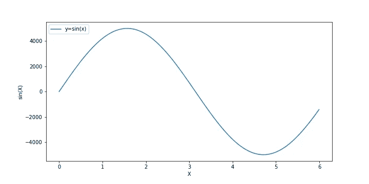
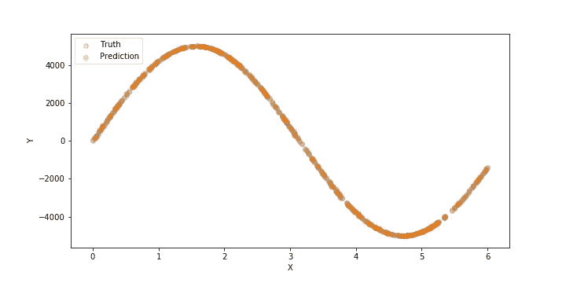
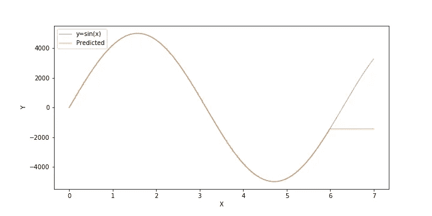
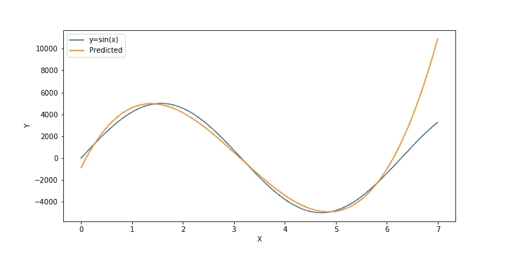
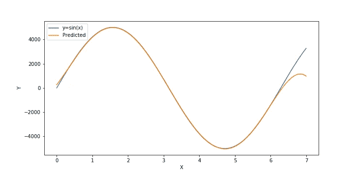

# 机器学习:模型选择和超参数调整

> 原文：<https://towardsdatascience.com/machine-learning-model-selection-and-hyperparameter-tuning-736158357dc4?source=collection_archive---------30----------------------->

## 网格搜索是发现更好的超参数的一种简单明了的方法


图片由 [andreas160578](https://pixabay.com/users/andreas160578-2383079/?utm_source=link-attribution&utm_medium=referral&utm_campaign=image&utm_content=2138981) 来自 [Pixabay](https://pixabay.com/?utm_source=link-attribution&utm_medium=referral&utm_campaign=image&utm_content=2138981)

在我的日常研究中，我经常面临的一个问题是选择一个合适的统计模型来拟合我的数据。大多数情况下，我会使用统计模型来消除 DNA 数据中的错误信号，我相信选择一个模型来解释数据的行为是数据科学爱好者的共同关注。我认为分享如何使用现成的库来解决这种情况是有用的。此外，选择一个模型是不够的，除非你知道最合适的超参数进展。让我们看一个简单的场景来理解它是如何实现的。

# 预测要求

预测要求可以有几种。主要我们可以看到两种**插值**和**外推**。在**插值**中，我们尝试预测缺失变量值的标签值。简而言之，我们知道周围的数据点，并尝试预测同一功能域内的不同数据点。相反，**外推**旨在预测稍微偏离现有数据点的值。例如，根据前两天和今天的降雨量，预测明天的降雨量。

# 一个示例场景

模拟这种场景的最简单的方法是使用一个已知的函数并检查它的行为。让我们以`y = 5000*sin(x)`为例。如果我们看看生成的代码和图，它看起来像下面这样。

```
import numpy as np
import matplotlib.pyplot as pltx = np.arange(0,6,0.005)
y = np.sin(x)*5000fig = plt.figure(figsize=(10,5))
plt.plot(x, y, label="y=sin(x)")
plt.xlabel("X")
plt.ylabel("sin(X)")
plt.legend(loc="upper left")
```



y =正弦(x)曲线

# 可能的回归变量

现在，我们已经看到了图表或趋势，让我们假设我们只有数据点，我们需要开发一个回归变量，可以满足`x=8`。

## 随机森林回归

随机森林是一种流行的回归技术。然而，随机森林对于过度适应的问题(对于训练集来说过于专门化)是相当流行的。下面是使用随机森林回归的代码和预测。

```
from sklearn.ensemble import RandomForestRegressor
from sklearn.model_selection import train_test_splitx_train, x_test, y_train, y_test = train_test_split(x, y, test_size=0.33, random_state=10)forest_reg = RandomForestRegressor(n_estimators=1, random_state=10)
forest_reg.fit(x_train.reshape(-1, 1), y)
y_hat = forest_reg.predict(x_test.reshape(-1, 1))fig = plt.figure(figsize=(10,5))
plt.scatter(x_test, y_test, label="Truth")
plt.scatter(x_test, y_hat, label="Prediction")
plt.xlabel("X")
plt.ylabel("Y")
plt.legend(loc="upper left")
```



对一组值的预测

我们可以清楚地看到，模型非常接近预测值。这是好事。请注意，我们将训练集和测试集分开，以确保没有明显的过度拟合。然而，如果我们看看未来的预测，我们可以看到一些有趣的事情。

```
x_next = np.arange(0,7,0.005)
y_next = np.sin(x_next)*5000y_next_hat = forest_reg.predict(x_next.reshape(-1, 1))
fig = plt.figure(figsize=(10,5))
plt.plot(x_next, y_next, label="y=sin(x)", alpha=0.5)
plt.plot(x_next, y_next_hat, label="Predicted", alpha=0.5)
plt.xlabel("X")
plt.ylabel("Y")
plt.legend(loc="upper left")
```



未来预测

哎呀！。我们可以看到，超出训练极限的数值是没有意义的。这是因为随机森林学会了只在训练范围内预测，或者只是插值。这就是多项式回归派上用场的地方。

## 多项式回归

多项式回归试图用多项式函数来表达数据。然而，多项式拟合的次数是一个无法学习的超参数。让我们来看看数据的多项式拟合。

```
from sklearn.linear_model import Ridge
from sklearn.preprocessing import PolynomialFeatures
from sklearn.pipeline import make_pipelinemodel = make_pipeline(PolynomialFeatures(3), Ridge())
model.fit(x_train.reshape(-1, 1), y_train)
y_next_hat = model.predict(x_next.reshape(-1, 1))x_next = np.arange(0,7,0.005)
y_next = np.sin(x_next)*5000fig = plt.figure(figsize=(10,5))
plt.plot(x_next, y_next, label="y=sin(x)")
plt.plot(x_next, y_next_hat, label="Predicted")
plt.xlabel("X")
plt.ylabel("Y")
plt.legend(loc="upper left")
plt.savefig("poly_fit.png")
```



三次多项式拟合

我们可以看到，虽然我对多项式次数为 3 的猜测不是很合理。然而，我可以继续输入值并进行测试。但是 sklearn 有一个更聪明的方法。

# 超参数调谐的网格搜索

Sklearn 库为我们提供了定义参数网格和选择最佳参数的功能。让我们看看如何用它来决定我们预测的适当程度。

```
from sklearn.model_selection import GridSearchCV
from sklearn.pipeline import Pipelineparam_grid = [
    {'poly__degree': [2, 3, 4, 5, 6, 7, 8, 9]}
  ]pipeline = Pipeline(steps=[('poly', PolynomialFeatures()), ('ridge', Ridge())])grid_search = GridSearchCV(pipeline, param_grid, cv=5,
                           scoring='neg_mean_squared_error',
                           return_train_score=True)grid_search.fit(x_train.reshape(-1, 1), y_train)
```

这里我们选择 2 到 8 度进行实验。这种网格搜索可以用于任何其他模型，您可以拥有尽可能多的参数。在这种情况下，我们试图找到使`neg_mean_squared_error`最小的一组参数，或者选择具有最小均方误差的点。然而，对于更大的参数空间，推荐使用[随机化搜索](https://scikit-learn.org/stable/modules/generated/sklearn.model_selection.RandomizedSearchCV.html)。

```
>> grid_search.best_params_
{'poly__degree': 5}
```

`best_params_`将输出最佳参数集作为 python 字典。就这么简单。

```
y_next_hat = grid_search.predict(x_next.reshape(-1, 1))x_next = np.arange(0,7,0.005)
y_next = np.sin(x_next)*5000fig = plt.figure(figsize=(10,5))
plt.plot(x_next, y_next, label="y=sin(x)")
plt.plot(x_next, y_next_hat, label="Predicted")
plt.xlabel("X")
plt.ylabel("Y")
plt.legend(loc="upper left")
```

现在，如果我们使用`grid_search`进行预测，我们可以看到我们对潜在的未来 X 值有一个更好的估计。



五次多项式拟合

我们可以看到，预测的多项式仅在远离训练集的较小范围内成立。这是因为我们的函数`sin(x)`是一个周期函数，除非我们提供所有可能的实数值，否则不存在完美的多项式拟合。

我希望这篇文章能够帮助您使用 python 内置的网格搜索功能进行超参数调优。这也可以用于更复杂的场景，例如具有预定义集群大小的集群、用于优化的可变ε值等。

如果您正在寻找一个支持参数调整的 ML 工具，请查看下面的链接；

[](https://neptune.ai/blog/optuna-vs-hyperopt) [## Optuna vs Hyperopt:应该选择哪个超参数优化库？- neptune.ai

### 思考应该选择哪个库进行超参数优化？使用远视有一段时间了，感觉像…

海王星. ai](https://neptune.ai/blog/optuna-vs-hyperopt) 

你好。