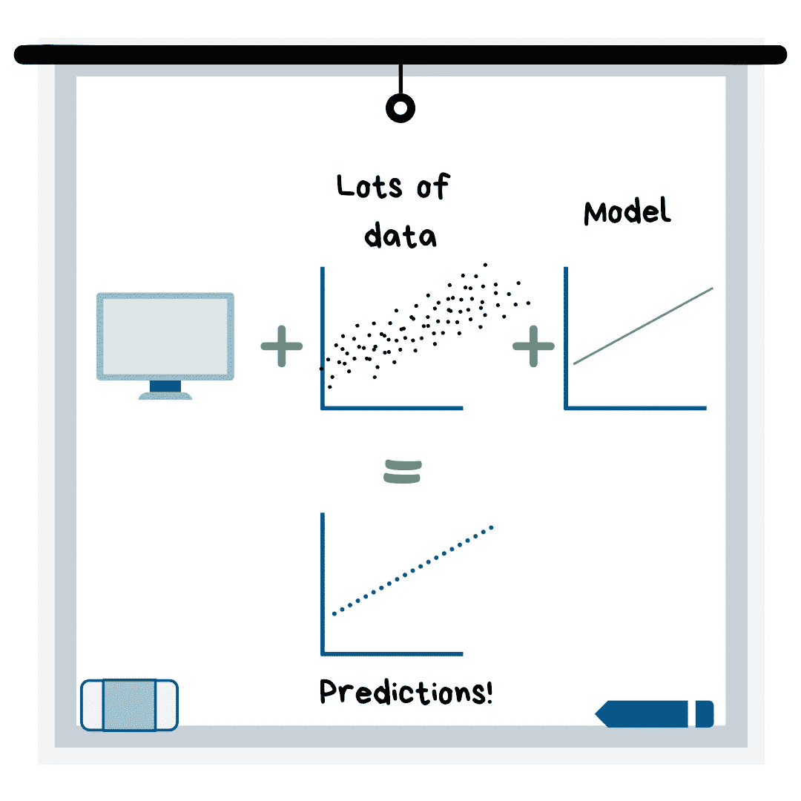
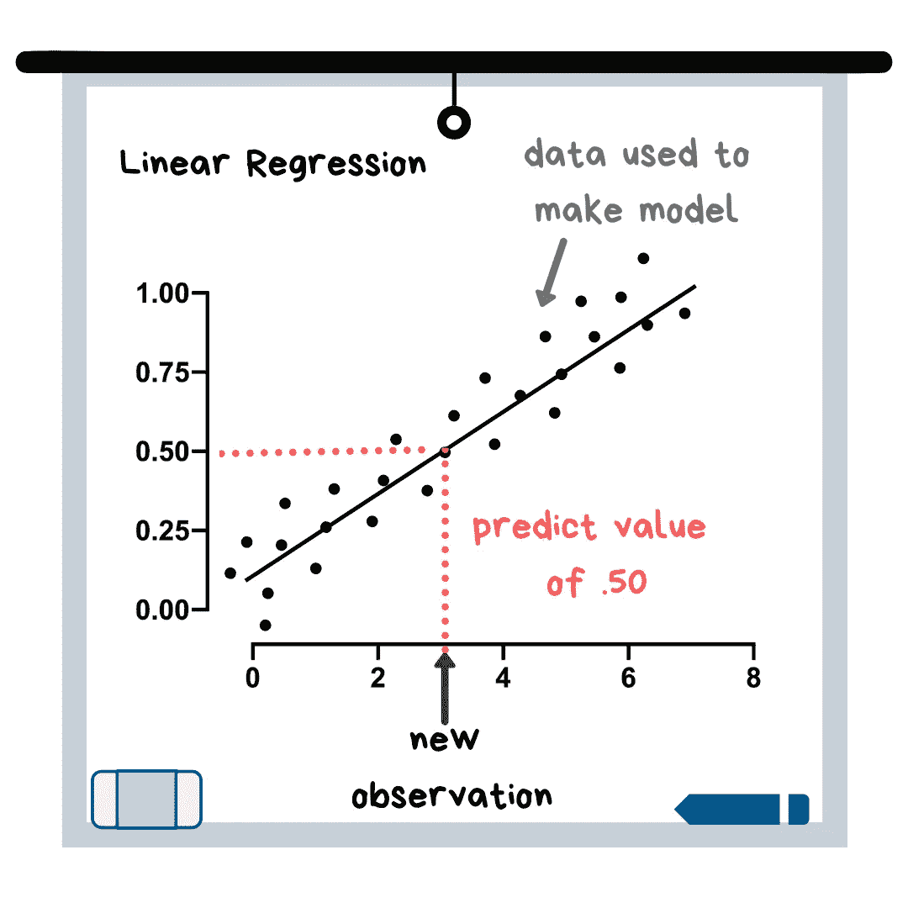
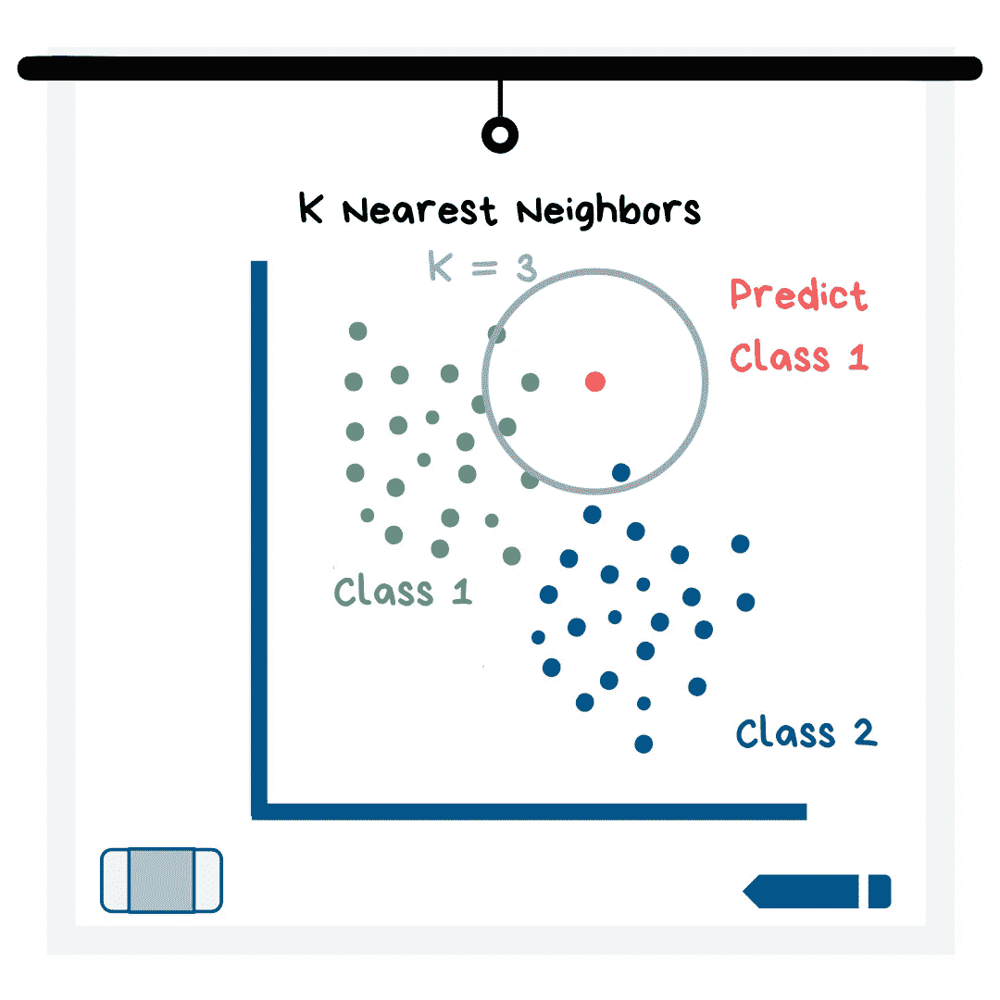
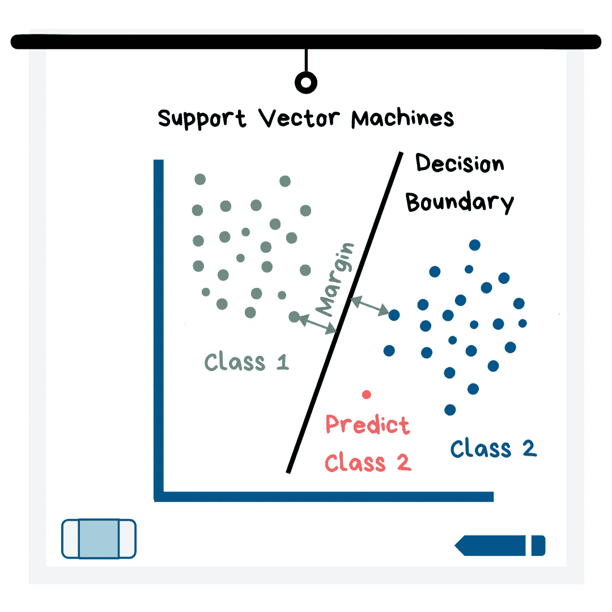
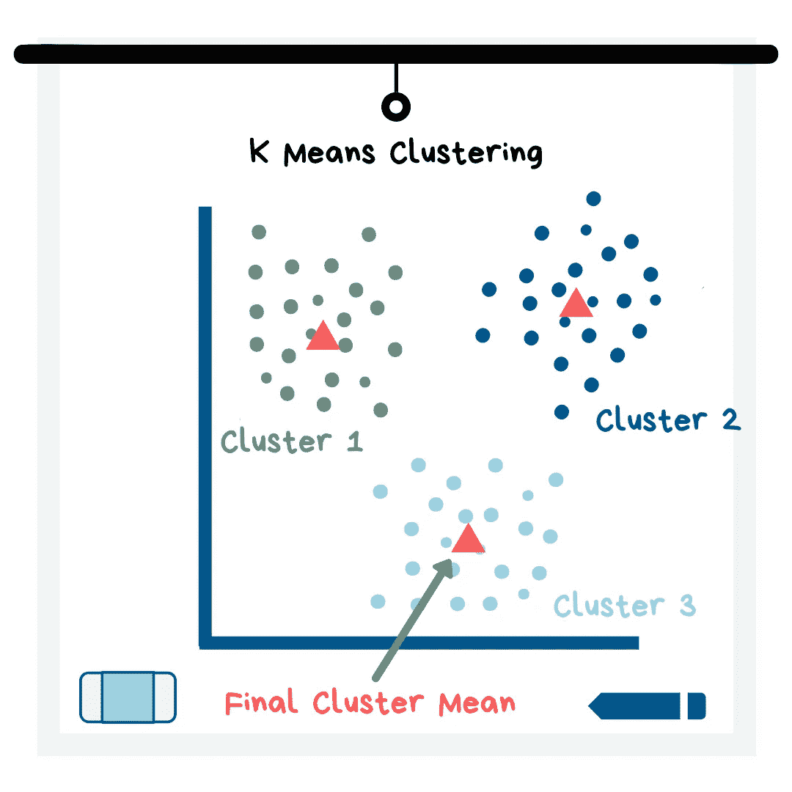
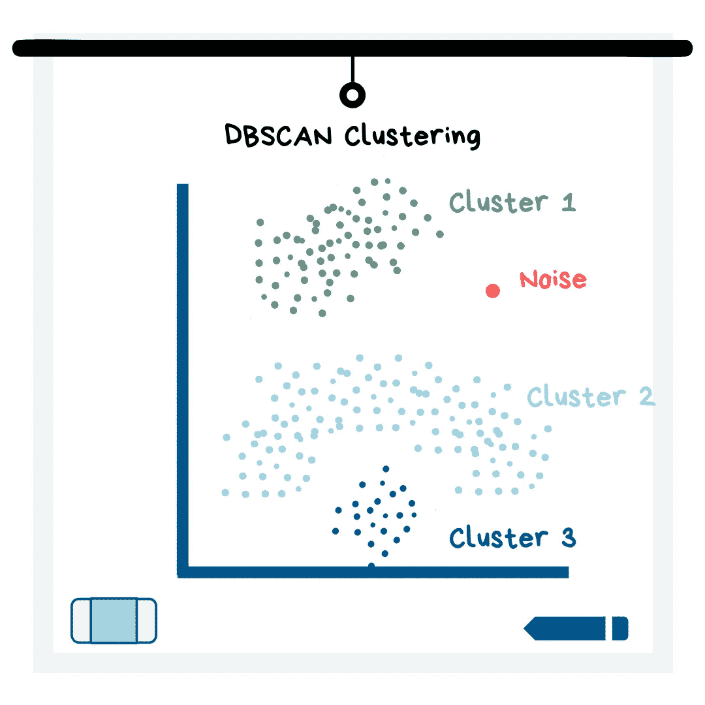

# 向一个五岁的孩子解释机器学习模型

> 原文：<https://towardsdatascience.com/machine-learning-models-explained-to-a-five-year-old-f2f540d9dcea?source=collection_archive---------8----------------------->

## 尽可能简单地解释 ML 模型是如何工作的

如果你是数据科学的新手，这个标题并没有侮辱你的意思。这是我的第二篇帖子，主题是一个流行的面试问题，大概是这样的:“像一个五岁的孩子一样给我解释一下[插入技术话题]。”

事实证明，达到五岁儿童的理解水平是相当困难的。因此，虽然这篇文章对幼儿园的孩子来说可能不是非常清楚，但对那些几乎没有数据科学背景的人来说应该是清楚的(如果到最后还不清楚，请在评论中告诉我)。

我将首先解释什么是机器学习，以及不同类型的机器学习，然后我将解释常见的模型。我不会深入研究任何数学问题，但是我正在考虑在以后的另一篇文章中这样做。尽情享受吧！

## 机器学习的定义

机器学习的图解

机器学习是指你将大量数据加载到计算机程序中，并选择一个模型来“拟合”这些数据，这使得计算机(在没有你的帮助下)能够做出预测。计算机制作模型的方式是通过*算法、*算法，这些算法可以从简单的方程(如直线方程)到非常复杂的逻辑/数学系统，让计算机做出最佳预测。

机器学习的名字很恰当，因为一旦你选择了要使用的模型并对其进行调整(也就是通过调整来改进)，机器就会使用该模型来学习你的数据中的模式。然后，你可以输入新的条件(观察)，它会预测结果！

## 监督机器学习的定义

监督学习是一种机器学习，其中你放入模型的数据被“标记”标记仅仅意味着观察的结果(也称为数据行)是已知的。例如，如果您的模型试图预测您的朋友是否会去打高尔夫球，您可能会有一些变量，如温度、星期几等。如果你的数据有标签，如果你的朋友真的去打高尔夫了，你也有一个值为 1 的变量，如果他们没有去打高尔夫，变量的值为 0。

## 无监督机器学习的定义

正如你可能已经猜到的，当涉及到标记数据时，无监督学习与监督学习相反。在无监督学习的情况下，你不知道你的朋友是否去打高尔夫了——这是由计算机通过模型找到模式，猜测发生了什么或预测将会发生什么。

# 监督机器学习模型

*【需要成人监督】*

## 逻辑回归

当你有一个*分类*问题*时，使用逻辑回归。这意味着你的目标变量(也就是你想预测的变量)是由类别组成的。这些类别可以是“是/否”,或者类似于代表客户满意度的 1 到 10 之间的数字。*

逻辑回归模型使用一个等式来创建数据曲线，然后使用该曲线来预测新观察的结果。

逻辑回归图解

在上图中，新观测值的预测值为 0，因为它位于曲线的左侧。如果您查看此曲线所基于的数据，这是有意义的，因为在图表的“预测值为 0”区域，大多数数据点的 y 值为 0。

## **线性回归**

线性回归通常是人们学习的第一批机器学习模型之一。这是因为当只使用一个 x 变量时，它的算法(即幕后的方程)相对容易理解——它只是在制作一条最佳拟合线，这是小学教授的概念。然后，该最佳拟合线用于预测新的数据点(见图)。

线性回归图解

线性回归类似于逻辑回归，但是当你的目标变量是*连续的*时使用，这意味着它基本上可以取任何数值。事实上，任何具有连续目标变量的模型都可以归类为“回归”连续变量的一个例子是房子的销售价格。

线性回归也很好解释。模型方程包含每个变量的系数，这些系数表示自变量(x 变量)的每个微小变化对目标变量的影响。以房价为例，这意味着您可以查看您的回归方程，并说“哦，这告诉我，房子大小(x 变量)每增加 1 英尺，销售价格(目标变量)就会增加 25 美元。”

## k 最近邻(KNN)

该模型可用于分类*或*回归！名称“K 个最近邻居”不是为了混淆。模型首先绘制出所有的数据。标题中的“K”部分是指模型为确定预测值而查看的最近相邻数据点的数量(请参见下图)。作为未来的数据科学家，你可以选择 K，你可以摆弄这些值，看看哪一个给出了最好的预测。

K 个最近邻的图示

K=__ 圆中的所有数据点都获得了关于这个新数据点的目标变量值应该是什么的“投票”。获得最多投票的值就是 KNN 为新数据点预测的值。在上图中，2 个最近的邻居是类 1，而 1 个邻居是类 2。因此，该模型将预测该数据点的类别 1。如果模型试图预测一个数值而不是一个类别，那么所有的“投票”都是被平均以得到预测的数值。

## 支持向量机

支持向量机通过在数据点之间建立一个*边界*来工作，其中一个类别的大部分落在边界的一边(在 2D 的情况下也称为线),而另一个类别的大部分落在另一边。

支持向量机图解

其工作方式是机器寻找具有最大*余量的边界。*边距定义为每个类的最近点与边界之间的距离(见图示)。然后绘制新的数据点，并根据它们落在边界的哪一侧放入一个类中。

我对这个模型的解释是针对分类情况的，但是你也可以用 SVMs 进行回归！

## 决策树和随机森林

我已经在以前的文章中解释过这些了——请点击这里查看(决策树和随机森林就在最后):

 [## 向五岁儿童解释数据科学概念

### 在采访中简单描述技术概念

towardsdatascience.com](/data-science-concepts-explained-to-a-five-year-old-ad440c7b3cbd) 

# 无监督机器学习模型

*【慎用】*

现在，我们正冒险进入无监督学习(也称为深层，一语双关)。提醒一下，这意味着我们的数据集没有被标记，所以我们不知道我们观察的结果。

## k 表示聚类

当使用 K 均值聚类时，首先必须假设数据集中有 K 个聚类。由于您不知道数据中实际有多少组，因此您必须尝试不同的 K 值，并使用可视化和度量来查看哪个 K 值有意义。K means 最适用于圆形且大小相似的簇。

K 均值算法首先选择最佳的 K 个数据点来形成 K 个聚类中每个聚类的中心。然后，对每个点重复以下两个步骤:

1.  将数据点分配给最近的聚类中心
2.  通过取现在该聚类中的所有数据点的平均值来创建新的中心

K 均值聚类图

## DBSCAN 聚类

DBSCAN 聚类分析模型与 K 均值聚类分析模型的不同之处在于，它不要求您输入 K 值，而且它还可以查找任何形状的聚类(请参见下图)。您不需要指定聚类的数量，而是输入您想要在一个聚类中的最小数据点数和数据点周围的半径来搜索一个聚类。DBSCAN 将为您找到集群！然后，您可以更改用于构建模型的值，直到获得对数据集有意义的聚类。

此外，DBSCAN 模型会为您分类“噪音”点(即远离所有其他观察值的点)。当数据点非常接近时，该模型比 K 均值更好。

# 神经网络

在我看来，神经网络是最酷、最神秘的模型。它们被称为*神经网络*，因为它们是模仿我们大脑中神经元的工作方式。这些模型在数据集中寻找模式；有时他们会发现人类可能永远也不会认识到的模式。

神经网络可以很好地处理图像和音频等复杂数据。从面部识别(*停止令人毛骨悚然，脸书*)到文本分类，它们是我们这些天一直看到的许多软件功能的背后。神经网络可以与已标记的数据(即监督学习应用)或未标记的数据(非监督学习)一起使用。

对于本文来说，即使只是触及神经网络如何运作的表面也可能过于复杂。如果你想了解更多，这里有一个“初学者”指南:【https://pathmind.com/wiki/neural-network】T4。

# 结论

希望这篇文章不仅增加了你对这些模型的理解，也让你意识到它们是多么的酷和有用！当我们让计算机做工作/学习时，我们可以坐下来看看它找到了什么样的模式。有时这可能会令人困惑，因为即使是专家也不明白确切的逻辑*为什么*计算机会得出这样的结论，但在某些情况下，我们所关心的只是它擅长预测！

然而，有些时候我们确实关心计算机是如何得到它的预测的，比如我们是否在使用这个模型来决定哪些求职者将获得第一轮面试。关于这方面的更多信息，这里有一个很棒的 TED 演讲，你不必是数据科学家也能理解或欣赏:

来自[www.ted.com](https://www.ted.com/talks/cathy_o_neil_the_era_of_blind_faith_in_big_data_must_end/transcript?language=en)([使用条款](https://www.ted.com/about/our-organization/our-policies-terms/ted-com-terms-of-use#h2--copyright-issues-and-licenses))

一如既往，非常感谢你的阅读，如果你觉得这篇文章有用，请分享！:)

*所有的图形都是我在*[*www.canva.com(用爱)制作的。如果您想获得使用许可，请联系我。*](http://www.canva.com.)

*也大喊到* [*肖恩·达文*](https://medium.com/u/e9b5c53eac8d?source=post_page-----f2f540d9dcea--------------------------------)*[*斯科特·克罗格*](https://medium.com/u/8b92ba10ceef?source=post_page-----f2f540d9dcea--------------------------------)*[*多顿·奥帕西纳*](https://medium.com/u/84d6c8c2ea97?source=post_page-----f2f540d9dcea--------------------------------)*&*[*巴努·耶拉*](https://medium.com/u/ede6d4d21ce3?source=post_page-----f2f540d9dcea--------------------------------) *通过我们的数据科学面试练习环节帮助我更好地理解这些模型。***