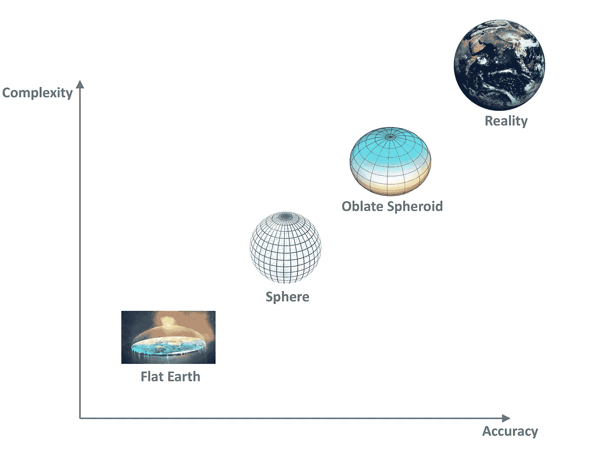
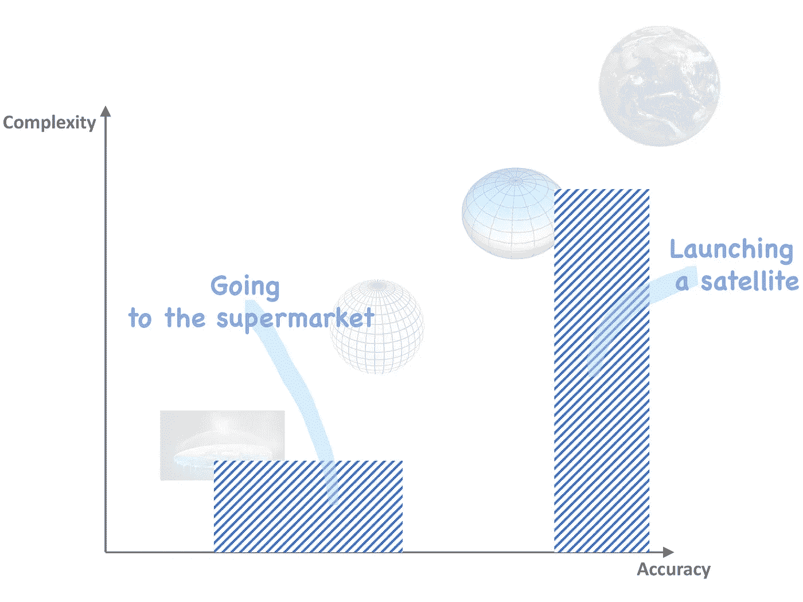
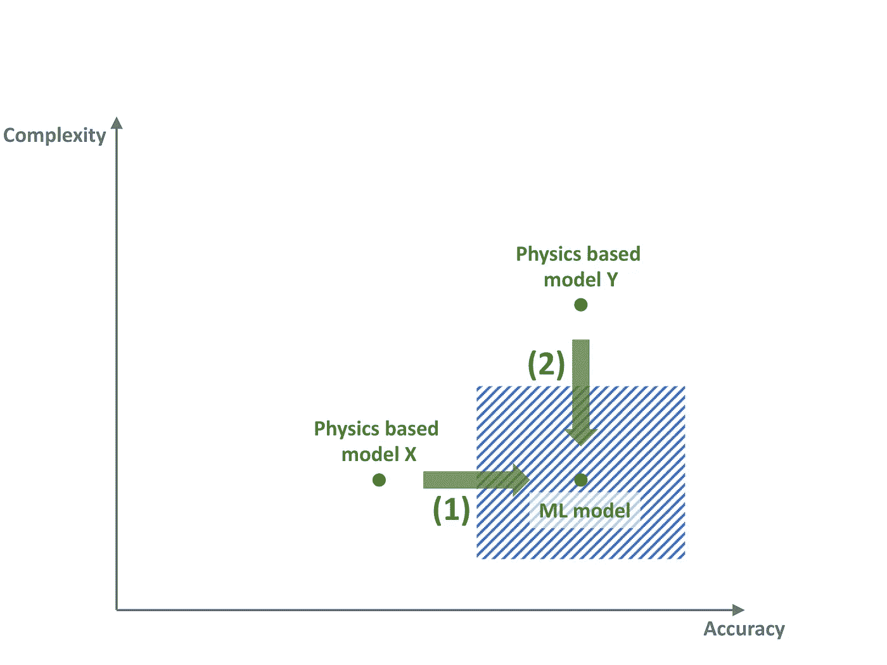

# 物理学和工程学的机器学习模型

> 原文：<https://towardsdatascience.com/machine-learning-models-for-physics-and-engineering-e77cdfbe68aa?source=collection_archive---------47----------------------->

> 物理学的主要目标是了解自然，而实现这一目标的一种方法是建立感兴趣的自然现象的模型。几个世纪以来，物理学家一直在挑战我们知识的极限，近年来，我们普遍开始遇到挑战，我们的物理驱动模型要么不够精确，要么太复杂，无法使用。在这些情况下，机器学习模型可以提供帮助。

模型是现实中一些相关部分的表示。一尊雕像是一个人的模型，一个词是一个事物的模型。在物理学中，我们对数学模型感兴趣——描述世界的方程。这些模型帮助我们理解现象并预测它们的行为。模型是基于假设的现实的简化。只要假设是合理的，模型预测就应该是准确的。力=质量 x 加速度是一个著名的模型，它对许多日常场景非常有效，但对微小物体(电子)、大质量物体(黑洞)或快速物体(光子)无效。

准确性和简单性是评估模型的两个重要因素。大多数情况下，这两者之间会有所取舍。按照 1:1 的比例绘制的城市地图可能非常精确，但非常复杂，因此完全没有用。因此，对于有用的模型来说，它应该高于一定的精度，并且低于一定的复杂度，其中规格取决于应用。

作为一个例子，让我们看看地球形状的 3 种模型:扁平，球形，扁球体(图 1)。随着精度的提高，模型的计算复杂性也随之增加。

**图 1** 三种不同的地球形状模型。

选择使用哪种模型在很大程度上取决于应用程序。尽管我们不是“地球是平的”,但我们实际上认为地球是“平的”,用于我们的许多日常活动，如去超市。但对于许多其他活动，如发射卫星，我们需要更精确的模型，我们可以负担更多的计算复杂性。我们的应用程序指定了我们希望模型所在的蓝色阴影区域(图 2)。

**图 2** 接受两种不同应用的模型空间(蓝色阴影区域)。注意，对于去超市，约束是计算复杂度的上限，而对于发射卫星，约束是准确度的下限。

我们经常遇到这样的情况:我们的物理模型不够精确(模型 X，图 3)，或者计算过于复杂(模型 Y，图 3)，无法满足我们的应用(蓝色阴影区域，图 3)。机器学习可以在两个基本方面提供帮助(图 3): (1)它可以提高准确性，而不增加复杂性。(2)它可以在不损失准确性的情况下降低复杂性。让我们来看看两者的一些例子。

**图 3** 两个基于物理的模型 X 和 Y 不符合规范。机器学习有两种方式可以帮助(1)提高准确性或(2)降低计算复杂性。

在我们最近的一个建造新型粒度分析仪的项目中，基于 Mie 理论的颗粒散射模型对于应用来说不够精确。使用机器学习模型(随机森林),我们能够构建满足规格的颗粒尺寸预测模型。你可以[在我们的报纸上读到更多。](https://www.nature.com/articles/s41377-020-0255-6)在这种情况下，我们能够在不增加计算复杂性的情况下提高模型精度(图 3，(1))。在另一个与显微镜相关的项目中，基于物理衍射定律的图像重建算法需要大约 10 分钟才能运行，这阻碍了显微镜提供“实时”图像的能力。我们通过开发深度学习模型来帮助我们的合作者，该模型可以在不到 1 秒的时间内实现相同的构建。在这里，我们能够简化计算的计算复杂性，同时不牺牲任何精度(图 3，(2))。

但是机器学习如何实现这些令人印象深刻的结果呢？正如我们所讨论的，每个模型都需要假设。通常，你做的假设越多/越强，你失去的准确性就越多。物理模型需要一些强有力的假设(没有多重散射，粒子是完美的球体，等等。)而对于构建机器学习模型，你做出较弱的假设(这个随机森林有足够的能力从这个数据集中学习分散关系)。至于计算复杂性，当然，它不会消失。而是把它推到机器学习模型开发的训练阶段。换句话说，创建模型可能需要时间，但一旦模型经过训练并准备好使用，它就会非常快地生成新的预测。

机器学习有可能改变许多领域:从传感到材料发现，到成像，到动态系统的最优控制。

你可以在推特上找到我 [@malicannoyan](https://twitter.com/malicannoyan) 。