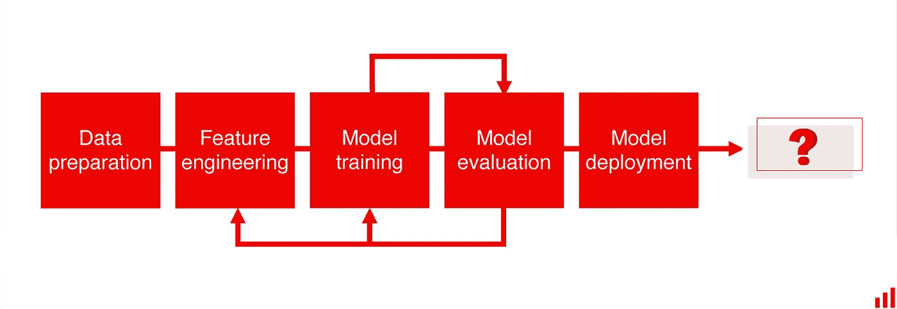
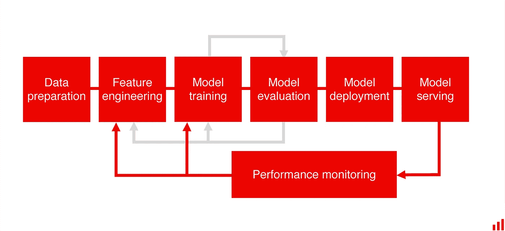
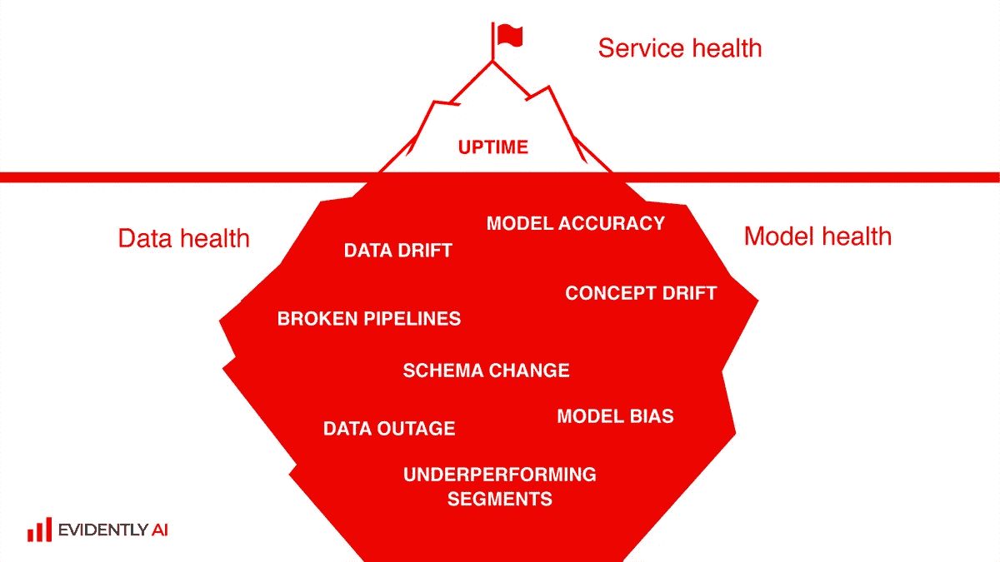
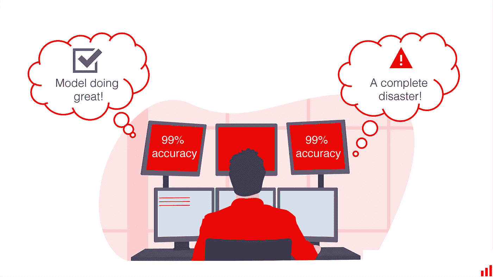
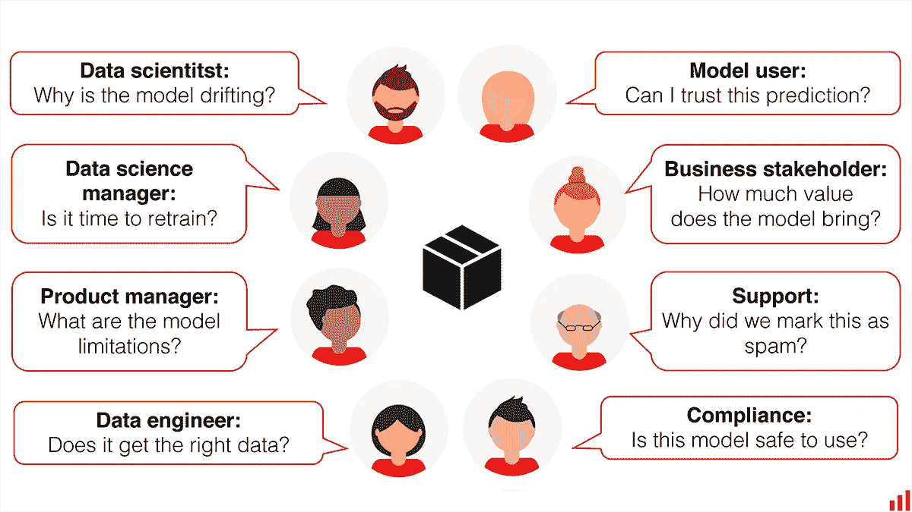
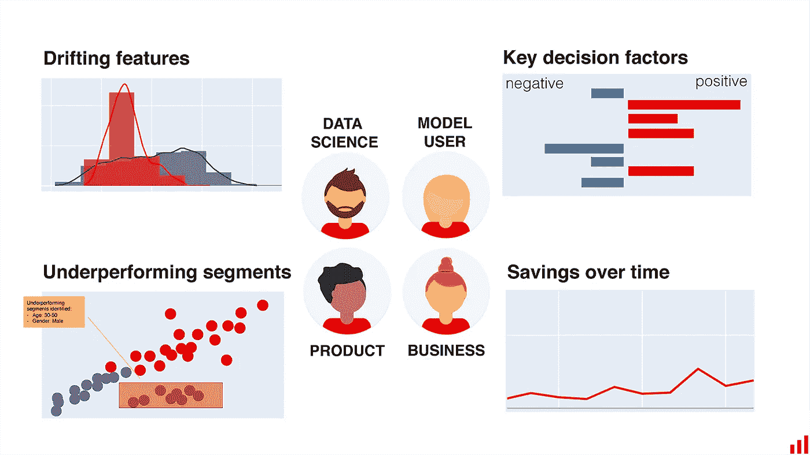
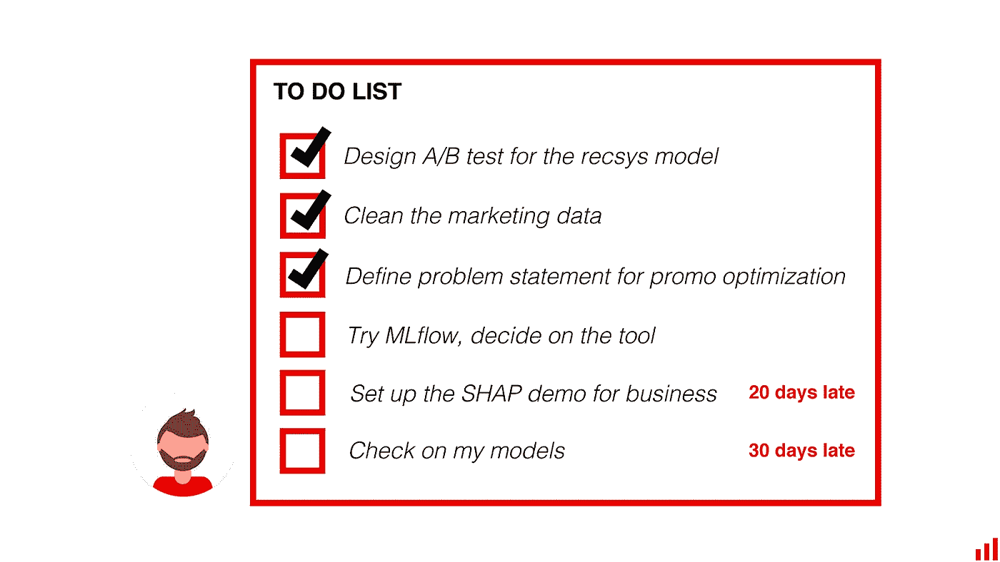

# 机器学习监控:它是什么，我们错过了什么

> 原文：<https://towardsdatascience.com/machine-learning-monitoring-what-it-is-and-what-we-are-missing-e644268023ba?source=collection_archive---------23----------------------->

## 部署后有生命吗？

图片作者。

# 部署后有生命吗？

恭喜你！您的机器学习模型现已上线。很多模特都没走那么远。有些[声称](https://venturebeat.com/2019/07/19/why-do-87-of-data-science-projects-never-make-it-into-production/)，高达 87%的从未部署。考虑到从一个概念到一个可行的应用程序是多么的困难，庆祝是当之无愧的。

## 这可能感觉像是最后一步。

事实上，甚至机器学习课程的设计和机器学习工具的前景也增加了这种看法。他们广泛地处理数据准备、迭代模型构建和(最近的)部署阶段。尽管如此，无论是在教程中还是在实践中，模型投入生产后发生的事情通常都取决于运气。

图片作者。

## 这种忽视的简单原因是缺乏成熟。

除了少数与机器学习息息相关的技术巨头，大多数行业才刚刚起步。现实生活中的机器学习应用经验有限。许多公司第一次整理出许多东西，然后匆忙部署，这让他们不知所措。数据科学家做从数据清理到 A/B 测试设置的所有事情。模型操作、维护和支持通常只是事后的想法。

机器学习来世的一个关键但经常被忽视的组成部分是监控。

# 为什么监控很重要

> 一盎司的预防抵得上一磅的治疗——本杰明·富兰克林

用我们现在使用的学习技术，一个模型永远不会是最终的。在训练中，它学习过去的例子。一旦释放到野外，它就可以处理新数据:这可以是用户点击流、产品销售或信用申请。随着时间的推移，这些数据会偏离模型在训练中看到的数据。迟早，即使是最精确和经过仔细测试的解决方案也会开始退化。

## 最近的疫情非常生动地说明了这一点。

有些案件甚至上了头条:

*   由于购物习惯的巨大转变，Instacart 的模型预测商店[商品可用性的准确性从 93%下降到 61%。](https://fortune.com/2020/06/09/instacart-coronavirus-artificial-intelligence/)
*   银行家[质疑](https://www.americanbanker.com/opinion/ai-models-could-struggle-to-handle-the-market-downturn)在繁荣时期训练的信贷模型是否能适应压力情景。
*   交易算法[因市场波动而失灵](https://www.wired.com/story/best-ai-models-no-match-coronavirus)。一些基金下跌了 21%。
*   图像分类模型不得不[学习](https://techcrunch.com/2020/08/02/ai-is-struggling-to-adjust-to-2020/)新的标准:一家人在笔记本电脑前意味着“工作”，而不是“休闲”
*   甚至天气预报也不太准确，因为有价值的数据随着商业航班的减少而消失了。

2020 年，你的图像分类模型可能需要学习“办公室工作”的新概念。
*(图片由* [*赖图*](https://www.pexels.com/@ketut-subiyanto) *上* [*像素*](https://www.pexels.com) *)*

## 除此之外，实时数据会出现各种各样的问题。

存在输入错误和数据库中断。数据管道断裂。用户人口统计的变化。如果模型接收到错误或不寻常的输入，它将做出不可靠的预测。或者很多很多。

## 模型故障和未经处理的腐烂会造成损害。

有时这只是一个小麻烦，比如一个愚蠢的产品推荐或错误的标签照片。在高风险领域，比如招聘、评级或信贷决策，这种影响要深远得多。即使在营销或供应链等“低风险”领域，表现不佳的模式在规模化经营时也会严重冲击底线。公司在错误的广告渠道浪费金钱，显示不正确的价格，库存不足，或者损害用户体验。

## 监控来了。

我们不只是部署我们的模型一次。我们已经知道它们会断裂和降解。为了成功地操作它们，我们需要实时了解它们的性能。它们是否按预期工作？是什么导致了这种变化？是时候介入了吗？

这种可见性不是一件好事，而是循环中的一个关键部分。监控贯穿于模型开发生命周期，将生产与建模联系起来。如果我们发现质量下降，我们可以触发再培训或回到研究阶段发布一个模型重制。

图片作者。

## 让我们提出一个正式的定义:

***机器学习监控*** *是一种跟踪和分析生产模型性能以确保用例定义的可接受质量的实践。它提供有关性能问题的早期警告，并帮助诊断问题的根本原因，以便进行调试和解决。*

# 机器学习监控有何不同

有人可能会想:我们部署软件已经很久了，监控也不是什么新鲜事。用你的机器学习工具做同样的事情。为什么这么大惊小怪？

这话有几分道理。部署的模型是一个软件服务，我们需要跟踪通常的健康指标，比如延迟、内存利用率和正常运行时间。但除此之外，机器学习系统还有其独特的问题需要关注。

图片作者。

## 首先，数据增加了额外的复杂性。

我们应该担心的不仅仅是代码，还有数据质量及其依赖性。更多移动部件——更多潜在故障模式！通常，这些数据源完全不受我们的控制。即使管道得到了完美的维护，环境的变化也会悄悄进入管道，导致性能下降。

世界变化太快了吗？在机器学习监控中，这个抽象的问题开始被应用。我们密切关注数据变化，并随意量化变化的程度。这与检查服务器负载是完全不同的任务。

## 更糟糕的是，模型经常无声无息地失败。

不存在“坏网关”或“404”。尽管输入数据是奇数，系统也可能会返回响应。个人预测可能看起来有道理——尽管是有害的、有偏见的或错误的。

想象一下，我们依靠机器学习来预测客户流失，而模型却功亏一篑。可能需要几周的时间来了解事实(例如有风险的客户最终是否会离开)或注意到对业务 KPI 的影响(例如季度续订量下降)。只有这样，我们才会怀疑系统需要运行状况检查！你几乎不会错过这么长时间的软件中断。在不受监控的模型领域，这种看不见的停机时间是一种令人担忧的现象。

为了扭转局面，你必须及早做出反应。这意味着只评估输入的数据和模型的反应:一种特殊的半盲监测。

图片作者。

## “好”和“坏”之间的区别并不明显。

一个偶然的异常值并不意味着模型失控，需要紧急更新。与此同时，稳定的准确性也会产生误导。隐藏在聚合数字后面的模型可能会在一些关键数据区域悄然失效。

图片作者。

## 没有上下文，度量是没有用的。

可接受的性能、模型风险和错误成本因用例而异。在贷款模式中，我们关心公平的结果。在欺诈检测中，我们几乎不能容忍假阴性。有了补货，多订购可能比少订购好。在营销模式中，我们希望密切关注高端市场的表现。

所有这些细微差别都反映了我们的监控需求、需要关注的具体指标以及我们解释它们的方式。

因此，机器学习监控介于传统软件和产品分析之间。我们仍然关注“技术”性能指标——准确性、平均绝对误差等等。但我们的主要目标是检查机器学习支持的决策的质量:它是否令人满意、公正，以及是否服务于我们的业务目标。

## 简单地

只看软件度量是太少了。再看下游产品或业务 KPI 就来不及了。机器学习监控是一个独特的领域，它需要适当的实践、策略和工具。

# 谁应该关心机器学习监控？

**简而言之:**所有关心模型对商业影响的人。

当然，数据科学家在第一线。但一旦模型离开实验室，它就成为公司产品或流程的一部分。现在，这不仅仅是一些技术上的人工制品，而是为用户和利益相关者提供的实际服务。

该模型可以向外部客户呈现输出，例如电子商务网站上的推荐系统。或者它可以是一个纯粹的内部工具，例如为您的需求计划人员提供的销售预测模型。在任何情况下，都有一个业务所有者——产品经理或业务线团队——依靠它来交付成果。以及其他一些相关人员，从数据工程师到支持人员。

## **数据和业务团队都需要跟踪和解释模型行为。**

图片作者。

**对于数据团队来说，这关乎效率和影响。**你希望你的模型做出正确的判断，并让企业采纳它们。你也希望维护是没有麻烦的。通过充分的监控，您可以快速检测、解决、预防事故，并根据需要刷新模型。可观察性工具有助于保持秩序，并节省你建造新东西的时间。

对于商业和领域专家来说，最终归结为信任。当你根据模型预测采取行动时，你需要一个理由来相信它们是正确的。您可能想要探索特定的结果，或者对模型的弱点有一个大致的了解。您还需要对正在进行的模型价值有清晰的认识，并对风险得到控制感到安心。

如果你从事医疗保健、保险或金融行业，这种监管就会变得正式。合规部将仔细检查模型的偏差和漏洞。由于模型是动态的，它不是一劳永逸的测试。您必须不断地对实时数据进行检查，以了解每个模型是如何跟上的。

## 我们需要生产模式的完整视图。

适当的监控可以做到这一点，并为每一方提供正确的度量和可视化。

图片作者。

让我们面对现实吧。企业采用可能是一场斗争。并且它通常只在模型部署之后才开始。这是有原因的。

在理想世界中，您可以将所有业务目标转化为一个优化问题，并达到使人工干预过时的模型精度。

在实践中，你经常会遇到一个混合系统和一堆其他的标准需要处理。这些是稳定性、伦理、公平性、可解释性、用户体验或边缘情况下的性能。你不能简单地将它们混合在你的误差最小化目标中。他们需要持续的监督。

## 有用的模型是被使用的模型。

如果生产系统永远做不到，神奇的沙盒准确性也没什么区别。

除了“速赢”试点项目之外，还必须实现价值。为此，您需要透明度、利益相关者的参与和正确的协作工具。

## 能见度是有回报的。

这种共享的环境提高了采用率。当事情偏离轨道时，它也会有所帮助。

假设一个模型返回一个“奇怪”的响应。这些是领域专家，他们会帮助你定义你是否可以忽略它。或者，你的模型在特定人群中失败了。你们可以一起集思广益，想出新的功能来解决这个问题。

想深入了解新兴的数据漂移吗？调整分类器决策阈值？找出如何通过调整产品特性来弥补模型缺陷？

## **所有这些都需要协作。**

只有当整个团队都能够获得相关的见解时，这种参与才有可能。模型不应该是晦涩的黑箱系统。相反，你把它当作一个机器学习产品，一个可以审计和监督的产品。

如果处理得当，模型监控不仅仅是技术上的错误跟踪。它服务于许多团队的需求，并帮助他们在模型支持和风险缓解方面进行协作。

# 监测差距

现实中，存在着痛苦的不匹配。调查[显示](https://fico.gcs-web.com/news-releases/news-release-details/new-report-corinium-and-fico-signals-increased-demand-artificial)公司只监控三分之一的模型。至于其他的？我们似乎被蒙在鼓里。

## 故事通常是这样展开的。

首先，一名数据科学家负责照看模型。在部署之后，人们经常需要收集反馈并重复细节，这让你很忙。然后，模型被认为是完全可操作的，它的创建者离开去了一个新的项目。监控任务悬而未决。

一些团队会定期重新访问模型以进行基本的健康检查，并错过其间发生的任何事情。其他人只是从他们的用户那里发现问题，然后匆忙灭火。

## **解决方案是定制的和部分的。**

对于最重要的型号，您可能会找到一个专用的自制仪表板。基于团队遇到的每一个连续的失败，他们经常成为定制检查的弗兰肯斯坦。为了描绘一幅完整的画面，每个模型监视器还将有一个定制的界面，而业务 KPI 存在于单独的孤立报告中。

如果业务团队中有人要求更深入的模型洞察，这将意味着定制脚本和耗时的分析工作。或者经常，请求被简单地取消。

很难想象依赖于抽查和人工审查的关键软件。但是这些脱节的、零碎的解决方案在现代数据科学世界中出奇地普遍。

## **为什么会这样？**

一个原因是对部署的模型缺乏明确的责任。在传统的企业环境中，您有一个 DevOps 团队负责任何新软件。对于机器学习来说，这是一个灰色地带。

当然，它可以监视服务的健康状况。但是，当输入数据发生变化时——这是谁的地盘？一些方面涉及数据工程，而另一些方面更接近于运营或产品团队。

## 每个人的事就是没人的事。

数据科学团队通常会承担监控责任。但是他们已经处理了太多的事情，很少有动力把维护放在第一位。

最后，我们经常会掉球。

*企业数据科学家的一天。图片作者。*

# 盯紧 AI

我们应该立即用以生产为中心的工具和实践来解决这个差距。

随着应用数量的增长，整体模型监控变得至关重要。你可以手持一个模型，但不是一打。

让团队负起责任也很重要。我们部署机器学习来提供商业价值——我们需要一种在生产中清晰展示它的方式！以及让人们意识到停机时间的成本以及支持和改进工作的重要性。

## **当然，整个**的数据科学过程都是混乱的。

我们很少记录实验。我们对部署管理不当。机器学习操作(又名 MLOps)是一种逐步解决这种混乱的新兴实践。监控在某种程度上是在最末端。然而，我们认为我们应该尽早解决这个问题。理想的情况是，你的第一个模型一出货。

当一位高级领导问你 AI 项目进展如何时，你不想花一天时间来回应。也不是最后一个知道模型失败的人。

无缝生产、可见收益和满意的用户是让机器学习获得规模化声誉的关键。除非在纯粹的研究中，那是我们的目标。

# 总结

监控可能很无聊，但却是成功的关键。
做得好，做得快。

*本博客最初发表于*[*https://evidentlyai.com*](https://evidentlyai.com/blog/machine-learning-monitoring-what-it-is-and-how-it-differs)*。*

*机器学习监控正是我们在* [*看得出来要解决的 AI*](https://evidentlyai.com) *。在 Github 中查看我们的* [*开源工具*](https://github.com/evidentlyai/evidently) *！*

想留在圈子里吗？ [*报名*](https://evidentlyai.com/sign-up) *获取我们的更新和产品消息，关注我们的*[*Twitter*](https://twitter.com/EvidentlyAI)*和*[*Linkedin*](https://www.linkedin.com/company/evidently-ai/)*获取更多关于生产机器学习的内容，或者加入我们的* [*不和谐社区*](https://discord.gg/xZjKRaNp8b) *进行聊天和连线。*