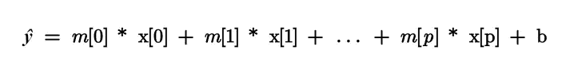
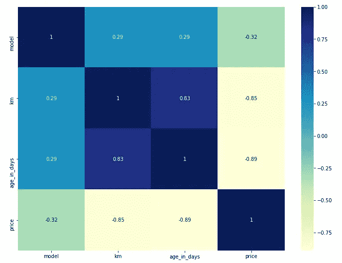

# 机器学习:通过预测菲亚特 500 的价格来观察线性模型是如何工作的

> 原文：<https://towardsdatascience.com/machine-learning-observe-how-a-linear-model-works-by-predicting-the-prices-of-the-fiat-500-fb38e0d22681?source=collection_archive---------61----------------------->

## 用实例研究机器学习


图尔古特·阿利耶夫在 [Unsplash](https://unsplash.com/s/photos/fiat-500?utm_source=unsplash&utm_medium=referral&utm_content=creditCopyText) 上的照片

**简介**

在本文中，我想通过向您介绍我做的一个真实项目来谈论线性模型。你可以在 [my Github](https://github.com/moryba/Predicting-the-prices-of-Fiat-500-with-Linear-Regression) 中找到的项目包括预测菲亚特 500 的价格。

我的模型的数据集有 8 列，如下图所示，1538 行。

*   型号:流行、休闲、运动
*   发动机功率:发动机的千瓦数
*   车龄天数:车龄天数
*   公里:汽车行驶的公里数
*   previous_owners:以前所有者的数量
*   lat:卖家所在的纬度(意大利的汽车价格从该国北部到南部各不相同)
*   lon:卖家的经度(意大利的汽车价格从该国北部到南部各不相同)
*   价格:销售价格

在本文中，我们将在第一部分看到关于线性回归、岭回归和套索回归的一些概念。然后，我将向您展示我对我考虑的数据集的基本见解，最后但同样重要的是，我们将看到我用来评估模型性能的准备工作和指标。

**第一部分:线性回归、岭回归和套索回归**

线性模型是一类使用输入要素的线性函数进行预测的模型。

关于回归，我们知道一般公式如下:



正如你已经知道的，x[0]到 x[p]代表单个数据点的特征。相反， **m** a **b** 是学习的模型参数， **ŷ** 是模型做出的预测。

回归有很多线性模型。这些模型之间的区别在于如何从训练数据中学习模型参数 **m** 和 **b** 以及如何控制模型复杂度。我们将看到三种回归模型。

*   **线性回归(普通最小二乘法)** →在训练集上找到使预测和真实回归目标 y 之间的均方误差最小的参数 **m** 和 **b** 。MSE 是预测值和真实值之间的平方差之和。下面介绍如何用 scikit-learn 计算它。

```
from sklearn.linear_model import LinearRegression X_train, X_test, y_train, y_test=train_test_split(X, y, random_state=0)lr = LinearRegression()lr.fit(X_train, y_train)print(“lr.coef_: {}”.format(lr.coef_)) print(“lr.intercept_: {}”.format(lr.intercept_))
```

*   **岭回归** →它用于预测的公式与用于线性回归的公式相同。在岭回归中，系数(m)被选择用于很好地预测训练数据，但也适合附加约束。我们希望 m 的所有条目都接近于零。这意味着每个特征应该对结果有尽可能小的影响(小斜率)，同时仍然预测良好。这种约束被称为正则化，这意味着限制模型以避免过度拟合。这种特殊的岭回归正则化称为 L2。岭回归在 **linear_model 中实现。山脊**如下图所示。特别是，通过增加 alpha，我们将系数移向零，这降低了训练集的性能，但可能有助于泛化并避免过度拟合。

```
from sklearn.linear_model import Ridge ridge = Ridge(alpha=11).fit(X_train, y_train)print(“Training set score: {:.2f}”.format(ridge.score(X_train, y_train))) print(“Test set score: {:.2f}”.format(ridge.score(X_test, y_test)))
```

*   **套索回归** →另一种正则化方法是套索。与岭回归一样，使用套索也将系数限制为接近于零，但方式略有不同，称为 L1 正则化。L1 正则化的后果是，当使用套索时，某些系数恰好为零。这意味着模型完全忽略了一些特征。

```
from sklearn.linear_model import Lasso lasso = Lasso(alpha=3).fit(X_train, y_train) print(“Training set score: {:.2f}”.format(lasso.score(X_train, y_train))) print(“Test set score: {:.2f}”.format(lasso.score(X_test, y_test))) print(“Number of features used: {}”.format(np.sum(lasso.coef_ != 0)))
```

**第二部分:我发现的见解**

在看到关于模型的准备和评估的部分之前，看一下数据集的情况是有用的。

在下面的散点图中，我们可以观察到一些特征之间有一些特殊的相关性，如公里数、使用年限和价格。


作者图片

相反，在下面的相关矩阵中，我们可以很好地看到特征之间的相关结果。

特别是在年龄天数和价格或者公里数和价格之间，我们有很大的相关性。

这是构建我们的模型的起点，并知道哪个机器学习模型可能更适合。



作者图片

**第三部分:准备并评估模型的性能**

为了训练和测试数据集，我使用了线性回归。

```
**from** **sklearn.linear_model** **import** **LinearRegression**
X_train, X_test, y_train, y_test = train_test_split(X, y, test_size=0.2, random_state=0)
lr = LinearRegression()
lr.fit(X_train, y_train)
```

出局:

```
LinearRegression(copy_X=True, fit_intercept=True, n_jobs=None, normalize=False)
```

在下表中，有我为我的模型考虑的每个特征的系数。

```
coef_df = pd.DataFrame(lr.coef_, X.columns, columns=['Coefficient'])
coef_df
```

出局:


现在，是时候对模型进行评估了。在下图中，以 30 个数据点的样本为特征，我们可以观察预测值和实际值之间的比较。正如我们所见，我们的模型相当不错。


作者图片

R 平方是模型输入解释因变量变化的能力的良好度量。在我们的例子中，我们有 85%。

```
**from** **sklearn.metrics** **import** **r2_score** round(sklearn.metrics.r2_score(y_test, y_pred), 2)
```

出局:

```
0.85
```

现在，我计算 MAE、MSE 和 RMSE，以便更精确地了解模型的性能。

```
**from** **sklearn** **import** **metrics** print(‘Mean Absolute Error:’, metrics.mean_absolute_error(y_test, y_pred)) print(‘Mean Squared Error:’, metrics.mean_squared_error(y_test, y_pred))print(‘Root Mean Squared Error:',
np.sqrt(metrics.mean_squared_error(y_test, y_pred)))
```

最后，通过比较训练集得分和测试集得分，我们可以看到我们的模型是如何执行的。

```
print("Training set score: {:.2f}".format(lr.score(X_train, y_train)))print("Test set score: {:.2f}".format(lr.score(X_test, y_test)))
```

出局:

```
Training set score: 0.83 Test set score: 0.85
```

**结论**

线性模型是在实践中广泛使用的一类模型，并且在过去几年中被广泛研究，特别是对于机器学习。所以，有了这篇文章，我希望你已经获得了一个良好的起点，以便提高自己，创建自己的线性模型。

感谢你阅读这篇文章。您还可以通过其他方式与我保持联系并关注我的工作:

*   [订阅](https://upscri.be/wxv1zi)我的时事通讯。
*   也可以通过我的电报群 [*初学数据科学*](https://t.me/DataScienceForBeginners) 联系。