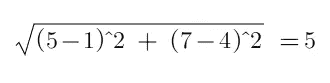
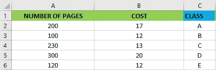
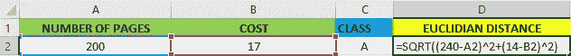
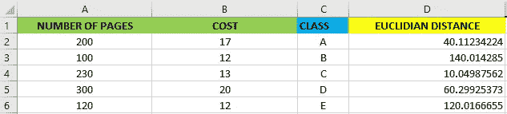
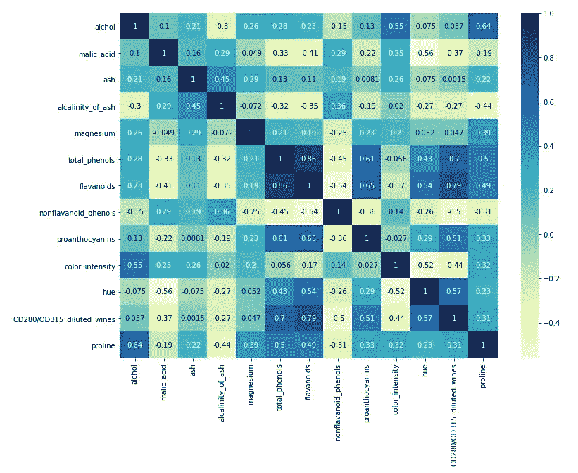
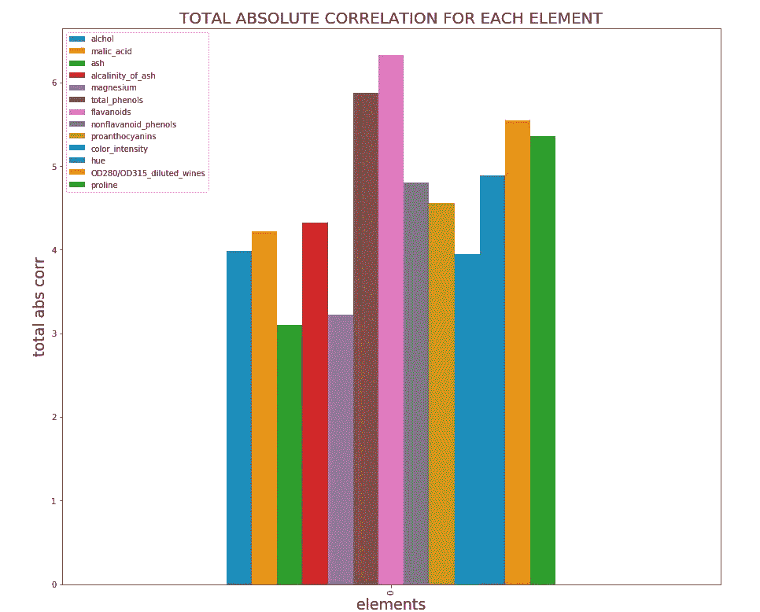
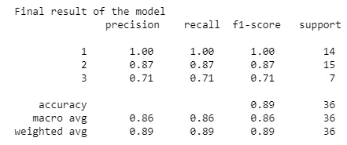

# 机器学习:通过预测意大利葡萄酒的品种来观察 KNN 是如何工作的

> 原文：<https://towardsdatascience.com/machine-learning-observe-how-knn-works-by-predicting-the-varieties-of-italian-wines-a64960bb2dae?source=collection_archive---------62----------------------->

## 做中学


凯尔西·钱斯在 [Unsplash](https://unsplash.com/s/photos/wine?utm_source=unsplash&utm_medium=referral&utm_content=creditCopyText) 上的照片

**简介**

在这篇文章中，我想用一个实际的例子向你介绍 KNN。

我会考虑我的一个项目，你可以在我的 [GitHub 简介](https://github.com/moryba/Predicting-the-vaieties-of-wines-with-KNN)中找到。对于这个项目，我使用了来自 [Kaggle](https://www.kaggle.com/) 的数据集。

该数据集是对意大利同一地区种植的葡萄酒进行化学分析的结果，但这些葡萄酒来自三个类别的三个不同品种。分析是通过考虑在三种类型的葡萄酒中发现的 13 种成分的数量来完成的。

本文将分为三个部分。在第一部分中，我将对 KNN 进行理论描述，然后我将专注于探索性数据分析部分，以便向您展示我发现的见解，最后，我将向您展示我用来准备和评估机器学习模型的代码。

第一部分:什么是 KNN，它在数学上是如何工作的？

k-最近邻算法不是复杂的算法。KNN 预测和分类数据的方法包括浏览训练数据，并找到最接近新点的 k 个训练点。然后，它将最接近的训练数据的类别标签分配给新数据。

但是 KNN 是如何运作的呢？要回答这个问题，我们必须参考两点之间的欧几里德距离公式。假设你需要计算笛卡尔平面上两点 A(5，7)和 B(1，4)之间的距离。您将应用的公式非常简单:



好吧，但是我们如何把它应用到机器学习中呢？假设你是一名书商，你想给一本名为《菲利普·K·蒂克的 Ubick》的新书分类，该书有 240 页，售价 14 欧元。正如你在下面看到的，有 5 个可能的类来放置我们的新书。



作者图片

为了知道哪个类最适合于 Ubick，我们可以使用欧几里德公式来计算数据集中每个观察值的距离。

公式:



作者图片

输出:



作者图片

正如你在上面看到的，最近的 Ubick 类是 C 类。

**第二部分:我发现的创建模型的见解**

在开始谈论我用来创建模型和预测葡萄酒品种的算法之前，让我简要地向你们展示一下我发现的主要见解。

在下面的热图中，不同功能之间存在关联。这对于初步了解我们数据集的情况以及了解是否有可能应用分类算法非常有用。



作者图片

乍一看，热图很棒，但这还不够。我还想知道是否有一些元素的绝对相关和很低，以便在训练机器学习模型之前删除它们。所以，我构建了一个直方图，如下图所示。

可以看到，有三个元素的总绝对相关度很低。元素是灰、镁和颜色强度。



作者图片

由于这些观察，现在我们确信有可能应用 KNN 算法来创建预测模型。

**第三部分:使用 scikit-learn 进行预测**

在这一部分中，我们将通过 scikit-learn 了解如何准备模型并对其进行评估。

下面你可以观察到我把模型分成两部分:80%用于训练，20%用于测试。我选择这个比例是因为数据集不大。

出局:

```
X_train shape: (141, 10)
y_train shape: (141,)X_test shape: (36, 10)
y_test shape: (36,)
```

你要知道 scikit-learn 中所有的机器学习模型都是在自己的类中实现的。例如，k-最近邻分类算法是在 KNeighborsClassifier 类中实现的。

第一步是将类实例化为一个对象，我称之为 *cli* ，如下图所示。该对象包含我将用来根据训练数据构建模型并对新数据点进行预测的算法。它还包含算法从训练数据中提取的信息。

最后，为了在训练集上构建模型，我们调用了 **cli** 对象的**拟合方法**。

出局:

```
KNeighborsClassifier(algorithm='auto', leaf_size=30, metric='minkowski',metric_params=None, n_jobs=None, n_neighbors=1, p=2,weights='uniform')
```

在 fit 方法的输出中，您可以看到创建模型时使用的参数。

现在，是时候对模型进行评估了。下面，第一个输出向我们展示了模型预测了 89%的测试数据。相反，第二个输出为我们提供了每个类的精确度的完整概述。

出局:

```
Test set score: 0.89
```

出局:



**结论**

我认为学习东西的最好方法是实践。所以在我的情况下，我从 [Kaggle](https://www.kaggle.com/) 下载数据集，这是找到一个好的数据集的最好地方之一，你可以在其上应用你的机器学习算法并了解它们是如何工作的。

感谢你阅读这篇文章。您还可以通过其他方式与我保持联系并关注我的工作:

*   订阅我的时事通讯。
*   也可以通过我的电报群 [*初学数据科学*](https://t.me/DataScienceForBeginners) 联系。