# AWS SageMaker 上的机器学习

> 原文：<https://towardsdatascience.com/machine-learning-on-aws-sagemaker-b23e32503106?source=collection_archive---------27----------------------->

## 如何用线性回归预测员工工资


Photo by @ [你好我是 Nik](https://unsplash.com/@helloimnik) 上[Unsplash](https://unsplash.com/photos/r22qS5ejODs)

在本教程中，我们将使用亚马逊 SageMaker Studio 在 [AWS SageMaker](https://aws.amazon.com/sagemaker/) 上创建一个 ML 模型，根据多年的经验来预测员工的工资。

# **问题陈述**

想象一下，一个潜在的员工已经通过了面试，现在 HR 想要给他们一份工作。薪水会是多少？

假设:对薪水有影响的唯一因素是多年的经验。

# **成果概述**

在本教程中，我将提出一个简单的线性回归模型。你在这个模型中输入多年的经验，它会做出相应的工资预测。

*注:你可以在这里找到我之前的帖子 TK 中关于线性回归的完整解释。*

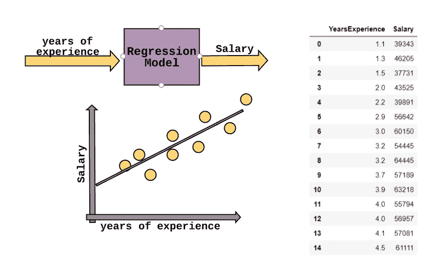

案例研究—结果概述

**使用的数据** : [卡格尔-工资-数据](https://www.kaggle.com/karthickveerakumar/salary-data-simple-linear-regression)

为了让这更令人兴奋，我们将在 Amazon SageMaker 上构建、训练和部署 ML 模型——耶！

## **亚马逊 SageMaker 工作室**

Sagemaker Studio 是一个用于机器学习的完全集成的开发环境(IDE)，它允许我们编写代码、跟踪实验、可视化数据和执行调试。

跟随:

*   从 AWS 管理控制台搜索栏中找到 SageMaker 服务。
*   点击亚马逊 SageMaker 工作室。
*   点击左上角的+图标，启动你的 Jupyter 笔记本。

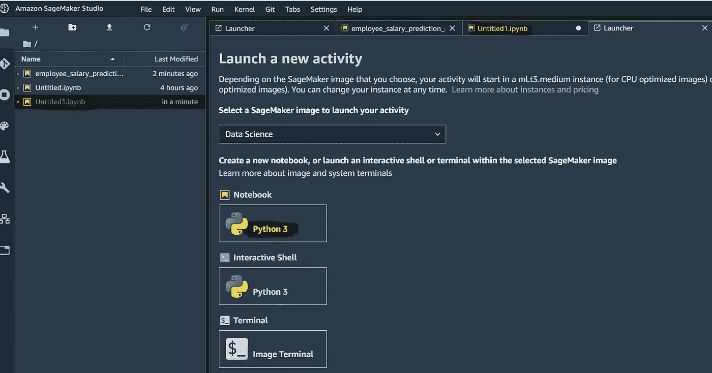

# 第一步:这项研究的目的是什么？

*   根据经验年限预测员工工资。
*   我们使用简单的线性回归模型:根据多年的经验(变量 X，独立变量)预测工资(变量 Y，独立变量)。

# **步骤 2:导入库和数据集**

```
**#import required libraries**
import pandas as pd
import numpy as np
import seaborn as sns
import matplotlib.pyplot as plt**#if you need to install some packages, use this command:**
!pip install tensorflow**#read the Dataset**
salary_df = pd.read_csv('salary.csv')
salary_df.head(10)
salary_df.tail(10)
```

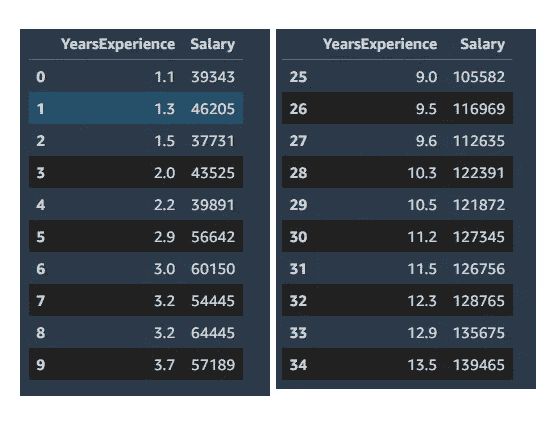

数据集的头部和尾部

# **第三步:探索性数据分析和可视化**

```
**#get some information about our DataSet** salary_df.info()
salary_df.describe()**#check if there are any Null values**
salary_df.isnull().sum()
```

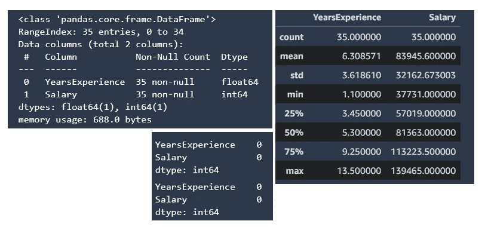

信息-描述-并检查是否有空值

```
**#visualizing data**
sns.pairplot(salary_df)
sns.heatmap(salary_df.corr(), annot=True)sns.regplot(salary_df['YearsExperience'], salary_df['Salary'], data = salary_df )
```

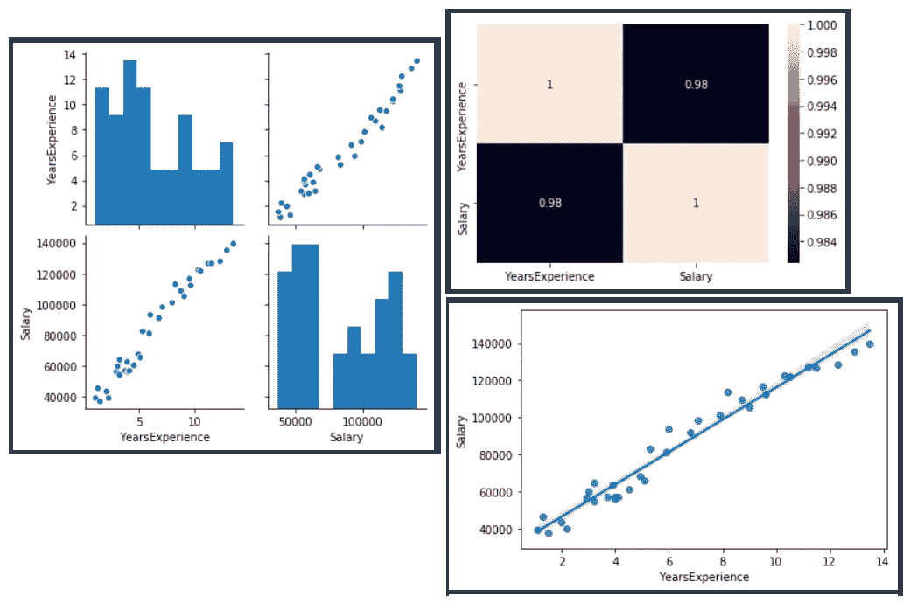

配对图-热图-正则图

# **第四步:将数据集分成训练集和测试集**

我们使用`Train`集合让算法学习数据的行为，然后我们在`Test`集合上检查我们的模型的准确性。

*   `Features(X)`:插入到我们模型中的列将用于进行预测。
*   `Prediction(y)`:将由特征预测的目标变量

```
**#define X variables and our target(y)**
X = salary_df[['YearsExperience']]
y = salary_df[['Salary']]**#splitting Train and Test** 
from sklearn.model_selection import train_test_splitX_train, X_test, y_train, y_test = train_test_split(X, y, test_size=0.33, random_state=0)**#need to have y_train & y_test as an vector(for SageMaker linear learner)** y_train = y_train[:,0]
y_test = y_test[:,0]
```

# **第五步:使用 SageMaker 训练线性学习模型**

在我们开始之前，让我们解释一下我们需要准备什么——我保证，我会很快的！

## **设置准备**

***亚马逊 S3***

*   亚马逊 S3 是一种存储服务，允许我们在目录(桶)中存储和保护我们的数据。我们将需要这项服务继续前进
*   **bucket:**是存储在亚马逊 S3 的对象的容器，每个 bucket 都有全局唯一的名称。

***创建桶***

*   首次搜索 S3 服务。
*   选择创建一个存储桶，并给它一个名称和区域。
*   点击下一步，直到您得到配置选项，您将阻止所有公共访问，并创建您的桶。

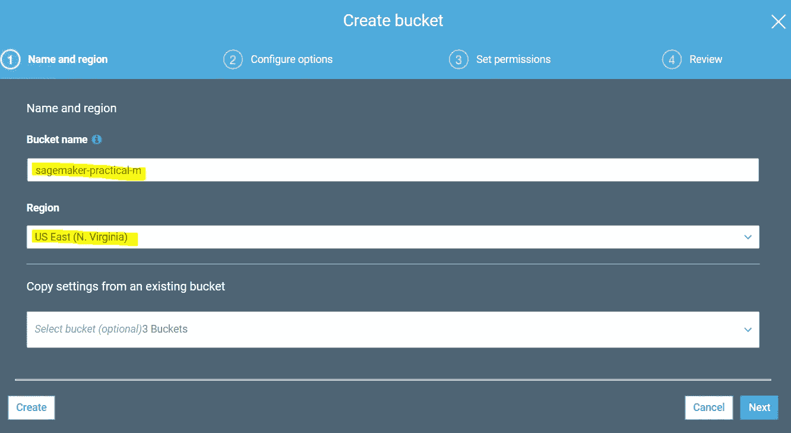

***【创建前缀(桶内子文件夹)***

在创建的桶中，点击“创建文件夹”并给它一个名字。

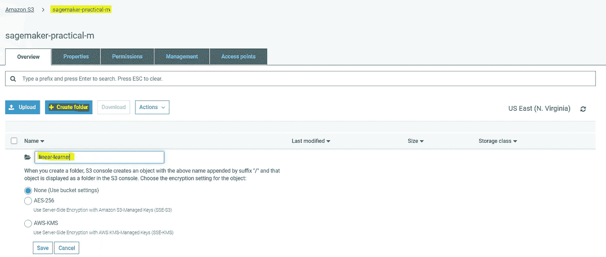

所以，我们有:

*   **斗:**斗:`sagemaker-practical-m`
*   **前缀:**

***IAM(身份和访问管理)***

我们需要给我们的 Sagemaker 一个 IAM 角色，这样它就可以代表我们执行任务(例如，读取训练结果，从 S3 存储桶中调用模型工件，以及将训练结果写入 S3)

让我们回到我们的代码:

```
**#import required kits** import sagemaker
import boto3 **#create a Sagemaker session**
sagemaker_session = sagemaker.Session()**#define the S3 bucket and prefix(subfolder within the bucket)** bucket = 'sagemaker-practical-m'
prefix = 'linear-learner' **#define IAM role**
role = sagemaker.get_execution_role()
print(role)
```


运行上述代码后的结果。

***Boto3*** *一个 AWS Python SDK，允许开发者编写使用亚马逊 S3 或 EC2 等服务的应用程序。*

让我们将训练数据转换成 Sagemaker 兼容的输入格式(RecordIO)。更多关于这个[的信息请点击](https://docs.aws.amazon.com/sagemaker/latest/dg/linear-learner.html#input_output)。

```
**#import module in terms of dealing with various types of I/O** import io**#import sagemaker common library** import sagemaker.amazon.common as smac **#converts the data in numpy array format to RecordIO format** buf = io.BytesIO()
smac.write_numpy_to_dense_tensor(buf, X_train, y_train)

**#reset in-memory byte arrays to zero** buf.seek(0)
```

最后一个命令用于清除内存缓冲区。

在我们的数据被转换成记录格式并包含在缓冲区中之后。我们现在可以将数据上传到 S3:

```
**#import module**
import os

**#Key refers to the name of the file** key = 'linear-train-data'**#uploads the data in record-io format to S3 bucket** boto3.resource('s3').Bucket(bucket).Object(os.path.join(prefix, 'train', key)).upload_fileobj(buf)**#training data location in s3**
s3_train_data = 's3://{}/{}/train/{}'.format(bucket, prefix, key)print('uploaded training data location: {}'.format(s3_train_data))
```


我们刚刚创建了“train”文件夹，其中包含我们上传的数据(linear-train-data)。

让我们回到 S3 仓库，检查文件是否在那里:

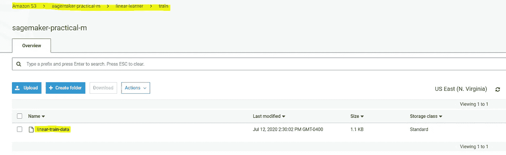

我们需要指定 S3 位置来存储我们的线性学习器输出:

```
**#create an output location in S3 bucket to store the linear learner output** output_location = 's3://{}/{}/output'.format(**bucket**, **prefix**)print('Training artifacts will be uploaded to: {}'.format(output_location))
```

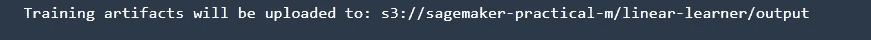

现在，要获得对线性学习器容器的引用，只需指定算法名:

```
**#specify the name of the algorithm, that we want to use** from sagemaker.amazon.amazon_estimator import get_image_uricontainer = get_image_uri(boto3.Session().region_name, 'linear-learner')
```

然后，我们传递希望用于训练的容器和实例类型。已经定义了输出路径和 SageMaker 会话变量。

```
linear = sagemaker.estimator.Estimator(container,
          role, 
          train_instance_count = 1, 
          train_instance_type = 'ml.c4.xlarge',
          output_path = output_location,
          sagemaker_session = sagemaker_session)
```

这些参数可以调整:

*   传入的要素数。
*   预测器的类型(`regressor`或`classifier`)。
*   小批量(每个小批量的观察次数)。

```
**#Train 32 different versions of the model and will get the best out of them** linear.set_hyperparameters(feature_dim = 1,
                           predictor_type = 'regressor',
                           mini_batch_size = 5,
                           epochs = 5,
                           num_models = 32,
                           loss = 'absolute_loss')**#pass in the training data from S3 to train the linear learner model** linear.fit({'train': s3_train_data})
```

# **步骤 6:部署训练好的线性学习模式**

```
linear_regressor = linear.deploy(initial_instance_count = 1,
                                 instance_type = 'ml.m4.xlarge')
```

为了在我们的模型中进行推理，我们需要将数据转换成文本/CSV 格式。在这里阅读更多。

```
from sagemaker.predictor import csv_serializer, json_deserializerlinear_regressor.content_type = 'text/csv'
linear_regressor.serializer = csv_serializer
linear_regressor.deserializer = json_deserializer
```

对测试集的预测:

```
**# making prediction on the test data** result = linear_regressor.predict(X_test)
result
```

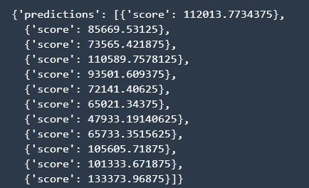

让我们取出结果编号并保存在`Prediction`板变量中:

```
**#access the scores by iterating through the scores in predictions** predictions = np.array([r['score'] for r in result['predictions']])
predictions
```

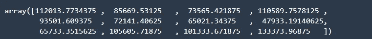

让我们检查结果作为一个`DataFrame`:

```
**#compare actual output values with predicted values** df = pd.DataFrame({'Actual': y_test.flatten(), 'Predicted': predictions.flatten()})
df
```

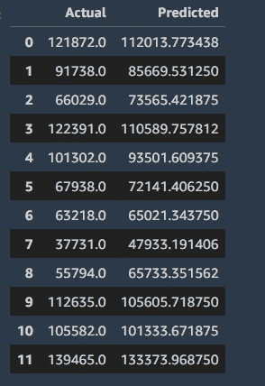

```
**# visualize comparison result as a bar graph** df1 = df.head(20)
df1.plot(kind='bar',figsize=(12,8))
plt.grid(which='major', linestyle='-', linewidth='0.5', color='green')
plt.grid(which='minor', linestyle=':', linewidth='0.5', color='black')
plt.show()
```

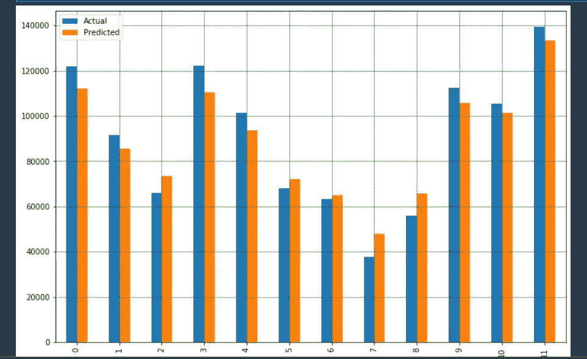

```
**#prediction vs test set**
plt.scatter(X_test, y_test,  color='blue')
plt.plot(X_test, predictions, color='red', linewidth=2)
plt.xlabel('Years of Experience (Testing Dataset)')
plt.ylabel('salary')
plt.title('Salary vs. Years of Experience')
plt.show()
```

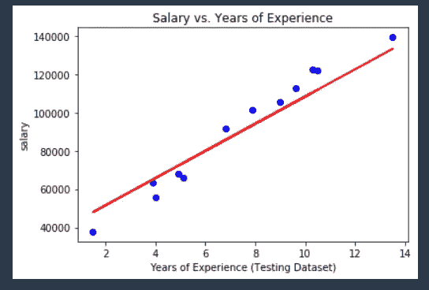

差不多就是这样！

**重要:**如果不想被亚马逊收费，永远记得删除端点！

```
**# Delete the end-point** linear_regressor.delete_endpoint()
```

我希望这篇文章能帮助你更好地理解这个话题。欢迎任何反馈，因为它让我获得新的见解！