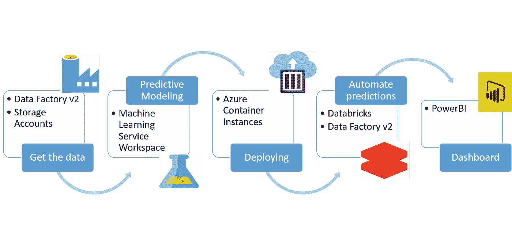
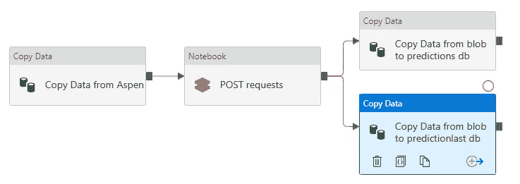

# Azure 上带有自动预测的机器学习

> 原文：<https://towardsdatascience.com/machine-learning-on-azure-with-automated-predictions-51d1721210f5?source=collection_archive---------17----------------------->

## 利用各种 Azure 服务创建端到端的生产机器学习管道


加州 17 英里路 Lone Cypress

我最近有机会在一家使用微软 Azure 作为人工智能平台的公司担任数据科学实习生。在我的一个项目中，我不得不推荐一个最优策略(设定点),在一个制造工厂中并行运行多个蒸汽锅炉。例如，在给定的特定条件下，以 100%(全容量)运行锅炉 1，以 50%运行锅炉 2，依此类推。目标是以最小的累积燃料输入满足工厂蒸汽需求。

> 由于这个问题的性质，锅炉的设定点将会 24/7 每分钟更新。

为了实现这一点，我在 Azure 上创建了一个端到端的机器学习(ML)管道。我所说的管道是指:

1.  将数据从本地服务器获取到云
2.  使用云计算创建预测模型，并将其部署为 API 端点
3.  每周 7 天、每天 24 小时自动进行预测，并将其存储回本地服务器(这被证明是很棘手的)
4.  创建用于监控性能的仪表板

在构建这个管道时，我发现微软的文档分散在几个产品中，而且不够直观，所以我认为分享我的工作流程并提供适当资源的链接会有所帮助。

工作流程可以总结在下图中。



> 这个博客的目的不是讨论 ML 方法论，而是理解如何利用不同的微软产品来创建端到端的生产管道。

那么，我们开始吧。

## 获取数据

在开始构建 ML 模型之前，我需要从本地 SQL server 查询相关的历史数据，并将其存储在云中。在这里，Azure Data Factory v2 ( [ADF](https://azure.microsoft.com/en-us/services/data-factory/?&ef_id=Cj0KCQiAxfzvBRCZARIsAGA7YMxT8Qsq5zPFJzJEN9lyqeQCu_F_RsX22fQrYZfz_IA_YFchnbAK2WkaAomJEALw_wcB:G:s&OCID=AID2000128_SEM_k2OvFYKP&MarinID=k2OvFYKP_287540103047_azure%20data%20factory_e_c__45619893599_kwd-295793767169&lnkd=Google_Azure_Brand&gclid=Cj0KCQiAxfzvBRCZARIsAGA7YMxT8Qsq5zPFJzJEN9lyqeQCu_F_RsX22fQrYZfz_IA_YFchnbAK2WkaAomJEALw_wcB) )派上了用场。ADF 允许您连接到本地数据库并编写 *t-SQL* 查询来将数据存储在 Azure Blob 存储中([Blob](https://docs.microsoft.com/en-us/azure/storage/blobs/storage-blobs-overview))。ADF 的 [*复制*](https://docs.microsoft.com/en-us/azure/data-factory/tutorial-hybrid-copy-data-tool) 工具(在移动和变换活动下)允许您复制所需的数据。

## 预测建模

一旦将所需数据存储在 blob 存储中，就可以使用 Azure 为开发 ML 模型提供的机器学习服务工作空间( [ML Services](https://docs.microsoft.com/en-us/azure/machine-learning/) )平台。如果你熟悉 Jupyter 笔记本环境，那么你会很高兴地知道 ML Services 允许你创建预装了重要库的笔记本。因此，您不需要担心环境的设置。

建立预测模型需要以下步骤:

1.  [创建你的 Azure 机器学习工作空间](https://docs.microsoft.com/en-us/azure/machine-learning/service/how-to-manage-workspace)，根据你的数据大小和计算需求指定虚拟机(VM)的大小。我使用了一个 3M 乘 13 的数据集，需要创建多个 ML 模型。因此，我决定使用 8 核 28 GB 虚拟机(V2 D4 标准)
2.  接下来，创建一个 Jupyter 笔记本和[连接到 blob 存储器](https://docs.microsoft.com/en-us/azure/machine-learning/service/how-to-access-data)。一旦连接上，就可以很容易地将 blob 数据转换成 pandas 数据框架
3.  [创建一个 Azure 机器学习计算目标](https://docs.microsoft.com/en-us/azure/machine-learning/service/how-to-set-up-training-targets)，它将并行运行多个作业，以加速训练和超参数调优
4.  [创建一个训练脚本](https://docs.microsoft.com/en-us/azure/machine-learning/service/tutorial-train-models-with-aml#create-a-training-script)，它将导入库、接受用户定义的参数、执行数据转换(如果有)、调整超参数、记录度量值等。基本上，它是在计算目标上运行的代码，用于训练您的模型
5.  [创建一个评估器](https://docs.microsoft.com/en-us/azure/machine-learning/service/how-to-train-ml-models)，其中包含训练脚本的位置、用户定义的参数值、所需的 conda 和/或 pip 库，以及计算目标
6.  [使用定义的超参数搜索空间、提前终止策略、主要指标、最大超参数运行和最大并发作业，配置您的超参数调整实验](https://docs.microsoft.com/en-us/azure/machine-learning/service/how-to-tune-hyperparameters)。此外，提供将使用采样超参数调用的估计器(在上面的步骤中创建)
7.  [提交实验](https://docs.microsoft.com/en-us/python/api/azureml-core/azureml.core.experiment(class)?view=azure-ml-py#submit-config--tags-none----kwargs-)并实时可视化超参数调整进度
8.  最后，群集返回最佳模型。使用完整的数据集重新训练它，[注册最终模型](https://docs.microsoft.com/en-us/azure/machine-learning/service/how-to-deploy-and-where#registermodel)用于部署

好的教程可以在[这里](https://github.com/Azure/MachineLearningNotebooks/tree/master/how-to-use-azureml/training-with-deep-learning)找到。

## 部署模型

一旦最终的模型在工作空间中注册，我们需要将它部署为一个 API 端点，我们可以查询它以获得几乎即时的预测。为了创建 API，我使用了 Azure 容器实例( [ACI](https://azure.microsoft.com/en-us/services/container-instances/) )。

除了最终模型之外，您还需要以下内容来使用 ACI 成功部署模型:

1.  入口脚本:该脚本将通过部署的 web 服务提交的数据传递给最终模型。然后，它将输出返回给客户端
2.  依赖关系:创建一个. yml 文件，其中包含模型进行推理所需的包
3.  部署配置:这描述了 API 的计算资源，例如内核和内存的数量

一旦您有了最终的模型、入口脚本、依赖项和部署配置，您就可以创建一个 [docker 映像并部署模型](https://docs.microsoft.com/en-us/azure/machine-learning/service/tutorial-deploy-models-with-aml)。

## 全天候自动预测

这是有趣的部分。我需要 24/7 每分钟向本地服务器数据库提交预测，所以我必须自动化预测部分。为此，我创建了一个 Databricks 笔记本(参见下面的代码示例),它获取输入，向 API 提交请求，并提交预测。流程可以总结如下:

1.  使用 ADF 将预测数据从本地服务器复制到云
2.  运行 databricks 记事本，并根据您的需求将预测存储在 blob 存储或 SQL 数据库中(我将在下面讨论这两者)
3.  使用 ADF 将预测从 blob 复制到本地 SQL 数据库



我的 ADF 管道快照，用于每分钟自动进行预测。绿色箭头确保前一个活动完成后，下一个活动才开始

为了每分钟都自动完成这个流程，您可以[安排一个触发](https://docs.microsoft.com/en-us/azure/data-factory/how-to-create-schedule-trigger)(触发的频率、开始和停止的时间等等。)在 ADF 中。跟随[这个](https://docs.microsoft.com/en-us/azure/data-factory/solution-template-databricks-notebook)了解更多关于如何添加数据块到 ADF 的细节。

我的 Databricks 笔记本看起来像这样:

```
## Connect to the storage account containing input datastorage_account_name = 'storage_account_name' storage_account_access_key = 'access_key' spark.conf.set("fs.azure.account.key."+storage_account_name+".blob.core.windows.net", storage_account_access_key)
```

这将允许您连接到 blob 存储。接下来，我连接到特定的 blob 并将其转换为 pandas 数据帧。

```
## To read in the blob as spark dataframedf = spark.read.csv(“wasbs://folder@storage_account_name.blob.core.windows.net/blob_name”, header = True)
df_panda = df.toPandas()
```

现在，你有了熊猫数据框架中的数据。如果有的话，进行必要的数据转换。然后，调用 API 端点来获得预测。

```
## Post requests to API end-point to get predictions
uri = ‘API_end_point’
test_samples = json.dumps({‘input data feature’: values})
test_samples = bytes(test_samples, encoding=’utf8')
fitness_ga = requests.post(uri, test_samples, headers = {‘Content-Type’: ‘application/json’})
ng_pred = [fitness_ga.json()]
pd_df = spark.createDataFrame(pd.DataFrame(ng_pred))
```

这里 *pd_df* 是包含预测的火花数据帧。最后，您可以将这些预测保存到 Azure SQL Server 数据库或 blob，如下所示。

*将数据块连接到 Azure SQL Server 数据库*

```
## Connecting to SQL server database from databricks
jdbcHostname = ‘your_sql_server_name.database.windows.net’
jdbcDatabase = ‘sql_server_database_name’ 
jdbcPort = 1433
jdbcUsername=’your_sql_server_username’
jdbcPassword=’your_sql_server_password’jdbcUrl = “jdbc:sqlserver://{0}:{1};database={2}”.format(jdbcHostname, jdbcPort, jdbcDatabase)
connectionProperties = { “user” : jdbcUsername, 
“password” : jdbcPassword, 
“driver” : “com.microsoft.sqlserver.jdbc.SQLServerDriver”} ## append spark dataframe to SQL database
mode=’append’
pd_df.write.jdbc(url=jdbcUrl, table=”sql_table_name”, mode=mode, properties=connectionProperties)
```

*将数据块连接到 Azure Blob 存储*

```
## Connecting Databricks to Azure blob storage
output_container_path = “wasbs://folder@storage_account_name.blob.core.windows.net”
output_blob_folder = output_container_path+”/temporary_blob_name” ## overwrite the blob, this creates a bunch of files
pd_df.coalesce(1).write.mode(“overwrite”).option(‘header’, ‘true’).format(‘com.databricks.spark.csv’).save(output_blob_folder) ## move the required data to blob where you want predictions finally
files = dbutils.fs.ls(output_blob_folder)output_file = [x for x in        files if x.name.startswith(‘part-’)]
dbutils.fs.mv(output_file[0].path, output_container_path+’/blob_name’)
```

## 仪表盘

一旦开始用预测填充本地数据库，就可以用 [PowerBI](https://powerbi.microsoft.com/en-us/get-started/?&ef_id=Cj0KCQiAxfzvBRCZARIsAGA7YMyoGQvJwmxuyMoTd_MBcJfgJzlIB2H6ZMnbFAmez7nDCVvIWUdbbVsaAj5lEALw_wcB:G:s&OCID=AID2000568_SEM_bHb24t0B&lnkd=Google_PowerBI_Brand&MarinID=sbHb24t0B_286802327412_power%20bi_e_c__55839339962_kwd-25206446922_&gclid=Cj0KCQiAxfzvBRCZARIsAGA7YMyoGQvJwmxuyMoTd_MBcJfgJzlIB2H6ZMnbFAmez7nDCVvIWUdbbVsaAj5lEALw_wcB) 连接本地数据库。PowerBI 让您只需从数据库表中拖放字段，就可以创建令人惊叹的可视化效果。一旦您在 PowerBI 中获得了所需的数据，您就可以计算和可视化关键性能指标(KPI)来衡量您的模型的性能。例如，在我的例子中，一个 KPI 可以是一段时间内的产出与投入(效率)的比率。创建后，您可以在数据库更新时自动更新仪表板。

事实上，在分析您的数据时，PowerBI 非常方便，可以节省您的时间和编码工作，同时创建出版物质量的交互式图表。

# 重要的考虑和学习

1.  ***成本*** :涉及两大成本，ML 服务的虚拟机(VM)和数据块集群。根据数据的大小和建模的复杂程度，您必须决定虚拟机内核和内存的最佳数量。同样，选择大于所需的 Databricks 集群可能会导致更高的成本。此外，确保在不使用时停止 ML 服务工作区和 Databricks 集群，以节省不必要的额外成本
2.  *延迟与模型复杂性:在我的情况下，我有多个 ML 模型，每分钟都需要预测(从本地服务器获取数据到将预测提交回本地服务器需要 1 分钟)。因此，我需要选择一个预测时间最短的模型，同时又不影响预测的准确性。 *LightGBM* 对我很有效*
3.  ****为什么是数据砖块？*** :我知道我可以使用 ADF 自动触发一个管道，ADF 允许我使用 Databricks notebook 作为活动。因为我可以用 Databricks 编写 python 和 spark 代码，所以这对我来说是一条自然的道路*
4.  ****从内部部署到云*** :从内部部署的 SQL 数据库向云查询大量数据可能非常耗时。因此，确保将查询的数据保存在云上的某个地方。例如，如果您想在 3 个月后重新训练您的模型，您只需要查询最近 3 个月的附加数据*
5.  ****数据块到数据库*** :我无法直接从数据块将预测写入本地数据库。但是，能够使用 ADF 将预测从 azure blob 存储写入本地数据库*
6.  ****输出错误日志*** : Azure 在出错时输出错误日志。例如，如果您在超参数调整或部署模型时遇到错误，阅读错误日志可以节省您大量的调试时间*
7.  ****XGBoost 风扇*** :在 ML 服务中，XGBoost 不会预装 Jupyter 笔记本。要获得 XGBoost，将下面的代码复制粘贴到 jupyter 笔记本中，它应该可以工作了*

```
*import sys
!conda install — yes — prefix {sys.prefix} py-xgboost
!conda install -y anaconda py-xgboost*
```

*从头开始设计如此复杂的管道可能很难，尤其是如果你是 Azure 的新手。希望这篇博客能帮助你开始。您可以创建一个 Microsoft Azure 免费帐户，并开始使用他们的大部分服务。关于如何开始的更多细节，请跟随[这个](https://azure.microsoft.com/en-us/free/)。*

*最后，我想真诚地感谢我的合作者 Radek Rybicki，他帮助我定义了这个项目，并指导我完成了它的不同阶段。*

*这是我的第一个数据科学博客，我真的很兴奋能继续写博客。如果您有任何意见和/或建议，请告诉我。我们可以稍后更详细地讨论管道的每个方面。*