# 机器学习或回归的意想不到的优点

> 原文：<https://towardsdatascience.com/machine-learning-or-the-unexpected-virtue-of-regression-b466a341acac?source=collection_archive---------51----------------------->

## 我希望在艰难地学会 ML 之前就知道的事情

照片由[张秀坤镰刀](https://unsplash.com/@drscythe?utm_source=medium&utm_medium=referral)在 [Unsplash](https://unsplash.com?utm_source=medium&utm_medium=referral) 上拍摄

计算机可以学习的想法激发了我们的想象力。我们看到机器人，自动驾驶汽车，我们想知道这怎么可能？好的，我们可以试着对我们的笔记本电脑说“来吧，伙计，跟着我学”。这是个好主意，不是吗？哦，你是对的，它不是那样工作的…暂时。

理解计算机如何能够学习东西可能是相当令人生畏的。我去过那里，努力研究人工神经网络是如何工作的。最后，所有元素都点击了。然而，我学得越多，就越明白我应该从一个不同的位置开始，让学习变得更容易、更有效。

这就是为什么我分享一个解释我们的计算机如何学习的故事。你也会发现回归并不总是意味着坏事。实际上，它会给你一个坚实的开端，让你进入机器学习的迷人世界。

# 闪回

想象一个典型的计算机科学学生。戴着眼镜，穿着极客 t 恤，因为熬夜和学习(或者玩电子游戏)看起来很累。主要的光源是一台来自计算机的显示器，太阳不是他的朋友。那是我，几年前。我已经了解了神经网络是如何工作的，我将参加关于更高级智能系统的实验室。实验开始了，我拿到任务，开始阅读:

> 实施一种智能方法…

这个简单的句子打动了我。什么是智能方法？我试图按照 [**费曼手法**](https://interestingengineering.com/learn-like-an-engineer-the-feynman-technique)【1】去学习东西:

第一步:选择一门你想学的学科，开始学习。

第二步:试着像对孩子解释一样解释。

我无法完成第二步，所以我决定问问我的讲师。他是这么回答的:

> “嗯，我认为每一种需要某种训练的方法都是智能的或机器学习的方法。你知道，动物和人通常被认为是聪明的。我们需要训练来掌握我们需要的技能。你的程序也努力训练，为你解决问题。”

这个简单的，非正式的定义是辉煌的。只是模仿一个程序，把它看作一个运动员或学生，他们通过试错变得越来越好。而且在实现目标的过程中非常执着。这就是机器学习的大视野。

记住这幅图，让我们来解释机器学习的主要方法之一，即**监督学习**。

# 回到学校

我喜欢把监督学习比作被老师思考。让我们回到我们上小学的时候。坐在教室里，等待老师教我们如何识别不同种类的树叶，如何命名和书写字母和数字。

[疾控中心](https://unsplash.com/@cdc?utm_source=medium&utm_medium=referral)在 [Unsplash](https://unsplash.com?utm_source=medium&utm_medium=referral) 上拍摄的照片

可能你的老师给了你一些例子。例如，他们给你看不同树的叶子，并给这些树命名。此外，它们可以让你注意到叶子的一些特征，如形状、颜色或结构。上完这一课后，你可以在公园散步时摘一片叶子，给一棵树命名。

这个想法适用于监督学习。首先，你是老师。你想解决某个任务，想教某人如何去做。这意味着你需要一个学生。在机器学习世界中，它通常是一个数学模型(比如一个方程或一组以特定方式组合的数字)。

然后，你要准备你的例子和每个例子的正确答案。这个数据集对于解决你的任务应该是有用的(例如，如果你想有一个识别它们的程序，树叶的照片)。

有了这个数据集，你就可以向你的模型展示你的例子了。您检查模型的反应，并将其与正确答案进行比较。最后，您必须调整您的模型参数(通常是许多数字)，以便它正确响应。

呈现示例、将模型的响应与正确答案进行比较以及调整参数的过程是迭代的。你重复它直到你的模型学习正确的答案。

# 寓教于乐

现在我们可以进入更多的细节，并尝试使用 ML 解决一个问题。所以作为一名教师，你想激发学生学习 ML 的好奇心。大概很多同学都爱超级英雄(我也爱他们)。你可以在任何地方找到它们，它们成为了我们文化的一部分。

照片由 [Ali Kokab](https://unsplash.com/@_alikokab_?utm_source=medium&utm_medium=referral) 在 [Unsplash](https://unsplash.com?utm_source=medium&utm_medium=referral) 上拍摄

所以我们来公式化一个你想解决的问题。你想知道超级英雄服装和他们的受欢迎程度之间有什么关系。

首先，我们来准备我们的例题和正确答案。为了做到这一点，我们需要弄清楚我们可以使用什么样的数据来建立服装和流行之间的关系。

幸运的是，浏览互联网会给你带来一个绝妙的主意。金钱可以很好地反映受欢迎程度。让我们试一试。选择大约 50 个超级英雄，检查我们需要为每个超级英雄服装支付多少钱。

然后你可以找到超级英雄出现的漫画书数量，并假设他们出现的越多越好。为了找到这样的数据，我们将使用下面的**【2】。**

**综合来看，排名中的每个超级英雄都有两个数字。服装价格(x)，漫画出镜率(y):**

**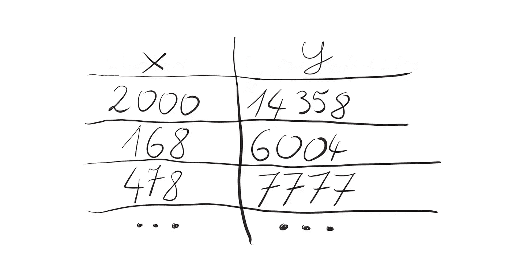**

**超级英雄数据集。(图片由作者提供)**

**这是我们的数据集。因为每行有两个数字，我们可以画一个图，看看它在 2D 是什么样子。**

**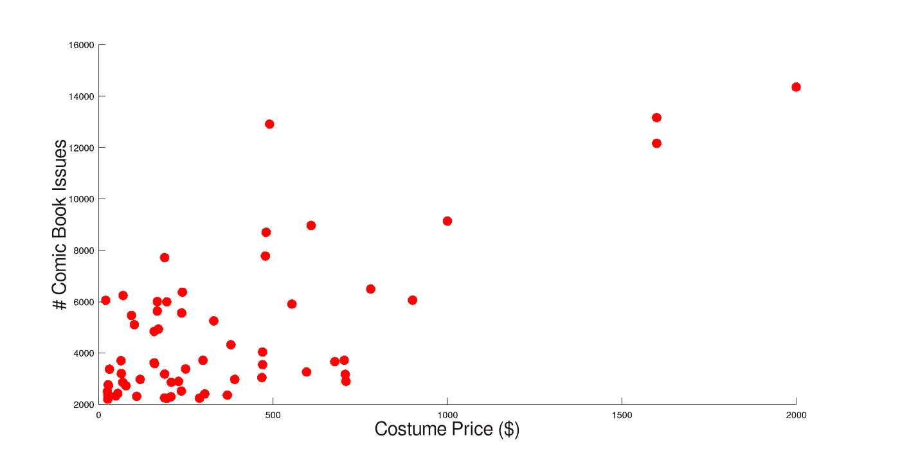**

**2D 的超级英雄。**

**现在是时候选择我们的学生了，一个将学习如何解决任务的机器学习模型。如果你看我们的情节，你可能会看到这个趋势，越贵的服装越多的漫画出现。如果我给你一支笔，让你画出这个趋势，你可以画一条简单的直线。**

**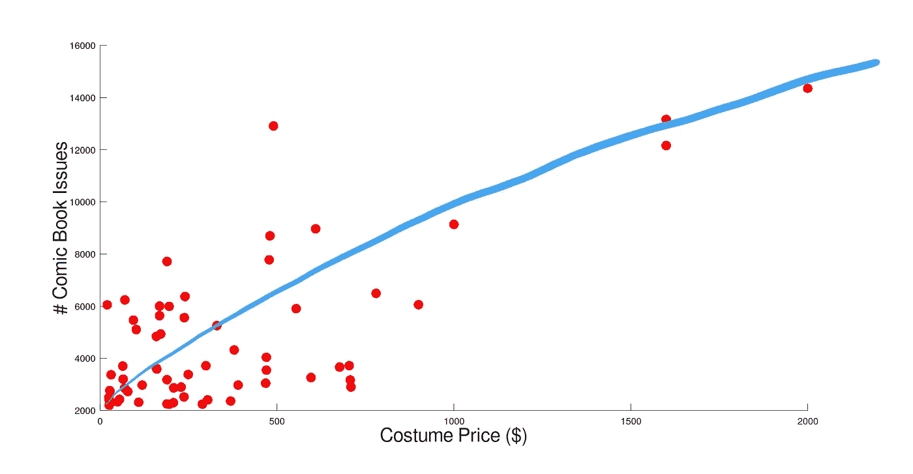**

**用我们自己的大脑画出一个趋势。(图片由作者提供)**

**它非常符合我们的数据，不是吗？所以让我们用一条**线**作为我们的 ML 模型。**

# **是鸟…是飞机…是线性回归！**

**我们将要使用的方法的正式名称是线性回归[3]。这是一种建模变量之间关系的方法。你可以用它来检查房子的大小与价格的关系，或者电流与电压的关系。我们想知道服装价格和漫画形象之间的关系。**

**我们的模型是一个线性方程(f(x)-漫画书发行数量)，有两个参数θ₀，θ₁(thetas)和变量 x(服装价格)。**

****

**线方程。(图片由作者提供)**

**它是如何工作的？让我们假设θ₀= 1，θ₁= 1。这意味着如果我们把 0 作为 x，我们有 0 乘以 1 等于 0，加上 1 等于 1。对于 x = 2，它是 2 乘以 1，加上 1 就是 3。我们可以用这些点(0，1)，(2，3)来画一条线。**

**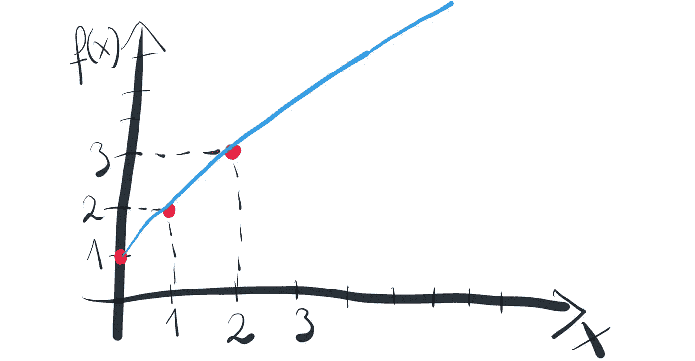**

**θ₀= 1，θ₁= 1 的线性函数草图(图片由作者提供)**

**如果我们改变参数，我们的线将通过不同的点。当然，在我们的机器学习风味的线性回归中，我们希望自动找到最佳参数。我们的程序将尝试不同的θ值，它需要知道这些参数正常意味着什么。这就是为什么我们需要一个目标函数。**

# **测试你的学生**

**在 ML 中，能够评估你的模型是非常重要的。你只需要知道它的表现是好是坏。我们使用所谓的**目标函数**来实现。让我们定义我们的线性回归目标函数。**

****

**线性回归目标函数。(图片由作者提供)**

**目标函数 Q 取决于在我们的程序寻找解决方案时改变的 thetas 参数，以及代表超级英雄的数据点(点是不变的，它们是真理的来源)。**

**按照这个公式，我们需要遍历所有的数据点(按照 jᵗʰ指数编号)。所以拿第一点来说，得到它的服装价格(xʲ)并计算函数 f 的一个值。然后减去这一点的漫画书发行数量(yʲ).将结果平方，并将其添加到总和中。对我们数据集中的每一点都这样做。**

**为了更容易理解，让我们看看这些例子。从我们的数据集中抓取一个点。想象一下，f(xʲ对这一点给你 4，而 yʲ等于 2。将这些值代入目标函数公式:**

**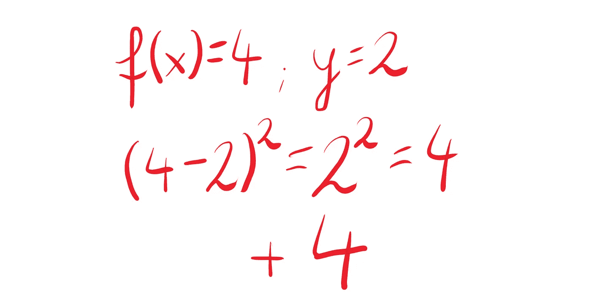**

**图片作者。**

**如你所见，在计算了这个特定点的目标函数公式后，我们得到了 4。这意味着我们需要在总和上加 4。好了，和在增长，去下一个点。**

**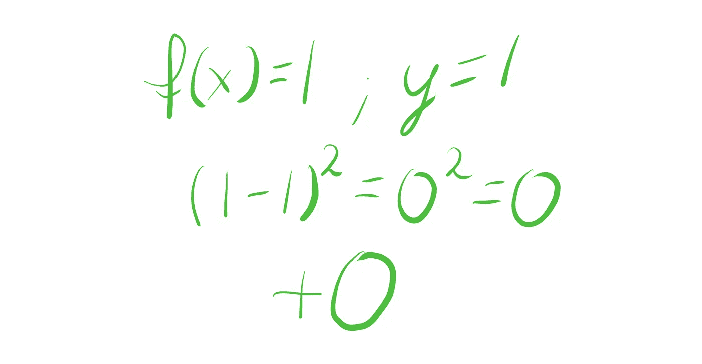**

**图片作者。**

**函数 f(xʲ的时间值是 1，而我们期望的是 1 (yʲ=1).如你所见，根据目标函数公式，我们在这一点上得到了 0。这意味着我们不需要添加任何东西到我们的总和，它保持在同一水平。**

**这就是我们的目标函数的工作方式！总和越接近 0 越好。如果数据点的函数值 f(x)接近或等于期望值(y)，这意味着我们找到了最佳θ参数。换句话说，当例子与正确答案相匹配时，我们会很高兴。所以我们需要最小化目标函数(总和应该很低)来解决我们的问题。**

# **机器学习的超级英雄**

**为了最小化我们的目标函数，我们将使用**梯度下降**算法【3，4】。对我来说，它是 ML 中的主要算法之一。其背后的基本思想通常用于复杂而强大的 ML 方法，如深度学习[4]。幸运的是，我们可以用一种非常简单的方式将它用于线性回归任务，并理解它是如何工作的。**

**首先，梯度下降是一种**迭代**算法。在每次迭代中，我们按照神秘的公式更新θ参数:**

**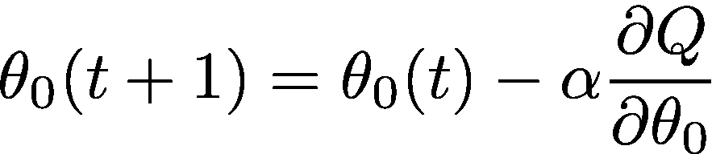**

**图片作者。**

**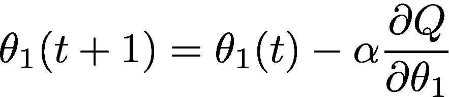**

**图片作者。**

**别担心，它看起来比实际复杂得多。开始之前，我们将θ初始化为一些随机值。然后我们开始更新它们。θ₀(t)和θ₁(t)是当前迭代(t)中θ参数的值。我们通过减去α，也称为学习步长(小实数，如 0.25)，乘以我们的目标函数的偏导数(**∂**q/**∂**θ)来改变它们。好吧，这听起来不简单，为什么我们需要衍生品？**

**关于**导数**你需要知道的最重要的事情是，函数的导数告诉你函数是如何变化的。如果你的函数是递增的，这个函数在这一点的导数将是正的。如果它在减少，导数将是负的。**

**为了简单起见，让我们假设我们的目标函数是一个简单的抛物线。其值取决于θ参数(θ轴)。如果我们计算函数 f 在抛物线上升点的导数，导数的值将是正的。在梯度下降公式中，它成立:-α乘以正导数。负乘以正得出一个负值
(例如-4 * 3 = -12)。这意味着我们需要从当前的θ中减去一些东西。**

**在下一次迭代中，我们计算一个新点的导数，如果它是正的，我们再从θ中减去一些。这就是我们如何在几个步骤中达到最小值。为了更好的理解，我们来形象化一下。**

**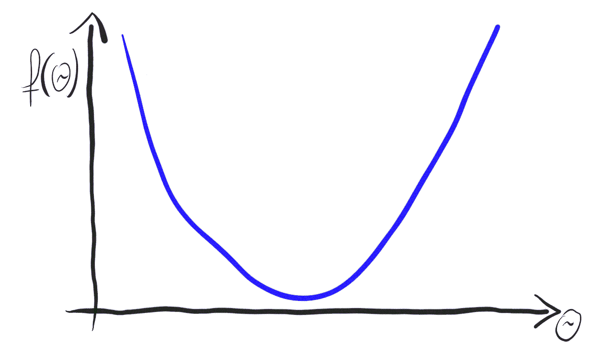**

**当从抛物线的上升边缘开始时，通过减法更新θ。(图片由作者提供)**

**如果我们把起点选在抛物线的递减边缘，我们的导数将是负的。所以当我们遵循梯度下降公式时，我们有-α倍的负导数。负乘以负得出正值(例如(-2)*(-3) = 6)。所以现在我们在θ上加一些东西。加法意味着我们在θ轴上向右移动。按照同样的步骤，我们最终达到最小值。这是视觉效果。**

****

**当从抛物线的递减边缘开始时，通过增加来更新θ。(图片由作者提供)**

**这就是如何使用梯度下降来最小化目标函数并找到最佳θ。想象你正在**下山**。不管你在哪里，计算导数的值，反方向(-α)到达山谷。把这个想法记在脑子里。计算机就是这样学习的。**

# **买一套超级英雄服装要花多少钱？**

**最后，我们有了拼图的所有元素:**

1.  **数据集(代表超级英雄的点)**
2.  **模型(直线方程)**
3.  **目标函数(对我们所有的点进行巧妙的求和)**
4.  **学习算法(梯度下降)**

**让我们运行梯度下降 1000 次迭代。这意味着我们将更新这两个标签 1000 次。那么我们的程序应该已经有最好的 thetas 了。**

**我们的最佳 thetas 是:**

**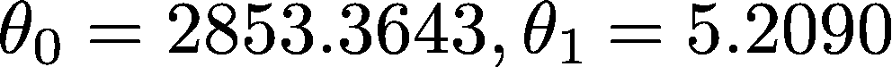**

**最佳 thetas。(图片由作者提供)**

**当我们将它们代入线方程时，我们得到:**

**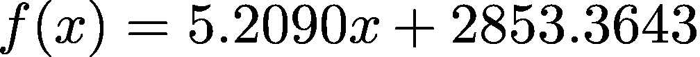**

**我们数据集的最佳直线方程。(图片由作者提供)**

**这就是我们的模型从数据集中学到的，但我同意这不是很有用。为了让它更实用，我们可以让它来回答我们的问题。假设你想投资 1 000 美元购买超级英雄服装(这是一大笔钱，但超级英雄的崇拜者会这么做)。一张图胜过千言万语，让我们画出最佳路线:**

**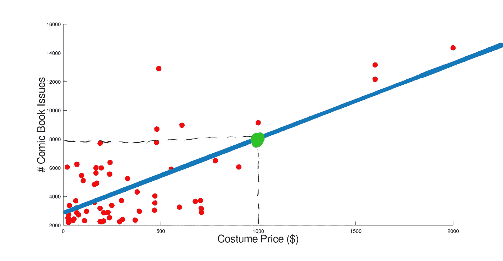**

**基于机器学习的服装价格对商品图书发行的线性回归模型。(图片由作者提供)**

**多亏了我们的模型，我们看到，如果我们投资如此昂贵的服装，它预测大约 8000 本漫画书会出现。不错啊，我们可以跻身出版最多的超级英雄前 10 名了！**

# **你要去冒险了**

**关于老师，学生，识别树叶，解决超级英雄问题的故事到此结束。然而，这是你进入机器学习世界的旅程的开始。现在你对计算机如何学习有了直觉，并且熟悉了最强大的 ML 概念之一，梯度下降算法。如果你对本文介绍的 ML 风格线性回归的实际实现感兴趣，请查看我的 [Github 库](https://github.com/rauluka/mluvr-regression) [5]。**

**是时候更进一步了，认识新的算法，概念，问很多问题。也许值得检查一下当教室里没有老师时会发生什么？如果是这样，理解**无监督学习**应该是你的下一步。**

## **参考书目:**

1.  **[https://interesting engineering . com/learn-like-an-engineer-the-Feynman-technique](https://interestingengineering.com/learn-like-an-engineer-the-feynman-technique)**
2.  **https://www . ranker . com/list/super heroes-rank-by-most-comic-book-appearances/ranker-comics**
3.  **Grus Joel,《从零开始的数据科学》,第二版，奥赖利媒体公司。**
4.  **帕特森乔希，吉布森亚当，深度学习，奥莱利媒体公司。**
5.  **[https://github.com/rauluka/mluvr-regression](https://github.com/rauluka/mluvr-regression)**