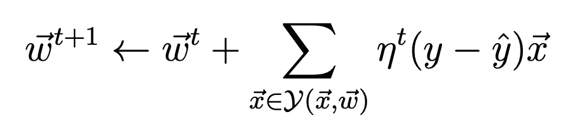
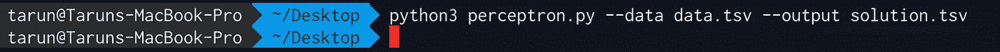

# 机器学习感知器实现

> 原文：<https://towardsdatascience.com/machine-learning-perceptron-implementation-b867016269ec?source=collection_archive---------34----------------------->

## Python 使用增量规则(梯度下降)


照片由[摄影师](https://unsplash.com/@ffstop?utm_source=unsplash&utm_medium=referral&utm_content=creditCopyText)在 [Unsplash](https://unsplash.com/s/photos/programming?utm_source=unsplash&utm_medium=referral&utm_content=creditCopyText) 上拍摄

在这篇文章中，我们将看看用`numpy`用`Python3`写的一个程序。我们将讨论什么是**感知器**的基础知识，什么是 **delta 规则**以及如何使用它来收敛感知器的学习。

# 什么是感知器？

感知器是二元分类器[监督学习](/basics-of-supervised-learning-classification-d26c00d80100)的算法(让我们假设`{1, 0}`)。我们有一个[权重向量和输入数据向量的线性组合](/simple-linear-regression-in-python-8cf596ac6a7c)，它通过一个激活函数，然后与一个阈值进行比较。如果线性组合大于阈值，我们预测该类为`1`，否则为`0\. Mathematically,`


资料来源:stackexchange.com

感知器只代表线性可分的问题。如果训练样本不是线性可分的，它们就不能收敛。这就带来了**德尔塔法则。**

**delta 规则**向[目标概念](/journey-into-data-mining-3b5ccfa5343)的最佳近似收敛。其核心思想是利用 [**梯度下降**](https://medium.com/swlh/batch-linear-regression-75e7dd2ab28b) 搜索所有可能权重向量的假设空间。

> 注意:这为“反向传播”算法提供了基础。

现在，让我们讨论一下手头的问题。程序将读取一个[数据集](https://gist.github.com/tarunlnmiit/8f23c6fe277fe682a17e5536733d4b35)(制表符分隔文件)，并将第一列视为[目标概念](/journey-into-data-mining-3b5ccfa5343)。目标概念中存在的值是 **A 和 B，**我们将把 **A** 视为+ve 类或`1`，把 **B** 视为-ve 类或`0`。该程序以批处理模式实现感知器训练规则，具有恒定的学习速率和退火(随着迭代次数的增加而减少)学习速率，从学习速率为 1 开始。



其中 Y(x，w)是被错误分类的样本集。我们将使用错误分类点的计数或数量作为我们的错误率(即| Y(x，w)|)。输出也将是包含每次迭代误差的制表符分隔(tsv)文件，即它将有 100 列。同样，它将有 2 行，一行用于正常学习率，一行用于退火学习率。

现在，理解什么是感知机，什么是德尔塔法则，以及我们将如何使用它。让我们开始实施`Python3`。

在程序中，我们从命令行提供两个输入。它们是:

1.**数据** —数据文件的位置。

2.**输出**—tsv 解决方案的写入位置

因此，程序应该能够这样启动:

```
python3 perceptron.py --data data.tsv --output solution.tsv
```

该程序由 8 部分组成，我们将一次看一个。

## 进口报表

```
import argparse # to read inputs from command line
import csv # to read and process dataset
import numpy as np # to perform mathematical functions
```

## 代码执行初始化程序块

```
# initialise argument parser and read arguments from command line with the respective flags and then call the main() functionif __name__ == '__main__':    
    parser = argparse.ArgumentParser()    
    parser.add_argument("-d", "--data", help="Data File")        
    parser.add_argument("-o", "--output", help="output")    
    main()
```

## `[main()](https://gist.github.com/tarunlnmiit/744221fb4289efc5d1e02d2a20b251d1)`功能

`main()`功能的流程如下:

1.  将各自的命令行输入保存到变量中
2.  设置开始学习率= 1
3.  使用`csv`和`delimiter='\t'`读取[数据集](https://gist.github.com/tarunlnmiit/8f23c6fe277fe682a17e5536733d4b35)，在`X`中存储自变量，在`Y`中存储因变量。我们将`1.0`作为偏差添加到我们的独立数据中
4.  独立数据和从属数据被转换为浮点型
5.  重量向量用与`X`维数相同的零初始化
6.  [**normal error**](https://gist.github.com/tarunlnmiit/9ec684d0098435f59876134dd5515f00)**和[**anneal error**](https://gist.github.com/tarunlnmiit/6ad1a050260b0302f58d496bca726c48)**通过调用各自的方法来计算****
7.  ****最后，输出保存到一个 tsv 文件中****

## ****[calculateNormalBatchLearning()](https://gist.github.com/tarunlnmiit/9ec684d0098435f59876134dd5515f00)函数****

****`calculateNormalBatchLearning()`的流程如下:****

1.  ****初始化变量`e`以存储错误计数****
2.  ****循环运行 100 次迭代****
3.  ****使用[calculatecopredictedvalue()](https://gist.github.com/tarunlnmiit/ffcf3acada3d7df941ea88dc2af16ff1)方法，根据之前描述的感知器规则计算预测值****
4.  ****使用 [calculateError()](https://gist.github.com/tarunlnmiit/c641dd660094112739c7f1b32432cbd3) 方法计算错误计数****
5.  ****使用 [calculateGradient()](https://gist.github.com/tarunlnmiit/75902865526a5b01914d5404353424d1) 方法根据上述等式更新权重****

## ****[calculateanelbatchlearning()](https://gist.github.com/tarunlnmiit/6ad1a050260b0302f58d496bca726c48)函数****

****`calculateNormalBatchLearning()`的流程如下:****

1.  ****初始化变量`e`以存储错误计数****
2.  ****循环运行 100 次迭代****
3.  ****使用[calculatecopredictedvalue()](https://gist.github.com/tarunlnmiit/ffcf3acada3d7df941ea88dc2af16ff1)方法，根据之前描述的感知器规则计算预测值****
4.  ****使用 [calculateError()](https://gist.github.com/tarunlnmiit/c641dd660094112739c7f1b32432cbd3) 方法计算错误计数****
5.  ****学习率除以迭代次数****
6.  ****使用 [calculateGradient()](https://gist.github.com/tarunlnmiit/75902865526a5b01914d5404353424d1) 方法根据上述等式更新权重****

## ****[calculated predicted value()](https://gist.github.com/tarunlnmiit/ffcf3acada3d7df941ea88dc2af16ff1)函数****

****如感知器图像所述，如果`W`和`X`的线性组合大于`0`，那么我们预测类为`1`否则为`0`。****

## ****[calculateError()](https://gist.github.com/tarunlnmiit/c641dd660094112739c7f1b32432cbd3) 函数****

****我们计算预测值和真实值不匹配的情况的数量，这成为我们的错误计数。****

## ****[calculateGradient()](https://gist.github.com/tarunlnmiit/75902865526a5b01914d5404353424d1) 函数****

****该方法是上述权重更新公式的翻译。****

****我将免费赠送一本关于一致性的电子书。在这里获得你的免费电子书。****

****现在，所有的代码都在外面。让我们来看看程序的执行情况。****

********

****下面是[输出](https://gist.github.com/tarunlnmiit/bd79340c72aa745cf1538e36776093c2)的样子:****

****[最终程序](https://gist.github.com/tarunlnmiit/34a01f01aa532f425f85f569e7c8bbc8)****

****如果你喜欢阅读这样的故事，并想支持我成为一名作家，可以考虑[注册成为一名媒体会员](https://tarun-gupta.medium.com/membership)。每月 5 美元，你可以无限制地阅读媒体上的故事。如果你注册使用我的链接，我会赚一小笔佣金，不需要你额外付费。****

****[](https://tarun-gupta.medium.com/membership) [## 加入我的推荐链接-塔伦古普塔

### 作为一个媒体会员，你的会员费的一部分会给你阅读的作家，你可以完全接触到每一个故事…

tarun-gupta.medium.com](https://tarun-gupta.medium.com/membership) 

这是我的故事索引:

 [## 标记故事列表的快速链接—感谢您的访问

### 我也有一份以快节奏出版为目标的出版物。读书成为作家。

tarun-gupta.medium.com](https://tarun-gupta.medium.com/thank-you-for-visiting-my-profile-9f708062c75e)****