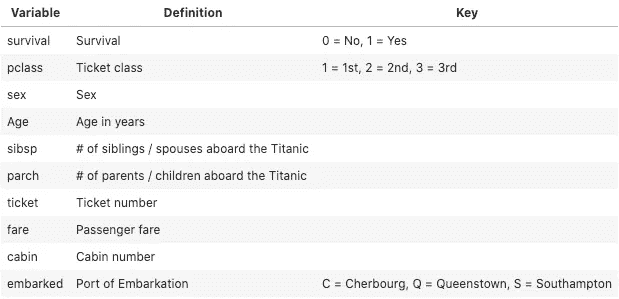
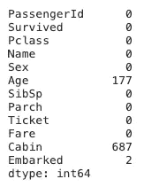
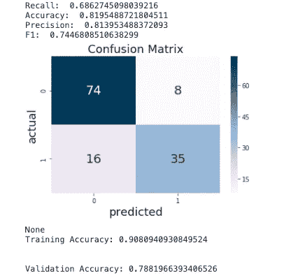
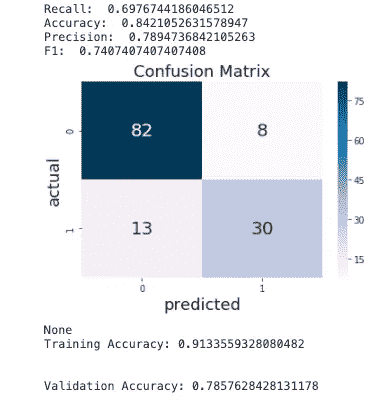
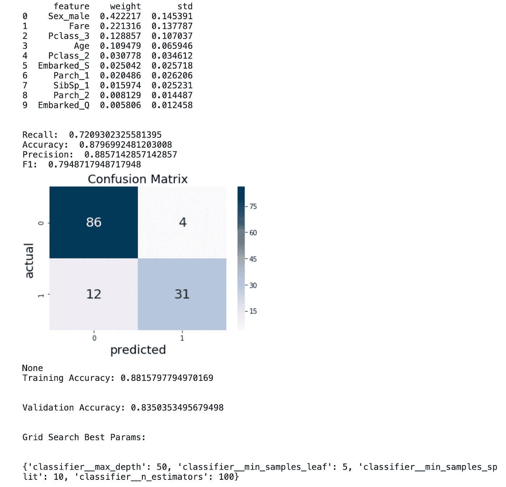
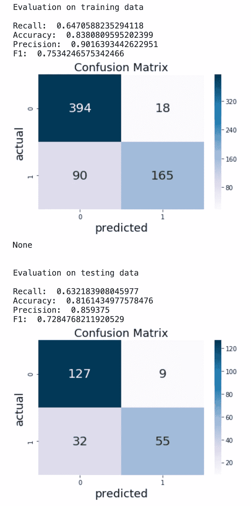

# 使用 Scikit-Learn 的机器学习管道

> 原文：<https://towardsdatascience.com/machine-learning-pipelines-with-scikit-learn-d43c32a6aa52?source=collection_archive---------3----------------------->

## 构建机器学习管道的分步教程


照片由[昆腾·德格拉夫](https://unsplash.com/@quinten149?utm_source=unsplash&utm_medium=referral&utm_content=creditCopyText)在 [Unsplash](https://unsplash.com/s/photos/pipeline?utm_source=unsplash&utm_medium=referral&utm_content=creditCopyText) 拍摄

## 概观

这篇文章将作为一步一步的指南来建立流水线，简化机器学习的工作流程。我将在本教程中使用臭名昭著的泰坦尼克号数据集。数据集是从 [**Kaggle**](https://www.kaggle.com/c/titanic/data) 获得的。目标是预测一个给定的人是否幸存。我将实现各种分类算法，以及网格搜索和交叉验证。该数据集包含每位乘客的记录，由 10 个变量组成(*见下面的数据字典*)。出于本教程的目的，我将只使用`train`数据集，它将被分成训练集、验证集和测试集。



(图片由作者提供)

## 为什么是管道？

机器学习工作流由数据准备的许多步骤组成(例如，处理缺失值、缩放/编码、特征提取)。当第一次学习这个工作流程时，我们一次执行一个步骤的数据准备。这可能会变得很耗时，因为我们需要对训练和测试数据都执行准备步骤。管道允许我们通过编译准备步骤来简化这个过程，同时减轻模型调整和监控的任务。Scikit-Learn 的 Pipeline 类提供了一种结构，用于应用一系列数据转换，然后是一个估计器(Mayo，2017)。有关更详细的概述，请查看 [**文档**](https://scikit-learn.org/stable/modules/generated/sklearn.pipeline.Pipeline.html) 。实现管道有很多好处:

*   **便利性和封装性:**我们只对数据调用一次`fit`和`predict`，以适应整个估计器序列。
*   **联合参数选择:**我们可以对管道中所有估计器的参数进行网格搜索。
*   **交叉验证:**管道有助于避免数据在交叉验证过程中从测试数据泄露到训练好的模型中。这是通过确保使用相同的样本来训练变压器和预测器来实现的。

是时候看看管道的运行了！下面，我将安装并导入必要的库。然后继续加载数据集并处理缺失值。一旦数据准备好了，我将为不同的数据类型创建转换器，并创建一个列转换器来封装预处理步骤。最后，我将编写一个函数来训练一个具有交叉验证的模型，以及一个类似的函数，包括网格搜索交叉验证。

*   **安装 Scikit-Learn**

```
!pip install -U scikit-learn
```

*   **导入必要的库**

```
***# Standard Imports*** import pandas as pd
import seaborn as sns
import numpy as np
import matplotlib.pyplot as plt
import pickle

***# Transformers*
from sklearn.preprocessing** import LabelEncoder, OneHotEncoder, StandardScaler, MinMaxScaler

***# Modeling Evaluation*
from sklearn.model_selection** import train_test_split, cross_val_score, KFold, GridSearchCV
**from sklearn.metrics** import accuracy_score, precision_score, recall_score,f1_score, confusion_matrix, classification_report
**from IPython.display** import display, Markdown
***# Pipelines***
**from sklearn.pipeline** import Pipeline, FeatureUnion
**from sklearn.base** import BaseEstimator, TransformerMixin
**from sklearn.compose** import ColumnTransformer
***# Machine Learning***
**from sklearn.tree** import DecisionTreeClassifier
**from sklearn.ensemble** import RandomForestClassifier
**from** **sklearn.model_selection** **import** KFold
**from** **sklearn.neighbors** **import** KNeighborsClassifier
```

*   **加载数据并查看前 5 行**

```
**df =** pd.read_csv("titanic.csv")
df.head()
```


作者图片

*   **检查缺失值**

```
df.isna().sum()
```



在`Age`列中有 891 个缺失值中的 177 个。出于本管道教程的目的，我将继续用平均年龄填充缺失的`Age`值。在`Cabin`列中有 891 个缺失值中的 687 个。我正在删除这个特性，因为大约 77%的值丢失了。`Embarked`特性只缺少 2 个值，所以我们可以用最常见的值来填充它们。`Name`和`Ticket`功能对每个乘客都有独特的价值，预测分类不需要这些功能，因此也将被删除。

*   **下降特性**

```
df.drop(["Name", "Ticket", "Cabin"], axis=1, inplace=True)
```

*   **填充 na 值为** `**Embarked**` **特征中出现频率最高的值，** `**S**` **。**

```
**df.Embarked =** df.Embarked.fillna(value='S')
```

既然我们已经处理了数据集中的缺失值，我们可以继续定义连续变量和分类变量。

*   **为数据帧中的列定义变量，以执行训练测试分割。**

```
**columns =** ['Pclass', 'Sex', 'SibSp', 'Parch', 'Fare', 'Embarked']**numerical_columns =** ['Age', 'Fare']**categorical_columns =** ["Pclass", "Sex",
                       "SibSp", "Parch", "Embarked"]
```

接下来，我将创建两个函数。第一个函数`cross_validate`将接受一个分类器和 cv(交叉验证器),将训练数据分成训练集和测试集，使分类器适合训练，并对其进行预测。然后，该函数将对保留验证集进行预测，并返回来自训练集和测试集的分数。

管道允许我们在一个步骤中执行预处理(例如标准化、编码、模型拟合)。一个管道可以接受任意数量的预处理步骤，每个步骤都有`.fit()`和`.transform()`方法。下面，我正在创建两个变压器，一个标准的定标器和一个热编码器。两个不同的转换器将用于不同的数据类型。

```
**#Creating** **ss** **transformer to scale the continuous numerical data with** **StandardScaler()****ss =** Pipeline(steps=[('ss', StandardScaler())])--------------------------------------------------------------------**#Creating ohe transformer to encode the categorical data with** **OneHotEncoder()****ohe =** Pipeline(steps=[('ohe', OneHotEncoder(drop='first'))])--------------------------------------------------------------------**#Creating preprocess column transformer to combine the ss and ohe pipelines****preprocess =** ColumnTransformer(
                    transformers=[
                        ('cont', ss, numerical),
                        ('cat', ohe, categorical)
                    ])
```

*   **创建评估函数以绘制混淆矩阵并返回准确度、精确度、召回率和 f1 分数**

```
def evaluation(y, y_hat, title = 'Confusion Matrix'):
    cm = confusion_matrix(y, y_hat)
    precision = precision_score(y, y_hat)
    recall = recall_score(y, y_hat)
    accuracy = accuracy_score(y,y_hat)
    f1 = f1_score(y,y_hat)
    print('Recall: ', recall)
    print('Accuracy: ', accuracy)
    print('Precision: ', precision)
    print('F1: ', f1)
    sns.heatmap(cm,  cmap= 'PuBu', annot=True, fmt='g', annot_kws=    {'size':20})
    plt.xlabel('predicted', fontsize=18)
    plt.ylabel('actual', fontsize=18)
    plt.title(title, fontsize=18)

    plt.show();
```

*   **对数据执行 train _ test _ split**

```
**X =** df.drop(['Survived'], axis=1)
**y =** df.Survived
**y =** LabelEncoder().fit_transform(y)
**X_train, X_test, y_train, y_test =** train_test_split(X, y, random_state=42)
```

## 创建`cross_validate`功能

*   定义带有预处理和分类器管道的完整管道
*   遍历交叉验证器中的每个折叠(默认为 5)
*   将分类器安装在训练装置上，`train_ind`(防止测试装置的数据泄漏)
*   根据训练集进行预测
*   对验证集进行预测
*   打印一份评估报告，其中包含混淆矩阵以及训练集和验证集的平均准确度分数

```
def cross_validate(classifier, cv):
    pipeline = Pipeline(steps=[
        ('preprocess', preprocess),
        ('classifier', classifier)
    ])
    train_acc = []
    test_acc = []
    for train_ind, val_ind in cv.split(X_train, y_train):
        X_t, y_t = X_train.iloc[train_ind], y_train[train_ind]
        pipeline.fit(X_t, y_t)
        y_hat_t = pipeline.predict(X_t) train_acc.append(accuracy_score(y_t, y_hat_t)) X_val, y_val = X_train.iloc[val_ind], y_train[val_ind]
        y_hat_val = pipeline.predict(X_val) test_acc.append(accuracy_score(y_val, y_hat_val))
    print(evaluation(y_val, y_hat_val))
    print('Training Accuracy: {}'.format(np.mean(train_acc)))
    print('\n')
    print('Validation Accuracy: {}'.format(np.mean(test_acc)))
    print('\n')
```

在函数中，我使用交叉验证器来分割训练数据，以便得到一个支持测试集(X_test，y_test)。现在我们可以通过输入想要的分类器和交叉验证器来使用上面的函数。

```
cross_validate(DecisionTreeClassifier(), KFold())
```

输出:



作者图片

*   **用 K 最近邻分类器**

```
cross_validate(KNeighborsClassifier(), KFold())
```

输出:



作者图片

## 网格搜索

假设我们想在管道中找到模型的最佳参数，我们可以创建一个网格搜索管道。要复习网格搜索，请查看 [***文档***](https://scikit-learn.org/stable/modules/grid_search.html) 。我们可以创建一个类似上面的函数来进行交叉验证，但是要稍微修改一下来执行网格搜索。该函数将接收所需的分类器、参数网格和交叉验证器。然后，将通过网格搜索完成与`cross_validate`功能相同的过程。

```
def grid_search(classifier, param_grid, cv):
    search = GridSearchCV(Pipeline(steps=[
        ('preprocess', preprocess),
        ('classifier', classifier)
    ]), param_grid, cv=cv)
    train_acc = []
    test_acc = []
    for train_ind, val_ind in cv.split(X_train, y_train):
        X_t, y_t = X_train.iloc[train_ind], y_train[train_ind]
        search.fit(X_t, y_t)
        y_hat_t = search.predict(X_t) train_acc.append(accuracy_score(y_t, y_hat_t)) X_val, y_val = X_train.iloc[val_ind], y_train[val_ind]
        y_hat_val = search.predict(X_val) test_acc.append(accuracy_score(y_val, y_hat_val))
    print(evaluation(y_val, y_hat_val))
    print('Training Accuracy: {}'.format(np.mean(train_acc)))
    print('\n')
    print('Validation Accuracy: {}'.format(np.mean(test_acc)))
    print('\n')
    print('Grid Search Best Params:')
    print('\n')
    print(search.best_params_)
```

*   **GridSearchCV 与随机森林**

为管道中的模型创建参数网格时，需要将模型名称附加到每个参数上。在下面的代码块中，我添加了`'classifier__'`来匹配管道中模型的名称(在管道中命名为模型‘classifier’)。

```
**#Creating parameter grid for Random Forest** rand_forest_parms = {'classifier__n_estimators': [100, 300, 500],
                     'classifier__max_depth':[6, 25, 50, 70],
                     'classifier__min_samples_split': [2, 5, 10],
                     'classifier__min_samples_leaf': [1, 2, 10]}**#Calling the grid_search function using the parameters above** grid_search(RandomForestClassifier(), rand_forest_parms)
```

输出:


在模型训练期间，重要的是执行特征选择，以确保模型具有最强的预测能力，并确保我们的模型不会太复杂。我们可以使用`eli5`库来检查管道中分类器的特征重要性。为此，我们需要创建一个包含数字特征列和编码列的列表。然后，用网格搜索管道的`best_estimator_`和它的`named_steps`调用`eli5.explain_weights_df`。当然，我们可以将它添加到我们的网格搜索函数中，通过修改该函数来接受一个将打印出这些特性的布尔值，从而返回前十个特性的重要性。

## 具有特征重要性的网格搜索功能

*   **在下面的函数中包含特性重要性的修改以粗体显示。**

```
def grid_search(classifier, param_grid, cv, ***print_feat=False***):
    cv = cv
    search = GridSearchCV(Pipeline(steps=[
        ('preprocess', preprocess),
        ('classifier', classifier)
    ]), param_grid, cv=cv)
    train_acc = []
    test_acc = []
    for train_ind, val_ind in cv.split(X_train, y_train):
        X_t, y_t = X_train.iloc[train_ind], y_train[train_ind]
        search.fit(X_t, y_t)
        y_hat_t = search.predict(X_t) train_acc.append(accuracy_score(y_t, y_hat_t)) X_val, y_val = X_train.iloc[val_ind], y_train[val_ind]
        y_hat_val = search.predict(X_val) test_acc.append(accuracy_score(y_val, y_hat_val))
    ***if print_feat:
        ohe_cols = list(search.best_estimator_.named_steps['preprocess'].named_transformers_['cat'].named_steps['ohe'].get_feature_names(
        input_features=categorical))
        num_feats = list(numerical)
        num_feats.extend(ohe_cols)
        feat_imp = eli5.explain_weights_df(search.best_estimator_.named_steps['classifier'], top=10, feature_names=num_feats)
        print(feat_imp)***
    print('\n')
    print(evaluation(y_val, y_hat_val))
    print('Training Accuracy: {}'.format(np.mean(train_acc)))
    print('\n')
    print('Validation Accuracy: {}'.format(np.mean(test_acc)))
    print('\n')
    print('Grid Search Best Params:')
    print('\n')
    print(search.best_params_)
```

*   **执行网格搜索并返回前十个重要特征及其权重**

```
grid_search(RandomForestClassifier(), rand_forest_parms, KFold(), print_feat=True)
```

输出:



假设网格搜索管道中的随机森林分类器表现最好。下一步将是观察经过训练的模型在坚持测试数据上的表现。我们需要做的就是用 GridSearchCV 创建一个最终的管道，并使其适合整个 X_train 和 y_train。然后，在 X_test 上预测。

*   **将最终管线拟合到** `**X_train**` **和** `**y_train**` **，并预测到** `**X_test**`

```
final_pipeline = GridSearchCV(Pipeline(steps=[
        ('preprocess', preprocess),
        ('classifier', RandomForestClassifier())
    ]), rand_forest_parms, cv=KFold())**#Fit and predict on train data**final_pipeline.fit(X_train, y_train)
train_pred = final_pipeline.best_estimator_.predict(X_train)
print('Evaluation on training data \n')
print(evaluation(y_train, train_pred))
print('\n')**#Predict on test data**test_pred = final_pipeline.best_estimator_.predict(X_test)
print('Evaluation on testing data \n')
print(evaluation(y_test, test_pred))
```

输出:



作者图片

## 结论

管道封装了我们的预处理步骤和模型，使机器学习工作流程变得更加容易。如果需要，我们可以在管道中拟合模型之前应用多个预处理步骤。对我来说，主要的好处是能够回到一个项目，并遵循我用管道设置的工作流程。在我了解管道之前，这个过程需要几个小时。我希望本教程能够成为学习管道工作流的有用资源。

## 资源

*   *使用 Scikit-learn 管道管理机器学习工作流第 1 部分:简介。(未注明)。检索自*[*https://www . kdnugges . com/2017/12/managing-machine-learning-workflows-sci kit-learn-pipelines-part-1 . html*](https://www.kdnuggets.com/2017/12/managing-machine-learning-workflows-scikit-learn-pipelines-part-1.html)
*   *柯恩，S. (2019 年 08 月 09 日)。构建机器学习管道。检索自*[*https://towards data science . com/architecting-a-machine-learning-pipeline-a 847 f 094 D1 c 7*](/architecting-a-machine-learning-pipeline-a847f094d1c7)
*   *sk learn . pipeline . pipeline .(n . d .)。检索自*[*https://scikit-learn . org/stable/modules/generated/sk learn . pipeline . pipeline . html*](https://scikit-learn.org/stable/modules/generated/sklearn.pipeline.Pipeline.html)
*   *M，S. (2019 年 12 月 13 日)。机器学习中的流水线是什么？如何创建一个？检索自*[*https://medium . com/analytics-vid hya/what-A-pipeline-in-machine-learning-how-to-create-one-BDA 91d 0 ce ACA #:~:text = A*](https://medium.com/analytics-vidhya/what-is-a-pipeline-in-machine-learning-how-to-create-one-bda91d0ceaca#:~:text=A)*机器学习管道用于帮助机器学习工作流程自动化。&text =机器学习(ML)流水线组成，并实现一个成功的算法。*
*   *泰坦尼克号:机器从灾难中学习。(未注明)。检索自*[*https://www.kaggle.com/c/titanic/data*](https://www.kaggle.com/c/titanic/data)
*   *3.2。调整估计器的超参数。(未注明)。检索自*[*https://scikit-learn.org/stable/modules/grid_search.html*](https://scikit-learn.org/stable/modules/grid_search.html)
*   *概述。(未注明)。检索自【https://eli5.readthedocs.io/en/latest/overview.html】[](https://eli5.readthedocs.io/en/latest/overview.html)*