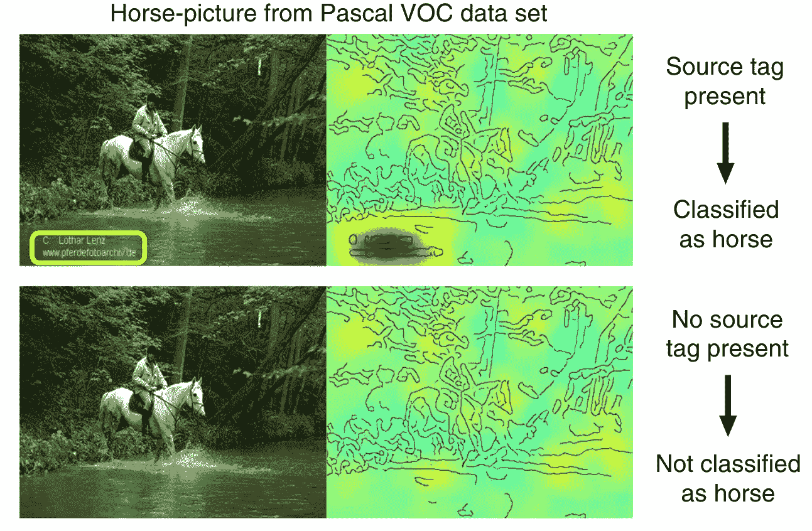
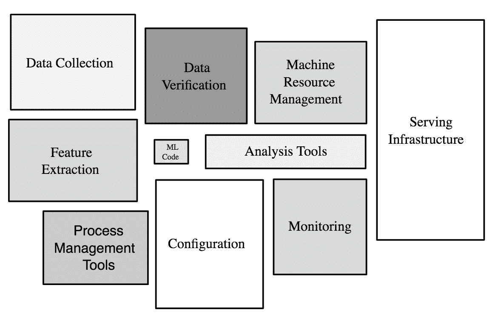

# 机器学习陷阱

> 原文：<https://towardsdatascience.com/machine-learning-pitfalls-e54ac3edc25?source=collection_archive---------23----------------------->

## 你的 ML 项目有多强就有多弱

Jelleke Vanooteghem 在 [Unsplash](https://unsplash.com/s/photos/oops?utm_source=unsplash&utm_medium=referral&utm_content=creditCopyText) 上拍摄的照片。

机器学习(ML)系统是复杂的，系统越复杂，故障模式就越多。知道什么会出错对于构建健壮的 ML 系统是至关重要的。我们将一起使用具体的例子来探索在 5 个不同的成熟度级别上可能出现的陷阱。

0 级—问题定义【T11 级—你的第一个 ML 模型
2 级—泛化
3 级—系统级性能
4 级— *性能*不是 o *输出结果*

这篇文章的最后一部分将讨论如何避免这些陷阱。专注于避免陷阱比从你的模型中榨取每一点准确性更好。

> “值得注意的是，像我们这样的人通过努力保持不愚蠢，而不是努力变得非常聪明，获得了多少长期优势。”
> 
> —查理·芒格

# 0 级问题定义

现实世界的问题很少表现为易处理的数据科学问题。因此，对于任何 ML 项目来说，第一步都是制定问题，换句话说，就是将一个高层次的目标转化为一个定义良好的数据科学问题。

在这个层次上最大的威胁是提出一个问题定义，当它被解决时，实际上对任何人都没有帮助。这篇文章中有两个例子:

> 1)大多数将深度学习应用于超声心动图分析的研究试图超越医生预测疾病的能力。但是，预测正常的心脏功能实际上会通过识别不需要他们专业知识的患者来节省心脏病专家的更多时间。
> 
> 2)许多将机器学习应用于葡萄栽培的研究旨在优化葡萄产量，但酿酒师“想要合适的糖和酸水平，而不仅仅是大量大而含水的浆果”。

# 第一级你的第一个 ML 模型

这一关是让一个 ML 模型在你的笔记本电脑上的测试集上工作。这不是一件容易的事情，但是大部分的内容已经集中在这一点上，因此我将只提到一个陷阱:

## 陷阱 1.1 假设更多的数据可以解决所有的问题

不相关的要素或低质量的数据会降低您可以达到的上限性能，这无法通过更多的数据来解决。

由于模型容量低而导致的拟合不足是另一个更多数据没有帮助的情况。

# 二级概括

这就是有趣的地方。假设您有一个模型，它在您的测试集上运行得非常好，但是在使用外部数据集进行测试时，它的性能会急剧下降。以下陷阱或许可以解释其中的原因:

## 陷阱 2.1 虚假关联

如果数据集包含与标注相关的信号(即噪声)之外的任何内容，您的模型将学习利用它进行预测。

在下面的例子中，神经网络将图像分类为“马”在看文本，而不是马。一旦文字被删除，图像就不会被归类为“马”。

Lapuschkin 等人的图片来自[揭露聪明的 Hans 预测器并评估机器真正学习什么](https://www.nature.com/articles/s41467-019-08987-4)。

## 陷阱 2.2 非代表性数据集

你用来训练你的 ML 模型的*样本*应该代表你计划使用它的*人群*。

假设您正在基于光散射数据构建一个粒子大小预测器，并且您只使用球形粒子对其进行了训练。如果在实践中人们也将它用于非球形粒子，模型性能将显著下降。

## 缺陷 2.3 测试和用例之间的数据不匹配

ImageNet 是一个包含数百万张图片和数千个类的数据库。年复一年，研究人员在 ImageNet challenge 上开发了性能更好的模型，这导致一些人说“视觉是一个已解决的问题”。

然而，当在 ObjectNet 上测试时，这些算法的性能下降了大约 40%。原因是 [ObjectNet](https://objectnet.dev/) 有适当的控制，对象在所有可能的旋转背景和视点。这是 ImageNet 所缺乏的。看一下[样本数据集](https://objectnet.dev/images/objectnet_controls_table.png)以了解差异。

## 隐患 2.4 列车测试泄漏

假设你正在从断层图像中检测某种疾病。您可能会有多个属于同一个患者的图像。如果您将所有图像随机分为训练集和测试集，来自同一患者的一些图像可能会进入训练集，而其他图像可能会进入测试集。在这种情况下，在训练集上训练的模型在测试集上可能具有高性能，因为您的模型识别患者，而不是疾病。

## 陷阱 2.5 随时间改变数据生成分布

数据生成过程会随时间而变化。10 年前的手机摄像头和今天大不一样。因此，如果一个模型是使用 10 年前的手机图像数据集开发的，但在今天测试，性能可能会有所不同。

> 大多数统计和机器学习算法都假设数据是从平稳分布中抽取的随机样本。不幸的是，今天大多数可用于挖掘的大型数据库违背了这一假设。它们是在几个月或几年内收集的，在此期间，产生它们的基本过程发生了变化，有时是彻底的变化。[来源](https://dl.acm.org/doi/10.1145/502512.502529)。

# 3 级系统级性能

我们开发机器学习*模型*，但它们通常作为另一个*系统*的一部分投入使用。因此，仅仅验证您的模型是不够的，您还应该验证您的系统。这一级别的陷阱是由于没有系统方法而产生的。

## 缺陷 3.1 错误输入

如果输入被破坏，完美的模型将产生错误的预测。导致两架 737 Max 飞机相隔五个月坠毁的防失速软件(MCAS)依靠单一传感器进行输入。一个传感器的故障导致 346 人死亡。

> 它没有冗余:它一次只从一个 AoA 传感器获取输入。这使得 MCAS 完全无法应对传感器故障。如果原始来源发生故障，它无法根据第二个传感器对其数据进行“健全检查”或切换到备份。**它只是相信给它的任何数据**，**，即使那些数据是坏的**，这就是发生在狮航 610 航班和埃塞俄比亚航空 302 航班上的事情。[来源](https://www.theverge.com/2019/5/2/18518176/boeing-737-max-crash-problems-human-error-mcas-faa)。

## 缺陷 3.2 没有为失败做准备

继续波音公司的例子，MCAS 系统并不是直接覆盖，飞行员也没有接受过适当的培训。

> 这个系统的存在，潜伏在 Max 的软件套件中的某个地方，是足够令人震惊的。更可怕的是，波音公司只向航空公司和飞行员提供了最低限度的信息。公告没有给出系统的名称，也没有解释它在正常操作中的作用。它只是说，有时它会出现故障，这可能会使你的飞机坠毁。
> 
> “这有点像，'**好吧，飞行员，祝你好运，想出办法，【T13]'”Einsetler 说。[来源](https://www.theverge.com/2019/5/2/18518176/boeing-737-max-crash-problems-human-error-mcas-faa)。**

## 缺陷 3.3 对系统其他部分的不利影响

最近，特斯拉 autopilot 在驾驶员专注度方面获得了一个低分:

> “不幸的是，有些驾车者认为他们今天可以购买一辆无人驾驶汽车。这是一种危险的误解，认为太多的控制权交给了没有准备好应对所有情况的车辆，”Thatcham Research 的欧洲 NCAP 董事会成员兼研究主管马修·艾弗里说。[来源](https://europe.autonews.com/automakers/tesla-autopilot-gets-low-score-driver-focus-european-safety-rating)

这种错误的安全感可能会降低驾驶员的表现，导致撞车:

 [## 一家联邦机构表示，对特斯拉自动驾驶仪的过度依赖导致了一起致命事故

### 揭示和解释我们的数字世界是如何改变的，以及如何改变我们。国家运输安全委员会…

www.vox.com](https://www.vox.com/2017/9/12/16294510/fatal-tesla-crash-self-driving-elon-musk-autopilot) 

# 四级*表现*不欧 *utcome*

[表现不是结果。](https://lukeoakdenrayner.wordpress.com/2019/01/21/medical-ai-safety-doing-it-wrong/)采用在问题定义期间设定的指标并不能保证达到预期的结果。

## 隐患 4.1 隐藏分层

一个具有高整体性能的癌症检测模型可能会持续遗漏一种罕见的癌症亚型，这被称为[隐藏分层](https://arxiv.org/abs/1909.12475)问题。整体绩效隐藏了小组绩效的可变性。

## 陷阱 4.2 人口统计偏见

作用于人类数据的机器学习模型容易受到人口统计学偏见的影响。亚马逊意识到他们的人工智能招聘工具对女性有偏见，即使性别没有在简历上明确标出。

 [## 据报道，亚马逊废除了歧视女性的内部人工智能招聘工具

### 即使对于亚马逊这样在人工智能方面有丰富经验的公司，机器学习的偏见也可能是一个问题。根据…

www.theverge.com](https://www.theverge.com/2018/10/10/17958784/ai-recruiting-tool-bias-amazon-report) 

## 陷阱 4.3 违反法规

一个技术上完美的模型，如果违反了规定，可能就没用了。

 [## 在加利福尼亚州，在设定汽车保险费率时不再考虑性别(2019 年发布)

### 加州本月加入了六个州的行列，禁止在评估风险时使用个人性别…

www.nytimes.com](https://www.nytimes.com/2019/01/18/your-money/car-insurance-gender-california.html) 

## 但最重要的是:你想这样做吗？

即使你建立了一个技术上完美的 ML 系统并产生了预期的商业结果，你对它的存在感到高兴吗？

[这是网飞(2015)](https://dl.acm.org/doi/10.1145/2843948) 的一篇很棒的论文，解释了他们的推荐系统以及商业成果。他们估计该系统每年为他们节省 10 亿美元。

但是你真的想造一个和睡眠竞争的让人上瘾的数码产品吗？你可能会，也可能不会，关键是要在构建它之前考虑它，而不是在事后考虑。

 [## 网飞首席执行官雷德·哈斯汀斯:睡眠是我们的竞争

### 网飞已经成为了疯狂观看的代名词——一整季疯狂观看陌生事物的行为

www.fastcompany.com](https://www.fastcompany.com/40491939/netflix-ceo-reed-hastings-sleep-is-our-competition) 

以 YOLO 物体检测算法闻名的 Redmon 在今年早些时候发表了以下声明:

# 解决方案？

以下是我在 Ipsumio 日常工作中使用的一些技巧。

## 提示 0:如果没有必要，不要使用 ML

我多次被要求用 ML 解决不需要 ML 的问题。如果没有必要，你可以通过不使用机器学习来避免上述所有挑战。

同样，如果一个有 3 个参数的 ML 模型解决了问题，不要使用有数千个参数的神经网络。

## 技巧 1:迭代地构建项目

而不是完善项目阶段，线性推进，反反复复。尽快部署概念证明，然后重新开始。

## 技巧 2:让领域专家参与进来

这是必须的。几乎项目的所有阶段都需要领域知识。如果不是:

## 技巧 3:让软件专家参与进来

将一个 ML 模型转变成一个系统并不简单。你的模型代码只是整个系统的一小部分。

ML 代码只是现实生产 ML 系统的一小部分。来自[机器学习速成班。](https://developers.google.com/machine-learning/crash-course/production-ml-systems)

## 技巧 4:跨专业交流

我参与了一个关于识别从皮肤损伤处收集的某些细胞的研究项目(赞克试验)。作为数据科学家，我阅读了几十篇关于赞克测试的研究论文和两本书。除此之外，我给了项目中的皮肤科医生一个关于 ML 的短期培训。这有助于我们在项目的所有阶段相互理解，从问题定义到结果解释。

 [## TzanckNet:一个卷积神经网络，用于识别细胞学中的细胞…

### 赞克涂片试验是一种低成本、快速和可靠的工具，可用于许多疾病的诊断

www.nature.com](https://www.nature.com/articles/s41598-020-75546-z) 

## 技巧 5:考虑可解释性和可解释性

对于某些应用程序，高性能本身就足够了，但是当风险很高时，可解释性和可解释性就变得不可或缺了。

在[的播客](https://gcppodcast.com/post/episode-238-asml-with-arnaud-hubaux/)中，Arnaud Hubaux 解释了他们是如何在 ASML 将物理学和 ML 结合起来的。他提到他们的客户看重因果关系多于相关性。在没有解释的情况下，他们不关心准确性的提高。因此，他们将物理定律用于特征工程和解释输出。

医疗保健是黑盒解决方案产生问题的另一个领域。例如，这条推文围绕这个问题引发了一场激烈的辩论:

## 技巧 6:错误分析

一个简单但有效的提示。看看你所有的错误，看看有没有系统性的错误。假设您正在开发一个汽车分类器，并意识到所有的假阴性都属于被物体遮挡的汽车。您可以注明“模型在遮挡情况下无法工作”,也可以增加训练数据中被遮挡的汽车图像，并尝试解决该问题。

## 技巧 7:用外部数据集测试模型

如果您使用来自一家医院的数据集开发模型，请考虑使用外部数据集按以下顺序测试您的模型:来自同一家医院的预期数据，来自同一医疗保健系统中不同医院的数据，来自不同医疗保健系统中不同医院的数据…

## 技巧 8:测试系统

仅仅测试模型是不够的，要把它作为一个系统来测试，看看它将如何与系统的其他部分及其环境发生反应。

## 技巧 9:检查子组性能

在标记数据的过程中，也让领域专家定义和注释子集。然后在这些子集中分析您的模型性能。

## 技巧 10:仔细创建数据集

查明

*   你要找的信号在数据里面
*   它是人口的代表
*   如果你正在生成数据集，模拟现实，而不是创建一个完美的数据集。(例如，如果实际使用低分辨率显微镜，不要用昂贵的显微镜创建数据集)。

## 技巧 11:利用 MLOps

随着我们开始看到更多的生产 ML，部署和维护这些系统吸引了更多的注意力。在您的工作流程中使用 MLOps 原则。

 [## 机器学习系统中隐藏的技术债务

### 机器学习为快速构建有用的复杂预测系统提供了一个非常强大的工具包。这个…

dl.acm.org](https://dl.acm.org/doi/10.5555/2969442.2969519) 

# 关键要点:

*   成功的机器学习项目需要的不仅仅是回溯测试集上的高性能模型。
*   因此，不要关注模型性能的增量收益，而要关注预防、检测和修复所有成熟度级别的缺陷。

> “我只想知道我会死在哪里，所以我永远不会去那里。”—查理·芒格