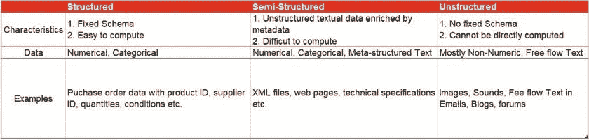
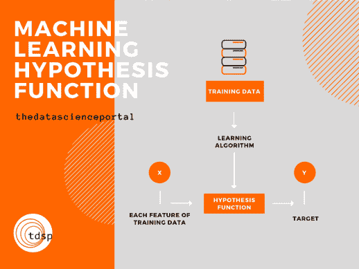
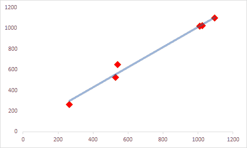
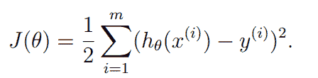

# 机器学习过程

> 原文：<https://towardsdatascience.com/machine-learning-process-7beab5c4f31b?source=collection_archive---------27----------------------->

艾萨克·史密斯在 [Unsplash](https://unsplash.com?utm_source=medium&utm_medium=referral) 上拍摄的照片

## 尽管有许多机器学习算法，每一个都有不同的方法，但有一个通用的程序可以用来解决任何机器学习问题。在本文中，我们将了解所有这些是如何发生的。

如果你想在此之前获得机器学习的一般介绍，请查看这篇文章:

 [## 那么什么是机器学习呢？

### 我相信到现在为止，你一定听说过这个术语，如果不出所料的话，只要看看…的演讲就知道了

thedatascienceportal.com](https://thedatascienceportal.com/so-what-is-machine-learning/) 

既然我们理解了什么是机器学习，那么现在让我们来学习如何应用机器学习来解决任何问题。

这是用于将机器学习应用于任何问题的基本过程

# 数据采集

解决任何机器学习问题的第一步是收集相关数据。它可能来自不同的来源，并采用不同的格式，如纯文本、分类或数字。数据收集很重要，因为这一步的结果直接影响我们问题的性质。

在大多数情况下，数据并不是放在现成的银盘上交给我们的，也就是说，通常情况下，我们认为相关的数据可能不会马上可用。我们很有可能必须进行某种练习或受控实验来收集我们可以使用的数据。我们还必须记住，我们正在收集的数据来自合法的程序，因此所有相关方都非常清楚正在收集的内容。

为了本文的目的，让我们假设我们已经收集了关于汽车的数据，并且我们正在尝试在机器学习的帮助下预测一辆新车的价格。

# 数据预处理

既然我们已经收集了与手头问题相关的数据，我们必须让它进入*同质*状态。我们的数据的当前形式可以包括各种类型的数据集，可能是由一千行和多列汽车数据组成的表格，或者可能是不同角度的汽车照片。保持事情简单并处理一种特定类型的数据总是明智的，也就是说，如果我们感觉有点太冒险，我们应该在开始处理我们的算法之前决定我们是要处理图像数据、文本数据还是视频数据！

*数据类型。*作者照片。

像每个计算机程序一样，机器学习算法也只理解 1 和 0。因此，为了运行任何这样的算法，我们必须首先将数据转换成机器可读的格式。如果我们把我们的照片放在幻灯片上，它根本不会理解！我们可以使用任何类型的数据——数字、图像、视频或文本——但我们必须对其进行配置，使其能够被机器理解。我们通过对数据进行*编码*来确保这一点——在这个过程中，我们将所有类型的数据用数字表示出来。

有关数据预处理和所有相关步骤的简单易懂的介绍，请查阅本文:

 [## 数据预处理

### 标签:当我们谈论数据时，我们通常会想到一些包含大量行和列的大型数据集。而那个…

thedatascienceportal.com](https://thedatascienceportal.com/data-preprocessing/) 

# 训练和测试数据

在我们开始构建机器学习模型之前，我们必须首先确定我们的*特征*，并决定我们的*目标*。**特性**是数据的属性，告诉我们数据中不同的实体。例如，我们可能有一个关于汽车的庞大数据集，使用机器学习来预测新车的价格。由于这些汽车是实体，在这种情况下，特征可能是发动机功率、里程、最高速度、颜色、座位容量、汽车类型等。等等..在这种情况下，*目标*或**目标**变量将是汽车的价格。

当我们处理任何机器学习问题时，我们总是将我们拥有的数据集分成**训练集**和**测试集**，通常分别是(70/30)或(80/20)分割。训练集，顾名思义，是用来训练模型的。当我们“训练”模型时，它试图理解数据集的所有特征如何形成目标变量——在监督学习的情况下，或者所有特征之间的关系和相关性——在非监督学习的情况下。在此之后，测试集将用于找出模型对数据的理解程度。

# 机器学习算法选择

在转换数据，使其变得清晰和可行之后，我们会对解决问题的方法有更好的想法，并尝试实现它。这是因为实际上是数据决定了我们能使用什么，不能使用什么。

比如说我们想造一个聊天机器人。聊天机器人将按照用户的询问进行回答。因此，我们可以说，任何对话的第一步都将是聊天机器人试图识别用户的意图，这是我们的第一个机器学习问题——意图分类。

这个问题要求我们使用一种特殊类型的数据——基于文本的数据。我们选择的机器学习算法一定是一种[分类](https://thedatascienceportal.com/so-what-is-machine-learning/)算法，即它根据已经看到的数据，将新输入的数据分类到某个标签类。当然，在这一步之前，来自用户的文本将被编码并经过所有必要的数据预处理步骤，然后将被输入到机器学习算法中。尽管我们必须小心选择我们的机器学习算法，但在选择最终的算法之前，探索所有可用的选项并使用各种合适的机器学习算法是很好的——无论如何，这都被认为是最佳实践。

# 价值函数

简而言之，成本函数是一个数学函数，它给出成本的度量；正如你可能已经听说的那样，我们做出的每一个决定都是有代价的。

> *“成本函数或损失函数是将一个事件或一个或多个变量的值映射到一个实数上的函数，该实数直观地表示与该事件相关的一些“成本”——*[*百科*](https://en.wikipedia.org/wiki/Loss_function)

该功能用于量化任何程序中每一步对应的*惩罚*。**就优化问题而言，我们必须致力于最小化该成本值。**

让我们来看一个例子——
假设你正在爬下一个悬崖。在任何时候，你都有几条路可以走，但你会:

*   从该点寻找最佳路径
*   拒绝所有让你超越自我的道路

如果我们将上涨与*惩罚*或*成本*联系起来，那么如果上涨，我们将增加总成本(就时间和精力而言)。因此，如果我们要设计一个数学函数来量化这个*成本*指标，我们可以潜在地将时间和精力作为因素。

另一个例子-
假设你开车从 A 地到 B 地，同样，我们有多条路径到达 B 地，但是我们:

*   寻找最短的路径
*   拒绝所有带我们去其他地方的路(很明显！)

如果我们把这种情况与*成本*联系起来，如果我们忽略了上面提到的两点，我们将会有很高的成本。在这里，我们可以将时间和油钱作为组成成本函数的因素，并判断此后采取的路径。

照片由[维达尔·诺德里-马西森](https://unsplash.com/@vidarnm?utm_source=medium&utm_medium=referral)在 [Unsplash](https://unsplash.com?utm_source=medium&utm_medium=referral) 拍摄

## 机器学习中的代价函数

任何机器学习算法都必须达到一个*最优状态*才能正常运行。成本函数帮助我们确定我们的模型是否处于最佳状态。通过不断比较*模型假设值*和*训练集*中的原始值，模型找出最佳状态。哇…退后！什么！？
别担心，我们会仔细研究所有概念！

**假设功能**

任何机器学习模型的背后本质上都是一个数学函数，它解释了数据中各种特征的作用，以形成目标变量或形成不同特征之间的相关性。

假设函数。作者照片。

如前所述，在训练期间，机器学习模型试图理解训练数据*特征*的值的不同组合如何形成相应的目标变量。为了更好地理解，让我们以一个培训记录为例，培训本质上意味着获取该记录的所有特征，并以某种方式将其映射到该培训记录的目标值。一个很好的例子就是我们之前讨论的汽车数据集。符号方面，特征取为 X，目标变量取为 y。
在此过程中，训练数据被输入到学习算法中，该算法是根据我们试图解决的问题选择的。这可能是一个分类问题，一个回归问题，或者完全是别的什么问题。输出这个*假设函数*是这个学习算法的工作。

*假设函数。来源:* [*CS229 吴恩达讲稿*](http://cs229.stanford.edu/notes/cs229-notes1.pdf)

对于一个两变量的问题，这可能是我们的假设函数。所有θ值都是参数或权重，选择这些参数或权重是为了使我们获得最接近每条记录的相应目标值的估计值。

然后，假设函数从每个训练记录中获取特征，并尝试估计相应的目标值。这个函数可以是简单的线性函数，也可以是复杂的函数，这取决于数据和所用的算法类型。并且因为它是一个估计函数，所以输出值不期望与目标值完全相等，至少在第一次尝试中不期望。
让我们再次使用汽车数据集，如果我们在这个数据集上使用一个学习算法，并尝试使用这些功能来训练它，我们将获得数据集中每辆汽车的价格估计值。由于这是一个训练数据集，我们已经将每辆车的价格作为目标变量。

*假设趋势线的估计值用蓝色切割接近目标值用红色。作者照片。*

**成本函数**

这就是成本函数发挥作用的地方。我们希望训练数据中的估计值和实际目标值之间的差异尽可能低，只有这样，我们才能说我们的模型是一个强模型，这意味着它将给出正确的目标值，或者至少返回一个非常非常接近特定训练记录的目标值的值。
所以，这就变成了一个*最小化*的问题。区别就是所谓的成本，而最小化函数就是所谓的成本函数。有几种方法可以达到极小的状态。我们可以简单地最小化整个训练集上的估计值和目标值之间的差异，或者我们可以采用平方差，或者其他一些变化来实现相同的事情。最广为接受且相当合理的成本函数之一是这样一个函数，如果你正在研究机器学习算法，你会很容易发现它:

*成本函数。来源:* [*CS229 吴恩达讲稿*](http://cs229.stanford.edu/notes/cs229-notes1.pdf)

这个函数适用于大多数回归问题。是的，我知道，我知道我说过我会保持简单，不会用奇怪的方程式吓到你。别担心，如果你这么正式，我们不会用公式或公式填满一块巨大的黑板。我给你简单解释一下，把一切都说得清清楚楚。

J(θ) —成本函数符号
m —训练记录数
hθ —假设函数
x(ᶦ)- iᵗʰ训练数据记录
hθ(x(ᶦ)——iᵗʰ训练记录的假设函数值
y(ᶦ)- iᵗʰ目标值

*   正如我之前提到的，我们将成本定义为假设函数值和目标值之间的差值
*   我们必须最终将我们从每个训练记录中得到的所有平方差相加，以得到整个训练数据的总成本
*   我们对每种情况下的差值进行平方，这有两个显著的优点
*   假设函数的估计值和目标值之间的差异可能是负的，对其求平方消除了我们降低总成本值的可能性，同时对我们从每个训练记录中获得的差异求和，仅仅因为其中一些是负的。
    |请注意，我们也可以采用绝对值，但这导致了一个问题——绝对值函数比平方函数更难进行数学分析——如果您需要进一步的解释，请在评论中告诉我——基本上，绝对值函数在所有点上都是不可微的，这是找到成本函数处于最小值的点所必需的|
*   平方也更加强调较大的差异，因为这些差异的影响也是平方的。因此，这些较大差异的贡献增加并突出。
*   通过在θ值上对函数求微分来执行最小化将移除公式中存在的 1/2

# 机器学习模型

如上面的假设趋势线图所示，最小化成本函数的主要目标是获得一条覆盖大部分目标值的直线趋势线，或者至少尽可能接近这些点。这就是为什么我们计算差异，并编写一个成本函数来减少它们。

而且这不是一次性的过程，更多的是一个迭代的过程，在这个过程中我们为假设函数选择我们的参数，计算估计值，然后用代价函数找出代价。之后，我们最小化这个成本，并再次执行整个活动。通过这种方式，我们重新进行整个计算，以达到我们认为具有最佳功能的点。我们可以随时检查当前结果的状态，只需对照目标值绘制函数。
然而，这整个迭代过程是当今所有优化算法的核心，因此您不必重复执行这一活动。最流行的一种，你可能听说过，是梯度下降。

 [## 梯度下降:机器学习最流行的算法之一介绍

### 梯度下降是迄今为止在机器学习和深度学习中使用的最流行的优化策略

builtin.com](https://builtin.com/data-science/gradient-descent) 

当我们确实有一个假设函数，它的估计值最接近目标值时，我们可以采用这个函数，并声称它是以尽可能好的方式*拟合*数据的函数。这就是我们的模型！

在这篇文章中，我想写的是解决任何机器学习问题和建立机器学习模型时遵循的一般过程。这更多的是一个理论上的解释，但我有更多的技术指南。

我希望你喜欢这篇文章。如果你对内容有任何疑问，请在评论中告诉我！
感谢阅读！

*原载于 2020 年 8 月 7 日【https://thedatascienceportal.com】**。更多此类内容请访问数据科学门户网站。***

* [## 数据科学门户

### 大家好，欢迎来到数据科学门户。这个空间致力于学习和理解所有令人兴奋的…

thedatascienceportal.com](https://thedatascienceportal.com/)*