# 针对类别不平衡的机器学习重采样技术

> 原文：<https://towardsdatascience.com/machine-learning-resampling-techniques-for-class-imbalances-30cbe2415867?source=collection_archive---------11----------------------->

## 如何为一个更好的预测模型期待意想不到的事情


让我们面对现实吧。不平等糟透了。我甚至还没有谈到这样一个事实:尽管非洲裔美国人和西班牙裔美国人占美国总人口的 32%，但他们却占美国监狱人口的 56%；也没有提到 T2 比尔·盖茨、杰夫·贝索斯和沃伦·巴菲特的财富总和比美国最底层的 50%的人的财富总和还要多。

尽管我很想对这些事实感到愤怒，但现在我谈论的是机器学习分类模型背景下的阶级不平衡。根据维基百科的说法，[算法偏差](https://en.wikipedia.org/wiki/Algorithmic_bias)“可能由于许多因素而出现，包括但不限于算法的设计，或者与数据编码、收集、选择或用于训练算法的方式有关的无意或意外使用或决策。”使用高度不平衡的数据训练模型可能会偏向多数类，这可能会产生严重的影响。

以 Kaggle 的宫颈癌风险分类数据集为例。

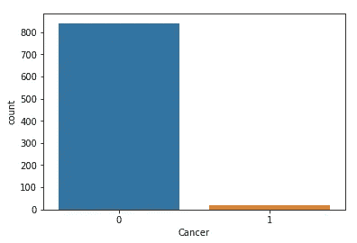

在数据集中包含的所有诊断中，只有 2%被发现是癌症。在执行简单的随机森林分类模型后，该模型的准确率为 99%！

```
from sklearn.ensemble import RandomForestClassifier
from sklearn.metrics import accuracy_score, recall_score, classification_report
from sklearn.model_selection import train_test_splitX = df.drop('Cancer', axis=1).dropna()
y = df['Cancer'].dropna()X_train, X_test, y_train, y_test = train_test_split(X, y, test_size = 0.25)random_forest = RandomForestClassifier(n_estimators=500).fit(X_train, y_train)
y_pred = random_forest.predict(X_test)
print('Accuracy score: ' + str(accuracy_score(y_test, y_pred)))
print('Recall score: ' + str(recall_score(y_test, y_pred)))
print(classification_report(y_test, y_pred))
```

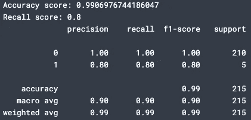

那不太可能。让我们再深入一点。让我们在模型中只包括 36 列中的两列。

```
X = df.loc[:,['Smokes', 'Hormonal Contraceptives']]
y = df['Cancer'].dropna()X_train, X_test, y_train, y_test = train_test_split(X, y, test_size = 0.25)
random_forest = RandomForestClassifier(n_estimators=500).fit(X_train, y_train)
y_pred = random_forest.predict(X_test)
print('Accuracy score: ' + str(accuracy_score(y_test, y_pred)))
print('Recall score: ' + str(recall_score(y_test, y_pred)))
print(classification_report(y_test, y_pred))
```

但是准确率只降到了 97%！我们随机选择的两个特征能够以 97%的准确率预测癌症的可能性非常小。

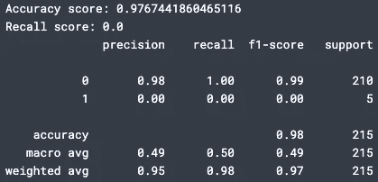

我们已经知道 2%的患者被诊断患有癌症，但是我们的第二个模型预测没有患者会患有癌症。看到这怎么会成为一个问题了吗？

# 你应该用什么标准来评估？

在严肃的医疗诊断模型、惩罚性模型如 [COMPAS](https://advances.sciencemag.org/content/4/1/eaao5580.full) 、累犯风险模型和欺诈检测中，都存在悬而未决的人命问题。在这些情况下，最好谨慎行事，保护尽可能多的人——无论这是否意味着降低误报或漏报的数量。

当考虑如何优化这些类型的模型时，我们可以解读一些指标。

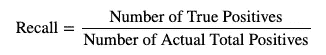

**回想一下:**以宫颈癌风险数据集为例，您可以问自己这个模型— *在所有实际被诊断患有癌症的患者中，我们的模型预测患有癌症的比例是多少？*

然而，回忆并不能让你了解全貌。假设你的模型将每个人都归类为患有癌症，包括那些没有患癌症的人，那么你的得分就是 100%。低召回分数表示高数量的假阴性。

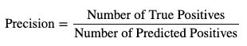

**Precision:** Precision 提出了相反的问题——*在所有被模型预测为患有癌症的患者中，有多少人确实患有癌症？*

如果你的模型预测 10 名患者患有癌症，如果所有的预测都是正确的，我们的得分将是 100%，即使还有 1000 多名患者没有得到诊断。低精度分数表示高数量的假阳性。

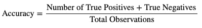

**准确性:**准确性是一个更可靠的评估指标，因为它衡量真实预测的总数，包括正面和负面预测。这是分类任务中最常见的指标。


**F1 得分:**F1 得分是另一个非常有用的指标。因为它衡量的是“精确度和召回率的调和平均值”，如果精确度和召回率都不高，它就不可能高，这表明模型整体表现良好。但是，F1 分数可以格式化，以解决二进制、多类和不平衡分类问题，在[sk learn . metrics](http://sklearn.metrics). F1 _ score 方法中使用以下参数:

*   **二进制—** 用于二进制分类问题。
*   **微—** 统计总的真阳性、假阴性和假阳性。
*   **宏—** 计算所有类别的未加权平均值(对于多类别问题。)
*   **加权—** 通过对每个类别的真阳性进行加权并取平均分数来说明类别不平衡。
*   **样本—** 查找每个类的每个指标的平均分。

# 让我们对抗不平等，一次一个重采样方法！

有了这些信息，我们将优化二进制 F1 分数，因为我们只有两个类。你可能会想“如果我们的数据如此严重不平衡，为什么不使用加权 F1 分数？”这就是重采样方法的用武之地！

我们将探讨三种简单而有用的方法(尽管还有更多)——对多数采样不足、对少数采样过采样和 SMOTE(合成少数采样过采样技术)。我们将使用的每种方法都旨在创建一个对半分布的训练集，因为我们正在处理一个二元分类问题。这些方法可用于为四个类别的多类别问题创建 25–25–25–25 分布，而不考虑类别的初始分布，或其他可能训练您的模型以获得更好结果的比率。

***在重新采样之前，请确保将您的数据分成训练集和测试集！*** 如果你不这样做，你会因为数据泄露而损害模型的质量，导致过度拟合和泛化能力差。

```
*# Import the resampling package*
from sklearn.utils import resample*# Split into training and test sets*
X_train, X_test, y_train, y_test = train_test_split(X, y, test_size = 0.25)*# Returning to one dataframe*
training_set = pd.concat([X_train, y_train], axis=1)*# Separating classes*
cancer = training_set[training_set.Cancer == 1]
not_cancer = training_set[training_set.Cancer == 0]
```

**欠采样多数**

欠采样可以定义为减少多数类的数量。这种技术最适用于有数千甚至数百万个数据点的数据。通常，您不希望减少正在处理的数据量，但是如果您可以牺牲一些训练数据，这种技术将非常有用。下面是它在宫颈癌数据集上的工作原理:

```
*# Undersampling the majority*
undersample = resample(not_cancer, 
                       replace=True, 
                       n_samples=len(cancer), #set the number of samples to equal the number of the minority class
                       random_state=42)*# Returning to new training set*
undersample_train = pd.concat([cancer, undersample])undersample_train.Cancer.value_counts(normalize=True)
```

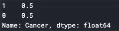

我们有均匀分布的班级！现在我们可以在随机森林分类器上测试它。

```
*# Separate undersampled data into X and y sets*
undersample_x_train = undersample_train.drop('Cancer', axis=1)
undersample_y_train = undersample_train.Cancer*# Fit model on undersampled data*
undersample_rf = RandomForestClassifier(n_estimators=500).fit(undersample_x_train, undersample_y_train)*# Make predictions on test sets*
y_pred = random_forest.predict(X_test)print('Accuracy score: ' + str(accuracy_score(y_test, y_pred)))
print('Average Recall score: ' + str(recall_score(y_test, y_pred, average='macro')))
print(classification_report(y_test, y_pred))
```

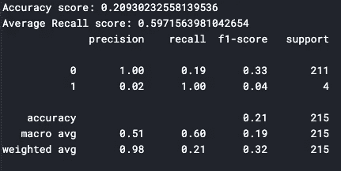

不完全是最好的结果，但因为我们减少了多数类的数量，我们只在 28 个实例上训练我们的模型，这对于样本大小来说太小了。接下来，我们将尝试对少数进行过采样。

**过采样少数**

对少数民族进行过采样将增加少数民族类中的数据点数量，同样旨在均匀分布训练集中的类。我们将重复和以前一样的过程。

```
*# Oversampling the minority*
oversample = resample(cancer, 
                       replace=True, 
                       n_samples=len(not_cancer), #set the number of samples to equal the number of the majority class
                       random_state=42)*# Returning to new training set*
oversample_train = pd.concat([not_cancer, oversample])oversample_train.Cancer.value_counts(normalize=True)
```


```
*# Separate oversampled data into X and y sets*
oversample_x_train = oversample_train.drop('Cancer', axis=1)
oversample_y_train = oversample_train.Cancer*# Fit model on oversampled data*
oversample_rf = RandomForestClassifier(n_estimators=500).fit(oversample_x_train, oversample_y_train)*# Make predictions on test sets*
y_pred = oversample_rf.predict(X_test)
print('Accuracy score: ' + str(accuracy_score(y_test, y_pred)))
print('Average Recall score: ' + str(recall_score(y_test, y_pred, average='macro')))
print(classification_report(y_test, y_pred))
```

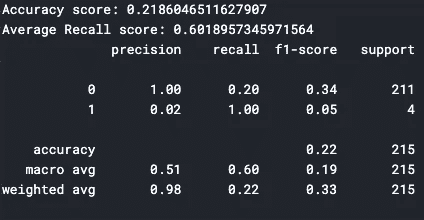

不幸的是，我们的结果只是稍微好一点。我们还有一项技术可以尝试。

**SMOTE(合成少数过采样技术)**

SMOTE 从现有的少数类池中合成数据点，并将它们添加到数据集中。这种技术通过为模型创建新的、不可见的数据点进行训练，确保了数据泄漏非常少。

```
*# Import the SMOTE package*
from imblearn.over_sampling import SMOTE*# Synthesize minority class datapoints using SMOTE*
sm = SMOTE(random_state=42, sampling_strategy=’minority’)
smote_x_train, smote_y_train = sm.fit_resample(X_train, y_train)*# Separate into training and test sets*
smote_x_train = pd.DataFrame(smote_x_train, columns = X_train.columns)
smote_y_train = pd.DataFrame(smote_y_train, columns = ['Cancer'])smote = RandomForestClassifier(n_estimators=1000).fit(smote_x_train, smote_y_train)

*# Predict on training set*
smote_preds = smote.predict(X_test)*# Checking accuracy and recall*
print('Accuracy Score: ', accuracy_score(y_test, smote_preds),'\n\n')
print('Averaged Recall Score: ', recall_score(y_test, smote_preds, average='macro'), '\n\n')

print(classification_report(y_test, smote_preds))
```

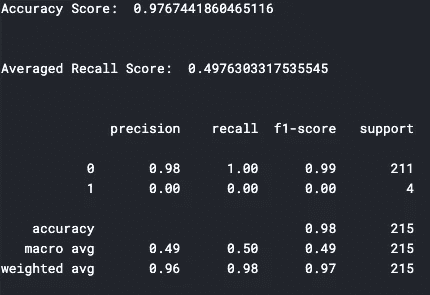

准确性和 f1 分数有所提高，但回忆分数略有下降。根据您的模型用例，此时您必须决定哪个模型保护的人最多。

# AOC 是美国下层的冠军，但是 ROC AUC 是模型评测的冠军

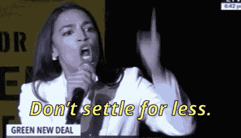

可视化模型质量的最佳方法之一是检查 ROC 曲线。ROC(受试者工作特性)曲线绘出了真阳性率 TPR 与假阳性率 FPR 的关系。最佳预测将在没有假阳性(成本)和 100%真阳性(收益)的点(0，1)处找到。

包括在图中的是无描述线，它展示了随机猜测，类似于抛硬币的概率。线上的点是“好的”猜测，因为它们在点(0，1)上更接近完美的结果。反之亦然，线以下的点表示预测不佳。

AUC，或曲线下面积，是可分离程度的定量度量。预测越接近理想结果，AUC 就越大。当 AOC 告诉我们不要退而求其次时，她是在告诉我们将 AUC 定在接近 1%或 100%的水平。

这是一个用 SMOTE 重采样训练集训练的随机森林分类器的例子(阅读文档[此处](https://scikit-learn.org/stable/auto_examples/model_selection/plot_roc.html#sphx-glr-auto-examples-model-selection-plot-roc-py)):

```
y_score = smote.fit(smote_x_train, smote_y_train).predict_proba(X_test)[:,1]fpr, tpr, thresholds = roc_curve(y_test, y_score)
print('AUC: {}'.format(auc(fpr, tpr)))
```

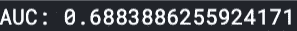

不算太差！仍有很大的改进空间，但我们可以从图中看出这一点:

```
plt.figure(figsize=(10, 8))
lw = 2
plt.plot(fpr, tpr, color=’darkorange’,
 lw=lw, label=’ROC curve’)
plt.plot([0, 1], [0, 1], color=’navy’, lw=lw, linestyle=’ — ‘)
plt.xlim([0.0, 1.0])
plt.ylim([0.0, 1.05])
plt.yticks([i/20.0 for i in range(21)])
plt.xticks([i/20.0 for i in range(21)])
plt.xlabel(‘False Positive Rate’)
plt.ylabel(‘True Positive Rate’)
plt.title(‘Receiver operating characteristic (ROC) Curve’)
plt.legend(loc=’lower right’)
plt.show()
```

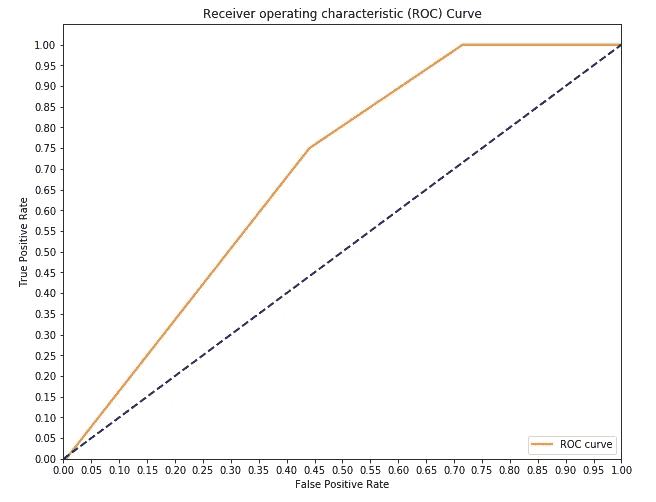

理想情况下，我们希望看到橙色线更加陡峭，直到它非常接近(0，1)时才会变平，但这是一个很好的起点。

与所有机器学习项目一样，这个过程是迭代的。在您决定采用哪种方法之前，还有其他方法可以对您的模型进行重新采样和验证。彻底考虑哪种性能指标符合您的目的，选择一种适合您的数据类型的算法，并根据部署后危害最小的算法来评估您的模型。

请在下面评论，告诉我你重新采样数据的其他方法！