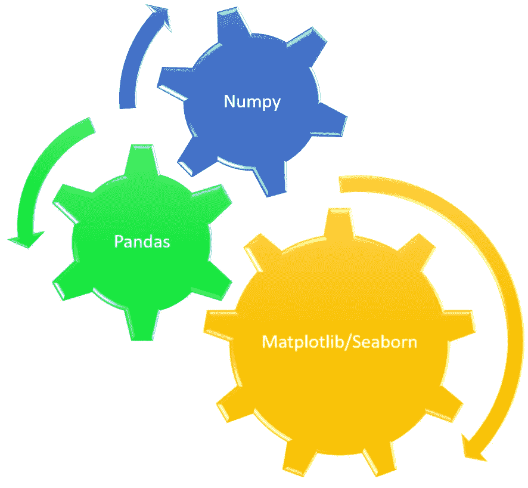
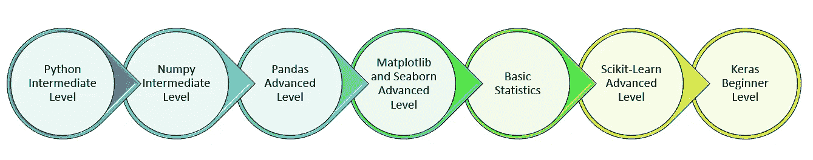

# 机器学习路线图——我的旅程和进化

> 原文：<https://towardsdatascience.com/machine-learning-roadmap-my-journey-and-evolution-a76ae656969?source=collection_archive---------12----------------------->

## 我从机械工程师到机器学习科学家的旅程和职业转型，以及经验教训

尼克·莫里森在 [Unsplash](https://unsplash.com?utm_source=medium&utm_medium=referral) 上拍摄的照片

人工智能、机器学习、深度学习、物联网等。是过去几年的流行语。如果有人在战略，商业或 IT 咨询，不知道至少基本的信息技术，那么我想他们是非常多余的。

为了跟上两年前的潮流，我决定熟悉机器学习和深度学习。

我们中的许多人希望转行到机器学习/人工智能领域，或者来自非科学背景，因此发现获得必要的知识具有挑战性。在这篇文章中，我将分享我的旅程和进化，以及帮助我获得这方面知识的资源。我希望它能提供洞察力，帮助你构建你的学习路径。

*我的挑战*

20 年前我学的是机械工程。工程学位让我能够用理性的方式进行系统思考。我在工程系学过高等微积分和线性代数，这些年来我忘记了大部分概念。很快就变得很明显，我需要学习一些东西作为先决条件，甚至在开始学习机器的 ABC 或深度学习之前。

1.  复习线性代数、微积分和概率的概念
2.  学习基本统计学
3.  选择主要语言
4.  学习地图

我没有精力去读数学课本，因此为了复习，我看了可汗学院和麻省理工学院开放课件上的线性代数、微积分和概率的视频。我将特别推荐吉尔伯特·斯特朗教授的讲座。

 [## 麻省理工学院开放式课程|免费在线课程材料

### 麻省理工学院开放式课程是一个基于网络的出版物，包含了几乎所有的麻省理工学院课程内容。开放式课程是开放的，可供…

ocw.mit.edu](https://ocw.mit.edu/index.htm) 

由于大量的库和开发者支持，我将 python 作为我的主要编程语言。

一旦我修改了数学概念，我就开始学习 Python。我以前用 C 语言做过编程，我已经知道了循环、条件语句等概念。

我发现 Eric Matthes 的书《 ***Python 速成班:基于项目的编程入门*** 》非常有助于理解语法和基本概念。我用来磨练我的基本 python 技能的另一本书是 Al Sweigart 的****用 Python 自动化枯燥的东西，第二版:完全初学者实用编程****】*。*

*在对 python 有了一个良好的基础之后，我把重点放在了用于机器学习的 python 包的三位一体上，即 NumPy、pandas 和 matplotlib/seaborn。*

**

*用于机器学习的 Python 三位一体库—图片由作者提供*

*所有三个软件包的官方文档都写得非常好，即使对于初学者也很容易理解。我从 NumPy 开始，然后去了 Pandas，最后去了 matplotlib/seaborn，以获得关于数据可视化的想法。*

*我花了大约 2 个月的时间，花了大约 3 个小时阅读，才达到这一点。在那之前，我从未学过统计学，我对统计学的全部知识仅限于平均值和众数。*

*我发现 David Spiegelhalter 的书《统计的艺术:从数据中学习》很有帮助。它不仅帮助我以非数学的方式了解统计学，而且在数据科学可视化方面也有很大帮助。它教会了我如何基于不同的数据可视化，基于相同的数据点传达不同的信息。*

*带着对基本统计学的概念性理解，我阅读了《数据科学家实用统计学:使用 R 和 Python 的 50+基本概念》一书*，以建立程序化的实践知识。**

**

*作者的机器学习地图-按作者分类的图片*

*经过三个月的学习，我终于准备好开始学习机器学习了。如果我能说出一本书加速了我的学习并解释了从初学者到高级水平的概念，那么它就是 Aurelien Geron 的“用 Scikit-Learn、Keras 和 TensorFlow 进行机器学习:构建智能系统的概念、工具和技术”。*

*一旦你遵循了我上面提到的从 python 到 pandas 和 matplotlib 的学习路径，那么这本书里没有一行是你不能理解的。这本书里没有数学术语的完整的动手方法对没有高级数学知识的人很有帮助。*

*我一共花了六个月的时间达到中级机器学习的熟练程度，又花了两个月的时间了解深度学习的基础知识。*

> **我的旅程中的主要收获和收获**

*机器学习和数据科学的熟练程度取决于对以下领域的扎实知识*

*   *至少具备中级 python 编程知识*
*   *关于 **Numpy** 、 **Pandas** 和**Matplotlib**/**Seaborn**Python 库的高级知识*

*不要急于开始机器学习图书馆和书籍，如果你还没有完全掌握这些图书馆的话。这些领域的全面知识将使你的机器学习变得迅速和愉快。*

*从线性回归等更简单、更知名的算法开始你的机器学习。不要试图用一个最复杂的鲜为人知的算法来显得博学并给别人留下深刻印象。*

*Scikit-learn 是一个非常强大和通用的机器学习库。从初学者的角度来看，它也是非常用户友好的，并且是可用的文档最丰富的库之一。我强烈建议从 Scikit-learn 开始，并在转到其他库之前花大量时间熟悉它。*

*在涉足深度学习世界之前，先熟悉机器学习。在没有很好地理解机器学习的情况下急于进行深度学习，从长远来看是没有帮助的。*

*从深度学习的 **Keras** 库开始，你可以把 TensorFlow 放在后面。*

*最后，在机器和深度学习上利用 Coursera 和 Edx 上的免费学习资源。*

*我希望开始机器和深度学习之旅的读者能够从本文概述的我的旅程中获得一些关于学习方法的见解，并能够构建他们的学习路径。*

*我有兴趣知道机器学习的其他专家和学生的学习地图、关键资源和方法。*