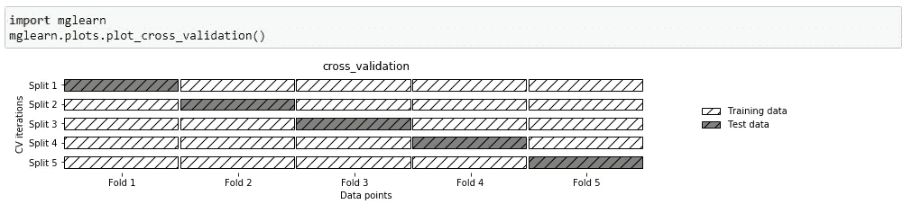
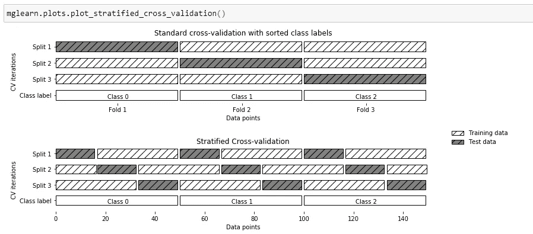

# 机器学习:关于交叉验证的一些注意事项

> 原文：<https://towardsdatascience.com/machine-learning-some-notes-about-cross-validation-4a0315599f2?source=collection_archive---------35----------------------->

## 交叉验证的不同方法概述


制造者在 [Unsplash](https://unsplash.com/collections/4545574/it?utm_source=unsplash&utm_medium=referral&utm_content=creditCopyText) 上 [NESA 的照片](https://unsplash.com/@nesabymakers?utm_source=unsplash&utm_medium=referral&utm_content=creditCopyText)

**简介**

如您所知，当我们将数据分为训练集和测试集时，我们的主要目标是了解模型在面对与训练阶段使用的数据不同的新数据时的预测能力。

无论如何，有一个可靠的方法来评估我们的模型的性能。这种方式被称为交叉验证。交叉验证是一种评估泛化性能的统计技术，它比使用分为训练集和测试集的方法更稳定。

在本文中，我们将了解一些交叉验证方法，如 K 倍交叉验证、分层 K 倍交叉验证和留一交叉验证。

**第一部分:K 倍交叉验证**

k 重交叉验证是最常用的交叉验证方法之一。在这个方法中， ***k*** 表示为了测试和训练我的数据，我想要尝试的实验(或折叠)次数。

例如，假设我们想要用由 1000 条记录组成的数据进行 5 次实验(或性能)。因此，在第一个实验中，我们测试或验证前 200 条记录，然后训练剩余的 800 条记录。当第一个实验完成时，我获得了一定的精度。然后，我们进行第二个实验，测试我之前测试的记录之后的 200 条记录，并训练剩余的 800 条记录。

我用一组 200 个记录继续实验，直到我完成所有 5 个实验。请记住，我们总是测试先前记录的下 200 个记录，并训练剩余的记录直到结束。

在我的 5 次实验结束时，我将获得 5 次精度，最终精度将是所有精度的平均值。

下面你可以看到一个直观的例子。



作者图片

交叉验证是在 scikit-learn 中使用来自 **model_selecion** 模块的 **cross_val_score** 函数实现的。 **cross_val_score** 函数的参数是我们想要评估的模型、训练数据和目标。下面是一个逻辑回归的例子:

```
from **sklearn.model_selection** import **cross_val_score**from **sklearn.linear_model** import **LogisticRegression**logreg = LogisticRegression()scores = cross_val_score(logreg, X,y,cv=5)
```

**第二部分:分层 K 褶交叉验证**

考虑到前面 1000 条记录的例子，有时从测试前 200 条记录开始并不总是一个好主意。事实上，在一个数据集中，我们可以发现前三分之一的数据指向同一个类。

假设我们有三个类(0、1 和 2)，如下所示:

```
[0 0 0 0 0 0 0 0 0 0 0 0 0 0 0 0 0 0 0 0 0 0 0 0 0 0 0 0 0 0 0 0 0 0 0 0 0 0 0 0 0 0 0 0 0 0 0 0 0 0 1 1 1 1 1 1 1 1 1 1 1 1 1 1 1 1 1 1 1 1 1 1 1 1 1 1 1 1 1 1 1 1 1 1 1 1 1 1 1 1 1 1 1 1 1 1 1 1 1 1 2 2 2 2 2 2 2 2 2 2 2 2 2 2 2 2 2 2 2 2 2 2 2 2 2 2 2 2 2 2 2 2 2 2 2 2 2 2 2 2 2 2 2 2 2 2 2 2 2 2]
```

可以看到，第一个第三类是 0，第二个是 1，第三个是 2。现在想象做 3 个实验(k=3)。在我们的第一个实验中，测试集只在类 0 中，训练集只在类 1 和 2 中。所以，你可以知道精度是 0。

为了处理这个问题，我们可以使用**分层 k 倍交叉验证**。在分层交叉验证中，我们对数据进行分割，使每个折叠中的类之间的比例与它们在整个数据集中的比例相同，如下图所示。在该图中，对 k 倍交叉验证和分层交叉验证进行了比较:



作者图片

Scikit-learn 帮助我们进行分层折叠。所以:

```
from **sklearn.model_selection** import **StratifiedKFold**skf = StratifiedKFold(n_split=5, random_state=None)# X is the feature set and y is the target
for train_index, test_index in skf.split(X,y): 
    print("Train:", train_index, "Test:", test_index) 
    X_train, X_test = X.iloc[train_index], X.iloc[test_index] 
    y_train, y_test = y[train_index], y[test_index]
```

**第三部分:留一交叉验证**

另一个有趣的交叉验证方法是**留一法。**这种方法类似于我们之前看到的 k-fold，但是对于每个实验(或表演),我们只取一个样本进行测试，而不是像以前那样取 200 个记录。

下面，我们可以用 **LeaveOneOut** 在 scikit-learn 中找到实现。

```
from **sklearn.model_selection** import **LeaveOneOut**loo = LeaveOneOut()cross_val_score(logreg, X, y, cv=loo)
```

**结论**

在本文中，您已经看到了机器学习中用于评估模型准确性的最常见的交叉验证方法。无论如何，还有一些其他的方法，如混洗-分裂交叉验证，分组交叉验证和时间序列交叉验证，在某些情况下非常有用。

感谢你阅读这篇文章。您还可以通过其他方式与我保持联系并关注我的工作:

*   订阅我的时事通讯。
*   也可以通过我的电报群 [*数据科学初学者*](https://t.me/DataScienceForBeginners) 联系。