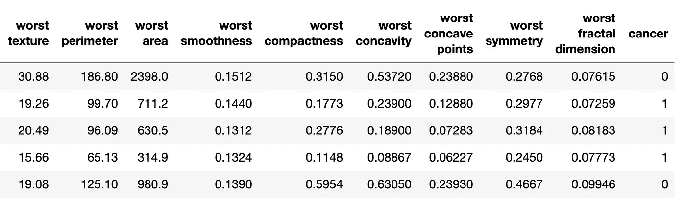
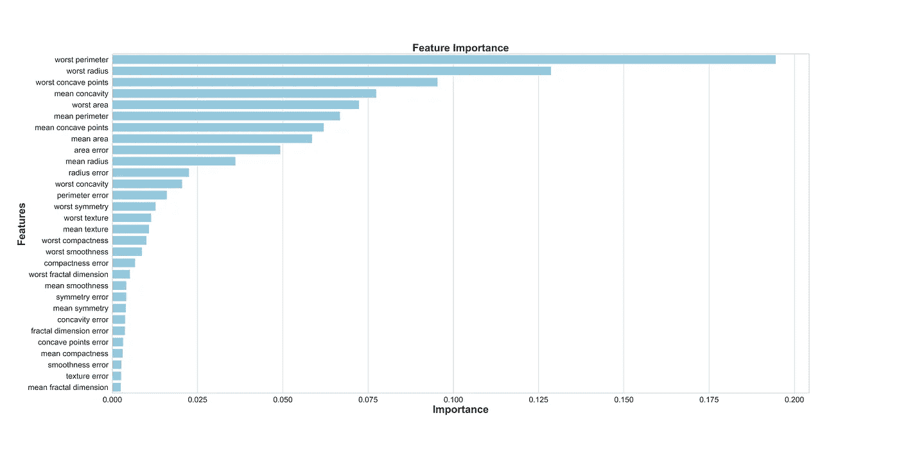
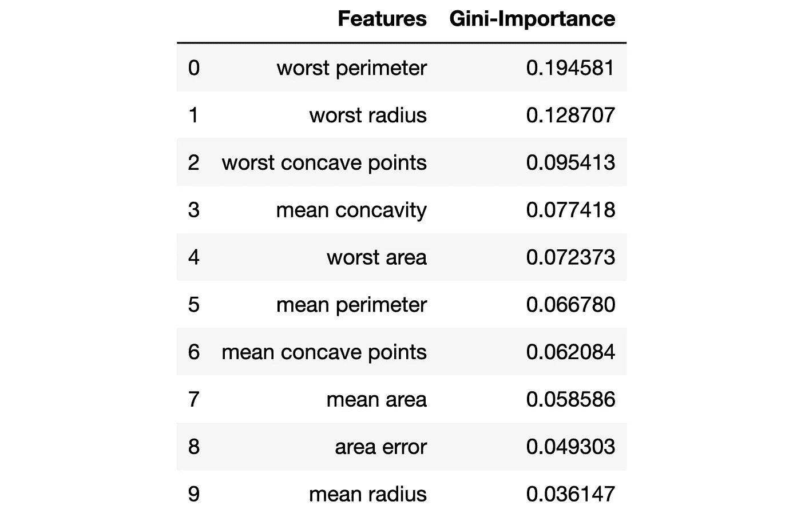
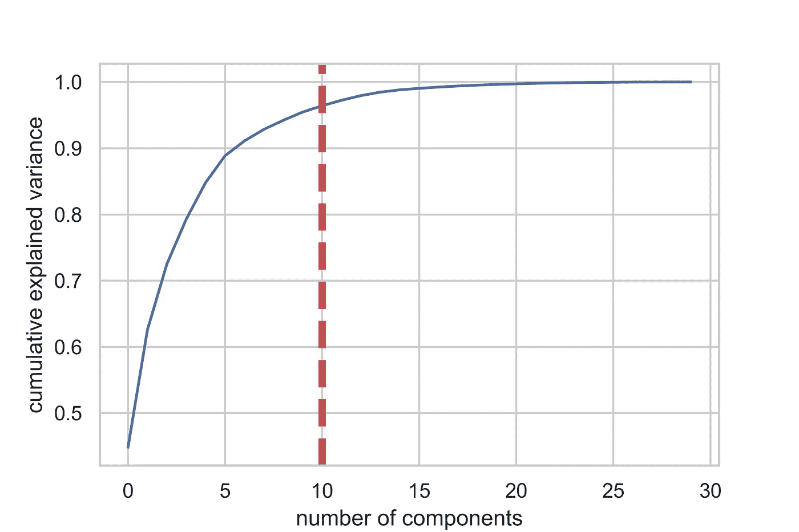
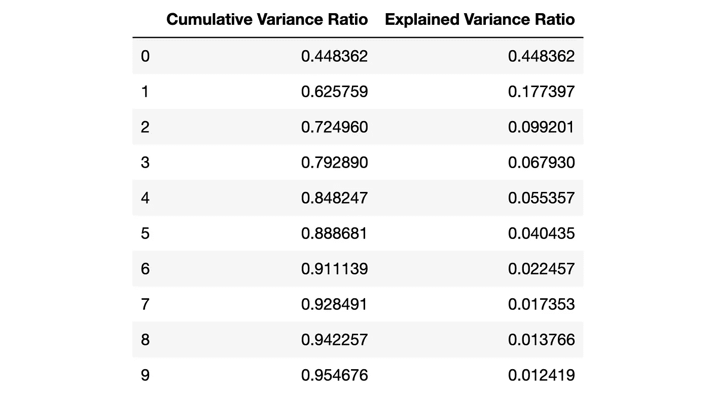
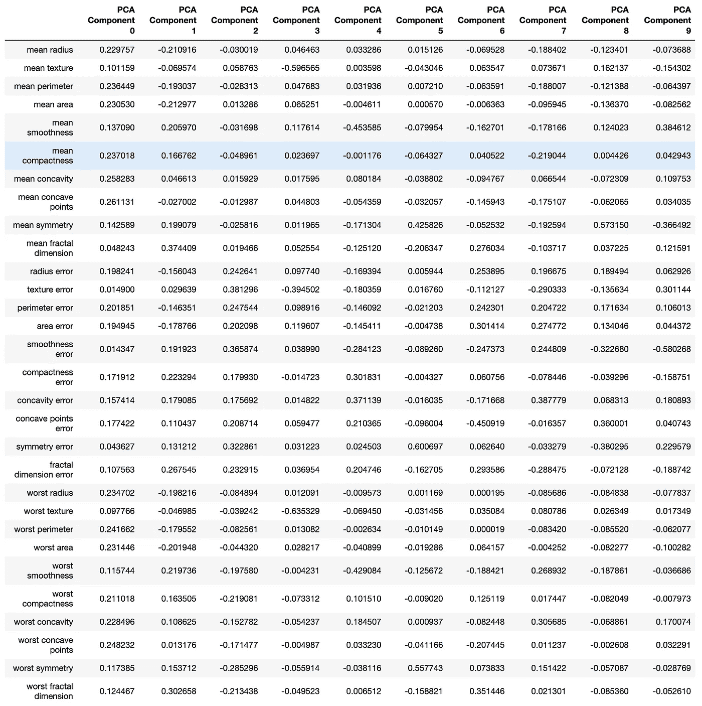
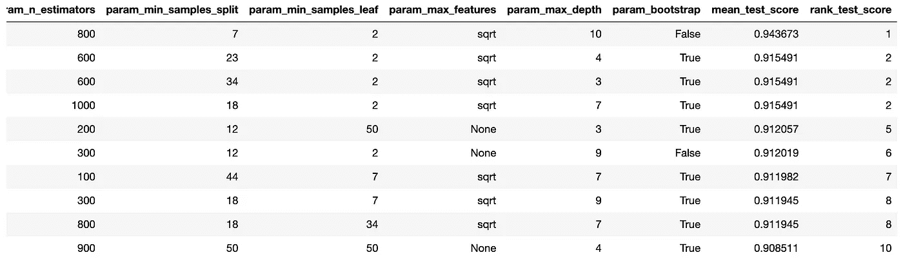
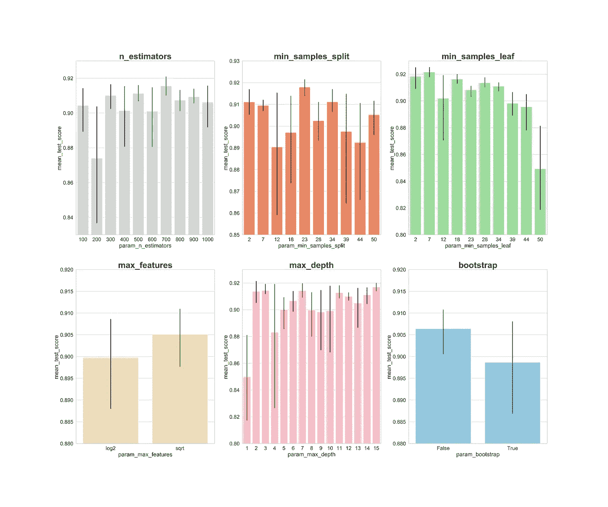
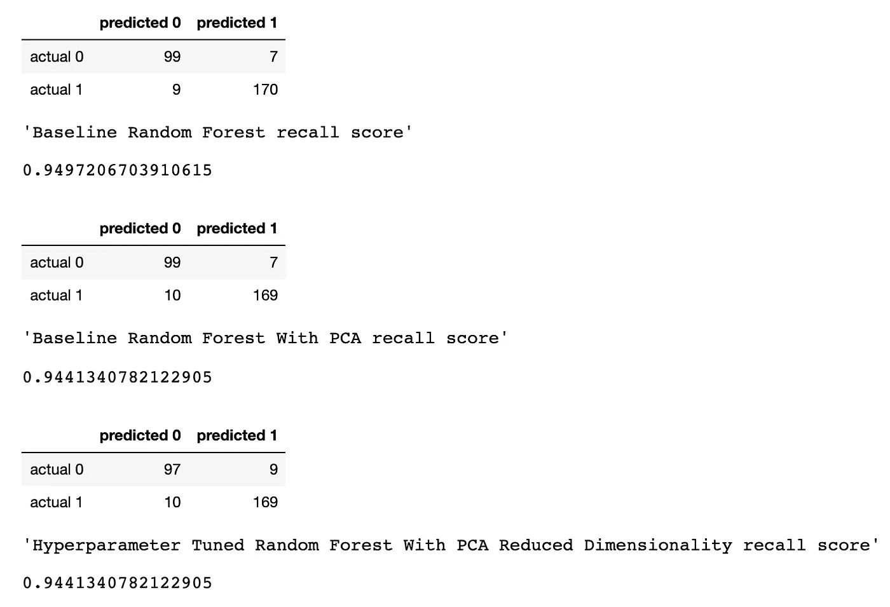

# 机器学习:循序渐进

> 原文：<https://towardsdatascience.com/machine-learning-step-by-step-6fbde95c455a?source=collection_archive---------1----------------------->

## 使用随机森林、PCA 和超参数调整的 Python 机器学习分类分步指南——带代码！


[图像来源](https://www.quora.com/How-should-I-start-in-the-field-of-machine-learning-and-AI-with-knowledge-of-programming-and-algorithms)

作为数据科学家，我们有许多选择来创建分类模型。最流行和可靠的方法之一是使用随机森林。我们可以对 [**随机森林**](/understanding-random-forest-58381e0602d2) 执行 [**超参数调整**](/hyperparameter-tuning-the-random-forest-in-python-using-scikit-learn-28d2aa77dd74) 来尝试优化模型的性能。

在将我们的数据拟合到模型之前，尝试[**【PCA】**](/a-one-stop-shop-for-principal-component-analysis-5582fb7e0a9c)也是常见的做法。但是我们为什么还要增加这一步呢？随机森林的全部意义不就是帮助我们容易地解释特征重要性吗？

是的，当我们分析随机森林模型的“特征重要性”时，PCA 会使解释每个“特征”变得更加困难。但是，PCA 执行降维，这可以减少随机森林要处理的要素数量，因此 PCA 可能有助于加快随机森林模型的训练。请注意，计算成本是随机森林的最大缺点之一(运行模型可能需要很长时间)。主成分分析会变得非常重要，尤其是在处理成百上千个预测特征的时候。因此，如果最重要的事情是简单地拥有性能最好的模型，并且可以牺牲解释特征重要性，那么 PCA 可能是有用的尝试。

现在，让我们开始我们的例子。我们将使用 [**Scikit-learn“乳腺癌”数据集。**](https://scikit-learn.org/stable/modules/generated/sklearn.datasets.load_breast_cancer.html) 我们将创建 3 个模型，并相互比较它们的性能:

*   1.随机森林
*   2.PCA 降维的随机森林
*   3.PCA 降维的随机森林&超参数调整

# 1.输入数据

首先，我们加载数据并创建一个数据框架。由于这是来自 Scikit-learn 的预先清理过的“玩具”数据集，我们可以继续进行建模过程了。但是，作为最佳实践，我们应该始终做到以下几点:

*   使用 **df.head()** 浏览新的数据帧，确保它看起来像预期的那样。
*   使用 **df.info()** 来了解每一列中的数据类型和计数。您可能需要根据需要转换数据类型。
*   使用 **df.isna()** 来确保没有 NaN 值。您可能需要根据需要估算值或删除行。
*   使用 **df.describe()** 了解每一列的最小值、最大值、平均值、中值、标准偏差和四分位间距。

名为**“cancer”**的列是我们希望使用模型预测的目标变量。**“0”表示“没有癌症”，“1”表示“癌症”。**

```
import pandas as pd
from sklearn.datasets import load_breast_cancercolumns = ['mean radius', 'mean texture', 'mean perimeter', 'mean area', 'mean smoothness', 'mean compactness', 'mean concavity', 'mean concave points', 'mean symmetry', 'mean fractal dimension', 'radius error', 'texture error', 'perimeter error', 'area error', 'smoothness error', 'compactness error', 'concavity error', 'concave points error', 'symmetry error', 'fractal dimension error', 'worst radius', 'worst texture', 'worst perimeter', 'worst area', 'worst smoothness', 'worst compactness', 'worst concavity', 'worst concave points', 'worst symmetry', 'worst fractal dimension']dataset = load_breast_cancer()
data = pd.DataFrame(dataset['data'], columns=columns)
data['cancer'] = dataset['target']display(data.head())
display(data.info())
display(data.isna().sum())
display(data.describe())
```



上面是乳腺癌数据框架的一部分。每一行都有关于患者的观察结果。名为“癌症”的最后一列是我们试图预测的目标变量。 **0 表示“没有癌症”，1 表示“癌症”。**

# 2.训练/测试分割

现在，我们使用 Scikit-learn 的“train_test_split”函数分割数据。我们希望为模型提供尽可能多的数据来进行训练。然而，我们还想确保我们有足够的数据让模型进行自我测试。通常，随着数据集中行数的增加，我们可以提供给定型集的数据就越多。

例如，如果我们有数百万行，我们可以有 90%的训练/ 10%的测试分割。然而，我们的数据集只有 569 行，这对于训练或测试来说并不是一个非常大的数据集。因此，为了公平对待训练和测试，我们将数据分成 50%训练和 50%测试。我们设置**分层=y** 以确保训练集和测试集与原始数据集具有相同比例的 0 和 1。

```
from sklearn.model_selection import train_test_splitX = data.drop('cancer', axis=1)  
y = data['cancer'] 
X_train, X_test, y_train, y_test = train_test_split(X, y, test_size=0.50, random_state = 2020, stratify=y)
```

# 3.缩放数据

在建模之前，我们需要通过缩放来“居中”和“标准化”我们的数据。我们按比例控制，因为不同的变量在不同的比例上测量。我们进行缩放，以便每个预测者可以在决定重要性时相互“公平竞争”。[见此文。](/scale-standardize-or-normalize-with-scikit-learn-6ccc7d176a02)我们还将“y_train”从 Pandas“Series”对象转换为 NumPy 数组，以便模型稍后接受目标训练数据。

```
import numpy as np
from sklearn.preprocessing import StandardScalerss = StandardScaler()
X_train_scaled = ss.fit_transform(X_train)
X_test_scaled = ss.transform(X_test)
y_train = np.array(y_train)
```

# 4.适合“基线”随机森林模型

现在我们创建一个“基线”随机森林模型。该模型使用所有预测功能以及在 [Scikit-learn 随机森林分类器文档中定义的默认设置。](https://scikit-learn.org/stable/modules/generated/sklearn.ensemble.RandomForestClassifier.html)首先，我们对模型进行实例化，并对缩放后的数据进行拟合。我们可以根据我们的训练数据来衡量模型的准确性。

```
from sklearn.ensemble import RandomForestClassifier
from sklearn.metrics import recall_scorerfc = RandomForestClassifier()
rfc.fit(X_train_scaled, y_train)
display(rfc.score(X_train_scaled, y_train))# 1.0
```

如果我们想知道哪些特征对随机森林模型预测乳腺癌最重要，我们可以通过调用 **"feature_importances_"** 方法来可视化和量化重要性:

```
feats = {}
for feature, importance in zip(data.columns, rfc_1.feature_importances_):
    feats[feature] = importanceimportances = pd.DataFrame.from_dict(feats, orient='index').rename(columns={0: 'Gini-Importance'})
importances = importances.sort_values(by='Gini-Importance', ascending=False)
importances = importances.reset_index()
importances = importances.rename(columns={'index': 'Features'})sns.set(font_scale = 5)
sns.set(style="whitegrid", color_codes=True, font_scale = 1.7)
fig, ax = plt.subplots()
fig.set_size_inches(30,15)
sns.barplot(x=importances['Gini-Importance'], y=importances['Features'], data=importances, color='skyblue')
plt.xlabel('Importance', fontsize=25, weight = 'bold')
plt.ylabel('Features', fontsize=25, weight = 'bold')
plt.title('Feature Importance', fontsize=25, weight = 'bold')display(plt.show())
display(importances)
```



# 5.主成分分析

现在，我们如何改进我们的基线模型？使用降维，我们可以用更少的变量逼近原始数据集，同时降低运行模型的计算能力。使用主成分分析，我们可以研究这些特征的累积解释方差比率，以了解哪些特征解释了数据中的最大方差。

我们实例化 PCA 函数，并设置我们想要考虑的组件(特征)的数量。我们将它设置为“30 ”,以查看所有生成组件的解释差异，然后决定在哪里进行切割。然后，我们将缩放后的 X_train 数据“拟合”到 PCA 函数。

```
import matplotlib.pyplot as plt
import seaborn as sns
from sklearn.decomposition import PCApca_test = PCA(n_components=30)
pca_test.fit(X_train_scaled)sns.set(style='whitegrid')
plt.plot(np.cumsum(pca_test.explained_variance_ratio_))
plt.xlabel('number of components')
plt.ylabel('cumulative explained variance')
plt.axvline(linewidth=4, color='r', linestyle = '--', x=10, ymin=0, ymax=1)
display(plt.show())evr = pca_test.explained_variance_ratio_
cvr = np.cumsum(pca_test.explained_variance_ratio_)pca_df = pd.DataFrame()
pca_df['Cumulative Variance Ratio'] = cvr
pca_df['Explained Variance Ratio'] = evr
display(pca_df.head(10))
```



该图显示，超过 10 个成分后，我们没有获得太多的解释方差。



该数据帧显示了累积方差比(解释了数据的总方差)和解释方差比(每个 PCA 成分解释了数据的总方差)。

**看上面的数据框架，当我们使用主成分分析将 30 个预测变量减少到 10 个成分时，我们仍然可以解释超过 95%的方差。**其他 20 个成分解释了不到 5%的方差，因此我们可以剔除它们。使用这个逻辑，我们将使用 PCA 将 X_train 和 X_test 的组件数量从 30 个减少到 10 个。我们将把这些重新创建的“降维”数据集分配给“X_train_scaled_pca”和“X_test_scaled_pca”。

```
pca = PCA(n_components=10)
pca.fit(X_train_scaled)X_train_scaled_pca = pca.transform(X_train_scaled)
X_test_scaled_pca = pca.transform(X_test_scaled)
```

每个分量都是原始变量与相应“权重”的线性组合。通过创建数据帧，我们可以看到每个 PCA 成分的“权重”。

```
pca_dims = []
for x in range(0, len(pca_df)):
    pca_dims.append('PCA Component {}'.format(x))pca_test_df = pd.DataFrame(pca_test.components_, columns=columns, index=pca_dims)
pca_test_df.head(10).T
```



# 6.PCA 后适合“基线”随机森林模型

现在，我们可以将我们的 X_train_scaled_pca 和 y_train 数据拟合到另一个“基线”随机森林模型，以查看我们是否对模型的预测有任何改进。

```
rfc = RandomForestClassifier()
rfc.fit(X_train_scaled_pca, y_train)display(rfc.score(X_train_scaled_pca, y_train))# 1.0
```

# 7.第一轮超参数调整:RandomSearchCV

在执行 PCA 之后，我们还可以尝试一些[超参数调整](/hyperparameter-tuning-the-random-forest-in-python-using-scikit-learn-28d2aa77dd74)来调整我们的随机森林，以获得更好的预测性能。超参数可以被认为是模型的“设置”。一个数据集的完美设置对于另一个数据集是不一样的，所以我们必须“调整”模型。

首先，我们可以从 RandomSearchCV 开始考虑广泛的值。随机森林的所有超参数都可以在 [Scikit-learn 随机森林分类器文档中找到。](https://scikit-learn.org/stable/modules/generated/sklearn.ensemble.RandomForestClassifier.html)

我们生成一个“param_dist ”,其中包含一系列值，用于尝试每个超参数。RandomSearchCV 被实例化，我们的随机森林模型首先被传入，然后是我们的“param_dist”、要尝试的迭代次数以及要执行的[交叉验证的次数](/cross-validation-a-beginners-guide-5b8ca04962cd)。

**“详细”**超参数在模型运行时为您提供或多或少的输出(比如状态更新)。 **"n_jobs"** 超参数让您决定要使用多少个处理器内核来运行模型。设置“n_jobs = -1”将使模型运行得最快，因为它使用了您所有的计算机核心。

我们将调整这些超参数:

*   **n_estimators:** 我们的随机森林中“树”的数量。
*   **max_features:** 每次分割的特征数量。
*   **max_depth:** 每棵树可以拥有的最大“分裂”数。
*   **min_samples_split:** 树的节点可以自我分裂之前所需的最小观察次数。
*   **min_samples_leaf:** 每棵树末端的每片叶子所需的最小观察次数。
*   **bootstrap:** 是否使用 bootstrap 为随机森林中的每棵树提供数据。(Bootstrapping 是从数据集中随机取样并替换。)

```
from sklearn.model_selection import RandomizedSearchCVn_estimators = [int(x) for x in np.linspace(start = 100, stop = 1000, num = 10)]max_features = ['log2', 'sqrt']max_depth = [int(x) for x in np.linspace(start = 1, stop = 15, num = 15)]min_samples_split = [int(x) for x in np.linspace(start = 2, stop = 50, num = 10)]min_samples_leaf = [int(x) for x in np.linspace(start = 2, stop = 50, num = 10)]bootstrap = [True, False]param_dist = {'n_estimators': n_estimators,
               'max_features': max_features,
               'max_depth': max_depth,
               'min_samples_split': min_samples_split,
               'min_samples_leaf': min_samples_leaf,
               'bootstrap': bootstrap}rs = RandomizedSearchCV(rfc_2, 
                        param_dist, 
                        n_iter = 100, 
                        cv = 3, 
                        verbose = 1, 
                        n_jobs=-1, 
                        random_state=0)rs.fit(X_train_scaled_pca, y_train)
rs.best_params_# {'n_estimators': 700,
# 'min_samples_split': 2,
# 'min_samples_leaf': 2,
# 'max_features': 'log2',
# 'max_depth': 11,
# 'bootstrap': True}
```

**在 n_iter = 100 和 cv = 3 的情况下，我们创建了 300 个随机森林模型，**随机采样上面输入的超参数的组合。我们可以调用 **"best_params_"** 来获得性能最好的模型的参数(显示在上面代码框的底部)。然而，这个阶段的“最佳参数”可能不会给我们最好的洞察力来获得一系列参数，以尝试下一轮的超参数调整。为了获得接下来要尝试的一系列值，我们可以很容易地获得 RandomSearchCV 结果的数据框架。

```
rs_df = pd.DataFrame(rs.cv_results_).sort_values('rank_test_score').reset_index(drop=True)
rs_df = rs_df.drop([
            'mean_fit_time', 
            'std_fit_time', 
            'mean_score_time',
            'std_score_time', 
            'params', 
            'split0_test_score', 
            'split1_test_score', 
            'split2_test_score', 
            'std_test_score'],
            axis=1)
rs_df.head(10)
```



现在，让我们在 x 轴上创建每个超参数的条形图，以及在每个值上建立的模型的平均得分，以查看平均而言哪些值是最成功的:

```
fig, axs = plt.subplots(ncols=3, nrows=2)
sns.set(style="whitegrid", color_codes=True, font_scale = 2)
fig.set_size_inches(30,25)sns.barplot(x='param_n_estimators', y='mean_test_score', data=rs_df, ax=axs[0,0], color='lightgrey')
axs[0,0].set_ylim([.83,.93])axs[0,0].set_title(label = 'n_estimators', size=30, weight='bold')sns.barplot(x='param_min_samples_split', y='mean_test_score', data=rs_df, ax=axs[0,1], color='coral')
axs[0,1].set_ylim([.85,.93])axs[0,1].set_title(label = 'min_samples_split', size=30, weight='bold')sns.barplot(x='param_min_samples_leaf', y='mean_test_score', data=rs_df, ax=axs[0,2], color='lightgreen')
axs[0,2].set_ylim([.80,.93])axs[0,2].set_title(label = 'min_samples_leaf', size=30, weight='bold')sns.barplot(x='param_max_features', y='mean_test_score', data=rs_df, ax=axs[1,0], color='wheat')
axs[1,0].set_ylim([.88,.92])axs[1,0].set_title(label = 'max_features', size=30, weight='bold')sns.barplot(x='param_max_depth', y='mean_test_score', data=rs_df, ax=axs[1,1], color='lightpink')
axs[1,1].set_ylim([.80,.93])axs[1,1].set_title(label = 'max_depth', size=30, weight='bold')sns.barplot(x='param_bootstrap',y='mean_test_score', data=rs_df, ax=axs[1,2], color='skyblue')
axs[1,2].set_ylim([.88,.92])
axs[1,2].set_title(label = 'bootstrap', size=30, weight='bold')plt.show()
```



查看上面的图表，我们可以了解每个超参数的每个值平均表现如何。

**n_estimators:** 300，500，700 似乎平均得分最高。

**min_samples_split:** 像 2 和 7 这样的较小值似乎得分较高。23 岁也有高分。我们可以尝试 2 以上的几个值，23 左右的几个值。

min_samples_leaf: 较小的值似乎与较高的分数相关…我们可以尝试 2-7 之间的值。

**max _ features:**“sqrt”平均分最高。

**max_depth:** 没有明确的模式，但是数值 2，3，7，11，15 似乎做的不错。

**bootstrap:** “假”平均分最高。

因此，现在我们可以将这些见解^，并进入第二轮超参数调整，以进一步缩小我们的选择。

# 8.第二轮超参数调优:GridSearchCV

在使用 RandomSearchCV 之后，我们可以使用 GridSearchCV 对我们的最佳超参数进行更精确的搜索。超参数是相同的，但是现在我们使用 GridSearchCV 执行更“详尽”的搜索。**在 GridSearchCV 中，尝试超参数值的每一个组合，这比 RandomSearchCV 需要更多的计算能力，在 RandomSearchCV 中，我们可以直接控制我们想要尝试的迭代次数。**例如，为我们的 6 个参数中的每一个仅搜索 10 个不同的参数值，使用三重交叉验证将需要 10⁶ x 3 或 3，000，000 次模型拟合！这就是为什么我们在使用 RandomSearchCV 之后执行 GridSearchCV，以帮助我们首先缩小搜索范围。

因此，使用我们从随机搜索 CV 中了解到的信息，让我们插入每个超参数的平均最佳表现范围:

```
from sklearn.model_selection import GridSearchCVn_estimators = [300,500,700]
max_features = ['sqrt']
max_depth = [2,3,7,11,15]
min_samples_split = [2,3,4,22,23,24]
min_samples_leaf = [2,3,4,5,6,7]
bootstrap = [False]param_grid = {'n_estimators': n_estimators,
               'max_features': max_features,
               'max_depth': max_depth,
               'min_samples_split': min_samples_split,
               'min_samples_leaf': min_samples_leaf,
               'bootstrap': bootstrap}gs = GridSearchCV(rfc_2, param_grid, cv = 3, verbose = 1, n_jobs=-1)
gs.fit(X_train_scaled_pca, y_train)
rfc_3 = gs.best_estimator_
gs.best_params_# {'bootstrap': False,
# 'max_depth': 7,
# 'max_features': 'sqrt',
# 'min_samples_leaf': 3,
# 'min_samples_split': 2,
# 'n_estimators': 500}
```

**在^，我们正在对 3x 1 x 5x 6 x 6 x 1 = 540 个模型拟合执行三重交叉验证，总共有 1，620 个模型拟合！**现在，在执行了 RandomizedSearchCV 和 GridSearchCV 之后，我们可以调用“best_params_”来获得一个最佳模型来尝试和预测我们的数据(显示在上面代码框的底部)。

# 9.根据测试数据评估模型的性能

现在，我们可以评估我们根据测试数据建立的每个模型。请记住，我们正在测试 3 种模型:

*   1.基线随机森林
*   2.PCA 降维的基线随机森林
*   3.使用 PCA 降维的基线随机森林和超参数调整

让我们生成每个模型的预测:

```
y_pred = rfc.predict(X_test_scaled)
y_pred_pca = rfc.predict(X_test_scaled_pca)
y_pred_gs = gs.best_estimator_.predict(X_test_scaled_pca)
```

现在，让我们为每个模型创建混淆矩阵，看看每个模型预测乳腺癌的能力如何:

```
from sklearn.metrics import confusion_matrixconf_matrix_baseline = pd.DataFrame(confusion_matrix(y_test, y_pred), index = ['actual 0', 'actual 1'], columns = ['predicted 0', 'predicted 1'])conf_matrix_baseline_pca = pd.DataFrame(confusion_matrix(y_test, y_pred_pca), index = ['actual 0', 'actual 1'], columns = ['predicted 0', 'predicted 1'])conf_matrix_tuned_pca = pd.DataFrame(confusion_matrix(y_test, y_pred_gs), index = ['actual 0', 'actual 1'], columns = ['predicted 0', 'predicted 1'])display(conf_matrix_baseline)
display('Baseline Random Forest recall score', recall_score(y_test, y_pred))
display(conf_matrix_baseline_pca)
display('Baseline Random Forest With PCA recall score', recall_score(y_test, y_pred_pca))
display(conf_matrix_tuned_pca)
display('Hyperparameter Tuned Random Forest With PCA Reduced Dimensionality recall score', recall_score(y_test, y_pred_gs))
```

下面，我们有我们劳动的最终成果:



**我们使用召回作为我们的性能指标，因为我们正在处理癌症诊断，并且最关心的是最小化我们模型中的假阴性预测错误。**

考虑到这个^，看起来我们的基线随机森林模型做得最好，具有最高的召回分数 **94.97%** 。给定我们的测试数据集，基线模型正确预测了总共 179 名实际患有癌症的人中有 170 名患者患有癌症。

这个案例研究提出了一个重要的注意事项:有时，在 PCA 之后，或者甚至在广泛的超参数调优之后，一个调优的模型的性能可能不如一个普通的老式“普通”模型。但是尝试是很重要的。你永远不知道哪种模式会做得最好，除非你都尝试过。就预测癌症而言，模型越好，就能拯救越多的生命。

## 希望这有所帮助！快乐造型！