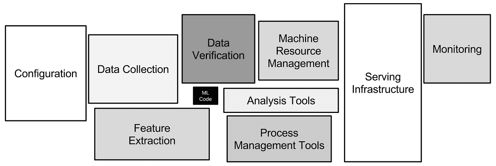
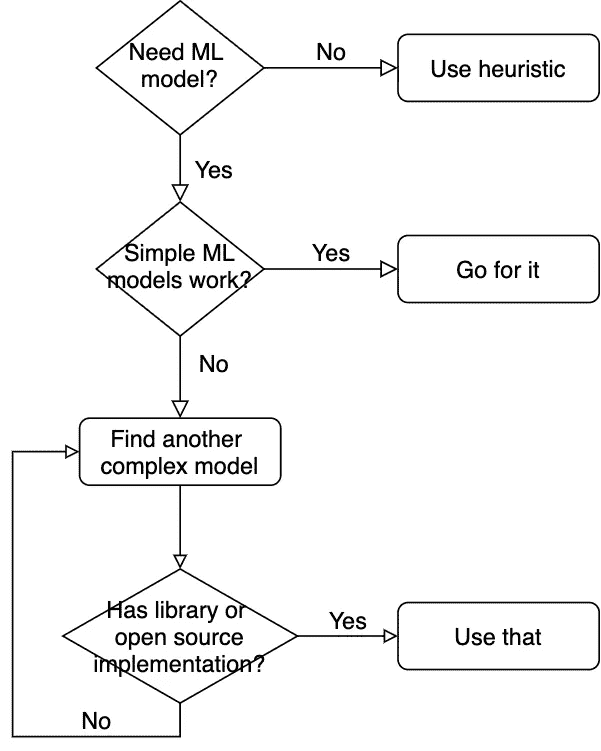

# 学校不教机器学习的东西

> 原文：<https://towardsdatascience.com/machine-learning-stuff-schools-do-not-teach-f2869f964b78?source=collection_archive---------11----------------------->

## 现实生活中的机器学习项目不仅仅是机器学习。

马库斯·温克勒在 [Unsplash](https://unsplash.com/s/photos/machine-learning?utm_source=unsplash&utm_medium=referral&utm_content=creditCopyText) 上的照片

如果你是一个渴望进入这一领域的机器学习/数据科学爱好者，那么很有可能你一定上过 Coursera 或 Fast.ai 的深度学习专业，或者来 Kaggle 练习和打磨过你的技能。这些都是很好的学习材料，将为你提供扎实的知识和良好的培训经历。

然而，从训练场到战场还有很大的距离。学校、课程、竞赛只关注机器学习算法，这在现实生活中的机器学习项目中只占很小一部分。还有一些其他的东西，课程和比赛是帮不上忙的，只有当你的脚在现实世界中站稳了，你才能学会。

作为一名机器学习工程师，一年的工作极大地影响了我的思维模式和机器学习项目应该如何执行的实践。在这篇文章中，我将分享我在第一年学到的一些经验。

# 问题陈述

## 培训:让我们解决问题。现实生活:什么问题？

在上课或参加比赛时，我通常会收到由机器学习专家制作的**机器学习** **问题和**问题。自然，它带有非常清楚的说明:目标、数据集、背景和解释等。我的工作只是处理数据并产生结果，没有任何问题被问及。

在现实生活中，我遇到的是业务团队和/或产品团队要求的**业务问题。因此，应该预料到，在没有提供说明的情况下，问题陈述可能会令人困惑和含糊不清。即使事情看起来很清楚，也不能确定我解释问题的方式和业务团队的是一样的。所以，我的第一个任务不是解决问题，而是向**提问**。**

举个例子:我在一家电子商务公司工作。一天，一位产品经理给了我一件购物品，让我在市场上找出最相似的商品。在考虑协同过滤或其他奇特的算法之前，我需要问一些非常基本的问题，比如:

*   定义物品 X 和物品 y 的“相似度”，同一个品牌？相同的产品类型？还是买产品 X 的用户总是买产品 Y？
*   商业目的是什么？来推荐类似的物品？建立收藏？或者检测重复的项目？
*   我是在建立在线服务还是离线数据库？
*   任务的时间表和路线图是什么？

随着我获得的经验越来越多，我需要开始采取主动，即确定业务需求、提出问题、问自己这些问题并找到自己的答案。

# 数据集

## 培训:我们来分析数据。现实生活:什么数据？

在训练或比赛中，这是一个公平的游戏，每个人都可以平等地访问相同的数据集。结果的质量很大程度上取决于算法。

现实生活不是一个公平的游戏。对于许多企业来说，数据是他们最大的资产，决定项目成功的是数据，而不是模型。我工作得越多，就越发现自己问了一些在学校时从未被关注过的问题:

*   有哪些可用的数据来源？如何访问它们？
*   数据有标签吗？如果没有，如何给它们贴标签？如果是，标签质量好吗？
*   我的算法有足够的数据吗？如果没有，如何获取更多数据？如果有，如何处理这么大的数据？

数据的可用性、质量和数量对项目的每一步都有决定性的影响。如果数据不好，那么每个机器学习模型看起来都是糟糕的选择。**如果数据是好的，那么即使-否则规则也能起作用**。我经常听到人们说数据科学家花 80%的时间寻找和处理数据，现在我知道他们说的是实话。

刚开始工作的时候，经常问同事用什么算法/库。这些天，我问的第一个问题是:“你是如何获得你的训练数据的？”

# 算法

## 培训:让我们建立模型。现实生活:让我们建立管道。

在训练中，数据量小到可以装进单机，项目范围小到可以压缩到单台笔记本。因此，在 Pandas、Pytorch Dataloader 等工具的帮助下，几行代码就可以为模型准备好我的数据。

在现实生活中，事情要完成得多。数据量和项目复杂性要求我处理数据加载、数据处理、模型评估等。，每个都有单独的组件。有时我还需要担心设置机器、调度、数据版本控制、代码版本控制等等。正如谷歌在这篇论文中所阐述的，**机器学习只是项目**的一个非常小的组成部分，因此，最好不要在开始时过多关注它。

机器学习组件只是整个管道的一小部分。图片来自这篇[论文](https://dl.acm.org/doi/10.5555/2969442.2969519)。

随着时间的推移，我形成了一种习惯，即当开始一个项目时，**当务之急是快速建立一个完整的端到端管道**，并用一个小数据集进行测试。此时，我只需要运行东西，性能还不是我关心的。这不仅适用于机器学习组件，也适用于管道的其他部分。**一旦事情开始运行，需要改进的地方就可以被识别出来，然后一次一个地进行改进。**这有助于我轻松确定瓶颈，并为项目制定更好的计划。

## 训练:让我们使用先进的模型，像职业选手一样。现实生活:让我成为 noob。

我曾经认为，使用先进的模型，或者更确切地说，从零开始构建它们，是专业知识的标志。因此，在训练中，为了完善我的投资组合，或者在排行榜上获得 0.01 分，我倾向于选择更复杂、更花哨的模型。我有时间，而且数据集很小，为什么不试试呢？

然而，在现实生活中这样做可能是愚蠢的表现。复杂的模型不太适用，原因有很多:

*   培训要花公司更多的钱。
*   它需要花费更多的时间来设置，并且对于每次训练迭代来说更是如此。这减少了我发现问题并做出改进的反馈循环的数量。
*   其结果更难解释。想象一下，如果我使用 XLNet 进行垃圾邮件检测，结果会变得很糟糕，我不知道在这 340 万个参数中，哪里出错了。
*   我的瓶颈可能是别的，而不是模型。想象一下，如果我花了 2 周时间构建多层集成模型，只是为了意识到糟糕的性能是因为我的地面真实数据被错误地标记了。

因此，我目前选择机器学习模型的程序如下:

我选择算法的程序。

我学到的关于算法的其他一些经验:

*   **领域知识和良好的数据可以击败任何模型。**
*   目标不是建立模型，而是在合理的时间和资源内解决问题，并产生合理的结果。

# 估价

## 训练:预测完成，工作完成。现实生活:没那么快！

在培训中，评估指标与问题一起明确定义。还有一个排行榜，用来比较我的型号和其他型号的性能。因此，当我的模型输出结果时，我可以马上提交结果，瞧，任务完成了。

在现实生活中，事情不会在预测完成后就停止。

*   更多的时候，我需要自己定义评估指标，这并不总是微不足道的。
*   输入数据通常是有噪声的，因此来自训练测试分割的结果可能是不可靠的。因此，需要一种更有说服力的评估方法，如人工检查，或 A/B 测试。
*   模特的良好表现是一回事，得到经理的认可是另一回事。恰当的沟通，好的故事，以及具体的支持数据，总是需要的。
*   输出的数据/模型/服务需要正确地传递给管道的下一个过程，以及正确的文档。

# 结论

很多课程只是关注机器学习算法，大部分比赛只是建立机器学习模型。然而，算法和模型只是现实项目中非常小的一部分。一个执行良好的项目还需要适当的问题陈述、良好的数据源、坚实的工程结构、顺畅的数据管道、可解释的结果以及可靠、令人信服的评估指标。

以上只是我作为机器学习工程师工作第一年后学到的许多宝贵经验之一。查看我以前的一些帖子[这里](/how-i-moved-from-physics-to-data-science-457340e39902?source=friends_link&sk=803ae880c3a624879be2bfc5ef211285)和[这里](/acing-the-data-science-take-home-assignment-530a93164e52?source=friends_link&sk=7e62d53f5432d8d92a47bfddca3d69d1)，并继续关注更多有趣的故事。

感谢您的阅读。