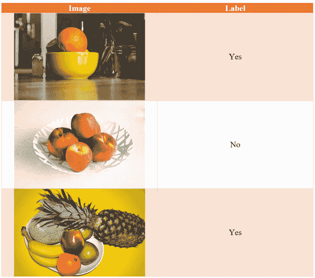
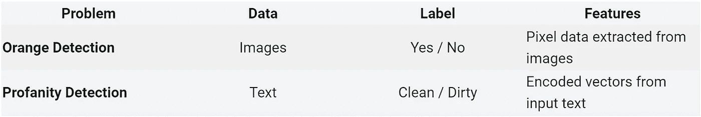
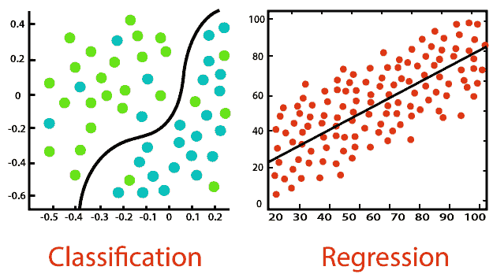

# 机器学习:监督学习

> 原文：<https://towardsdatascience.com/machine-learning-supervised-learning-8c5331c485f5?source=collection_archive---------60----------------------->

图片由[亚历山德罗·迪·克雷迪科](https://unsplash.com/@aledicredico) 在 [Unsplash](https://unsplash.com/photos/aIY9yXHMX28) 上拍摄

## 就像人类能区分果酱和果冻一样(或者我们能吗？)，在机器学习的帮助下，现在机器也可以对它们看到的物体进行标记和分类。但是他们必须为此接受训练。让我们看看这意味着什么…

在这篇文章中，我想回顾一下机器学习中一个非常重要的话题——监督学习。这是业内使用的最流行的机器学习形式。看完这个帖子:

*   你将能够理解什么是监督学习以及它是如何工作的
*   你将了解监督学习的类型
*   您将了解一些示例算法和实际应用

我们可能想先从基础开始，快速浏览机器学习的定义，以涵盖所有基础。

# 机器学习

机器学习是一个与构建系统或程序有关的研究领域，这些系统或程序能够在没有明确编程的情况下学习。机器学习系统接收大量数据，然后*从中学习*模式和标签，基本上是根据从未见过的数据预测信息。

从感悟中学习| *形象由* [*布拉塞克*](https://unsplash.com/@goumbik?utm_source=unsplash&utm_medium=referral&utm_content=creditCopyText) *上* [*下*](https://unsplash.com/s/photos/analytics?utm_source=unsplash&utm_medium=referral&utm_content=creditCopyText)

下面是机器学习的一个流行定义:

> *如果由 P 测量的计算机程序在 T 中的任务上的性能随着经验 E 而提高，则称该计算机程序从关于某类任务 T 和性能测量 P 的经验 E 中学习*
> 
> [*汤姆·米切尔*](http://www.cs.cmu.edu/~tom/)

我知道这很难完全理解，所以让我把它分解成更简单的术语。将*经验*视为数据，将*任务*视为利用该数据预测某事，将*绩效评估*视为预测实际上是否正确的答案。

让我们举个例子。假设我们正试图为 Google 构建下一代垃圾邮件过滤系统，以便直接在 Gmail 中使用。这将意味着*体验*将接收数百万封电子邮件，*任务*将预测特定电子邮件是否是垃圾邮件，而*性能*将通过分析该系统的预测实际上是否正确来衡量。

垃圾邮件与非垃圾邮件|图片由埃克塞特大学提供

# 机器学习模型

机器学习模型是一种算法，它已经用某种特定类型的历史数据进行了训练，通过将它应用于从未见过的数据来预测某些事情。它可能是一个类别标签、一个数值，甚至可能是数据中一些有趣的模式，以构建有影响力的见解。

机器学习模型的这项任务完全取决于手头的问题，这也决定了我们要使用什么样的数据。我们试图解决的机器学习问题也决定了我们实际上如何处理这个问题。
我们在训练数据中有输出吗？
如果是，输出什么样的数据？离散类还是数值？

作者的完美(角色)模型| *图片*

培训记录由**特征**组成。顾名思义，它们是我们正在处理的数据的属性——数据所涉及的对象的特征或属性。

一个**标签**是一种告诉机器学习模型它应该在新数据中寻找的东西是否实际存在于这个特定的训练记录中的方式——这就是我们正在预测的。这些是离散值，机器学习模型可以预测从未见过的数据。对于这样的机器学习问题，特征是输入，标签是输出。

机器学习模型可以工作的另一种方式是通过预测**数值**。假设我们正在处理汽车数据。我们有过去 10 年的汽车价格数据。该数据包含诸如公司、制造年份、功率、汽车类型等特征。等等。作为特征，当然汽车价格作为输出。在这种情况下，我们将建立一个机器学习模型，它会吸收所有这些特征，并告诉我们新车的价格。

你认为这要花多少钱？|图片由 [Yerson Retamal](https://pixabay.com/users/voltamax-60363/?utm_source=link-attribution&utm_medium=referral&utm_campaign=image&utm_content=4629329) 来自 [Pixabay](https://pixabay.com/?utm_source=link-attribution&utm_medium=referral&utm_campaign=image&utm_content=4629329)

回到我们的 Gmail 垃圾邮件过滤器，我们会用数百万封电子邮件来训练机器学习模型。在这种情况下，特征将是电子邮件主题、电子邮件正文、电子邮件:发件人字段等。每封邮件我们都会贴上“垃圾邮件”或“非垃圾邮件”的标签。通过这种方式，模型可以区分哪些电子邮件要通过，哪些电子邮件要过滤掉。

当然，会有大量的数据预处理，以编码或嵌入的形式将文本和电子邮件内容的其余部分转换为机器学习模型可以理解的内容。如果你想更深入地了解机器学习或数据预处理的定义，一定要看看这些文章

 [## 那么什么是机器学习呢？

### 你可以很容易地找到许多机器学习的流行用例。我敢肯定，当你需要购买新的…

thedatascienceportal.com](https://thedatascienceportal.com/posts/so-what-is-machine-learning/)  [## 数据预处理:概念

### 本文的目的是介绍数据预处理中使用的概念，数据预处理是机器…

thedatascienceportal.com](https://thedatascienceportal.com/posts/data-preprocessing/) 

机器学习有两种形式:

1.  监督机器学习
2.  无监督机器学习

本文的范围仅仅是解决有监督的学习，但是不要担心，当你向下滚动时，你会发现一篇专门讨论无监督学习的文章的链接🙂

# 监督学习

监督学习是机器学习的一种形式，其中我们的机器学习模型的输入和输出对我们来说都是可用的，也就是说，我们通过简单地查看数据集就知道输出会是什么样子。“受监督”这一名称意味着输入要素与其各自在数据中的输出之间存在关系。我们实现的任何机器学习算法的目标都是通过估计这种关系来预测从未见过的数据的新的但相似的输出。

大图描绘的数据集| *图片由* [*Unsplash*](https://unsplash.com/s/photos/fruit-basket) 组成

例如，像识别任何图像中是否存在橙子这样的问题是机器学习模型可以处理的。另一个，可能更有用一点，可以识别某段文本是否包含亵渎。

你可以看到这两个问题显然是非常不同的。让我们看看下表:

数据集比较|按作者分类的图像

但同时，这两个问题又很相似……怎么会呢？

在这两种情况下，我们将使用数据训练一个机器学习模型，其中每个训练记录和实际数据都包含一个标签。该标签将告诉我们橙色是否出现在图像中(是/否)，或者在特定文本中是否确实存在亵渎(干净/肮脏)。换句话说，机器学习模型应该从一组已知的可能结果中选择结果。这组可能的结果由数据中存在的标签组形成。该模型试图在其训练期间学习输入特征和输出标签之间的关系。

*   在垃圾邮件检测问题中，该模型将分析新邮件，并为其给出“垃圾邮件”或“非垃圾邮件”的标签
*   在橙色检测问题中，模型将分析新图像，并告诉我们图像中是否存在橙色——“是”——或“否”

现在，如果我们重温之前的汽车价格预测问题，我们会注意到它也有些类似。这里的数据也包含了每辆汽车的特性，如公司、制造年份等。等等。随之而来的是价格。在这种情况下，机器学习模型应该根据它在训练期间从历史数据中学习的关系来估计或预测新车的价格。

基于此，现在让我们进入本文的最后一部分。监督机器学习问题可以有两种类型:

*   分类
*   回归

# 分类

垃圾邮件过滤器、橙色检测问题和亵渎检测问题是机器学习问题，其中我们似乎有正确定义和离散的标签作为输出。因此，机器学习模型只需根据它在训练期间从历史数据中学习到的内容来告诉我们标签。这种监督学习称为分类。

那些离散的标签通常被称为类，任何这样的监督机器学习问题都被称为分类问题。一些最流行和最广泛使用的机器学习用例是分类问题，因此一些最广泛使用和实现的机器学习算法是分类算法。仅举几个例子:

*   朴素贝叶斯分类器
*   k-最近邻
*   逻辑回归
*   支持向量机
*   决策树
*   随机森林
*   神经网络

分类 vs 回归| *图像通过* [*分析 Vidhya*](https://www.analyticsvidhya.com/blog/2020/04/supervised-learning-unsupervised-learning/regression-vs-classification-in-machine-learning/)

# 回归

之前的汽车价格预测问题是一个机器学习问题，其中我们没有离散的标签或类别，而是根据每辆汽车的价格，我们有连续的数值。通过对历史汽车价格数据进行训练，机器学习模型将学习汽车功能与其价格之间的关系。然后，它将能够通过观察新车的特征来预测其价格。

在这种情况下，我们有一个连续的输出变量，一个数值，它直接取决于存在的特征。对于监督回归问题，人们谈论最多的用例之一是股票价格预测。虽然很难找到训练模型的完美数据集，但人们使用样本数据的回归技术来粗略估计真实世界的情况，以便在股市中做得更好。回归中的一些算法:

*   线性回归
*   多变量回归
*   套索回归
*   里脊回归

我希望这篇文章能让你对监督机器学习这个话题有所了解。这是数据科学和机器学习中一个非常重要的话题，比其他一些很酷的东西更容易理解和解释——这在商业世界中非常有价值。在商业世界中，ML 模型的可解释性是非常可取的，因为大量的资金被投入到每一件事情中，并且期望模型输出不仅被商业界理解，而且被消费者理解。

感谢您的阅读！

*原载于 2020 年 11 月 15 日*[*【https://thedatascienceportal.com】*](https://thedatascienceportal.com/posts/supervised-learning/)*。*如果您喜欢这篇文章并希望看到更多此类内容，请访问数据科学门户网站！

无监督的机器学习—

 [## 机器学习:无监督学习

### 这里发生的事情是，我们完全基于我们真正看到的东西进行模式识别，这也是…

thedatascienceportal.com](https://thedatascienceportal.com/posts/unsupervised-learning/)  [## 数据科学门户

### 我肯定你上过网飞、脸书和 YouTube。你看到你喜欢的东西，你和它互动-你喜欢一个…

thedatascienceportal.com](https://thedatascienceportal.com)