# 用于调查报告的机器学习技术

> 原文：<https://towardsdatascience.com/machine-learning-techniques-for-investigative-reporting-344d74f69f84?source=collection_archive---------22----------------------->

## 一个简短的机器教程，介绍了一系列分析数据、发现偏差和做出预测的技术，以及所有这些如何有助于向编辑推销新故事。


来源:Dreamstime

当你想到新闻业中的机器学习(ML)时，你听到的例子往往是大胆的。有些非常复杂，并且是为非常具体的用例定制的。例如，机器学习模型可以被记者用来识别泄露给国际调查记者联盟的 20 万份文件中的商业计划、财务报表或纳税申报表。

诸如此类的例子令人眼花缭乱。但问题是，对于刚刚起步的人来说，它们真的没有什么帮助。为了探索机器学习在数据新闻中的用途，我们需要从更基础的层面开始。本教程将从这个层次开始，并希望展示如何让 ML 作为一个记者为你工作。

为什么是这个教程？去年关于“[为你的调查性报道提供开源卫星数据](/how-to-use-open-source-satellite-data-for-your-investigative-reporting-d662cb1f9f90)的教程非常成功，今年的教程采用了类似的机器学习方法。三个部分，从简单开始，越来越复杂。

## 机器学习和特征选择

我们来看看机器学习和特征选择(特征选择的解释者[这里](https://machinelearningmastery.com/feature-selection-with-real-and-categorical-data/))。目标是在以自动化方式分析数据的过程中帮助您。更不是胡乱预测。听起来有点适得其反？您将很快看到它在数据调查中是如何有用的。

在我们开始之前，我想强调我不是专家，只是一个爱好者。我在我的报道中使用了一些技巧，真的只是为了让我的生活更轻松。数据科学的复杂性有一个完全不同的世界。我们只会触及表面，让它变得实用和有用

**你需要什么:**

您需要在笔记本电脑上安装 R:

= >下面是[如何在 Mac OC 和 Windows 上安装 R](https://courses.edx.org/courses/UTAustinX/UT.7.01x/3T2014/56c5437b88fa43cf828bff5371c6a924/)。

= >如何安装 R 的集成开发环境 [R-Studio](https://medium.com/@GalarnykMichael/install-r-and-rstudio-on-mac-e911606ce4f4)

我们将向您展示如何为分类和回归任务进行特征选择。数据科学家一直使用它来提高模型的性能，同时优化训练时间。但是在这里我们不太关心这个。对我们和我们的读者来说，更有趣的是我们的数据是如何运转的。在几个例子中，我们将向您展示如何回答诸如“*是什么让我们的数据中的某些人口统计数据投票给英国退出欧盟？*’(第一部分)，*什么对臭氧读数影响最大？*’(第二部分)和’*什么特征让人们赚得更多(以及)我们在数据中是否发现了偏见的痕迹？*’(第三部分)。

# **“递归划分和回归树”方法:**

## 一个两秒钟的介绍，介绍 journos 如何在他们的故事中使用树模型和可视化:

阿曼达·考克斯的故事就是一个最好的例子。她在为《纽约时报》报道美国大选结果时使用了这个词。

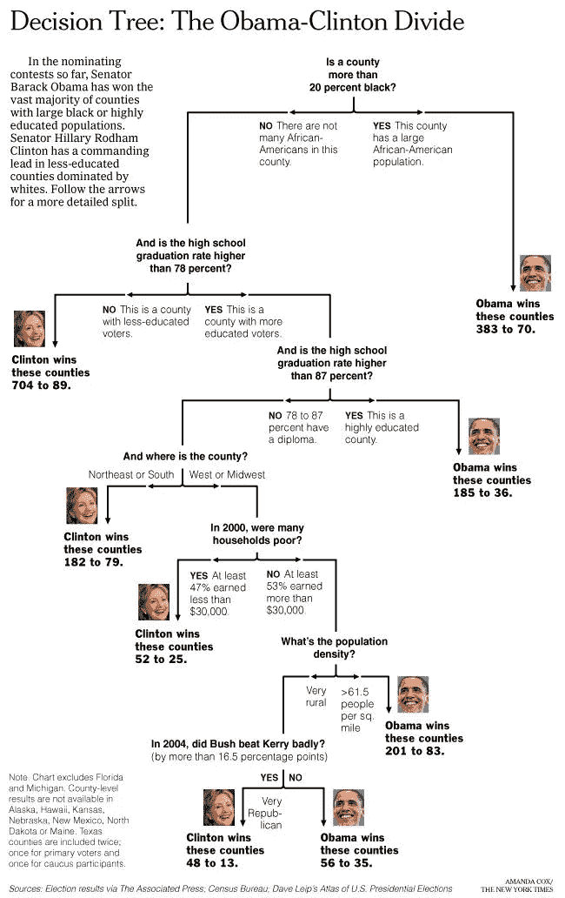

阿曼达·考克斯·NYT

另一个例子是 Stefano Ceccon 的。他为《泰晤士报》数据团队建立了一个英国选举分类树。

几年前，我使用 R-Studio svg 输出功能为英国《金融时报》一项关于中国 iPhone 购买习惯的消费者调查绘制了一幅可视化图。


2017 [英尺](https://t.co/Bpnu4agg6Y?amp=1)件

决策树模型在记者中很受欢迎，因为它们本质上很简单，更容易向读者解释。有人称之为直觉。为什么直观？有人说它们类似于人类在分类方面的决策。如果一个人知道数据中的所有概率，他或她会采取类似的行动。用于回归和分类任务的其他模型类型可能与此非常不同。决策树的图形输出也有助于向编辑推销。我们在上面看到了一些例子。

决策树模型从一开始就有一些缺点:与其他模型类型相比，它们的预测准确性可能较低。此外，数据中的微小变化可能会导致最终树的显著变化，从而降低树的健壮性。在我们下面的随机 Forrest 编码示例中，我们将展示如何通过在一个模型中聚集许多树而不是一个来克服这个问题。还有像[装袋](https://rpubs.com/kangrinboqe/268745)和[助推](https://datascienceplus.com/gradient-boosting-in-r/)这样的方法可以帮助你的模型。

## 1.英国退出欧盟的例子

我们将使用英国选区的数据集来调查哪些因素促成了英国的英国退出欧盟投票。我们考虑各种年龄和投票人口统计。我们想知道哪些列对投票最有预测性。

我合并了人口普查数据和 2016 年英国退出欧盟公投的数据。现在，想象一下这个包含 32 列的数据集放在您的桌子上。你的编辑要求你调查你的后续报道应该密切关注哪些人口统计数据。

> 对脱欧投票最有预测力的是什么？

这里的主要关注点是选民是否投票支持脱欧。所以二进制分类。如果投票份额高于 50 %,则“Leave.percent”采用因子值“Leave ”,如果低于 50 %,则采用“remain”。

让我们用下面的代码将数据加载到 R-studio 环境中。

我们在数据中的变量的品尝者:

*   类型: ***苏格兰*** 或 ***英格兰/威斯区***
*   人口的年龄: ***年龄. 0 至. 4*** ， ***年龄. 5 至. 9*** ， ***年龄. 10 至. 14*** …
*   计票: ***有效票、*******否决票%***等。*
*   *最终变量，输出结果变量:' ***'百分比。离开***’。'要么' ***离开*** '要么' ***留在*** '*

*现在我们需要一个模型。这是一个分类任务。决定' ***是离开*** 还是' ***保持。*** 所以我们选择决策树模型。这是监督学习中使用最广泛、最实用的方法之一(简短说明[此处](https://medium.com/@chiragsehra42/decision-trees-explained-easily-28f23241248))。为了适应决策树模型，我们使用了 ***rpart*** 包(rpart [包的插图](https://cran.r-project.org/web/packages/rpart/vignettes/longintro.pdf))。*

*rpart 只是在 r 中创建“递归分区和回归树”的一个选项。运行它的一般格式是(不要运行它):*

*该函数的第一个参数是一个模型公式，符号{(波浪号)代表“被建模为”。在波浪符号的左边，我们告诉模型结果变量。在我们的例子中是“百分比”。离开”(这是‘离开’还是‘留下’)。在右边，我们命名所有我们希望模型考虑的变量。*

*因为我们想探索对“百分比”来说什么是最重要的。“离开”，我们将所有其他 31 个变量/列抛向模型。我们用“百分比”来表示。离开~。”(圆点是数据中“所有其他变量”的缩写。它节省了我们的工作，因为我们不必写出数据中的所有变量:*'百分比。离开~类型+编码+全部。居民+0 岁至 4 岁+10 岁至 14 岁…'。**

*我们需要把数据分成两组。我们稍后会检查准确性。我们对我们的测试和训练数据应用 70:30 的分割(这不是一成不变的，而是通用的方法。有人不同意[这里](https://www.researchgate.net/post/Is_there_an_ideal_ratio_between_a_training_set_and_validation_set_Which_trade-off_would_you_suggest)。如你所料，训练集[英国退出欧盟 _ 训练]是用来训练模型的。测试集[英国退出欧盟测试]是一个虚拟的生产环境，以测试预测，评估准确性和条件。*

*现在，在加载包之后，让我们构建。我们的*英国退出欧盟 _ 模型*如下:*

*在 R-Studio 控制台上，您现在应该可以看到所有分割的统计数据。*

*让我们用 rpart.plot 可视化我们的决策树(vignette [这里](http://www.milbo.org/doc/prp.pdf)):*

*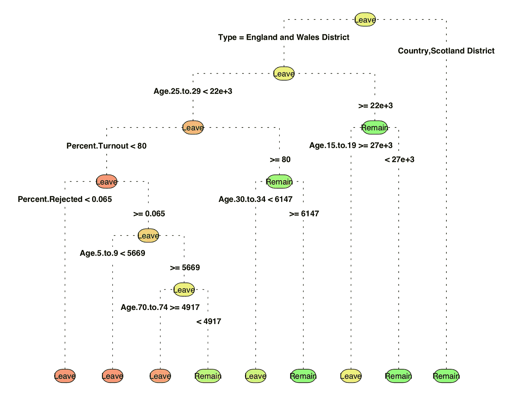*

*我们可以改变我们的决策树可视化，以获得更有说服力的演示。一个选择是 [ggparty](https://github.com/martin-borkovec/ggparty) 包，在引擎盖下使用 [ggplot](https://ggplot2.tidyverse.org/reference/ggplot.html) (向新 [ggparty](https://github.com/martin-borkovec/ggparty) 包的创建者马丁·博尔科维克和尼亚兹·马丁致敬，同时查看路易斯·维德·阿雷戈蒂亚关于此事的[帖子](http://Arregoitia))。*

*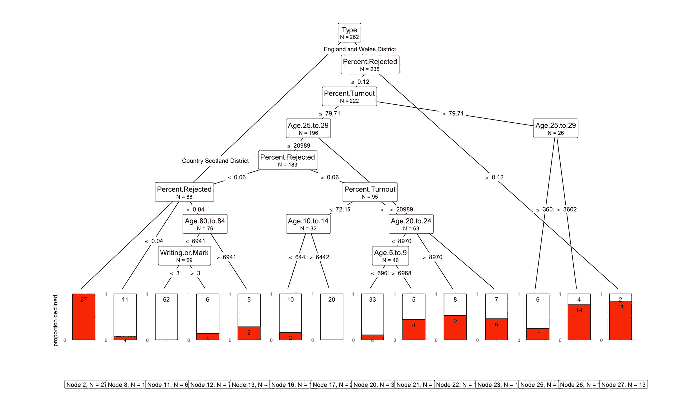*

*[ggparty](https://github.com/martin-borkovec/ggparty) 型号:ctree*

*这种表示法的好处是，我们可以在节点级别获得关于观察值数量的明确数据，以及定义分裂的预测值(Arregoitia)。*

*从上面的两个视图中，我们已经可以看出*类型以及一个特定的年龄人口统计比其他 29 列更重要。**

****修剪树:****

**修剪决策树意味着修补我们的决策树 ***rpart*** 模型中的 CP 参数。我们想减少交叉验证的误差。为了得到最优 CP，我们使用***plot CP****来绘制它*。****

***printcp* 和 *plotcp* 揭示了每个 nsplit 的交叉验证误差，并可用于“修剪树”。交叉验证误差(xerror)最小的一个就是 CP 的最佳值。**

**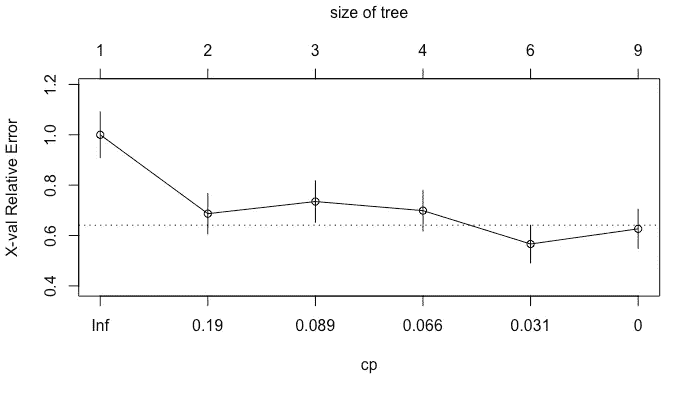****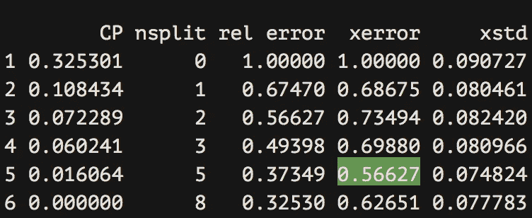**

**最佳复杂度参数(CP)值在具有最低 xerror 值的行中。**

**我们相应地更新了基本模型:**

**有了我们修剪过的树模型，让我们计算树的 ***精确度*** 。请记住，我们测试的是之前放在一边的看不见的测试数据:**

```
 **[Output]: 0.9292035**
```

**我对自己 92%的准确率感到满意。你叫什么？**

**但是如果我们想快速知道哪些变量在你训练好的 ***rpart*** 决策树模型中最重要呢？我们可以简单地获取***variable . importance***参数并用 ggplot 可视化它。这可能是编辑在决定是否把故事委托给你时唯一真正感兴趣的部分。**

**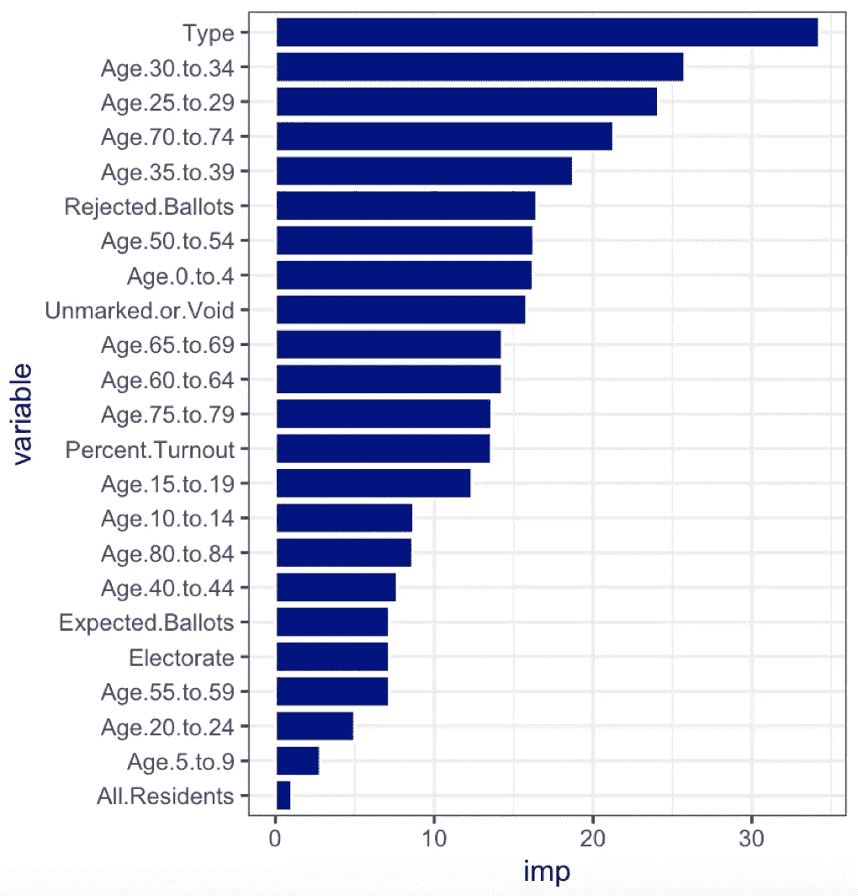**

**啊！我们发现，对于我们的车型类型(威尔士/英格兰或苏格兰)以及 25 至 34 岁年龄段的人口统计数据，有一些最大的“信号”。本身并不是突破性的新闻。但是请在您的下一个包含数百个列的分析速度的背景下查看它。您自己的数据探索过程现在仅使用几行代码来告诉您的编辑数据框中有什么。**

****Boruta 方法:决定放弃哪个特征，保留哪个特征:****

**另一种选择特性的方法是使用 Boruta 和同名的 R 包。“Boruta”可以用来决定变量是否重要。这是一个基于 ***随机福里斯特*** 模型的特征选择算法(下面是一个详细的例子)。**

**有趣的事实:博鲁塔这个名字来自斯拉夫神话中的一个恶魔，据说他住在松树林里。没印象？更多在此[贴](https://www.analyticsvidhya.com/blog/2016/03/select-important-variables-boruta-package/)。**

**让我们执行 Boruta 搜索:**

```
**[Output]:
# Boruta performed 99 iterations in 15.63705 secs.
# 29 attributes confirmed important: Age.0.to.4,
# Age.10.to.14, Age.15.to.19, Age.20.to.24,
# Age.25.to.29 and 24 more;
# 1 attributes confirmed unimportant:
# Writing.or.Mark;
# 1 tentative attributes left: No.Official.Mark;**
```

**绘制它:**

**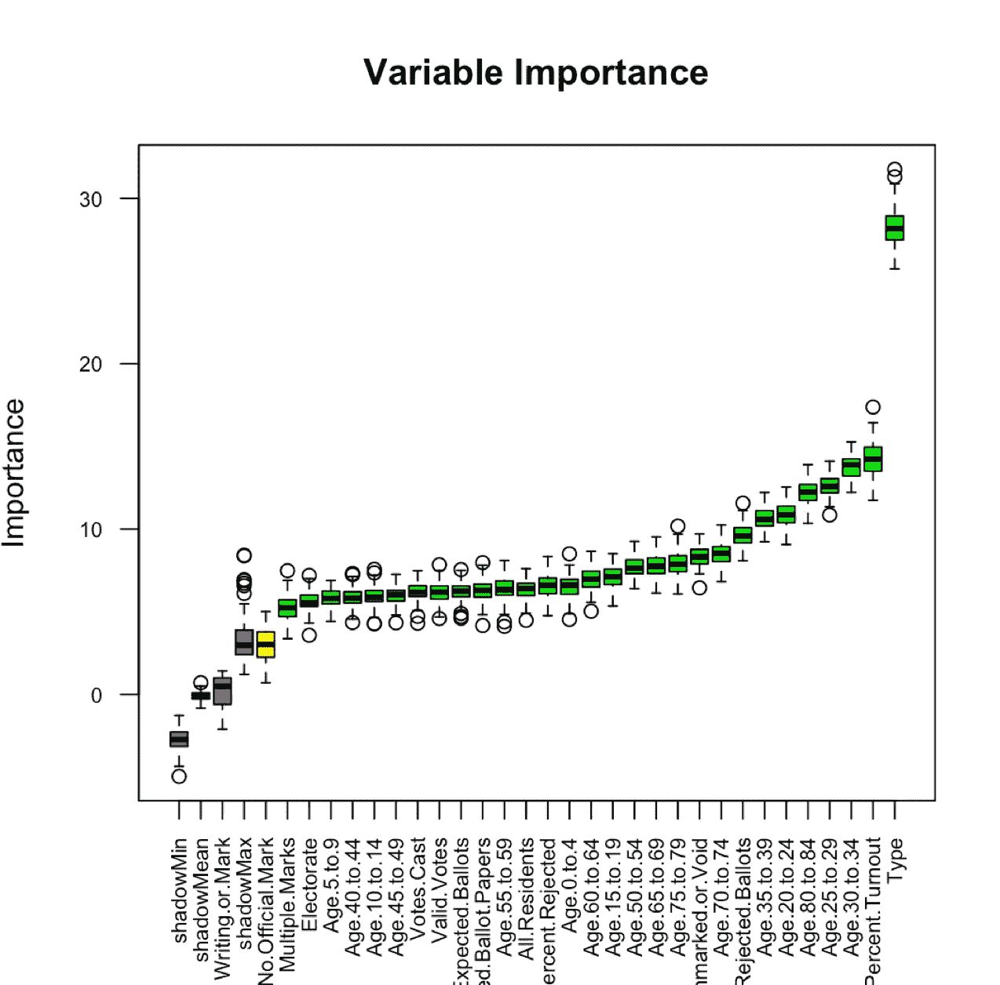**

**用于功能选择的 Boruta 包**

**太好了！右边是你非常重要的特征。令人高兴的是，箱线图还显示了异常值，亮绿色的最小值、最大值、第一个和第三个四分位数、中间值以及四分位数之间的范围(关于箱线图的信息[此处为](/understanding-boxplots-5e2df7bcbd51))。**

# ****2。数值数据:通过'*相对重要性* ':** 找到有价值的变量**

## **示例:臭氧数据集**

**如果你有数字数据要分析和预测，一个选择是线性模型(lm，这里是解释者)。我们可以使用它来执行回归任务，也可以用于单层方差分析和协方差分析。相对重要性为我们提供了一种方法来决定哪些变量对我们的研究有最大的价值。**

**首先，我们将臭氧水平数据读入 R(感谢[塞尔瓦·普拉巴卡兰的 GitHub 账户)](https://github.com/selva86/datasets)。**

**现在，因为我们所有的列都是数字数据，所以我们可以运行一个关联图来查看哪些列相关。您可以使用 PerformanceAnalytics 包来实现这一点(但是还有许多其他的包)。**

**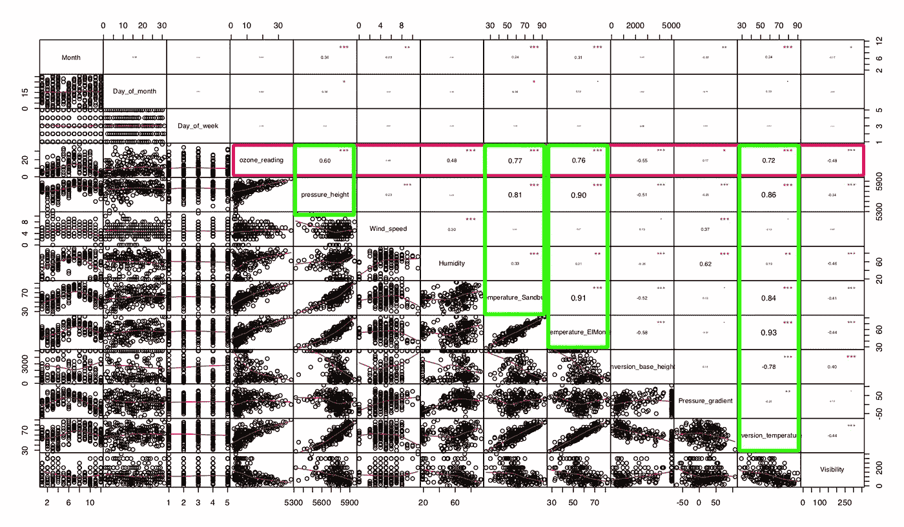**

**PerformanceAnalytics viz(作者的红线和绿线)**

**假设我们对作为结果变量的臭氧水平感兴趣。从图中我们已经可以看出哪些特征与*臭氧读数*相关。那么，哪一个数值变量(与之前英国退出欧盟数据中的分类变量相反)对臭氧水平影响最大呢？**

**使用 calc.relimp { relaimpo }，输入 lm 模型的变量的相对重要性，我们可以确定相对百分比:**

**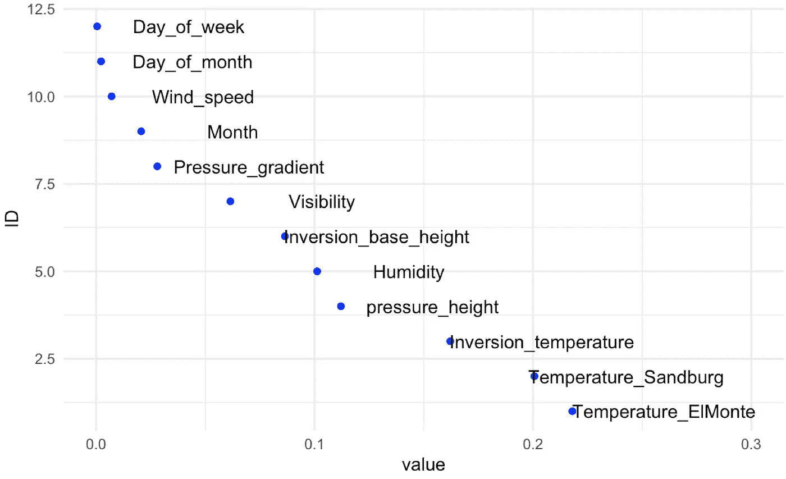**

**我们的模型表明，“温度 _ 艾尔蒙特”相对来说比“温度 _ 桑德堡”更重要(尽管在我们的相关图中相关系数略高)。从这里，您可以开始更传统的数据驱动的报告，并调查为什么这个变量会出现在顶部。**

# ****3。途径** **【随机森林】****

## **示例:带有随机福里斯特的收入数据集**

**在最近的一次调查中，我检查了[西米德兰兹郡警察罪犯预测模型](https://eandt.theiet.org/content/articles/2019/09/ai-offender-prediction-system-at-west-midlands-police-examined/)是否可能因在训练模型中包含有争议的数据集而遭受种族偏见。运行随机 Forrest 可以帮助您发现执法数据模型中使用的数据的偏差。**

**下面我们看到了西米德兰兹郡警察部队的模型中最重要的预测因素列表。如果你对可能有争议的模型进行调查，我建议让数据科学家公开他们的特征重要性。这可能会带来有价值的报道。**

**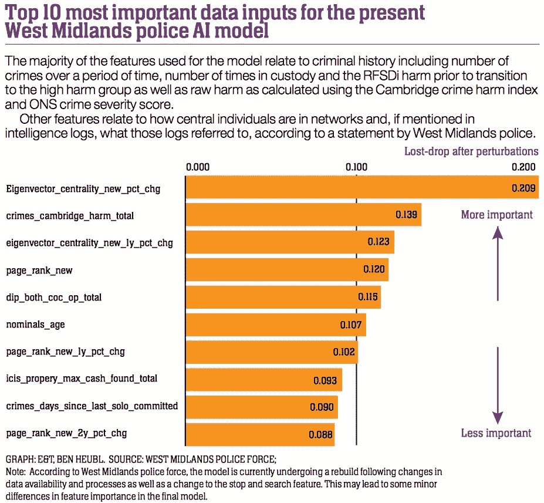**

**E&T 关于[西米德兰兹郡警察罪犯预测模型](https://eandt.theiet.org/content/articles/2019/09/ai-offender-prediction-system-at-west-midlands-police-examined/)的调查**

**出于我们的目的，我们将使用一个关于人口统计和工资的普通数据集。但这种数据可能来自泄漏或数据泄露。我们的数据列出了超过 8，000 个人的各种人口统计数据(这是一个常用于训练模型的数据集)。让我们假设一个告密者把这些数据通过电子邮件发给你。也许它来自你正在调查的一个有争议的实体。你的编辑要求你检查人们工资背后的驱动力。偏见有什么合理的说法吗？**

**在收入数据集中，我们有 14 个变量(包括性别，婚姻。状态等。).**

**我们将建立一个随机福里斯特模型来分类收入阶层。然后检查特征重要性。我们还将优化我们的模型，并针对传统的决策树模型运行它(类似于本教程第一部分中关于英国退出欧盟数据的内容)。哪个表现更好？).**

**让我们把数据载入并混洗一下。然后替换 NAs(空单元):**

**我们运行一个简单的随机福里斯特模型，并在适当的位置设置默认参数。现在到了有趣的部分。哪些栏目最能说明各种收入类别？**

**不出所料，所有的专栏都贡献了一些份额。但有些人比其他人多得多。职业似乎是最能说明问题的特征，还有年龄。顺便说一句，这类似于天普大学的研究人员在什么对未来财富影响最大的问题上的发现。如果性别和种族排名靠前(或靠后),这就提出了一些有趣的问题，我们作为记者可能想继续调查。**

**我们不是为此而来。但是它可以给你一个钩子来进一步调查对群体的偏见或不公平待遇。**

**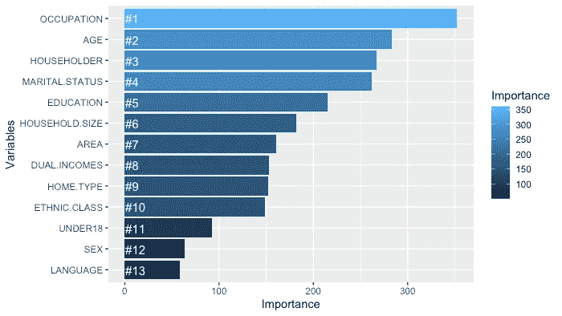**

**其他后续调查可能需要说明哪些职业在每个收入类别中被提及的频率最高？我们为此创建了一个模式函数。你看到我看到的了吗？**

```
**[Output]:
INCOME mode 
1 -10.000) Student, HS or College 
2 [10.000–15.000) Clerical/Service Worker
3 [15.000–20.000) Professional/Managerial
4 [20.000–25.000) Professional/Managerial
5 [25.000–30.000) Professional/Managerial
6 [30.000–40.000) Professional/Managerial
7 [40.000–50.000) Professional/Managerial
8 [50.000–75.000) Professional/Managerial
9 [75.000- Professional/Managerial**
```

****优化随机福里斯特模型****

**随机森林模型使用如上所示的默认参数运行，但仍有改进的空间。我们可以通过改变“mtry”输入标度(在每个阶段、每个分割点随机采样的变量数量)来微调我们的模型。同时，我们将尝试改变“Ntree”输入(我们种植的树的数量)。).**

**为了方便起见，我们将只对收入阶层进行两种分类:一种是 30，000 英镑以上，另一种是 30，000 英镑以下。**

**为了找到最佳的“mtry”值，我们将遍历每个模型并检查准确性:**

**您的 mtry 值具有最高的平均准确度。**

****关于“Ntree”输入的补充说明**:你不应该把它做得太小，以确保每个输入行至少被预测几次。**

****对比其他模型:**我们这样做是为了看看哪种模型效果最好。决策树和随机福里斯特模型的区别？检查下面。还有大量的其他模型类型(查看[模型列表](https://topepo.github.io/caret/available-models.html)，caret 包可以帮助你)。这些只是其中比较简单的一些。**

**使用 RPART，这个用来建模分类和回归树的包，我们得到了一个被变量分成不同分支的树。为了预测结果，我们对最常见的结果进行了拆分和预测。如第一个示例所示，我们借助 bucket 参数控制了拆分的数量。**

**另一方面，随机森林稍微高级一些。它也适用于分类和回归树，但使用集成学习算法来预测结果。Random Forest 在编译所有树的结果之前构建多个决策树，这些结果最终得出最终结果。**

****随机福里斯特模型与决策树模型:****

```
**[1] 0.7341071**
```

**把这个和你的随机福里斯特模型比较一下:**

```
**[1] 0.7757143**
```

**好样的。你的哪个模特赢了？**

**很好地完成了教程。**

## **其他特征选择技术**

**还有许多其他的特征选择技术。一种叫做**信息价值和证据权重。** R 的[信息值包](https://cran.r-project.org/web/packages/InformationValue/InformationValue.pdf)用于二进制分类。它提供了计算分类变量的证据权重和信息值的函数。还有来自[earth pack](https://cran.r-project.org/web/packages/earth/earth.pdf)e 的 **MARS** ，用于实现基于广义交叉验证(GCV)、变量出现的子集模型数(nsubsets)和残差平方和(RSS)的变量重要性。还有**逐步回归。**假设您有大量的预测值(列> 15)，这有助于您将输入数据分成十个预测值的部分，每个块包含响应值。**

## **R 语言中的机器学习**

**我们只检查了决策树、lm 和随机福里斯特模型。但是还有各种各样的其他模型类型。R caret 包提供了一种以标准方式处理许多模型类型的实用方法。如果你有兴趣，可以看看它的在线手册([这里](https://topepo.github.io/caret/index.html))，你可以使用的模型([这里](https://topepo.github.io/caret/available-models.html))和一个整洁的 R 备忘单([这里](https://github.com/rstudio/cheatsheets/raw/master/caret.pdf))。Caret 是开始其他建模任务的一个很好的资源。祝你好运。**

****教程的数据源和内容:****

**从 Kaggle 网站下载的人口普查数据和公投结果数据。[林克在这里](https://www.kaggle.com/electoralcommission/brexit-results#census.csv)。一些内容受到了 R-statistics.co 和塞尔瓦·普拉巴卡兰以及其他作者发布的代码的启发，比如这位 r-blogger 发布的代码。**

**检查我们的 Selva Prabhakaran 材料。他的网站上有些有价值的东西。收入。臭氧数据集也来自[**Selva Prabhakaran**](https://github.com/selva86)的 [Github repo](https://github.com/selva86/datasets/blob/master/income.csv) 。**

****关于用 Python 做类似的事情:****

**随机森林模型的特征选择可以在 Eryk Lewinson 的教程[中找到。](/explaining-feature-importance-by-example-of-a-random-forest-d9166011959e)**

***本教程是由 Techjournalist 的一名调查记者为 2020 年* [*伦敦记者见面会*](https://www.meetup.com/Journocoders/) *的一次活动编写的。***