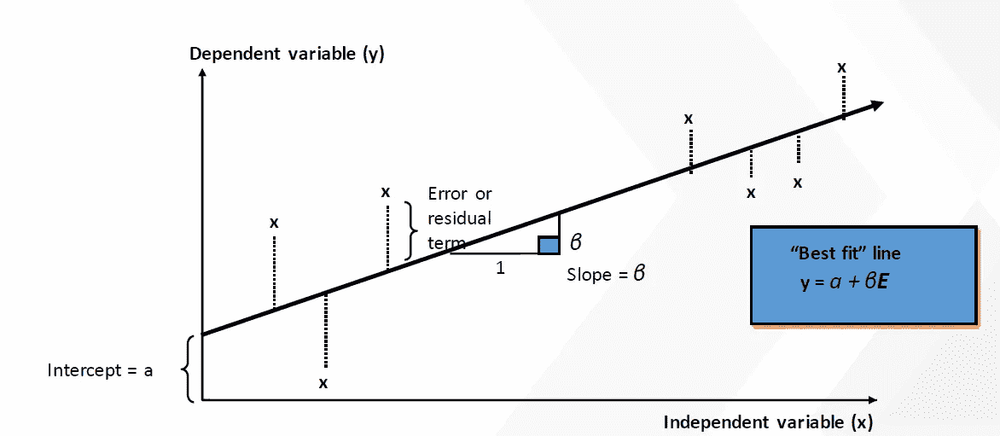
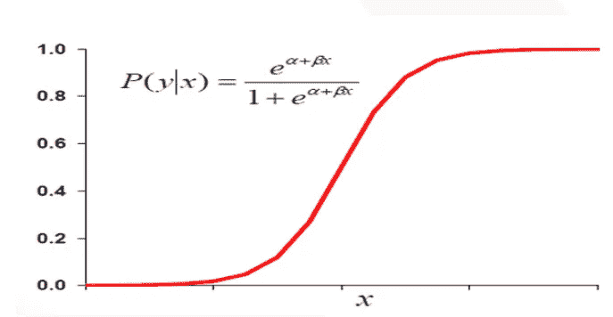
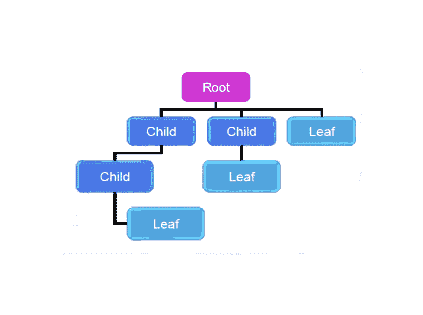

# 5 分钟机器学习技巧

> 原文：<https://towardsdatascience.com/machine-learning-techniques-in-5-minutes-9f4ad7d1733c?source=collection_archive---------35----------------------->

## 5 分钟的机器学习技巧

马库斯·温克勒在 [Unsplash](https://unsplash.com?utm_source=medium&utm_medium=referral) 上的照片

今天，在神经网络的时代，你可能没有太多的时间来研究机器学习技术的细节。但是，你仍然可能想知道机器学习算法是如何工作的，机器学习中最流行的算法是什么，以及算法之间的关键区别是什么。

在本文中，我将帮助您介绍不同的机器学习算法及其用法、关键因素和局限性。我们还将看到一些有助于验证算法的基本指标。

# **线性回归**

在线性回归中，我们试图建立一个模型来解释因变量(Y)和自变量(X)之间的关系。我们的 Y 应该是归一化的，X 和 Y 之间应该是线性关系。

使用的损失函数:RMSE(均方根误差)、MSE(均方误差)、MAPE(平均绝对百分比误差)、MAE(平均绝对误差)

作者图片

误差计算:我们使用误差的平方和(残差)来计算误差，这里的主要目标是最小化残差。我们使用梯度下降来实现，梯度下降使用 Y 轴上的残差和 X 轴上的截距来定义误差平方和最小的点。

# 逻辑回归

这个算法是线性回归的扩展。我们用它来解决分类问题。在这里，Y aka 因变量没有被标准化，并且它与 X 变量没有线性关系。这里的第一步是归一化 Y，我们可以用不同的连接函数来做。在二进制分类的情况下，链接函数的名称是“logit”。并且，95%的分类问题仅基于二元分类。

用于验证的矩阵:精确度、召回率、灵敏度、特异性。

为了定义不同类别的阈值，我们使用 AUC(曲线下面积)和 ROC(受试者操作者特征)。我们用它们来描述使用不同阈值的灵敏度和 1-特异性之间的曲线。无论哪种算法在不同的曲线中提供最大的面积，我们都选择它来用我们的数据建模。

作者图片

# 决策图表

当数据变得复杂时，我们的线性模型无法将数据分成不同的类别。这引入了对非线性的需求。决策树为我们提供了在数据中引入非线性的方法。在这里，我们可以根据不同的决策拆分数据。我们可以使用决策树进行回归、分类和填充缺失值。决策树的优点是易于实现和解释。但是一旦条件增加，模型就变得复杂，这在模型中引入了高方差，导致决策树中的过度拟合问题。

作者图片

# 制袋材料

当决策树面临过拟合问题时，就出现了集成的概念。装袋有助于克服过度拟合问题，使模型不那么复杂。
在这里，我们使用了引导样本的概念，我们通过替换从数据集中获取样本数据。意味着下一次我们可能会再次得到同样的样本。

作者图片

我们获取具有相似列的数据集的引导样本(替换),并基于不同的引导样本，我们创建不同的决策树并获取合并输出。这种合并的方法有助于在合并结果时减少模型的差异，但是模型变得很难解释。

# 随机森林

在 bagging 中，我们使用一组相似的列来获取样本数据，这导致了几乎相同的模型，因为数据的根节点将是相同的，因此，拆分将随之而来。在这里的随机森林中，我们使用一组随机的列进行随机采样，这些列指向不同模型中的不同根节点，最终提供更好的准确性。当我们的模型中存在过度拟合时，随机森林非常有用。这种方法在不同的比赛中也是有帮助的。

# adaboost 算法

当我们的模型中存在拟合不足的问题时，我们使用增强模型。这些是连续模型。提升方法有助于提升不正确输出样本的输出，给予这些样本更高的优先级。Adaboost (Adapting Boosting)是 Boosting 机制的一种，它是基于决策树的，在这里，我们试图给样本更高的权重，这给出了错误的预测。

最终型号= W1M1+W2M2+W3M3+…..WnMn

作者图片

这里，M1 是第一个决策树，W1 是与 M1 关联的权重。每个模型都将有助于校正样本预测集。最后，我们将所有模型结合起来，以获得样本的最终预测值。

# 梯度增强

梯度增强是 Adaboost 的一种改进机制。这里，我们试图通过减少误差来增加/提高模型精度。第一个模型试图找到残差/误差，下一个模型试图解释残差。这样，在即将到来的下一个模型中，误差开始减少。梯度增强处理模型中的欠拟合问题。

# XGBoost

XGBoost 就像全才。它解决了欠装配和过装配问题。它还有许多其他功能，如缺失数据处理、内置的交叉验证机制和正则化。

# 最后

最后，我们已经涵盖了机器学习的所有强大的算法概念。我们观察到，随机森林非常适合过拟合问题，而梯度增强则适合欠拟合问题。最后，我们引入 XGBoost 来处理欠拟合和过拟合问题。

如果你是深度学习技术的爱好者，我有一些优秀的最新资源，可能会让你更好地了解深度学习能力。

*   [构建&部署自定义对象检测模型](/step-by-step-yolo-model-deployment-in-localhost-using-python-8537e93a1784)
*   [增加物体探测的每秒帧数](/no-gpu-for-your-production-server-a20616bb04bd)
*   [物体检测中的数据增强](https://medium.com/predict/data-augmentation-for-custom-object-detection-15674966e0c8)
*   [物体检测的数据标注](https://medium.com/swlh/how-to-label-images-for-object-detection-step-by-step-7ee317f98583)
*   [语言翻译模型深度学习](https://medium.com/swlh/building-a-language-translation-chatbot-in-python-step-by-step-40709393a98)
*   [Azure 数据科学家认证 DP-100 提示](https://medium.com/python-in-plain-english/dp-100-tips-tricks-91a841637fa0)

继续探索数据科学！