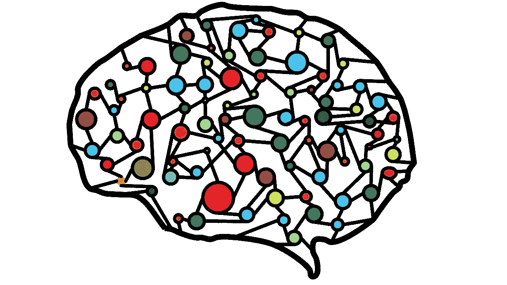
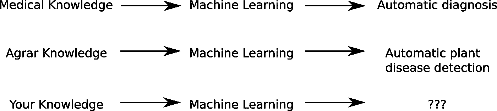
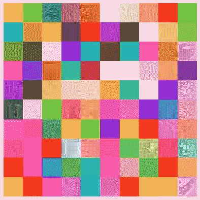
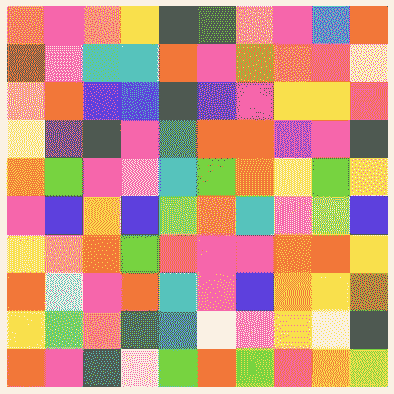
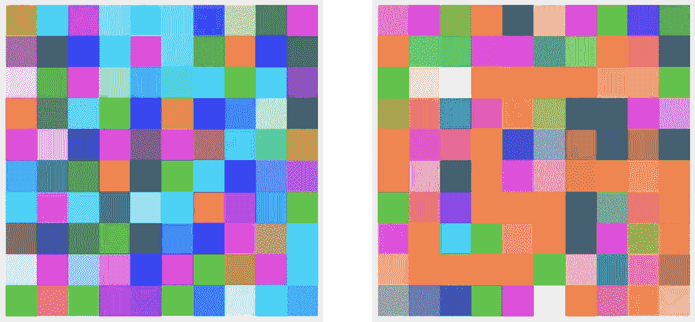
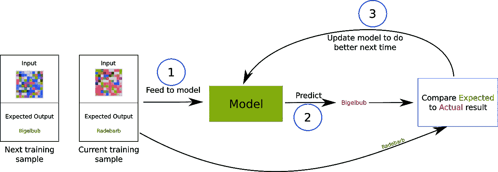
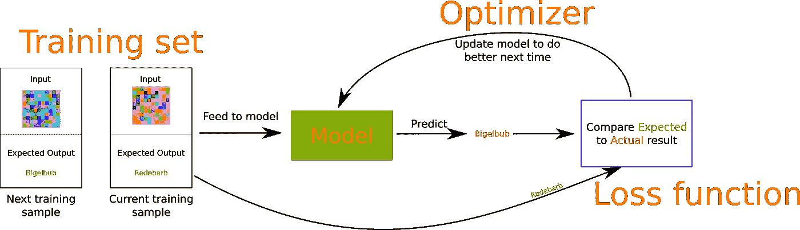

# 机器学习:大图景

> 原文：<https://towardsdatascience.com/machine-learning-the-big-picture-fbdfa2b3c6f9?source=collection_archive---------24----------------------->

## 亲身体验机器如何学习。

演职员表: [ahmedgad @ pixabay](https://pixabay.com/de/users/ahmedgad-9403351/)

# 动机

毫无疑问，你听说过“机器学习”这个术语。它如何成为下一个重大技术，它将如何解决人类将面临的每一个问题。关于这个话题有很多夸张的说法，很多流行词汇满天飞，新闻以惊人的速度产生。

忽略所有的宣传，机器学习真的是一个非常通用的概念。从医学图像的诊断到无人驾驶汽车，它被用于各种主题。

# 连接不同领域的概念性理解

每个人都有自己的专业领域。机器学习是一个只有当它与特定领域的知识相结合时才会变得生动的话题。因此，对任何人来说，理解它的基本原理是非常重要的。

这种理解使任何人都能在自己的专业领域找到机器学习的应用和自动化的机会。

# 任何人都可以做

好消息是:从概念上理解机器学习如何工作不需要任何数学知识，也不是特别难理解。

不要误解:围绕机器学习建立业务、实施或进行研究是困难的。但是了解足够的基础知识，以确定其应用的机会？每个人都能做到。

为了证明这个观点，我将描述一个实验，在这个实验中，你是学习的机器。根据那个实验的结果，我将制定机器学习算法遵循的一般框架。

更好的消息是:一旦你理解了机器学习的一般框架，理解最终会出现的趋势或流行词汇就容易多了。

举个例子:

有人在谈论汽车。他们吹嘘说他们把 V8 引擎换成了 V12 引擎。即使你不知道那些具体的术语是什么意思，你也对汽车的工作原理有一个概念性的了解。简单地说，引擎就是让汽车行驶的东西。考虑到这一点，您可以简化原始语句:

> 我把 V8 换成了 V12
> 
> 我换了引擎
> 
> 我换了能让汽车行驶的东西

# 实验

先说实验。你是测试对象。我将向您展示几张不同的图片，您的目标是告诉我它们属于以下哪个类别:

*   拉德巴布
*   Bigelbub

这些名字对你来说不应该有任何意义，因为它们是我刚刚编出来的。

## 第一阶段

这是第一张照片。是 Radebarb 还是 Bigelbub？

Bigelbub 还是 Radebarb？

即使你不确定这将走向何方，现在就选一门课吧。

正确答案是…拉德巴布。在接下来的实验中要记住这一点。

## 第二阶段

下面是下一张图:

Bigelbub 还是 Radebarb？

正确答案是…又是拉德巴。

## 第 3 阶段

再来两个，就大功告成了:

Bigelbub 还是 Radebarb？

答案是…第一张是 Bigelbub，第二张是 Radebarb。

# 分析

那么我们来分解一下实验中刚刚发生的事情。首先，请注意以下两点:

*   你应该区分两个阶级。类名对你来说没有任何意义。
*   你得到的照片在开始时对你来说没有任何意义。没有熟悉的物体或形状，只有一堆像素

这些都是机器学习模型在训练时面临的前提条件。它没有内在的知识，不知道在它显示的照片上什么可能是重要的，也不知道这些类之间的关系是什么。

## 第一阶段

在这个阶段，你看到了第一张图片。你在这里最多只能猜测。如果我让你写下你对自己的猜测有多确定，答案应该是这样的:

*   50%拉德巴布
*   50% Bigelbub

## 第二阶段

你已经在最后阶段收到了第一点信息。你看到的照片是 Radebarb。在第二阶段，你会看到另一幅图像。

它看起来和上一个没有太大的不同，但是你仍然不知道要找什么。所以也许你对这些课程的信心是这样的:

*   60%拉德巴布
*   40% Bigelbub

## 第 3 阶段

现在越来越清晰了。一张图看起来和前两张一模一样，但另一张图看起来完全不同。这肯定动摇了你的信心:

*   99% Bigelbub 第一张图片
*   第二张图片的 99% Radebarb

## 学习过程

起初，你所能做的就是随机猜测。每次猜中后，正确的类别就会显示出来。有了这些信息，你更新了对‘rade barb’和‘bigel bub’的概念，对这两个类的特征越来越有把握。

这是监督学习的基本概念。下一节将这个概念形式化，并介绍一些常用的符号。

# 机器学习的一般框架

请看下面的流程图:

机器学习的基本框架

这个流程图总结了实验中发生的事情。让我们用它来推导机器学习如何工作的一般框架。

*   **训练集**。对于任何要发生的机器学习，我们需要已知它们属于哪一类的示例图像。最左边的两个框显示了两个这样的图像/标签对。用于训练模型的所有图像/标签对的集合被称为**训练集**。
*   **车型**。在实验中，你是模型。最初，你对要解决的任务一无所知。向模型显示一幅图像，并预测它可能属于哪一类。模型的一个例子是神经网络。
*   **损失函数**。最右边的方框将模型的预测与预期标签进行比较。有多种方法可以量化模型预测的“正确或错误程度”。计算你“有多错/对”的具体方法叫做**损失函数**。损失函数的一个例子是 [**均方误差损失**](https://en.wikipedia.org/wiki/Mean_squared_error) 。
*   **优化器**。有了预测的错误/正确程度的信息，下次必须更新模型以做得更好。有多种方法可以完成这些更新。一般来说，从损失函数中获取误差并更新模型的东西称为**优化器**。优化器的一个例子是 [**随机梯度下降**](https://en.wikipedia.org/wiki/Stochastic_gradient_descent) 。

就是这样！你知道对机器学习如何工作有一个基本的了解。在接下来的文章中，我将使用这个框架来描述当实际使用机器学习来解决现实世界的任务时出现的困难，所以如果你对此感兴趣，请继续关注！