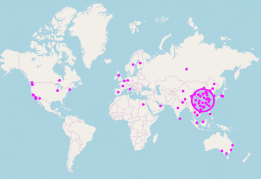
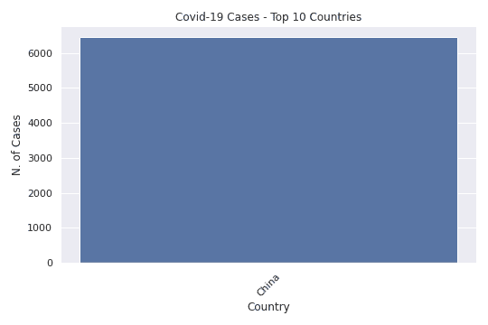
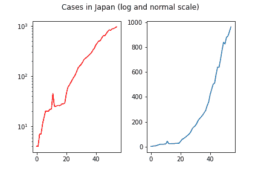
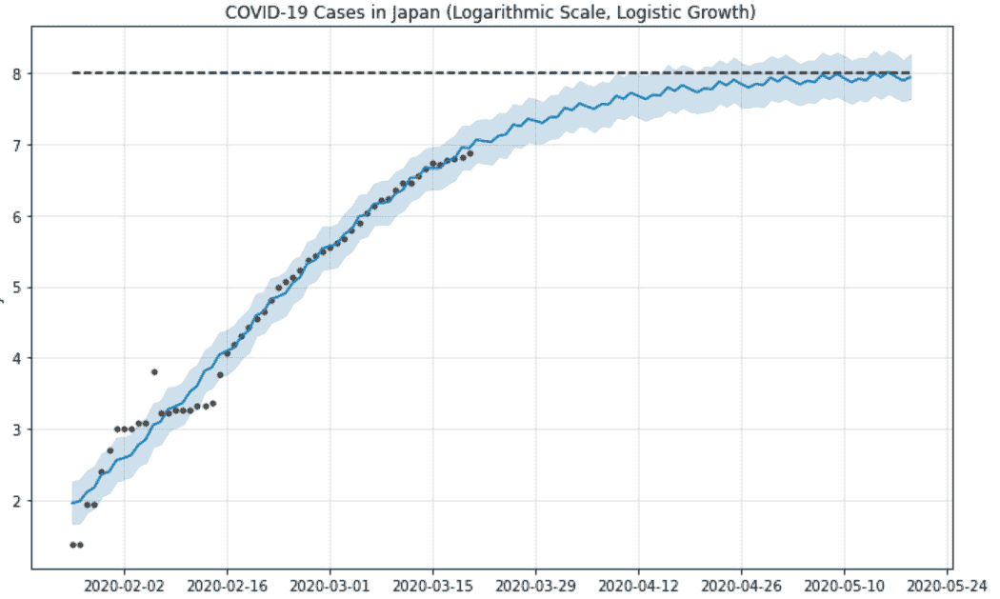
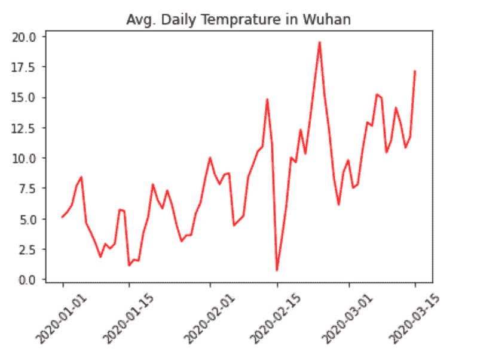

# 机器学习&冠状病毒

> 原文：<https://towardsdatascience.com/machine-learning-the-coronavirus-9cb8352e1b36?source=collection_archive---------14----------------------->

## 我们如何利用 AI 更好地了解 COVIV-19。

最近我们脑海中的热门话题是新型冠状病毒，或新冠肺炎。它影响了我们许多人的生活，并导致了整个金融市场的巨大动荡。

作为一名数据科学家，有一样东西是我可以一直依赖的，即使是在这些困难时期——数据。幸运的是，关于新冠肺炎价差的数据可以在网上找到。

虽然数据科学和机器学习方法已经在许多领域实际解决了长期存在的问题(语言翻译、图像识别和情感分析等)，但这些方法不可能神奇地“解决”冠状病毒危机；然而，对其行为的更好理解、基于数据的更仔细分析和有意义的预测可能有利于决策和政策制定。

那么…这里我们可以应用哪些 ML 方法呢？

# 1.数据可视化

当开始处理新数据时，良好的可视化可以在许多方面提供帮助。有时候这就是你所需要的！但它总能在处理数据时提供见解和想法，并节省大量时间。

我推荐的一个很酷的地理可视化 Python 库是**follow**，它可以用来创建交互式世界地图。

在以下示例中，我绘制了自 2 月中旬以来的新冠肺炎病例数:

还可以创建不同国家的病例数条形图。对于这些类型的地块， **seaborn** 是一个易于使用且有用的库:

(在这个特定的图中，中国仅指湖北地区，美国仅指纽约)。

许多其他创造性的可视化可以被制作出来，它们经常为我们提供容易理解的有用信息！

# 2.时间序列预测模型

预测模型可用于预测时间序列数据的不同未来方案。通常，这些模型需要对数据进行几个假设，虽然我不会在这里讨论这些假设，但人们必须意识到这些模型的局限性和适当的用法。此外，还有几个重要的概念需要考虑:

*   **缩放**，在这种情况下应该是对数(想想为什么！).
*   **数据清理**，即去除极端异常值或无效数据。例如，病例数量的急剧增加导致检测数量的突然增加，而不是新患者的实际数量，这可能会误导预测模型。
*   数据中有没有**季节性**？

几个库(Python 和 R 中都有)可以用来完成这样的任务。我特别喜欢的一本是《先知》(fbprophet，作者脸书)。以下是日本的病例数，按正常比例和对数比例:

下面是一个使用 prophet 对总病例数*进行短期预测的示例。我假设了病例数的对数的逻辑模型；我们知道，病例数有一个峰值，然后下降，所以从长期来看，*活跃的*病例数将会有所不同。*

# 3.监督学习，一个例子:冠状病毒和天气

我记得读过的一篇关于这种病毒的早期文章将它的潜在传播与天气联系起来，希望更温暖的气候可以最小化它的有效性。

我想更深入地挖掘这一点，并了解“天气”如何影响病毒。这是一种**监督学习**问题:使用几个其他自变量描述和预测一个因变量。

然而，“天气”是一个有许多含义的概念，比如说，不太清楚从原始温度数据中应该做什么样的特征工程。

一个好的开始方式是看一个例子，所以我从检查武汉的天气开始，这是 2019 年 12 月病毒首次出现的地方。我找到了过去几个月的温度监测站数据(ID CHM00057494 ),并得到了下图:

一个有趣的观察结果是，平均温度在 1 月至 3 月期间似乎相当不稳定；而且，有几个尖锐的“滴”或“刺”；这可能暗示我们，温度的这种“波动性”可能是我们模型的一个好特征。

应该用什么 **ML 型号**？这总是一个很好的问题，并且由于存在各种各样的模型，选择哪一个并不总是很清楚(合理的方法是有时尝试许多模型，并根据其在测试集上的性能选择最好的一个！).

考虑到之前的观察，我将根据不同国家的气候进行划分:热带、干燥、潮湿的亚热带、潮湿的大陆性气候(以及极地气候，但不要太多！).我将使用 **KNN** 算法，它有时(不合理地)不被考虑。它依赖于对具有相似或“接近”统计数据的数据点进行平均，以获得对所需数据点的预测。我将使用的特征是一个时间窗口内的案例数量和气候类型；KNN 算法的简单性可以防止过度拟合结果，并且适用于这些情况。我将数据划分到 3 月 10 日之前和之后(火车-测试在时间上分裂)。sklearn 库实现了 KNN 算法(sk learn . neighbors . kneighborsregressor ),但我决定编写自己的版本来定制距离度量，因为这是一个实现起来相当简单的算法。

我得到的结果很有意思——一个 **8.5%** 病例数的预测值与实际值的相对误差。**基线**(定义该基线总是很重要)，该基线仅取同一国家的前一天，具有 **15.8%** 的相对误差。所以我们实际上得到了一个重要的(！)通过使用 KNN 和气候数据的改进。

昨天(3 月 20 日)模型预测的一些轶事:

*   预测马提尼克岛有 33 例；实际人数是 32 人。
*   预测波多黎各有 16 例；实际人数是 14 人。
*   预计关岛有 13 例；实际人数是 14 人。

总之，通过机器学习，我——我不是传染病方面的专家——能够更好地了解这种病毒，甚至使用纯 ML 方法获得合理的预测方法。

保持安全和健康！

***编者按:*** [*走向数据科学*](http://towardsdatascience.com) *是一份以数据科学和机器学习研究为主的中型刊物。我们不是健康专家或流行病学家，本文的观点不应被解释为专业建议。想了解更多关于疫情冠状病毒的信息，可以点击* [*这里*](https://www.who.int/emergencies/diseases/novel-coronavirus-2019/situation-reports) *。*