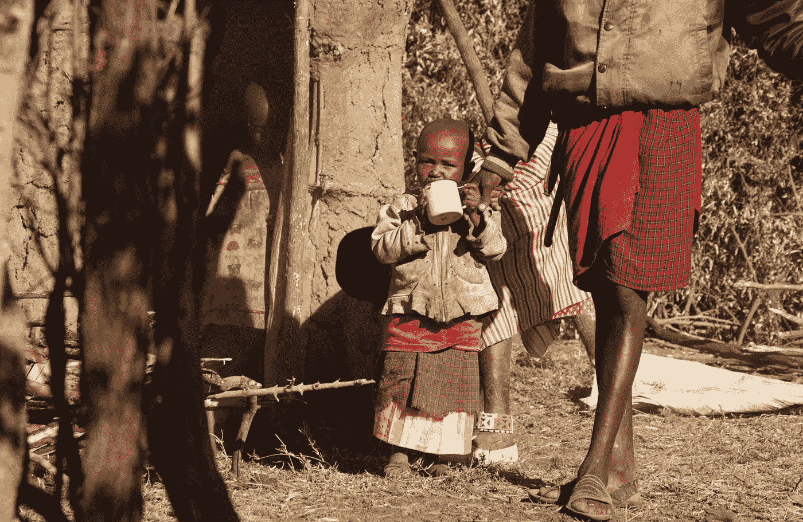
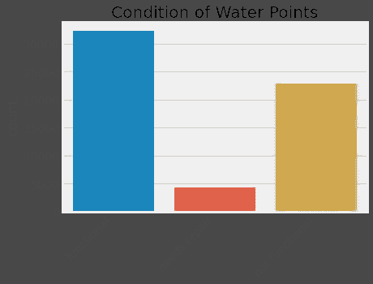
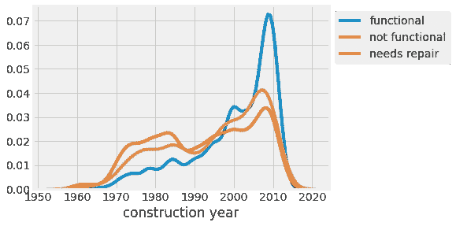
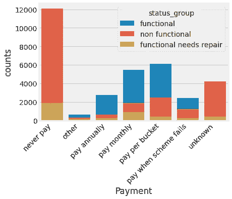
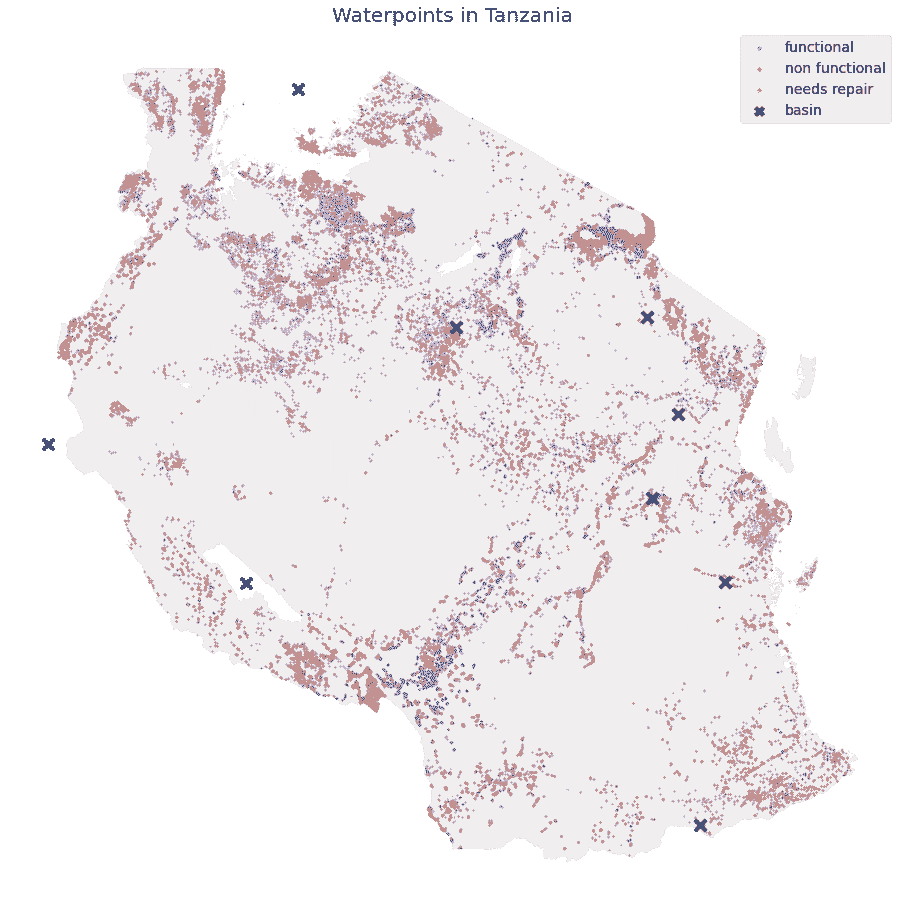

# 用机器学习解决多类分类问题

> 原文：<https://towardsdatascience.com/machine-learning-to-help-water-crisis-24f40b628531?source=collection_archive---------65----------------------->

## 用 Python 预测坦桑尼亚的水点状况



玛格达莱娜·库拉·曼切在 [Unsplash](https://unsplash.com?utm_source=medium&utm_medium=referral) 上的照片

根据 Water.org[和国际生命之水](https://water.org/)的数据，在坦桑尼亚 5700 万人口中，有 2500 万人无法获得安全的饮用水。妇女和儿童必须每天多次前往取水，而水源的安全甚至没有保障。2004 年，坦桑尼亚 12%的死亡是由水传播疾病造成的。

尽管为解决坦桑尼亚的水危机付出了多年努力和大量资金，但问题依然存在。使用可收集的数据预测坦桑尼亚供水点状况的能力将使我们能够制定计划，有效地利用资源来发展可持续的基础设施，这将影响许多人的生活。

# 数据

作为解决这一问题的一项举措， [DrivenData](https://www.drivendata.org/competitions/) 利用开源平台 [Taarifa](http://taarifa.org/) 从坦桑尼亚水利部收集的数据，发起了一场基于勘探的竞赛。该项目的目标是预测三种不同类别的每个供水点的状态:功能正常、不正常和需要修复。



我们的数据集显示，59，400 个供水点中有 62%有功能，而 38%没有功能。在这些功能性供水点中，12%需要维修。

# 探索性数据分析

在清理了数据并处理了缺失值和异常值之后，我们研究了单个要素如何与水点的状况相关联。以下是我们探索性数据分析的一些观察结果。

## 旧的供水点没有得到维护



这是不同建设年份的用水点分布。我们可以看到，大多数可以使用的供水点都是最近建成的，这可能是因为近年来投入了大量资金。但是，事实上，即使是最近建成的核电站也有可能不像旧的核电站那样发挥作用，这是非常令人担忧的。

## 付款事宜。



稳定的付款计划似乎是一个强有力的指标，表明供水点是否会得到维持。问题是，虽然维护供水点的责任留给了每个社区，但坦桑尼亚的大多数社区没有足够的钱来维护这些供水点。

## 位置很重要



根据坦桑尼亚的这张地图，我们可以看到水点条件往往集中在不同的区域。这告诉我们，位置是这个问题的重要预测因素。

# 特征工程

基于我们的探索性数据分析，我们决定扩展包含位置信息的特性。首先，我们根据它的名字找到了盆地的位置，并计算了从水点到盆地的距离。

使用 [Geopy](https://geopy.readthedocs.io/en/stable/) 的[的](https://nominatim.org/)包找到位置，该包使用 OpenStreetMap 数据。

然后我们使用[测地线](https://geopy.readthedocs.io/en/stable/#module-geopy.distance)距离 Geopy 计算距离。

此外，我们还设计了其他几个特征，包括位置是在城市还是农村地区，以及村里其他井的总数。

# 预处理

## 重采样

我们的数据有一个等级不平衡的问题，这意味着功能水点比需要修复的水点多得多。这可能会使预测偏向多数类，因此我们使用 SMOTE(合成少数过采样技术)对数据进行重新采样。简而言之，通过合成与同一类中现有样本距离较近的新样本，对过采样进行 SMOTE。

除了重采样之外，我们还将分类特征转换为二元虚拟特征，并对所有特征进行标准化。

## 特征选择

我们的原始数据有许多分类特征，这导致在对分类特征进行一次热编码后产生相对大量的特征。为了优化计算，我们决定运行基于树的特征选择。

# 模型评估

## 评估指标

决定与项目目标一致的评估指标是非常重要的(如果您需要复习，请参见这里的)。我们处理这个问题有两个主要目的，一个是建立一个具有最高整体精度的模型，另一个是建立一个成功预测维修需求的模型。后者很重要，因为准确预测维修需求与影响坦桑尼亚许多人生活的变化直接相关。但是在这篇文章中，我将从整体准确性的角度来评估模型。

## 虚拟分类器

首先，我们首先安装一个虚拟分类器作为基线模型。我们的虚拟分类器使用分层方法，这意味着它根据每个类别的比例进行预测。

*请注意，这段代码中的 X_test 指的是我们的验证集。我们已经搁置了维持集，以便在最后测试最终模型。*

```
**# Dummy result: Accuracy:  0.33**
```

我们的假人表现出大约 33%的准确性，这是假人对三个类别进行分类的预期性能。

## k-最近邻

我们测试的第一个模型是 K 近邻(KNN)。KNN 基于第 *k* 个最接近观测值的类别进行分类。超参数调谐是通过 [Optuna](https://optuna.org/) 实现的。我们测试了 GridSearchCV 和 Optuna 的性能，发现 Optuna 更加通用和高效。

```
**# KNN Result - Accuracy: 0.752**
```

## 随机森林分类器

接下来，我们用 Optuna 超调测试了随机森林分类器。随机森林在数据子集上同时拟合多个决策树，然后聚合结果。

```
**# Random Forest Results - Accuracy : 0.74**
```

对于这个问题，KNN 的性能优于随机森林分类器。但是，尽管这里没有报道，随机森林分类器在对少数民族分类方面比 KNN 分类器做得好得多。

## XGBoost

因为我们测试了一个打包方法，所以我们也使用 XGBoost 测试了一个增强方法。这是一个梯度推进模型的实现，它根据预测误差迭代训练弱学习者。

```
**# XGBoost Results - Accuracy: 0.78**
```

XGboost 在准确性得分方面有所提高，其预测少数民族类别的敏感性也高于其他两个模型。

## 投票分类器

最后，我们将所有之前的模型进行投票。当使用投票分类器时，我们可以结合每个模型对每个类别概率的预测(软)或使用其对每个类别的二元选择(硬)。在这里，我们使用软投票。

```
**# Voting Classifier - Accuracy: 0.79**
```

投票分类器为少数类返回稍高的准确度和相似的召回率。我们决定继续使用投票分类器作为我们的最终模型，并测试维持测试集。

# 最终模型性能

我们的最终模型显示**对维持组的预测准确率**为 80%(基线为 45%),对少数类的召回率接近 50%,比基线模型的 6%召回率有了显著提高。


照片由 [Unsplash](https://unsplash.com?utm_source=medium&utm_medium=referral) 上的 [ngozi Assata](https://unsplash.com/@ngoziassata?utm_source=medium&utm_medium=referral) 拍摄

# 额外奖励:口译

因为我们的最终模型涉及在距离算法和基于树的集成之间投票，所以很难解释我们模型的特征重要性。但是，使用弹性网络正则化和 SGD 训练的逻辑回归的附加分析表明，足够的水量、公共竖管的使用和最近建成是功能性供水点的重要预测因素。

另一方面，位置是非功能性供水点的重要预测因素。尤其是靠近维多利亚湖的一些北部地区，与无法运行的供水点高度相关。最后，非功能性和需要修复的水点之间的 GPS 高度显示出不同的模式。有必要进行进一步的调查，以确定 GPS 高度的重要性，无论它是否与特定的政府区域相关，或者可访问性的差异，或者它是否对某些提取类型有任何技术影响。

这个项目是与我的同事 dolcikey 合作完成的。