# 利用机器学习预测黄金价格

> 原文：<https://towardsdatascience.com/machine-learning-to-predict-gold-price-returns-4bdb0506b132?source=collection_archive---------11----------------------->

## [黄金预测](https://towardsdatascience.com/tagged/gold-price-prediction)

## 用 PyCaret 预测黄金价格

# 介绍

十多年来，我一直是金融市场的学生，一直在研究不同的资产类别及其在不同经济条件下的行为。很难找到比黄金更具两极分化的资产类别。有喜欢它的人，也有讨厌它的人，更多的时候，他们永远停留在同一个阵营。由于黄金本身没有什么基本面(这又是一个两极分化的来源)，在这个多部分系列中，我将尝试使用几种机器学习技术来预测黄金价格回报。以下是我(目前)对该系列的设想:

***第一部分:确定方法，收集和准备数据***

***第二部分:使用 PyCaret*** 的回归建模

***第三部分:使用 PyCaret*** 分类建模

***第四部分:时间序列建模使用 Prophet(脸书)***

***第五部分:评估方法整合***

> “请注意，在一个竞争极其激烈的市场中，黄金是一种交易非常广泛的资产。长期从任何策略中持续赚钱是极其困难的，如果不是不可能的话。这篇文章只是分享我的经验，而不是投资或交易的处方或倡导。然而，对于像我这样的该领域的学生来说，这个想法可以通过个人努力扩展和发展成交易算法。”

# 背景

几个世纪以来，黄金一直是人类最初的价值储存手段和交易媒介，直到几个世纪前纸币取代了黄金。然而，直到 1971 年布雷顿森林协定被废除，世界货币成为真正的′𝐹𝑖𝑎𝑡′货币之前，大多数可持续的纸币都是由黄金支持的。

然而，黄金不仅作为珠宝的首选金属，而且作为价值储存手段和多样化投资组合中通常可取的一部分，继续引起人们的兴趣，因为它往往是一种有效的通胀对冲和经济经历艰难时期的避风港。

# 方法

在这个系列中，我们将采用不同的方法来预测黄金价格的回报，使用**机器学习**正如引言部分所强调的

首先，我们将走回归路线来预测未来 2 周和 3 周的黄金回报。我们将通过使用不同工具的历史回报来实现这一点，我认为这将影响黄金的前景。根本原因是，我将黄金称为一种“反动”资产。它几乎没有自己的基本面，价格的变动通常是投资者如何看待其他资产类别(股票、大宗商品等)的衍生品。).

# 导入数据

在本次和后续练习中，我们将需要过去 10 年中几种工具的收盘价。我们可以使用各种付费资源(路透社、彭博)和免费资源(IEX、Quandl、Yahoofinance、谷歌财经)来导入数据。由于这个项目需要不同类型的资产类别(股票、商品、债务和贵金属)，我发现**'**[***Yahoo financials***](https://pypi.org/project/yahoofinancials/)**'**软件包非常有用且简单明了。

```
***#Importing Libraries***
import pandas as pd
from datetime import datetime
import matplotlib.pyplot as plt
from yahoofinancials import YahooFinancials
```

我准备了一份需要导入数据的仪器清单。***Yahoo financials***包需要 Yahoo 股票代码。该列表包含股票代号及其说明。包含列表的 excel 文件可以在[这里](https://github.com/Riazone/Gold-Return-Prediction/blob/master/Ticker%20List.xlsx)找到，文件名为“Ticker List”。我们导入该文件，并将股票代码和名称提取为单独的列表。( [*见笔记本*](https://github.com/Riazone/Gold-Return-Prediction/blob/master/Regression/Gold%20Prediction%20Experiment%20%20Regression-%20PyCaret.ipynb) )

```
ticker_details = pd.read_excel(“Ticker List.xlsx”)
ticker = ticker_details['Ticker'].to_list()
names = ticker_details['Description'].to_list()
ticker_details.head(20)
```

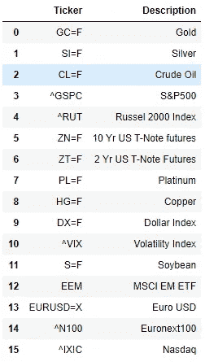

有了列表后，我们需要定义需要导入数据的日期范围。我选择的期限是 2010 年 1 月至 2020 年 3 月 1 日。我之所以没有提取之前的数据，是因为 2008-09 年的**全球金融危机(GFC)** 极大地改变了经济和市场格局。那段时期之前的关系现在可能没那么重要了。

我们创建一个日期范围，并将其写入一个名为 ***values*** 的空数据帧，我们将从 yahoofinancials 中提取并粘贴数据。

```
***#Creating Date Range and adding them to values table***
end_date= “2020–03–01”
start_date = “2010–01–01”
date_range = pd.bdate_range(start=start_date,end=end_date)
values = pd.DataFrame({ ‘Date’: date_range})
values[‘Date’]= pd.to_datetime(values[‘Date’])
```

一旦我们在 dataframe 中有了日期范围，我们就需要使用 ticker 符号从 API 中提取数据。 ***yahoofinancials*** 以 JSON 格式返回输出。下面的代码循环遍历股票代码列表，只提取所有历史日期的收盘价，并将它们添加到在日期上水平合并的 dataframe 中。鉴于这些资产类别可能有不同的地区和交易假期，每次数据提取的日期范围可能不相同。通过合并，我们最终会有几个 *NAs* ，稍后我们将*填充*。

```
***#Extracting Data from Yahoo Finance and Adding them to Values table using date as key*** for i in ticker:
 raw_data = YahooFinancials(i)
 raw_data = raw_data.get_historical_price_data(start_date, end_date, “daily”)
 df = pd.DataFrame(raw_data[i][‘prices’])[[‘formatted_date’,’adjclose’]]
 df.columns = [‘Date1’,i]
 df[‘Date1’]= pd.to_datetime(df[‘Date1’])
 values = values.merge(df,how=’left’,left_on=’Date’,right_on=’Date1')
 values = values.drop(labels=’Date1',axis=1)***#Renaming columns to represent instrument names rather than their ticker codes for ease of readability***
names.insert(0,’Date’)
values.columns = names
print(values.shape)
print(values.isna().sum()) ***#Front filling the NaN values in the data set***
values = values.fillna(method="ffill",axis=0)
values = values.fillna(method="bfill",axis=0)
values.isna().sum()***# Coercing numeric type to all columns except Date***
cols=values.columns.drop('Date')
values[cols] = values[cols].apply(pd.to_numeric,errors='coerce').round(decimals=1)
values.tail()
```

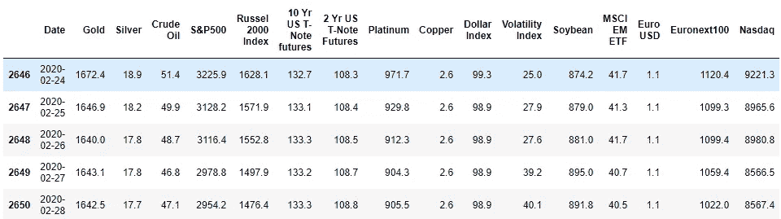

值表的尾部

# 准备数据

在上述方法中，我们强调了我们将使用上市工具的滞后回报来预测黄金的未来回报。在这里，我们继续计算所有工具的短期历史回报和少数选定工具的长期历史回报。

其背后的基本思想是，如果某项资产表现优异或表现不佳，投资组合重新平衡的可能性更大，这将影响未来其他资产类别的回报。如果股票市场(比如说 S & P500)在过去的 6 个月中表现出惊人的回报，资产经理可能会希望记录利润，并分配一些资金到贵金属上，为股票市场的调整做准备。下图显示了在不同的市场条件下，黄金和标普 500 之间的价格变动和相关性。

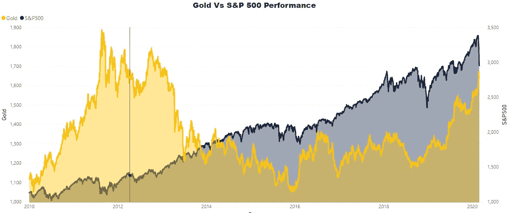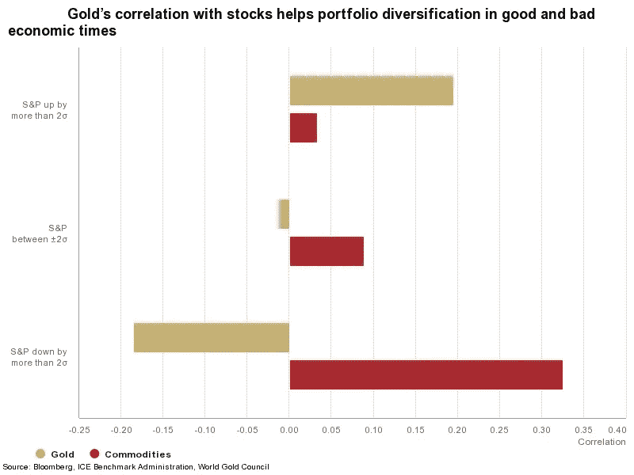

资料来源:彭博、ICE 基准管理机构、世界黄金协会。[链接](https://www.gold.org/goldhub/research/relevance-of-gold-as-a-strategic-asset-2019)

从上面我们可以看到，当 S&P500 出现极端的负向运动时，黄金表现出负相关性。最近股市的大幅下跌也凸显了类似的关系，当金价因预期下跌而上涨时，年初至今金价上涨了 11%，而 S&P500 年初至今下跌了 11%。

然而，我们将使用机器学习来评估假设。您可以直接从我的 [git-hub repo](https://github.com/Riazone/Gold-Return-Prediction/blob/master/Training%20Data_Values.csv) 下载文件名为‘Training Data _ Values’的数值数据

```
imp = [‘Gold’,’Silver’, ‘Crude Oil’, ‘S&P500’,’MSCI EM ETF’]***# Calculating Short term -Historical Returns***
change_days = [1,3,5,14,21]data = pd.DataFrame(data=values[‘Date’])
for i in change_days:
 print(data.shape)
 x= values[cols].pct_change(periods=i).add_suffix(“-T-”+str(i))
 data=pd.concat(objs=(data,x),axis=1)
 x=[]
print(data.shape)***# Calculating Long term Historical Returns***
change_days = [60,90,180,250]for i in change_days:
 print(data.shape)
 x= values[imp].pct_change(periods=i).add_suffix(“-T-”+str(i))
 data=pd.concat(objs=(data,x),axis=1)
 x=[]
print(data.shape)
```

除了滞后回报，我们还可以看到不同窗口的当前金价离其移动平均线有多远。这是技术分析中非常常用的指标，移动平均线为资产价格提供支撑和阻力。我们使用简单移动平均线和指数移动平均线的组合。然后，我们将这些移动平均值添加到现有的特征空间。

```
***#Calculating Moving averages for Gold***
moving_avg = pd.DataFrame(values[‘Date’],columns=[‘Date’])
moving_avg[‘Date’]=pd.to_datetime(moving_avg[‘Date’],format=’%Y-%b-%d’)
***#Adding Simple Moving Average***
moving_avg[‘Gold/15SMA’] = (values[‘Gold’]/(values[‘Gold’].rolling(window=15).mean()))-1
moving_avg[‘Gold/30SMA’] = (values[‘Gold’]/(values[‘Gold’].rolling(window=30).mean()))-1
moving_avg[‘Gold/60SMA’] = (values[‘Gold’]/(values[‘Gold’].rolling(window=60).mean()))-1
moving_avg[‘Gold/90SMA’] = (values[‘Gold’]/(values[‘Gold’].rolling(window=90).mean()))-1
moving_avg[‘Gold/180SMA’] = (values[‘Gold’]/(values[‘Gold’].rolling(window=180).mean()))-1***#Adding Exponential Moving Average*** moving_avg[‘Gold/90EMA’] = (values[‘Gold’]/(values[‘Gold’].ewm(span=90,adjust=True,ignore_na=True).mean()))-1
moving_avg[‘Gold/180EMA’] = (values[‘Gold’]/(values[‘Gold’].ewm(span=180,adjust=True,ignore_na=True).mean()))-1
moving_avg = moving_avg.dropna(axis=0)
print(moving_avg.shape)
moving_avg.head(20)
```

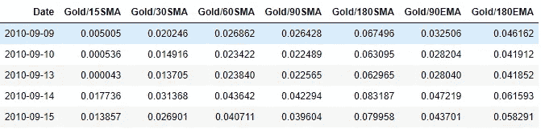

移动平均数据帧的输出

```
***#Merging Moving Average values to the feature space***
data[‘Date’]=pd.to_datetime(data[‘Date’],format=’%Y-%b-%d’)
data = pd.merge(left=data,right=moving_avg,how=’left’,on=’Date’)
print(data.shape)
data.isna().sum()
```

这都是关于特性的。现在我们需要创建目标，也就是我们想要预测的。因为我们在预测回报，所以我们需要选择一个我们需要预测回报的时间范围。我选择了 14 天和 22 天的时间范围，因为其他更小的时间范围往往非常不稳定，缺乏预测能力。然而，你也可以尝试其他的地平线。

```
***#Calculating forward returns for Target***
y = pd.DataFrame(data=values[‘Date’])
y[‘Gold-T+14’]=values[“Gold”].pct_change(periods=-14)
y[‘Gold-T+22’]=values[“Gold”].pct_change(periods=-22)
print(y.shape)
y.isna().sum()***# Removing NAs***

data = data[data[‘Gold-T-250’].notna()]
y = y[y[‘Gold-T+22’].notna()]***#Adding Target Variables***
data = pd.merge(left=data,right=y,how=’inner’,on=’Date’,suffixes=(False,False))
print(data.shape)
```

现在我们有了完整的数据集，可以开始建模了。在下一部分中，我们将使用极其创新和高效的 PyCaret 库来试验不同的算法。我还将展示如何创建一个管道来不断导入新数据，以使用训练好的模型生成预测。

# 利用机器学习预测黄金价格

## 使用 PyCaret 的第二部分回归建模

在第一部分中，我们讨论了从开源免费 API 导入数据，并以一种适合我们预期的机器学习练习的方式准备它。您可以参考第一部分的代码，或者从 [github repo](https://github.com/Riazone/Gold-Return-Prediction/blob/master/Training%20Data.csv) 导入文件名为“Training Data”的最终数据集。

PyCaret 是 Python 中的一个开源机器学习库，可以在任何笔记本环境中使用，并大大减少了编码工作，使过程变得非常高效。在下面的部分我们将看到*[***py caret***](https://pycaret.org/)如何为任何机器学习实验增压。首先，您需要使用以下命令安装 PyCaret:*

```
*!pip install pycaret*
```

## *22 天模型*

*我们以 22 天为目标。这意味着，根据历史数据，我们将尝试预测未来三周的黄金回报。*

```
****#If you are importing downloaded dataset***
data = pd.read_csv("Training Data.csv")from pycaret.regression import ****#We have two target columns. We will remove the T+14 day Target*** data_22= data.drop(['Gold-T+14'],axis=1)*
```

***设置***

*要在 PyCaret 中开始任何建模练习，第一步是“设置”功能。这里的强制变量是数据集和数据集中的目标标签。所有基本和必要的数据转换，如丢弃 id、一次性编码分类因子和缺失值插补，都在后台自动进行。PyCaret 还提供了 20 多个预处理选项。对于这个例子，我们将在设置中使用基础知识，并在后面的实验中尝试不同的预处理技术。*

```
*a=setup(data_22,target='Gold-T+22',
        ignore_features=['Date'],session_id=11,
        silent=True,profile=False);*
```

*在上面的代码中，数据集作为“data_22”传递，目标指向标记为“Gold-T+22”的列。我特别提到要忽略“日期”列，以防止 PyCaret 在日期列上创建基于时间的功能，这在其他情况下可能非常有用，但我们现在不评估这一点。如果您想查看变量之间的分布和相关性，您可以保留参数“profile=True”，它显示一个 panda profiler 输出。我特意提供了‘session _ id = 11 ’,以便能够重新创建结果。*

***魔法命令....*compare _ models()****

*下一步，我将使用 PyCaret 的一个我最喜欢的特性，它将数百行代码缩减为两个字——“compare _ models”。该函数使用所有算法(目前有 25 种)并使它们适合数据，运行 10 重交叉验证，并为每个模型提供 6 个评估指标。所有这些只用两个字。为了节省时间，函数中还可以使用另外两个参数:*

***a. turbo=False** —默认为真。当 turbo=True 时，比较模型不会评估一些更昂贵的算法，即核脊(kr)、自动相关性确定(ard)和多层感知器(mlp)*

***b .黑名单** —在这里，可以传递算法缩写的列表(参见 docstring ),这是众所周知的耗时更长且性能改善很小的方法。下面，我已经把尼尔森回归器(tr)列入了黑名单*

```
*compare_models(blacklist=['tr'],turbo=True)*
```

*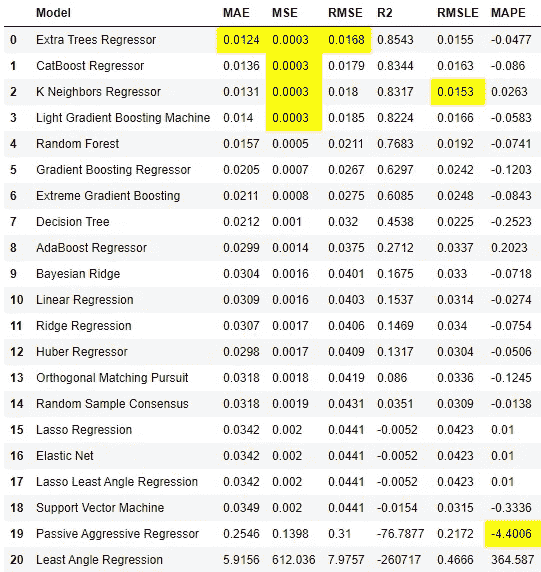*

*比较模型的输出*

*这里我们将使用 R 平方(R2)作为度量标准。我们看到 ET、Catboost 和 KNN 是前三名的模型。下一步，我们将调整三个模型的超参数。*

***调整模型超参数***

*PyCaret 为每个算法都预定义了一个网格，并且 ***tune_model()*** 函数使用随机网格搜索来查找优化指标选择的参数集(此处为 Rsquare ),并显示优化模型的交叉验证分数。它不接受经过训练的模型，并且需要作为字符串传递的估计量的缩写。我们将调整额外树(et)、K 最近邻(knn)和 CatBoost (catboost)回归器。*

```
*et_tuned = tune_model(‘et’)*
```

*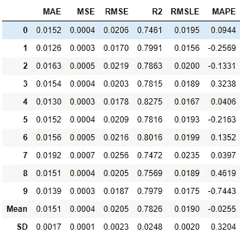*

```
*catb_tuned = tune_model(‘catboost’)*
```

*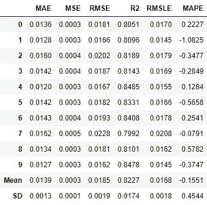*

```
*knn_tuned = tune_model(‘knn’,n_iter=150)*#I have increased the iteration in knn because increasing iterations have shown to perform better for knn rather than other models in question without significantly increasing the training time.**
```

*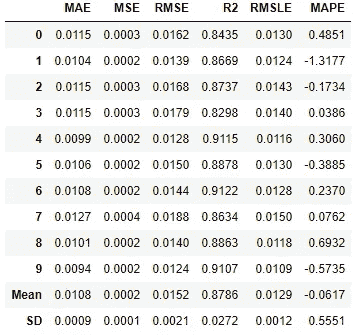*

*上面我们可以看到，knn 的 R2 在调优后大幅提升至 87.86%，远高于调优后没有提升的 et 和 catboost。这可能是因为网格搜索过程中的随机化。在一些非常高的迭代次数下，它们可能会改进。*

*我还会创建一个基本的额外树(et)模型，因为它的原始性能(调优前)非常接近调优后的 knn。我们将使用 PyCaret 中的***create _ model()***函数来创建模型。*

```
*et = create_model(‘et’)*
```

***评估模型***

*对训练好的模型进行一些模型诊断是很重要的。我们将使用 PyCaret 中的 ***evaluate_model()*** 函数来查看绘图集和其他诊断信息。它接受经过训练的模型，以返回模型诊断图和模型定义的选择。我们将对我们的两个顶级模型进行模型诊断，即 knn_tuned 和 et。*

*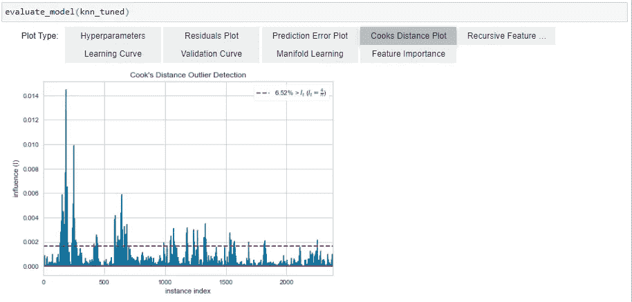*

*库克距离图 knn_tuned*

*上面，我们可以清楚地看到，在前 500 个观察值中，有许多异常值，它们不仅影响模型性能，还可能影响未来的模型泛化。因此，去除这些异常值可能是值得的。但在此之前，我们将通过 et 来了解特征重要性(knn 不提供特征重要性)*

*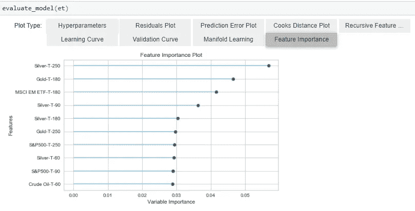*

*我们认为，白银和新兴市场 ETF 的回报率具有最高的特征重要性，突显出白银和黄金通常成对波动，而投资组合配置确实在新兴市场股票和黄金之间转移。*

***去除异常值***

*要移除异常值，我们需要回到设置阶段，使用 PyCaret 内置的异常值移除器，并再次创建模型以查看影响。*

```
*b=setup(data_22,target=’Gold-T+22', ignore_features=[‘Date’], session_id=11,silent=True,profile=False,remove_outliers=True);*
```

*如果***' remove _ outliers '***参数设置为 true，PyCaret 使用奇异值分解(SVD)技术删除通过 PCA 线性降维识别的离群值。默认杂质水平为 5%。这意味着它将删除 5%的观察值，它认为是离群值。*

*移除异常值后，我们再次运行我们的顶级模型，看看是否有任何性能改进，显然有。*

*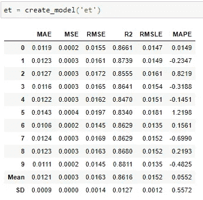**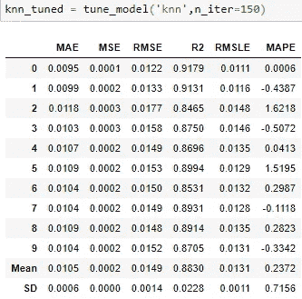

剔除异常值后的 et 和 knn_tuned 结果* 

*我们看到 et 的性能从 85.43%提高到 86.16%，knn_tuned 的性能从 87.86%提高到 88.3%。褶皱间的标准差也有所降低。*

***集合模型***

*我们还可以尝试看看 bagging/boosting 是否可以提高模型性能。我们可以使用 PyCaret 中的***ensemble _ model()***函数，通过下面的代码快速查看集成方法如何改善结果:*

```
*et_bagged = ensemble_model(et,method=’Bagging’)
knn_tuned_bagged = ensemble_model(knn_tuned, method='Bagging')*
```

*上述代码将显示类似的交叉验证分数，但没有显示出太大的改进。回购中的笔记本链接可以看到结果。*

***混合模型***

*我们可以混合前 2 个模型(et 和 knn_tuned)来看看混合模型是否可以表现得更好。人们经常看到，混合模型经常学习不同的模式，并且它们一起具有更好的预测能力。为此我将使用 PyCaret 的***blend _ models()***函数。它接受一个训练模型列表，并返回一个混合模型和 10 倍交叉验证分数。*

```
*blend_knn_et = blend_models(estimator_list=[knn_tuned,et])*
```

*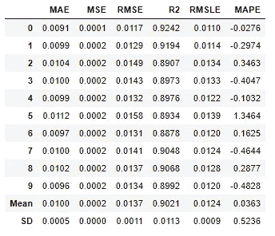*

*混合模型的结果*

*在上表中，我们看到混合的 ***knn_tuned*** 和 ***et*** 返回比两者更好地表示 R2。与 ***knn_tuned*** 相比，R2 的平均 R2 增加了 1.9%，标准差减少了 1.9%，这意味着跨褶皱的性能更好、更一致。*

*90.2%的平均 R2 意味着我们的模型能够从我们提供的特征中捕捉平均 90.2%的黄金回报变化。*

***堆叠模型***

*虽然混合模型的结果很好，但我想看看是否有可能从数据中提取更多的 R2 基点。为此，我们将建立一个多层次的模型堆栈。这不同于混合，因为模型层是按顺序堆叠的，因此一层中模型的预测将与原始要素一起传递到模型的下一层(如果 restack = True)。一组模型的预测极大地帮助了后续模型的预测。链的末端是元模型(默认是线性的)。PyCaret guide 有更多关于[主题](https://pycaret.org/stack-models/)的细节。在笔记本中，我尝试了几种架构。下面展示的是性能最佳的产品:*

```
*stack2 = create_stacknet(estimator_list=[[catb,et,knn_tuned],[blend_knn_et]], restack=True)*
```

*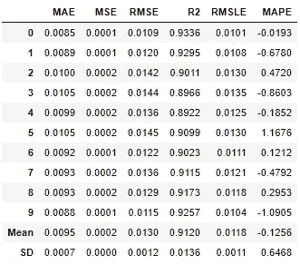*

*堆叠 2 的结果(多层堆叠)*

*正如我们在上面看到的， ***stack2*** 模型比 ***blend_knn_et*** 有 1%的 R2，我们将选择 ***stack2*** 作为最佳模型，并保存它用于预测。*

***保存模式***

*一旦模型定型，我们需要保存模型，以便在新数据上使用它来进行预测。我们可以通过 save_model()来实现。这会将模型保存在当前目录或任何已定义的路径中。下面的代码将模型和预处理管道保存为名称***【22 天回归器】****

```
*save_model(model=stack2, model_name=’22Day Regressor’)*
```

***对新数据进行预测***

*一旦我们保存了我们的模型，我们将希望在新数据到达时对其进行预测。我们可以依靠 yahoofinancials 软件包来给出所有工具的收盘价，但是，我们需要再次准备新的数据，以便能够使用该模型。这些步骤与我们在准备培训数据时所做的类似，唯一的区别是我们将导入最新的数据，并且我们不会创建标签(我们不能创建标签，因为我们没有未来的价格)。下面的代码 chuck 应该导入并调整数据，使其为预测做好准备。*

```
****#Importing Libraries***
import pandas as pd
from datetime import datetime
import matplotlib.pyplot as plt
from yahoofinancials import YahooFinancialsticker_details = pd.read_excel("Ticker List.xlsx")
ticker = ticker_details['Ticker'].to_list()
names = ticker_details['Description'].to_list()***#Preparing Date Range***
end_date= datetime.strftime(datetime.today(),'%Y-%m-%d')
start_date = "2019-01-01"
date_range = pd.bdate_range(start=start_date,end=end_date)
values = pd.DataFrame({ 'Date': date_range})
values['Date']= pd.to_datetime(values['Date'])***#Extracting Data from Yahoo Finance and Adding them to Values table using date as key***
for i in ticker:
    raw_data = YahooFinancials(i)
    raw_data = raw_data.get_historical_price_data(start_date, end_date, "daily")
    df = pd.DataFrame(raw_data[i]['prices'])[['formatted_date','adjclose']]
    df.columns = ['Date1',i]
    df['Date1']= pd.to_datetime(df['Date1'])
    values = values.merge(df,how='left',left_on='Date',right_on='Date1')
    values = values.drop(labels='Date1',axis=1)***#Renaming columns to represent instrument names rather than their ticker codes for ease of readability***
names.insert(0,'Date')
values.columns = names***#Front filling the NaN values in the data set***
values = values.fillna(method="ffill",axis=0)
values = values.fillna(method="bfill",axis=0)***# Co-ercing numeric type to all columns except Date***
cols=values.columns.drop('Date')
values[cols] = values[cols].apply(pd.to_numeric,errors='coerce').round(decimals=1)
imp = ['Gold','Silver', 'Crude Oil', 'S&P500','MSCI EM ETF']***# Calculating Short term -Historical Returns***
change_days = [1,3,5,14,21]data = pd.DataFrame(data=values['Date'])
for i in change_days:
    x= values[cols].pct_change(periods=i).add_suffix("-T-"+str(i))
    data=pd.concat(objs=(data,x),axis=1)
    x=[]***# Calculating Long term Historical Returns***
change_days = [60,90,180,250]for i in change_days:
    x= values[imp].pct_change(periods=i).add_suffix("-T-"+str(i))
    data=pd.concat(objs=(data,x),axis=1)
    x=[]***#Calculating Moving averages for Gold***
moving_avg = pd.DataFrame(values['Date'],columns=['Date'])
moving_avg['Date']=pd.to_datetime(moving_avg['Date'],format='%Y-%b-%d')
moving_avg['Gold/15SMA'] = (values['Gold']/(values['Gold'].rolling(window=15).mean()))-1
moving_avg['Gold/30SMA'] = (values['Gold']/(values['Gold'].rolling(window=30).mean()))-1
moving_avg['Gold/60SMA'] = (values['Gold']/(values['Gold'].rolling(window=60).mean()))-1
moving_avg['Gold/90SMA'] = (values['Gold']/(values['Gold'].rolling(window=90).mean()))-1
moving_avg['Gold/180SMA'] = (values['Gold']/(values['Gold'].rolling(window=180).mean()))-1
moving_avg['Gold/90EMA'] = (values['Gold']/(values['Gold'].ewm(span=90,adjust=True,ignore_na=True).mean()))-1
moving_avg['Gold/180EMA'] = (values['Gold']/(values['Gold'].ewm(span=180,adjust=True,ignore_na=True).mean()))-1
moving_avg = moving_avg.dropna(axis=0)***#Merging Moving Average values to the feature space***data['Date']=pd.to_datetime(data['Date'],format='%Y-%b-%d')
data = pd.merge(left=data,right=moving_avg,how='left',on='Date')
data = data[data['Gold-T-250'].notna()]
prediction_data = data.copy()*
```

*准备好数据后，我们需要加载模型并进行预测。为了加载模型，我们将再次使用 PyCaret 的回归模块。下面的代码将加载模型，对新数据进行预测，并使用数据集中每个日期的历史价格、预计回报和 3 周内的预测价格。*

```
*from pycaret.regression import ****#Loading the stored model*** regressor_22 = load_model("22Day Regressor");***#Making Predictions*** predicted_return_22 = predict_model(regressor_22,data=prediction_data)
predicted_return_22=predicted_return_22[['Date','Label']]
predicted_return_22.columns = ['Date','Return_22']***#Adding return Predictions to Gold Values***
predicted_values = values[['Date','Gold']]
predicted_values = predicted_values.tail(len(predicted_return_22))
predicted_values = pd.merge(left=predicted_values,right=predicted_return_22,on=['Date'],how='inner')
predicted_values['Gold-T+22']=(predicted_values['Gold']*(1+predicted_values['Return_22'])).round(decimals =1)***#Adding T+22 Date*** from datetime import datetime, timedeltapredicted_values['Date-T+22'] = predicted_values['Date']+timedelta(days = 22)
predicted_values.tail()*
```

*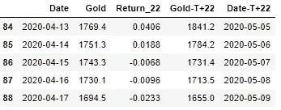*

*上表输出显示，黄金在 2020 年 4 月 17 日的收盘价为 1，694.5 美元，模型预测在接下来的 22 天内，回报将为-2.3%，导致 2020 年 5 月 9 日的价格目标为 1，655 美元。我为预测建立了一个单独的笔记本，标题为 ***“黄金预测新数据—回归”*** ，可以在回购[这里](https://github.com/Riazone/Gold-Return-Prediction/blob/master/Regression/Gold%20Prediction%20New%20Data%20-%20Regression.ipynb)找到。*

*我们可以使用相同的概念和技术来预测 T+14 天。代码和输出可以在 Jupyter 笔记本标题 ***“黄金预测实验回归—py caret”***中找到，在 repo [这里](https://github.com/Riazone/Gold-Return-Prediction/blob/master/Regression/Gold%20Prediction%20Experiment%20%20Regression-%20PyCaret.ipynb)。*

# *重要链接*

****链接第三部分—*** [***预测金价暴跌***](/predicting-crashes-in-gold-prices-using-machine-learning-5769f548496)*

****链接到*** [***Github 资源库***](https://github.com/Riazone/Gold-Return-Prediction)*

****关注我上***[***LinkedIn***](https://www.linkedin.com/in/riazuddin-mohammad/)*

****指南***[***py caret***](https://pycaret.org/guide/)*