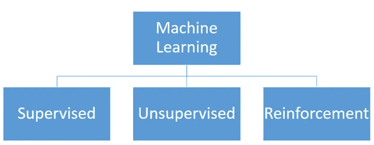
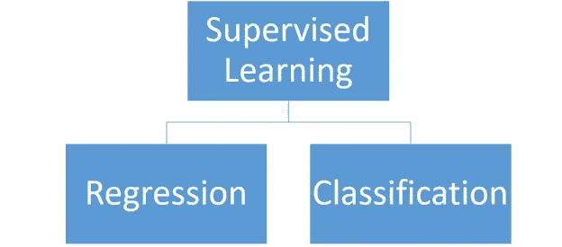
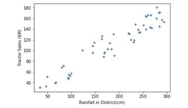
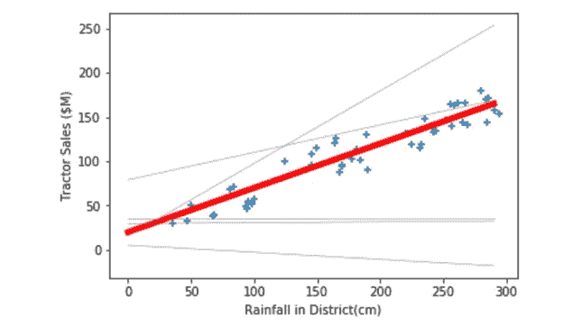
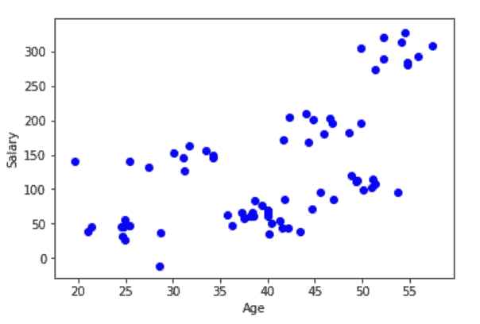

# 简化的机器学习

> 原文：<https://towardsdatascience.com/machine-learning-use-cases-an-overview-for-business-users-c5b786a91604?source=collection_archive---------44----------------------->

弗兰基·查马基在 [Unsplash](https://unsplash.com?utm_source=medium&utm_medium=referral) 上拍摄的照片

## 商业用户概述

正如我们之前讨论过的，机器学习指的是用于识别数据中模式的算法。但是我们所说的“模式”到底是什么意思，我们能用 ML 做什么，以及所有这些关于“模型”和“训练”它们的术语是什么。在这篇文章中，我将尝试解释这一切，而不会变得太专业，以及作为一个商业用户，你应该知道的关于机器学习的知识。

从什么是不同类型的 ML 用例开始:

机器学习用例

# 监督学习

监督学习意味着用例，我们有一个目标，我们试图预测给定的数据。举个例子，

*   信用卡公司试图根据客户的个人资料和信用记录计算出信用额度
*   一家汽车制造公司利用天气和宏观经济数据估算拖拉机销量
*   一家数字媒体公司预测客户是否会因其在平台上的活动而流失，或者
*   Gmail 根据邮件正文、主题和发件人预测邮件的类别。

监督算法使我们能够使用**输入数据**(客户的信用历史、天气和宏观经济状况、客户在平台上的活动、邮件规格)来预测**目标**(例如，估计的信用额度、拖拉机销量、客户是否会流失，或者邮件类别)。

有两种监督算法

监督学习算法的类型

这些变量根据目标变量的类型而有所不同:

*   如果目标变量是一个数字(例如信用额度或拖拉机销量)，这个问题被称为**回归**问题。
*   如果目标是一个类别(此人是否会流失—是或否；邮件所属的文件夹—主要、更新、促销、论坛或垃圾邮件)，这个问题被称为**分类**问题。

回归和分类问题都有模型，即可以解决这些类型问题的算法。但是他们是怎么解决的，机器到底“学习”了什么。让我们试着用我们钟爱的线性回归的例子来探索一下

# 示例使用案例

假设作为一家汽车制造公司，我们想预测拖拉机的销售，根据我们的专业知识，我们知道降雨量会影响销售。检查去年的数据，我们得到以下图表

我们注意到某种程度上的线性关系，并决定“拟合”一个线性回归模型。 *[【数学预警]]* 即考虑我们的目标(销售额)为 ***y*** ，输入变量(降雨量)为 ***x*** ，我们可以将数据表示为:
*y = mx +c*

或者换句话说

销售= *坡度* * 降雨量+ *截留量*

*m* 和 *c* 的不同值可能会给我们不同的线，但是我们想要给我们最接近我们的数据点的线的值。

从所有不同的可能线条(其中一些以灰色显示)中，我们注意到其中一条(红色粗体)与我们的数据最接近，也就是说，如果我们使用这条线条来估计降雨量的销售额，我们将得到最接近实际销售额的预测。注意，我们找到的这个解也只是某个 *m(斜率)*和 *c(截距)。*

因此，对于下一年，如果我们知道降雨量，我们可以预测一个地区的销售额如下

销售额= *m* *降雨量+ *c*

使用我们找到的值 ***m*** 和 ***c*** 作为我们的解。

延伸这个例子，如果我们想包括更多的变量，比如回购利率(贷款利率的代理)，那么我们的等式应该是

销售额= *m1* *(降雨量)+ *m2* *(回购利率)+ *c*

该模型必须计算参数的最佳值— *m1、m2* 和 *c* 以根据输入数据预测销售额。

这些斜率(*m’*s)和截距(c)的最佳值如何给出最接近我们数据的图，以及我们如何准确定义这种接近度涉及到相当多的数学问题，因此超出了本文的范围，但重要的是这些是我们的线性回归“模型”已经学习的“参数”，它们可以用来从我们的输入数据预测我们的目标变量。

就像线性回归试图在我们的数据上拟合直线一样，不同的模型会试图在我们的数据上拟合不同的函数，即，试图找到最接近数据点的曲线，就像线性回归中的斜率和截距一样，我们试图找到其他参数的最佳值，这使我们与数据最接近。

分类算法的工作方式类似，唯一的区别是它们试图调整参数，使我们获得最大的准确性，或者为尽可能多的数据点分配正确的类别。

您可能已经听说过所有模型的名称——线性回归、逻辑回归、支持向量机、决策树、随机森林、神经网络(或深度学习模型),这些模型都只是试图估计一个能给出最接近数据的预测的函数，并找到该函数的最佳参数值，这个找到最佳参数值的过程称为“训练”

## 这里需要注意一些事情:

*   数据的数量和质量很重要:如果我们只有很少的数据点，由于缺乏证据，我们不能非常确定我们的预测。但是，仅仅有大量的数据点并不能保证有好的预测，如果我们的降雨量比历史上任何时候都多，我们就不能准确地预测销售额，因为模型从未见过这个输入范围内的值。背景也很重要-一个为印度训练得很好的模型，可能在一定程度上适用于类似的发展中国家人口，但在一个完全不同的地方，比如说美国，会给出错误的预测。
*   领域专业知识:模型的选择及其实现是获得良好预测的一部分，但是更重要的因素是发送到模型的数据，这就是领域专业知识发挥作用的地方。例如，在上面的例子中，非常了解汽车销售的人可能能够说出到底是什么影响了拖拉机的销售，并且将这些变量作为输入数据发送会比使用输入数据与拖拉机销售没有很好关系的非常复杂的模型给出更好的结果。

# 无监督学习

这意味着在数据中没有目标的问题，我们的目标是探索数据的分布。无监督学习的一个主要用例是聚类

## 使聚集

顾名思义，它在数据中识别聚类。例如，如果一家银行有以下关于客户年龄和工资的数据。

该银行希望对相似的用户进行分组，以便围绕这些用户群制定营销和产品策略

**注意:**y 轴(工资)不要和目标混淆，和回归的情况一样。我们的任务不是根据年龄数据预测工资，而是将年龄和工资相似的人分组。

聚类算法可能会给出以下结果

在这里，每个数据点(或客户)现在都与一个集群相关联(用颜色表示)，这使得围绕每个产品制定策略变得更加容易。

**注意:**本例中仅考虑了两个变量(年龄和薪水)来说明这一点，因此，即使在没有任何算法的情况下，也有可能直观地探索数据并进行聚类，但在现实中，我们处理多个(任何超过 3 个)变量，不可能直观地显示数据。

同样，有几种算法可以对数据进行聚类，每种算法都适用于不同的数据分布和用例，但它们都试图实现相同的目标——在没有任何目标的情况下识别数据中相似点的组。

# 其他 ML 算法

除了聚类之外，还有其他无监督学习算法，例如降维。但是由于它们的业务用例有限，并且主要用于提高其他模型的性能，所以我在这里不讨论它们。

强化学习是一种完全不同的 ML 算法，用于在相对不太动态的环境中决定最大化长期回报的行动。详细讨论它超出了本文的范围，但是到目前为止，它们在业务应用程序中相对较少使用。

因此，大多数 ML 用例可以被设计为回归、分类或聚类任务之一

# 离别的思绪

我希望这能让你更好地理解什么是机器学习，以及它能做什么。实施这些 ML 模型的数据科学家必须了解不同模型的本质，它们是如何工作的，以及它们都可以用在哪里。但是，作为一名业务用户，了解您可以从您拥有的数据中获得的所有见解可能是开始与您的分析部门或顾问讨论的良好第一步，以帮助您的组织开始做出更好的数据驱动型决策