# 深入决策树和随机森林

> 原文：<https://towardsdatascience.com/machine-learning-v-decision-trees-random-forest-kaggle-dataset-with-random-forest-3ebfe6d584be?source=collection_archive---------48----------------------->

## 以及带有随机森林的已解 Kaggle 数据集

# 内容

在本帖中，我们将介绍:

1.  决策树术语
2.  测量杂质的方法
3.  CART 算法
4.  使用 CART 手工构建决策树
5.  为什么选择随机森林而不是决策树
6.  随机森林中决策树的多样化
7.  利用随机森林改进海量数据分类器

在[之前的](https://medium.com/analytics-vidhya/machine-learning-iv-support-vector-machines-kaggle-dataset-with-svms-57d7c885652a)帖子中，我们详细讨论了支持向量机，还解决了 Kaggle 的欺诈性信用卡交易数据集。在这篇文章中，我们将会看到另外两种监督学习算法:决策树和随机森林。在完成这篇文章后，我们将几乎涵盖了业内所有广泛使用的监督机器学习算法。

# 决策树

决策树这个术语是不言自明的，它的工作方式类似于人的决策能力。人类是如何做决定的？首先，人类定义目标。在机器学习中，特定任务的目标由数据集决定。一旦人们有了一个明确的目标，他们就会回答各种问题/执行各种任务，以实现这个目标。为实现目标而执行的第一个任务类似于决策树的**根节点**。它代表了决策树的目标。根节点分支到某个选项集，每个选项都有自己的选项集。这个过程一直持续到我们做出最后的决定。现在，这些选项中的每一个都类似于一个**决策节点**，最终决策由一个**叶节点**表示。在几乎所有情况下，根节点也充当决策节点。对于巨大的决策树，一个决策节点的输出是许多决策节点，除了在树的最深层，它是叶节点。

决策树建模是一种监督学习算法，可用于回归和分类问题中的连续和离散值数据集。最常见的是，决策树被用作分类器，递归地将数据划分到类别中。决策树是一个有向树，即一旦我们到达树中的特定节点，我们就不能回溯到前一个节点，即**父节点**不能从**子节点**访问。

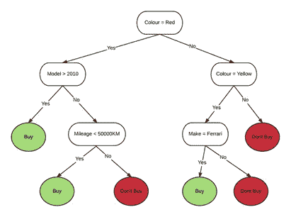

决策树示例([来源](https://www.researchgate.net/figure/An-example-of-a-simple-decision-tree_fig2_311614501))

看到上面这个决策树的例子后，我们可以看到，算法决定最先问的问题是汽车的颜色。所有其他问题也遵循一定的顺序。提问的顺序非常重要，否则对于如上所示的简单场景，决策树会变得非常复杂。决策树如何确定它需要问的问题的顺序？提问的顺序取决于哪个问题会导致该级别数据的良好分割。每个节点上的数据分割方式类似于二分搜索法。在根节点，我们有整个数据集。根节点应该将馈送给它的数据分成两个或更多个组，其中每个组中的数据具有相似的属性。假设根节点将数据分割成 3 组，那么这 3 组将是根节点的 3 个子节点，并且这 3 个节点中的每一个都将执行分割数据的操作，创建更多的子节点，并且对每个节点进行该过程，直到该节点不再有分割要做(叶节点)，这是进行预测的点。

决策树如何决定哪个问题导致好的拆分，哪个问题没有？这是通过测量杂质来量化的。

# 不纯

学习最优决策树的问题是 NP 完全的，所以为了更好地模仿最优解，杂质的概念应运而生。杂质是对数据同质性的一种度量。如果数据只包含一个类，则称之为纯数据或同质数据。数据中的类越多，越不纯。除了叶节点之外，决策树中的每个节点都包含有可能分裂成更多组的数据，即每个节点都有与数据相关的某种杂质。不纯程度较低的节点需要较少的信息来描述它们，而不纯程度较高的节点需要更多的信息来描述它们。因此，节点的子节点比它们的父节点具有更高的纯度。

# 测量杂质

有各种方法来衡量杂质，但最常用的是信息增益和基尼指数。我们一个一个来看。

## 信息增益

信息增益用于确定哪个特征/属性给了我们关于一个类的最大信息。它基于熵的概念。统计学中的熵类似于热力学中的熵，熵表示无序。熵越高，随机性越大(即纯度越低)，从给定信息中得出结论变得越困难。对于完全纯的数据样本，即当仅存在一个类别时，熵最小(0)，如果数据平均分布在所有类别之间，则熵最大(1)。

我们为逻辑回归定义的二元交叉熵损失函数与熵非常相似。对于具有“c”个不同类的数据集，熵的度量如下:

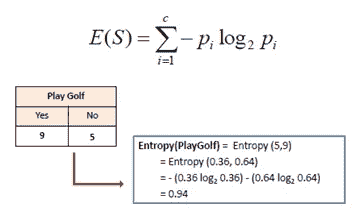

计算熵([来源](https://www.saedsayad.com/decision_tree.htm))

其中 pi 表示给定类别 I 中示例的分数。在上图的示例中，有 2 个类别，因此 c=2。p(是)= 9/14 (0.64)，p(否)= 5/14 (0.36)。一旦计算出节点的熵，则给定特定特征的特定输出的信息增益被计算为:

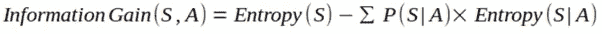

其中，S 是输出类，A 是数据集的特定要素，P 与上面定义的含义相同(对于 pi)。由于对数函数的高计算时间，基尼指数在实际应用中优于信息增益。

## 基尼指数

从形式上来说，基尼指数衡量的是随机选择某个变量时，该变量被错误分类的概率。概率值为 0 意味着变量不会被错误分类，只有当我们只有一个输出类时才有可能，即数据是 100%纯的。随着基尼指数值的增加，由于杂质的增加，特定变量被错误分类的可能性也增加。这些值传达的信息与熵值产生共鸣。对于具有“c”类的数据集，基尼指数定义为:

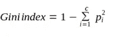

其中 pi 表示给定类别 I 中实例的分数，这类似于熵定义。

还有更多的杂质测量方法，如卡方、分类误差等。但这里的主要思想是让读者熟悉杂质测量方法。这里需要注意的一点是，这些杂质测量函数的作用类似于**成本函数**。

# 构建决策树

构建决策树实际上是对输入数据特征的划分，这导致 2 个或更多子节点，并且该过程对每个子节点递归地进行。一旦创建了这个树，就已经在所有节点上划分了特征。

用于分类的各种决策树算法沿着以下路线进行比较:

㈠分割标准

㈡消除/减少过度拟合的技术

㈢处理不完整的数据

用于决策树构造的各种算法有 CART、ID3、C4.5、C5.0、CHAID、MARS 等。在本帖中，我们将详细讨论 CART。CART 是应用最广泛、最高效的决策树算法之一。

# 分类和回归树

顾名思义，CART 算法用于生成分类和回归决策树。我们将在这里集中讨论分类部分。它用于解决多类分类问题(对于二分类，它生成一棵二叉树)，并使用基尼指数作为度量来评估决策树中一个特征节点的分裂。

在 CART 算法中，**目标是最小化每个节点的成本函数(基尼指数)**。以贪婪的方式选择决定每个节点的特定分割的输入变量/特征的选择，以最小化成本函数。以这种贪婪的方式，考虑具有不同组变量/特征的多个分裂点，并且选择在该节点处导致基尼指数的最小值(即，更同质的分裂)的分裂。对树中的所有子节点递归地执行该过程。

这个过程可能永远继续下去，并可能导致许多不必要的子节点的形成，因此需要停止。为此，我们计算通过树的每个节点的训练示例的总数。这个数是一个超参数，根据数据集进行调整，这个数的最佳选择导致健壮决策树的形成。给一些直觉，如果树的节点只有一个通过它的训练示例，这意味着生成的决策树正遭受过度拟合，因为它对一个示例给予了如此多的重要性，以至于它调用了它的单独节点。这种决策树需要降低其复杂性，这可以通过剪枝来实现。

**决策树剪枝**是一种通过删除对分类目标没有什么帮助的部分来减小决策树大小的技术。2 流行的修剪方法有:

㈠减少错误修剪(自下而上)

㈡成本复杂性削减(自上而下)

更多关于这些修剪方法可以在[这里](https://en.wikipedia.org/wiki/Decision_tree_pruning)找到。现在我们已经知道了 CART 算法背后的底层逻辑，让我们来看一个二进制分类的例子，如何使用 CART 构造决策树。让我们使用 UCI 机器学习动物园动物分类数据集的 10 条记录来手工构建一个决策树。给定特征“牙齿”、“毛发”、“呼吸”、“腿”，决策树应该输出动物的种类(哺乳动物/爬行动物)。

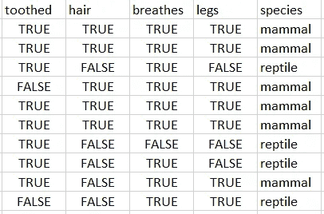

让我们一个一个地从每个特性开始。我们在数据中观察到，所有输入特征都由布尔值表示。

(i) **齿状**:让我们总结一下‘齿状’特征值的输出(种类)。

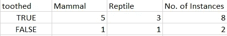

基尼指数(齿状=真)= 1—{(5/8)+(3/8)} = 1–0.39–0.14 = 0.47

基尼指数(锯齿=假)= 1—{(1/2)+(1/2)} = 1–0.25-0.25 = 0.5

为了获得“有齿物种”的最终基尼指数，我们使用上述计算值的加权和，如下所示:

基尼指数(有齿)=(8/10)* 0.47+(2/10)* 0.5 = 0.38+0.1 =**0.48**

(二)**头发**:让我们总结一下输出(种类)wrt 的‘头发’特征值。

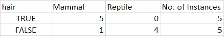

基尼指数(hair = true)= 1—{(5/5)+(0/5)} = 1–1–0 = 0

基尼指数(hair = false)= 1—{(1/5)+(4/5)} = 1–0.04–0.64 = 0.32

为了获得“物种”相对于“毛发”的最终基尼指数，我们使用上述计算值的加权和，如下所示:

基尼指数(头发)=(5/10)* 0+(5/10)* 0.32 =**0.16**

(三)**呼吸**:总结一下‘呼吸’特征值的输出(物种)。


基尼指数(呼吸=真实)= 1—{(6/9)+(3/9)} = 1–0.45–0.11 = 0.44

基尼指数(breats = false)= 1—{(0/1)+(1/1)} = 1–0–1 = 0

为了获得“物种”相对于“呼吸”的最终基尼指数，我们使用上述计算值的加权和，如下所示:

基尼指数(呼吸)=(9/10)* 0.44+(1/10)* 0 =**0.40**

(iv) **legs** :让我们总结一下‘legs’特征值的输出(种类)。

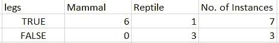

基尼指数(legs = true)= 1—{(6/7)+(1/7)} = 1–0.73–0.02 = 0.25

基尼指数(breats = false)= 1—{(0/3)+(3/3)} = 1–0–1 = 0

为了获得“物种”对“腿”的最终基尼系数，我们使用上述计算值的加权和，如下所示:

基尼指数(呼吸)=(7/10)* 0.25+(3/10)* 0 =**0.18**

现在，我们已经针对所有 4 个输入特征计算了输出变量的基尼指数，我们需要选择根节点。选择根节点使得它具有最小的基尼指数。基尼指数越低，早期预测答案的几率就越高(由于节点的纯度更高)。所以在这里，我们选择**头发**作为根节点。此时的决策树看起来像这样:


让我们首先考虑“头发”取值为 TRUE 的情况。

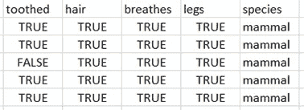

当 hair 取值为 TRUE 时，让我们针对输入特征(不包括**头发**特征)计算输出的基尼指数。

(i) **齿状**:让我们总结一下当 hair = TRUE 时“齿状”特征值的输出(种类)

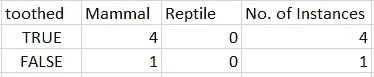

基尼指数(头发=真&牙齿=真)= 1—{(4/4)+(0/4)} = 1–1–0 = 0

基尼指数(头发=真&牙齿=假)= 1—{(1/1)+(0/1)} = 1–1–0 = 0

为了获得“头发=真”的“物种”wrt“有齿”的最终基尼指数，我们使用上述计算值的加权和作为:

基尼指数(齿牙&头发=真)=(4/5)* 0+(1/5)* 0 = 0+0 =**0**

(ii) **呼吸**:让我们总结一下当 hair = TRUE 时“呼吸”特征值的输出(种类)

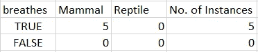

基尼指数(头发=真实，呼吸=真实)= 0

基尼指数(头发=真，呼吸=假)= 0

为了获得“头发=真”的“物种”wrt“呼吸”的最终基尼指数，我们使用上述的加权和。

基尼指数(呼吸和头发=真实)= **0**

(iii) **legs** :让我们总结一下当 hair = TRUE 时‘legs’特征值的输出(种类)

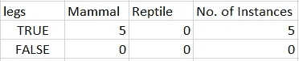

基尼指数(头发=真&腿=真)= 0

基尼指数(头发=真&腿=假)= 0

为了获得“头发=真”的“物种”对“腿”的最终基尼指数，我们使用上述的加权和。

基尼指数(腿和头发=真)= **0**

在上述所有情况下，基尼系数等于 0。这意味着，如果我们预测该物种有毛发，则可以基于给定的数据集以高置信度将其归类为“哺乳动物”。此时，决策树看起来像这样:

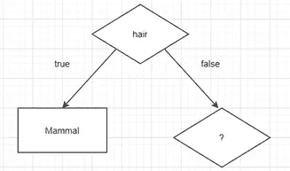

现在，让我们考虑“头发”取值为 FALSE 的情况。

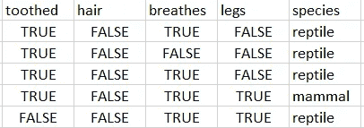

当头发的值为 FALSE 时，让我们针对输入特征(不包括**头发**特征)计算输出的基尼指数。

(i) **齿状**:让我们总结一下当 hair = FALSE 时‘齿状’特征值的输出(物种)

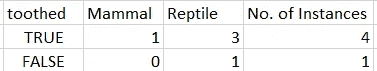

基尼指数(头发=假&牙齿=真)= 1—{(1/4)+(3/4)} = 1–0.06–0.56 = 0.38

基尼指数(头发=假&牙齿=假)= 1—{(0/1)+(1/1)} = 1–0–1 = 0

为了获得“头发=假”的“物种”wrt“有齿”的最终基尼指数，我们使用上述计算值的加权和作为:

基尼指数(齿牙&头发=假)=(4/5)* 0.38+(1/5)* 0 = 0.3+0 =**0.3**

(ii) **呼吸**:让我们总结一下当 hair = FALSE 时‘呼吸’特征值的输出(种类)

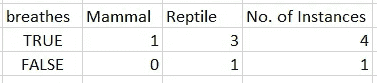

基尼指数(头发=假，呼吸=真)= 1—{(1/4)+(3/4)} = 1–0.06–0.56 = 0.38

基尼指数(头发=假&呼吸=假)= 1—{(0/1)+(1/1)} = 1–0–1 = 0

为了获得“头发=假”的“物种”wrt“呼吸”的最终基尼指数，我们使用上述计算值的加权和作为:

基尼指数(呼吸和头发=假)=(4/5)* 0.38+(1/5)* 0 = 0.3+0 =**0.3**

(iii) **腿**:让我们总结一下当 hair = FALSE 时‘腿’特征值的输出(物种)

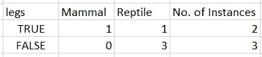

基尼指数(头发=假&腿=真)= 1—{(1/2)+(1/2)} = 1–0.25–0.25 = 0.5

基尼指数(头发=假&腿=假)= 1—{(0/3)+(3/3)} = 1–0–1 = 0

为了获得“头发=假”的“物种”wrt“腿”的最终基尼指数，我们使用上述计算值的加权和作为:

基尼指数(齿牙&头发=假)=(2/5)* 0.5+(3/5)* 0 = 0.2+0 =**0.2**

在上述 3 个案例中，我们看到，在“头发=假”的条件下，“腿”特征的基尼指数最小。因此，当“hair=FALSE”时，选择“legs”作为子节点。此时，决策树看起来像这样:

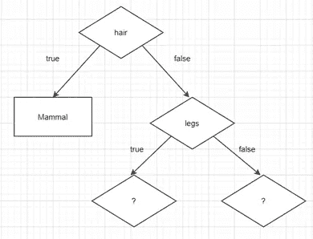

为了更进一步，让我们考虑 legs = TRUE(现在隐含 hair = FALSE)的情况。

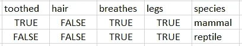

当头发取值为假而腿取值为真时，让我们针对输入特征计算基尼指数，不包括**头发**和**腿**特征。

(i) **齿状**:让我们总结一下头发=假，腿=真时‘齿状’特征值的输出(物种)。

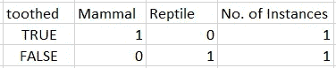

基尼指数(头发=假&腿=真&牙齿=真)= 0

基尼指数(头发=假&腿=真&牙齿=假)= 0

为了获得“头发=假”和“腿=真”的“物种”wrt“有齿”的最终基尼指数，我们使用上述的加权和。

基尼指数(牙齿&头发=假&腿=真)= **0**

(二)**呼吸**:总结一下头发=假，腿=真时‘呼吸’特征值的输出(物种)。

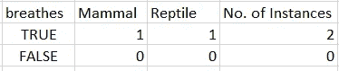

基尼指数(头发=假&腿=真&呼吸=真)= 1—{(1/2)+(1/2)} = 1–0.25–0.25 = 0.5

基尼指数(头发=假&腿=真&呼吸=假)= 0

为了获得“头发=假”和“腿=真”的“物种”wrt“有齿”的最终基尼指数，我们使用上述的加权和。

基尼指数(牙齿&头发=假&腿=真)= (2/2) * 0.5 + (0/2) * 0 = **0.5**

在上面的 2 个例子中，我们看到‘齿状’的基尼指数较低，所以当‘legs = TRUE’时，它被选为子节点。决策树现在看起来像这样:

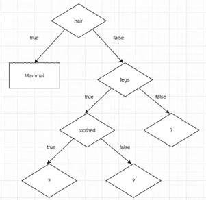

现在，让我们考虑“legs”取值为 FALSE 的情况。

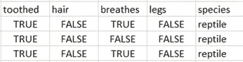

从上面的场景中，我们可以清楚地看到，当“头发=真”和“腿=假”时，输出的“物种”在所有情况下都是“爬行动物”。因此，我们无需计算基尼指数，就可以有把握地得出结论，为决策树生成的子节点将是值为“爬虫”的叶节点。(请记住，当我们考虑“头发=真”的情况时，我们看到所有输出的“物种”值都是“哺乳动物”，通过计算基尼指数，我们直接生成了一个值为“哺乳动物”的叶节点)

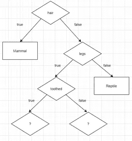

进一步来说，让我们考虑“锯齿=真”的情况。这里隐含了“头发=假”和“腿=真”的情况。

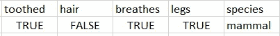

在这里，我们只有一个被归类为哺乳动物的记录。因此，这种特征的组合导致输出的“物种”是“哺乳动物”。

考虑到“齿状=假”的情况，我们得到

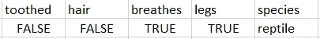

以类似的方式，我们可以得出结论，这组特征的输出“物种”是“爬行动物”。现在，我们终于构建了一个决策树，我们可以在其上抛出一些测试数据来进行预测。

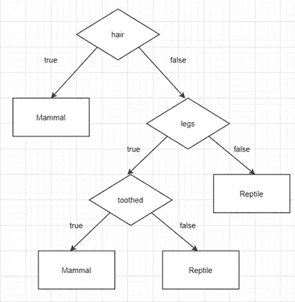

如果到目前为止您已经仔细观察过，您可能已经观察到该数据集中的所有变量都是分类变量(即，要素具有一组有限的不同值(2)，如 TRUE 和 FALSE)。在你在**中遇到的数据集中，真实生活混合了分类变量和连续变量**。为了从具有连续值的数据集构建决策树，通过定义某个阈值将这些连续值转换成分类值。利用这一点，可以为任何类型的数据构建决策树。

# 为什么不使用决策树

尽管决策树创建起来非常直观和简单，但是它们有以下缺点。

1.它们是不稳定的，这意味着数据的微小变化会导致最优决策树结构的巨大变化。

2.计算可能会变得非常复杂，尤其是当许多值不确定和/或许多结果相互关联时。

3.决策树倾向于非常快地过度适应训练数据，并且可能变得非常不准确。

# 随机森林

由于决策树的上述缺点，使用随机森林算法来代替决策树。随机森林算法使用大量决策树，这些决策树作为[集合](https://en.wikipedia.org/wiki/Ensemble_learning)运行。机器学习集成只由具体的有限的备选模型集组成，但通常允许在这些备选模型中存在更加灵活的结构。

随机森林算法是基于**群体智慧**的概念。在计算机科学的各种任务中，群体智慧是一种非常有效的技术。事实上，维基百科(完全众包，每个人都可以编辑)和大英百科全书(完全由专家编写)的质量标准水平相当，这证明了群体智慧的力量。人群中的每个人都做出了带有一定误差的预测。因为所有的个体都是独立行动的，所以他们的错误也是相互独立的。换句话说，这些误差是**不相关的**，也就是说，当考虑到一堆误差时，这些误差相互抵消，我们得到的是一个良好、准确的预测。这就是随机森林算法的工作方式。

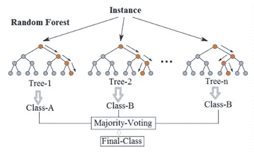

随机森林简体([来源](https://en.wikipedia.org/wiki/Random_forest))

# 随机森林算法的工作

随机森林算法使用来自给定数据集的大量决策树(创建一个**森林**)，这些决策树彼此独立/不相关，总体上优于其任何组成树。森林中的组成树木之间的这种很少甚至没有的相关性为这种集合方法赋予了**随机**的元素，这产生了一种奇妙的效果，即保护树木免受它们各自错误的影响。但是我们需要确保我们为随机森林工作而随机制作的各种决策树的输出不应该是完全随机的。为了确保这一点，我们需要确保:

(I)为了使随机决策树有效，输出应该依赖于所有的训练特征，而不仅仅是其中的一些。

(ii)每个决策树做出的预测应该彼此具有低相关性，以便使群体智慧概念起作用。

第一点是我们收集的数据集的特征。那么，作为一名数据科学家，我们如何确保组成决策树尽可能多样化呢？为此，随机森林使用以下两种技术:

㈠装袋

(二)特征随机性

## 制袋材料

决策树的一个主要缺点是，它们对数据的微小变化都不够稳健，这使得它们容易过度拟合。我们来了解一下装袋是如何解决这个问题的。考虑具有 **M** ( > > 50)个训练示例的训练数据集，为了简单起见，让我们考虑这些是 1 到 50 范围内的 M 个数字。如果我们想要将 **B** 决策树用于随机森林，那么通过 bagging，每个 B 决策树由 M 个训练样本组成，但是不是使用所有的 M 个训练样本，而是使用这些训练样本的随机子集(这里数字在 1 到 50 的范围内),并且来自该子集的数字被随机重复，直到总共 M 个训练样本被创建。

装袋有什么帮助？通过创建大量的决策树，其中大量的训练示例随机分布在决策树中，聚集的结果是随机森林模型，该模型即使对数据的微小变化也是健壮的，从而消除了决策树的主要缺点之一(通过使用决策树)。

## 特征随机性

使用随机训练样本的想法也可以应用于训练数据的特征。回想一下，在构造决策树时，当决定每个节点的分裂时，我们考虑了所有的特征。如果训练数据集具有 **N** 个特征，那么在特征随机性中，在创建每个 B 决策树时，通过使用这 N 个特征的随机子集而不是使用所有 N 个特征来做出分裂节点的决定。

当 bagging 和特征随机性都用于为随机森林生成决策树森林时，**每个决策树由训练样本的随机子集以及特征的随机子集构成**。这种随机性通过确保形成不相关的决策树来保护彼此免受其错误的影响，从而为随机森林分类器增加了很多鲁棒性和稳定性。一旦所有这些组成决策树做出预测，就会进行多数表决，以获得分类器的最终预测。

到目前为止，我们已经看了很多概念。从决策树背后的数学到手动创建一个决策树，然后看看如何在随机森林中使用决策树，我们已经走了很长的路。现在是我们实践随机森林分类器的时候了，在这篇文章中，我们不会处理一个新的数据集，相反，我们将改进我们的逻辑回归模型，我们在这篇文章中对泰坦尼克号数据集进行了训练。这是实际机器学习任务的执行方式。尝试了各种机器学习模型，并且在实践中使用了效果最好并且证明了所获得的结果的模型。记住，坚持是关键。所以让我们开始吧。

# 问题陈述

泰坦尼克号问题的数据集可以在这里找到。我们必须预测泰坦尼克号上的一名乘客能否生还，给出相应的数据。我们已经在[这个](https://medium.com/analytics-vidhya/machine-learning-ii-logistic-regression-explained-data-pre-processing-hands-on-kaggle-728e6a9d4bbf)岗位应用了数据预处理和逻辑回归。现在，我们将使用前一篇文章中相同的预处理数据，但这次将应用随机森林分类。预处理后的数据集如下所示:

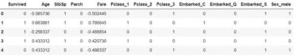

在应用了**递归特征消除(RFE)** 之后，我们获得了将有助于训练随机森林分类器的前 8 个最重要的特征。更多关于 RFE 的信息可以在这里找到[。](https://scikit-learn.org/stable/modules/generated/sklearn.feature_selection.RFE.html)

```
from sklearn.ensemble import RandomForestClassifier
from sklearn.feature_selection import RFEcols = [“Age”, “SibSp”, “Parch”, “Fare”, “Pclass_1”, “Pclass_2”, “Pclass_3”, “Embarked_C”, “Embarked_Q”, “Embarked_S”, “Sex_male”]X = final_train[cols]
y = final_train[‘Survived’]model = RandomForestClassifier()*# selecting top 8 features* rfe = RFE(model, n_features_to_select = 8)
rfe = rfe.fit(X, y)print(‘Top 8 most important features: ‘ + str(list(X.columns[rfe.support_])))
```

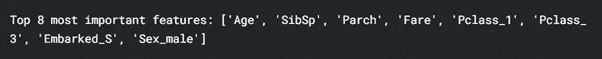

现在我们已经有了应该用于训练分类器的特征列表，让我们对数据集应用随机森林分类器。与逻辑回归不同，随机森林有大量需要输入模型的参数。最重要的参数是:

1.n_estimators =前集中的树的数量

2.max_features =分割结点时考虑的最大要素数

3.max_depth =每个决策树中的最大级别数

4.min_samples_split =分割节点前放置在节点中的最小数据点数

5.min_samples_leaf =叶节点中允许的最小数据点数

6.bootstrap(如 bagging) =采样数据点的方法(有或没有替换)

这些参数很多，很难手动获得它们的最优值。因此，我们通过向模型传递每个参数的一组值来利用计算能力，参数将这些值应用于数据集并选择最佳值。对于这个数据集，使用随机超参数网格技术，我花了大约 5 分钟来获得最佳值。

```
*# Number of trees in random forest* n_estimators = [int(x) for x **in** np.linspace(start = 200, stop = 2000, num = 10)]*# Number of features to consider at every split* max_features = ['auto', 'sqrt']*# Maximum number of levels in tree* max_depth = [int(x) for x **in** np.linspace(10, 110, num = 11)]
max_depth.append(None)*# Minimum number of samples required to split a node* min_samples_split = [2, 5, 10]*# Minimum number of samples required at each leaf node* min_samples_leaf = [1, 2, 4]*# Method of selecting samples for training each tree (bagging)* bootstrap = [True, False]*# Creating random grid* random_grid = {'n_estimators': n_estimators, 'max_features': max_features, 'max_depth': max_depth, 'min_samples_split': min_samples_split, 'min_samples_leaf': min_samples_leaf, 'bootstrap': bootstrap}
```

在每次迭代中，算法将选择特征的不同组合。总共有 2 * 12 * 2 * 3 * 3 * 10 = 4320 个设置！然而，随机搜索的好处是，我们不是在尝试每一种组合，而是随机选择大范围的值进行采样。

```
*# First create the base model to tune* rf = RandomForestClassifier()*# Random search of parameters, using 3 fold cross validation,
# search across 100 different combinations, and use all available cores*rf_random = RandomizedSearchCV(estimator = rf, param_distributions = random_grid, n_iter = 100, cv = 3, verbose=2, random_state=42, n_jobs = -1)*# Fit the random search model* rf_random.fit(final_train[selected_features], final_train['Survived'])
rf_random.best_params_
```

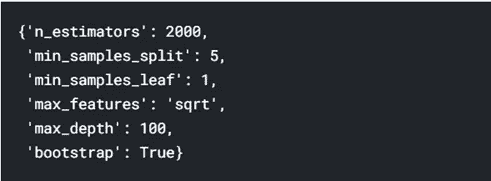

现在，我们已经从提供给算法的给定范围中获得了一组最佳参数，让我们使用 sci-kit learn 提供的默认值和我们获得的值来训练随机森林分类器。

```
X = final_train[selected_features]
y = final_train['Survived']X_train, X_test, y_train, y_test = train_test_split(X, y, test_size=0.15, random_state=2)*# fitting both base random forest model and RandomizedSearchCV random forest model* base_model = RandomForestClassifier()
base_model.fit(X_train, y_train)best_random = RandomForestClassifier(n_estimators = 2000, min_samples_split= 5, min_samples_leaf = 1, max_features = 'sqrt', max_depth = 100, bootstrap = True)best_random.fit(X_train, y_train)
```

现在我们已经训练了这些模型，让我们使用下面定义的评估函数来评估它们。

```
def evaluate(model, test_features, test_labels):
  predictions = model.predict(test_features)
  errors = abs(predictions - test_labels)
  accuracy = accuracy_score(test_labels, predictions) * 100
  print('Model Performance')
  print('Average Error: **{:0.4f}** degrees.'.format(np.mean(errors)))
  print('Accuracy = **{:0.2f}**%.'.format(accuracy)) return accuracybase_accuracy = evaluate(base_model, X_test, y_test)
```

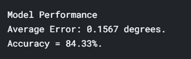

```
random_accuracy = evaluate(best_random, X_test, y_test)
```

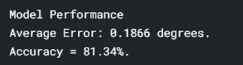

我们观察到，基础模型的测试精度为 84.33%，而我们提供随机搜索获得的参数的模型的测试精度为 81.34%，这应该高于基础模型的精度。这可能是因为训练数据集不够大，或者我们提供给随机搜索选择的值可能包含了最佳值的范围。不过，我们肯定可以用它来提高我们的准确性。

类似地，我还应用了 GridSearchCV 来检查分类器的准确性，同样是 81%左右。相对较低的准确性可能是由于上述原因造成的。

但是，从这个练习中得到的关键收获是，我们将模型在测试集上的准确性从使用逻辑回归的 77.6%提高到使用随机森林算法的大约 84%，这确实证明了我们上面对随机森林算法的讨论是正确的。当我在 Kaggle 上提交这个模型的结果时，我收到了 0.7751 的公开分数，这比我们收到的逻辑回归分类器的分数(0.7703)要好，虽然差不了多少，但足以向前迈出一步，以改进已经存在的健壮分类器。

这篇文章的完整代码可以在[这里](https://www.kaggle.com/vardaanbajaj/titanic-random-forest)找到。

这个帖子到此为止。在迄今为止的所有帖子中，我们已经非常详细地探索了最常用的监督机器学习算法。从[的下一篇](/machine-learning-vi-unsupervised-learning-k-means-kaggle-dataset-with-k-means-1adf5c30281b)文章开始，我们将深入无监督学习的基础知识，并学习各种无监督学习算法，从 K-means 聚类开始。