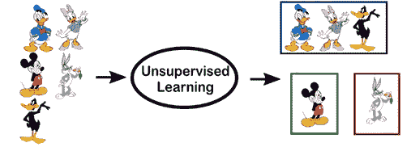
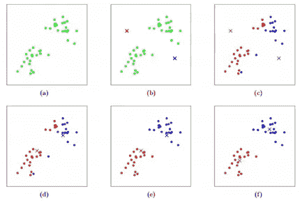
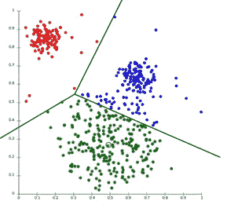
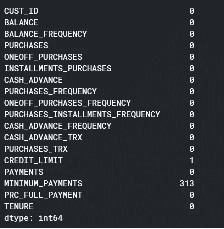
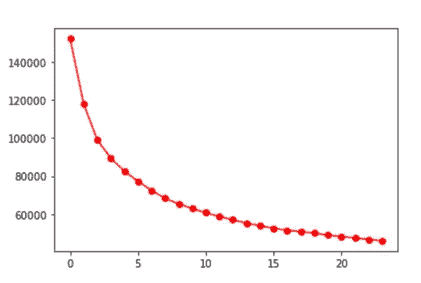
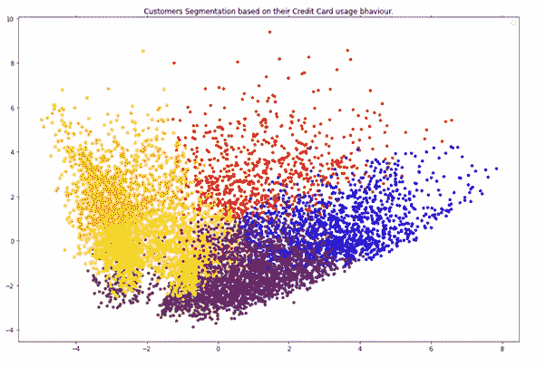

# 无监督学习和深入 K-Means

> 原文：<https://towardsdatascience.com/machine-learning-vi-unsupervised-learning-k-means-kaggle-dataset-with-k-means-1adf5c30281b?source=collection_archive---------42----------------------->

## 以及用 K-Means 求解的 Kaggle 数据集

# 内容

在本帖中，我们将了解:

1.  无监督学习
2.  K 均值的工作示例
3.  K 均值的代价函数
4.  集群的初始化方法
5.  肘法(试凑法)
6.  Kaggle 的信用卡数据集来映射用户的消费活动

到目前为止，在关于机器学习的系列文章中，我们已经看了到目前为止最流行的监督算法。在[之前的](https://medium.com/analytics-vidhya/machine-learning-v-decision-trees-random-forest-kaggle-dataset-with-random-forest-3ebfe6d584be)帖子中，我们详细讨论了决策树和随机森林。这篇文章和接下来的几篇文章将重点关注无监督学习算法，它们背后的直觉和数学，最后是一个求解的 Kaggle 数据集。

# 无监督学习

在没有监督的情况下完成的学习任务是无监督学习。与有监督的机器学习算法不同，无监督学习的训练数据中不存在监督机器学习模型性能的标签。但是，像监督学习算法一样，非监督学习用于离散和连续数据值。形式上，无监督学习是一种机器学习算法，用于从由没有标记响应的输入数据组成的数据集进行推断。


([来源](https://www.kdnuggets.com/2018/04/supervised-vs-unsupervised-learning.html)

无监督学习有两种类型:**判别模型**和**生成模型**。辨别模型只能告诉你，如果你给它 X，那么结果是 Y，而生成模型可以告诉你，你将同时看到 X 和 Y 的总概率。

所以区别如下:**判别模型给输入分配标签，没有预测能力**。如果你给它一个不同的 X，它从来没有见过，它不知道 Y 会是什么，因为它还没有学会。有了**生成模型**，一旦你设置好它并找到基线，你可以给它任何输入并要求预测。因此，它**具有预测能力**。

无监督学习的两个常见用例是:

(一)聚类分析，又称探索性分析

(二)主成分分析

聚类分析或聚类的任务是以这样一种方式将数据点分组，即一个聚类中的数据点与其他聚类中的数据点相似而不同。聚类有多种应用，例如在市场细分、模式识别、词向量、检测网络攻击等许多领域。

主成分分析用于降低数据集的维度(特征的数量)。除了降低维度，主成分分析还将数据转换成人类难以理解的数字形式。通过主成分分析，模型的训练时间可以在很大程度上减少，而精度只有非常轻微的下降。

无监督学习的一些常见例子是 K-means、主成分分析(PCA)、自动编码器等。在这篇文章中，我们将详细介绍 K-means 算法。



无监督学习示例([来源](https://www.kdnuggets.com/2018/04/supervised-vs-unsupervised-learning.html))

# k 均值

让我们首先掌握术语“K-Means”的用法。在统计学中，“平均值”是指一组给定数据点的平均值。这意味着该算法处理“K”平均值。但是,“K”平均值意味着什么呢？我们通常只有一个代表整个数据的平均值。拥有“K”个平均值意味着我们已经对“K”个数据段执行了“均值”运算，每个数据段都可以被视为一个单独的独立单元。因此，只有当给定数据被分成“K”个部分/组/簇时，才有可能获得“K”个平均值。术语 K-means 本身足以描述它是一种聚类算法，因此我们应该避免将术语“聚类”与 K-means 一起使用。稍后我们会看到这正是 K-means 背后的数学原理。

从形式上来说，K-Means 是一种无监督学习算法，它采用具有“m”条记录的未标记数据集，并将其分组为“K”个子集/聚类，其中每个聚类都具有具有相似属性和 K < m. The algorithm however is not intelligent enough to determine the number of clusters in the data automatically and hence requires a predefined number of clusters (K) to divide the data into ‘K’ coherent groups. That being said, K-means is still one of the most widely used clustering algorithms due to its simplicity and fast computation time.

K-means algorithm works in 2 steps.

(i) Cluster assignment

(ii) Move centroid

Both of these steps are repeated until the algorithm converges.

# K-Means Working Example

To better understand the 2 steps of K-means, let’s look at how K-means works through an example and the optimization objective (cost function) involved. In order to visualize things, we’ll assume that the data we’re using just has 2 features i.e. 2-dimensional data. Let us divide the data into 2 clusters, so K = 2.



K-Means Working ([源](https://stanford.edu/~cpiech/cs221/handouts/kmeans.html)的记录

给定图(a)中原始数据的散点图，首先在图上选择 2 个随机点(聚类质心)(图 b)。一旦选择了这些点，就计算所有数据点到所选聚类点的接近度。有许多方法可以计算邻近度，最简单的方法之一是使用欧几里德距离。一旦计算出所有的欧几里德距离，就将数据点分配给离它们最近的那些聚类质心。在图 c 中，基于数据点与聚类质心的接近度，将数据点分配给红色/蓝色聚类质心。这是**聚类分配步骤**，其中每个数据点被分配给一个聚类。但是这些聚类分配不是最优的，因为聚类质心的初始值是随机选择的。为了克服这个问题，计算属于一个聚类的所有数据点的中心值，并将聚类质心移动到这个新位置，如图 d 所示。这是**移动质心步骤**。到目前为止，我们已经执行了一次聚类分配和移动质心步骤的迭代，还没有将数据点很好地划分成聚类。为了使 K-means 算法收敛，我们需要对这两个步骤进行多次迭代。图 e 对图 d 中获得的新的聚类质心执行“聚类分配步骤”,然后图 f 执行“移动质心步骤”以给出新的最佳聚类质心。此时，经过这些步骤的 2 次迭代，我们似乎已经达到了给定数据点的最佳聚类分组。实际上，要达到最佳的集群分组需要大量的迭代。

上述 K-means 聚类的整个过程可以通过下面的伪代码来总结。

```
Initialize cluster centroids µ(1), µ(2), µ(3), ……, µ(k) **∈ R**n randomly, where **R**n represents a feature vector of n-dimensions.Repeat until convergence:
{
  for i = 1 to m
    c(i) = cluster centroid closest to training example x(i)
  for k = 1 to K
    µ(k) = average (mean) of points assigned to cluster k
}
```

# 价值函数

现在我们知道了 K-means 中涉及的步骤如何导致聚类，让我们尝试通过这些步骤背后的直觉来获得所涉及的优化目标(成本函数)。在一行中，K-means 算法确定每个数据点的聚类质心，然后将聚类质心移动到该聚类的中心位置，并且重复这两个步骤，直到算法收敛。因此，成本函数应该最小化每个聚类质心与其对应数据点的总距离；服从于“群集分配步骤”和“移动质心步骤”中出现的条件。

在正式定义 K-means 的代价函数之前，让我们看一下用来定义代价函数的符号。

c(i) =训练示例 x(i)当前被分配到的分类号(在 1 和 K 之间)

(k) =群集质心的表示((k) **∈ R** n)

(c(i)) =训练示例 x(i)已被分配到的聚类的聚类质心的表示。

成本函数的参数是 c(i)和(k)(也是 c(i))，因为通过改变这些参数，我们可以得到不同的聚类，并且目标是得到通过最小化成本函数可以得到的最佳聚类。K 均值的最小化目标是:


并且成本函数产生最小值的 c(i)和(k)的值是这些参数的最佳值。在“聚类分配步骤”期间，在参数 c(i)保持(k)固定的情况下最小化成本函数(即成本函数对 c(i)变量取偏导数)，并且在“移动质心”步骤期间，在参数 c(i)保持固定的情况下最小化成本函数(即成本函数对(k)变量取偏导数)。

梯度下降算法然后在计算这两个偏导数的总和之后更新成本函数，并使我们能够达到全局最小值/良好的局部最小值。

# 初始化集群

在 k-means 的伪代码中，我们看到了聚类分配步骤和移动质心步骤如何协同工作来生成 k 个聚类，但我们仍然没有讨论如何随机初始化聚类质心，这是伪代码的第一行。就像我们在线性和逻辑回归中随机初始化参数‘W’和‘b’一样，这里，随机初始化参数 c(i)和(k)有不同的方式。让我们逐一讨论。

**(i)** **Forgy 初始化** : Forgy 初始化是一种很好的快速初始化参数的方法。对于 K 个聚类，Forgy 方法从训练数据集中随机选择 K 个观测值，并将其作为初始均值(聚类质心)。Forgy 初始化是一种用于初始化聚类质心的非常直观的技术，因为聚类质心将位于训练数据点附近的某处，然而在实践中，它倾向于将初始均值展开，即算法需要更多的步骤来收敛。

**(ii)** **随机划分**:该方法将每个数据点随机分配到 K 个聚类中的一个，同组的数据点组合在一起形成组，取其平均值来确定初始的聚类质心。随机划分方法通常是模糊 k-means 的首选，但对于标准 k-means，forgy 初始化工作良好。

**(iii) K-means++** :这种方法背后的直觉是，展开 K 个初始聚类质心是一件好事。从被聚类的数据点中均匀随机地选择第一个聚类质心，之后从剩余的数据点中选择每个后续的聚类质心，其概率与其到该点最近的现有聚类中心的距离的平方成比例。这种方法优于 Forgy 初始化和随机分区方法，是首选方法。更多关于 K-means++的信息可以在[这里](https://en.wikipedia.org/wiki/K-means%2B%2B)找到。

# 局部最优问题

尽管上面提到的随机初始化对于 K-means 工作得很好，但是它们可能导致 K-means 收敛到成本函数的不良局部最优(一些局部最优接近全局最优，一些不接近全局最优)，从而导致较差的聚类形成。事实上，在所有具有随机初始化步骤的算法中，它们都有陷入局部最优的风险，甚至是线性和逻辑回归算法。请看下图，当算法陷入糟糕的局部最优时，K-means 形成的聚类的一个例子。


这些坏的局部最优对模型的性能是有害的。我们需要避免这种情况。解决方案很简单。对于 2–10 之间的 K 值，我们可以通过运行 10 到 1000 次 K 均值迭代来解决这个问题，每次使用不同的初始随机初始化，并选择一个模型，对于该模型，获得的参数集(c(i)和(K))导致成本函数的最小值。然而，这种方法不适用于大 K 值，因为我们想要的聚类越多，算法收敛到局部最优的机会就越大。因此，在这种情况下，我们不需要应用 K-means 很多次，因为每次都有很高的机会收敛到局部最小值。对于大 K 值，K 均值的单次迭代给出了令人满意的结果。

# 选择 K

由于未标记的数据，我们无法评估 K-means 模型的性能，变量 K 的选择变得具有挑战性。在这种情况下，最明智的做法是使用试凑法。在用于 K-means 的试凑法中，我们选择 K 值的范围(假设 1 到 10)，并通过在所选范围内的每个可能的 K 值运行 K-means 来计算总成本。成本函数急剧下降的 K 值，以及在此之后成本函数缓慢下降的 K 值，可以被认为是 K 的最佳值。这种方法被称为**肘方法**，但我喜欢称之为试凑法。然而，并不强制选择该拐点作为 K 的最佳值。成本函数值随着 K 值的增加而减小，并且当 K = m(训练数据点的总数)时达到 0，这发生在每个数据点是其自身唯一聚类的一部分时。虽然我们不希望 K = m，但是我们可以根据我们手头的计算能力、数据量和数据复杂度来超越肘点。


肘法举例([来源](https://www.researchgate.net/figure/Result-of-the-elbow-method-to-determine-optimum-number-of-clusters_fig8_320986519)

## 附加注释

到目前为止，我们已经非常详细地讨论了 K-means，我想把你的注意力吸引到我们刚刚开始讨论 K-means 的时候。我提到过 K-means 的局限性之一是它不能自动捕获所有的聚类，并且需要一个明确的聚类数目值。然而，这也可以成为一种优势。考虑这样一个数据集，我们需要为一项任务(如市场细分)找到聚类，但数据点是均匀分散的。在这种情况下，自动捕获聚类的算法更有可能失败。但是通过提供给 K-means 的明确的聚类数，我们可以期望该算法得出甚至人类都无法找到的良好分组。这就是 K-means 的妙处。

关于 K-means 需要注意的另一件重要事情是，K-means 导致聚类的线性分离。这可能令人吃惊，但没什么可担心的。聚类(在一组数据点周围手工绘制的代表聚类的曲线形状)仍然与我们目前所描绘的非常相似。下图会让事情更清楚。



聚类的线性分离([来源](https://aws.amazon.com/blogs/machine-learning/k-means-clustering-with-amazon-sagemaker/))

至此，我们结束了对 K-means 的讨论。现在，让我们使用 Kaggle 的一个未标记的信用卡数据集，并使用它来确定不同信用卡持有者的信用卡使用模式。

# 问题陈述

我们将使用 Kaggle 上的信用卡数据集来确定地图消费活动。数据集可以在[这里](https://www.kaggle.com/arjunbhasin2013/ccdata)找到。按照惯例，我们需要对数据进行预处理，以便将其输入 K-means 算法。首先，让我们将数据读入熊猫数据帧。

```
import numpy as np
import pandas as pdimport matplotlib.pyplot as plt
from sklearn.preprocessing import StandardScaler
from sklearn.cluster import KMeans
from sklearn.decomposition import PCA
import osfor dirname, _, filenames in os.walk('/kaggle/input'):
  for filename in filenames:
    print(os.path.join(dirname, filename))
```


```
df = pd.read_csv(‘/kaggle/input/ccdata/CC GENERAL.csv’)
print(df.shape)
df.head()
```


```
df.describe()
```


数据集中有 18 个特征很难放入单个图像中。但是，从 df.describe()的输出中，我们可以看到，对于所有的列/特征，标准偏差都很高，最小值和最大值相差太远，分布偏向较低值，这可以从 75%标记、平均值和最大值中看出。这意味着给定的数据集包含离群值，需要处理这些离群值。简单地忽略离群值会导致大量数据丢失。

在我们处理异常值之前，让我们检查数据中缺失的值并估算它们。

```
df.isna().sum()
```



只有两列有空值。缺失值是整个数据集(1/8950)和(313/8950)的一小部分，因此很容易估算。我们将使用平均值估算 CREDIT_LIMIT，由于 MINIMUM_PAYMENTS 是一个偏向下侧的连续变量，我们可以使用平均值或中值估算它。这应该不会有太大的差别，因为丢失值的比例非常小。我们会用平均值来估算。

```
df[‘MINIMUM_PAYMENTS’].fillna(df[‘MINIMUM_PAYMENTS’].mean(skipna=True), inplace=True)df[‘CREDIT_LIMIT’].fillna(df[‘CREDIT_LIMIT’].mean(skipna=True), inplace=True)
```

既然我们已经处理了丢失的值，让我们把注意力放回到异常值上。让我们将整个数据集的值转换为分类值。由于我们对通过分类寻找相似性感兴趣，所以将特定范围内的值分组并给它们分配一个类别是一个好主意。稍后，我们还将对这些类别值进行标准化，以确保任何列中没有大值主导/扭曲聚类结果。

```
columns = ['BALANCE', 'PURCHASES', 'ONEOFF_PURCHASES', 'INSTALLMENTS_PURCHASES', 'CASH_ADVANCE', 'CREDIT_LIMIT','PAYMENTS', 'MINIMUM_PAYMENTS'] # All features with outlandish valuesfor c in columns:
  Range = c+'_RANGE'
  df[Range]=0
  df.loc[((df[c]>0)&(df[c]<=500)),Range]=1
  df.loc[((df[c]>500)&(df[c]<=1000)),Range]=2
  df.loc[((df[c]>1000)&(df[c]<=3000)),Range]=3
  df.loc[((df[c]>3000)&(df[c]<=5000)),Range]=4
  df.loc[((df[c]>5000)&(df[c]<=10000)),Range]=5
  df.loc[((df[c]>10000)),Range]=6columns=['BALANCE_FREQUENCY', 'PURCHASES_FREQUENCY', 'ONEOFF_PURCHASES_FREQUENCY', 'PURCHASES_INSTALLMENTS_FREQUENCY', 'CASH_ADVANCE_FREQUENCY', 'PRC_FULL_PAYMENT']for c in columns:
  Range=c+'_RANGE'
  df[Range]=0
  df.loc[((df[c]>0)&(df[c]<=0.1)),Range]=1
  df.loc[((df[c]>0.1)&(df[c]<=0.2)),Range]=2
  df.loc[((df[c]>0.2)&(df[c]<=0.3)),Range]=3
  df.loc[((df[c]>0.3)&(df[c]<=0.4)),Range]=4
  df.loc[((df[c]>0.4)&(df[c]<=0.5)),Range]=5
  df.loc[((df[c]>0.5)&(df[c]<=0.6)),Range]=6
  df.loc[((df[c]>0.6)&(df[c]<=0.7)),Range]=7\
  df.loc[((df[c]>0.7)&(df[c]<=0.8)),Range]=8
  df.loc[((df[c]>0.8)&(df[c]<=0.9)),Range]=9
  df.loc[((df[c]>0.9)&(df[c]<=1.0)),Range]=10columns=['PURCHASES_TRX', 'CASH_ADVANCE_TRX']for c in columns:
  Range=c+'_RANGE'
  df[Range]=0
  df.loc[((df[c]>0)&(df[c]<=5)),Range]=1
  df.loc[((df[c]>5)&(df[c]<=10)),Range]=2
  df.loc[((df[c]>10)&(df[c]<=15)),Range]=3
  df.loc[((df[c]>15)&(df[c]<=20)),Range]=4
  df.loc[((df[c]>20)&(df[c]<=30)),Range]=5
  df.loc[((df[c]>30)&(df[c]<=50)),Range]=6
  df.loc[((df[c]>50)&(df[c]<=100)),Range]=7
  df.loc[((df[c]>100)),Range]=8
```

因为我们已经修改了所有现有的特性名称，所以我们可以删除现有的特性名称。

```
df.drop(['CUST_ID', 'BALANCE', 'BALANCE_FREQUENCY', 'PURCHASES', 'ONEOFF_PURCHASES', 'INSTALLMENTS_PURCHASES', 'CASH_ADVANCE', 'PURCHASES_FREQUENCY',  'ONEOFF_PURCHASES_FREQUENCY', 'PURCHASES_INSTALLMENTS_FREQUENCY', 'CASH_ADVANCE_FREQUENCY', 'CASH_ADVANCE_TRX', 'PURCHASES_TRX', 'CREDIT_LIMIT', 'PAYMENTS', 'MINIMUM_PAYMENTS', 'PRC_FULL_PAYMENT' ], axis=1, inplace=True)X= np.asarray(df)df.head()
```


我们可以画出所有特征的频率分布。你可以在笔记本[这里](https://www.kaggle.com/vardaanbajaj/k-means-to-recognize-credit-card-usage-patterns?scriptVersionId=39202855)查看。上图显示，较低值的频率较高，因为数据中的大多数值都很小。这从我们通过 *df.describe()* 获得的数据分布的**最小值、第一四分位数、第三四分位数中值和最大值**中可以明显看出。然而，这个过程需要一定数量的试验，但并没有消耗太多时间。现在，我们将所有值标准化，以在 0–1 的范围内调整它们。

```
scaler = StandardScaler()
X = scaler.fit_transform(X)
```

既然我们已经将数据从连续值转换为离散值，并将其降低到一个特定的范围内，我们已经确保对所有的特征给予同等的重视。现在，我们可以继续应用 K-means。让我们用**肘法**来选择 k 的一个最优值。

```
clusters = 25
cost = []for i in range(1,clusters):
  kmeans = KMeans(i)
  kmeans.fit(X)
  cost.append(kmeans.inertia_)plt.plot(cost, ‘ro-’)
```



当 K = 6 时，我们似乎到达了一个拐点。在这个 K 值之后，成本下降得非常慢。

```
kmeans = KMeans(6)
kmeans.fit(X)labels = kmeans.labels_
```

这一步的输出是一个“集群”变量，它包含数据集的每个记录/行的集群号。让我们在数据帧的末尾添加这个变量。

```
clusters = pd.concat([df, pd.DataFrame({‘cluster’:labels})], axis=1)
```

为了可视化所创建的集群并查看它们是否定义良好，我们需要降低数据的维度，因为在 2 维空间中很难可视化 n 维数据。然而，在降低数据维数的同时，我们希望确保尽可能多地获取原始数据集的特征。为此，我们使用主成分分析(PCA)，这有助于我们实现上述目标。关注下一篇文章，深入了解 PCA。

```
pca = PCA(2)
principalComponents = pca.fit_transform(X)
x, y = principalComponents[:, 0], principalComponents[:, 1]
print(principalComponents.shape)colors = {0: ‘red’, 1: ‘blue’, 2: ‘green’, 3: ‘yellow’, 4: ‘orange’, 5:’purple’}
```


```
final_df = pd.DataFrame({‘x’: x, ‘y’:y, ‘label’:labels})
groups = final_df.groupby(labels)
```

最后，我们将所有的集群绘制成一个单独的情节中不同的支线剧情。

```
fig, ax = plt.subplots(figsize=(15, 10))for name, group **in** groups:
  ax.plot(group.x, group.y, marker='o', linestyle='', ms=5, color=colors[name], mec='none')
  ax.set_aspect('auto')
ax.tick_params(axis='x',which='both',bottom='off',top='off',labelbottom='off')
  ax.tick_params(axis= 'y',which='both',left='off',top='off',labelleft='off')ax.set_title(“Customers Segmentation based on their Credit Card usage bhaviour.”)plt.show()
```



成绩还过得去。我们有 6 个明显不同的集群。我们看到，如果我们将聚类数选择为 5，绿色的聚类可以是黄色和紫色聚类的一部分。此外，我们还可以通过绘制聚类中每个特征的频率分布图，然后比较和对比这些图来确定每个聚类的含义。这篇文章的完整代码可以在[这里](https://www.kaggle.com/vardaanbajaj/k-means-to-recognize-credit-card-usage-patterns?scriptVersionId=39202855)找到。

这个帖子到此为止。在这篇文章中，我们对 K-means 算法进行了详细的分析。在[的下一篇](/deep-dive-into-principal-component-analysis-fc64347c4d20)文章中，我们将深入探讨主成分分析，这是最流行和最广泛使用的无监督学习算法之一。