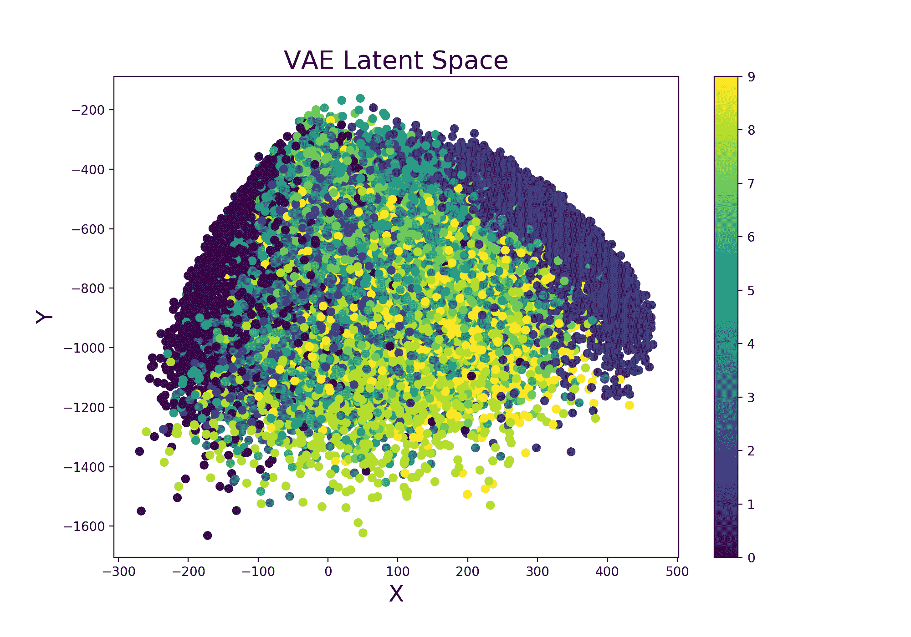

# 机器学习可视化

> 原文：<https://towardsdatascience.com/machine-learning-visualization-fcc39a1e376a?source=collection_archive---------6----------------------->

## [入门](https://towardsdatascience.com/tagged/getting-started)

## 收集了一些有趣的技术，可以用来可视化机器学习管道的不同方面。



# 介绍

作为任何数据科学项目的一部分，[数据可视化](/interactive-data-visualization-167ae26016e8)在了解更多可用数据和识别任何主要模式方面发挥着重要作用。

> 如果有可能让机器学习也成为分析的一部分，那不是很好吗？

在本文中，我们将探讨一些技术，可以帮助我们面对这一挑战，如:平行坐标图，汇总数据表，绘制人工神经网络图和更多。

本文使用的所有代码都可以在我的 [Github](https://github.com/pierpaolo28/Data-Visualization/tree/master/Machine%20Learning%20Visualization) 和 [Kaggle 账户](https://www.kaggle.com/pierpaolo28/notebooks)上免费获得。

# 技术

## 超参数优化

超参数优化是机器/深度学习中最常见的活动之一。机器学习模型调整是一种优化问题。我们有一组超参数(如学习率、隐藏单元数等)，我们的目标是找出它们值的正确组合，这可以帮助我们找到函数的最小值(如损失)或最大值(如精度)。

在我之前的文章[中，我详细介绍了我们可以在这个领域使用什么样的技术，以及如何在 3D 空间中测试它们，在这篇文章中，我将向您展示我们如何在 2D 空间中完成报告。](/hyperparameters-optimization-526348bb8e2d)

此类任务的最佳解决方案之一是使用[平行坐标图](https://en.wikipedia.org/wiki/Parallel_coordinates)(图 1)。使用这种类型的图，我们实际上可以很容易地比较不同的变量(如特征)，以发现可能的关系。在超参数优化的情况下，这可以作为一个简单的工具来检查什么参数组合可以给我们最大的测试精度。平行坐标图在数据分析中的另一个可能用途是检查数据框中不同要素之间的值关系。

在图 1 中，有一个使用 Plotly 创建的实例。

```
import plotly.express as px

fig = px.parallel_coordinates(df2, color="mean_test_score", 
          labels=dict(zip(list(df2.columns), 
          list(['_'.join(i.split('_')[1:]) for i **in** df2.columns]))),
          color_continuous_scale=px.colors.diverging.Tealrose,
          color_continuous_midpoint=27)

fig.show()
```

图 1:平行坐标超参数优化图。

可以使用不同的技术在 Python 中创建平行坐标图，例如使用 Pandas、Yellowbrick、Matplotlib 或 Plotly。使用所有这些不同方法的一步一步的例子都可以在我的笔记本中找到，网址是[这个链接。](https://www.kaggle.com/pierpaolo28/parallel-coordinates-plots?scriptVersionId=35973765)

最后，另一种可能的解决方案是使用[权重&偏差扫描](https://www.wandb.com/articles/hyperparameter-tuning-as-easy-as-1-2-3)功能来创建这种类型的图。weights&bias 是一款免费工具，可用于为个人或团队自动创建不同机器学习任务的图表和日志(如学习曲线、绘图模型等)。

## 数据包装器

[Data Wrapper](https://www.datawrapper.de/) 是一款为专业图表创作设计的免费在线工具。例如，纽约时报、Vox 和 WIRED 等杂志的文章中就使用了这一工具。不需要登录，所有的过程都可以在网上完成。

今年已经为这个工具额外创建了一个 [Python 包装器](https://blog.datawrapper.de/datawrapper-python-package/)。这可以通过以下方式轻松安装:

```
pip install datawrapper
```

为了使用 Python API，我们还需要注册 Data Wrapper，进入设置并创建一个 API 密钥。使用这个 API 键，我们就能够远程使用数据包装器。

此时，我们可以很容易地创建一个条形图，例如，通过使用下面几行代码并传递一个 Pandas 数据帧作为我们的 ***create_chart*** 函数的输入。

```
from datawrapper import Datawrapper
dw = Datawrapper(access_token = "TODO")*games_chart = dw.create_chart(title = "Most Frequent Game Publishers", chart_type = 'd3-bars', data = df)**dw.update_description(*
 *games_chart['id'],*
 *source_name = 'Video Game Sales',*
 *source_url = 'https://www.kaggle.com/gregorut/videogamesales',*
 *byline = 'Pier Paolo Ippolito',*
*)**dw.publish_chart(games_chart['id'])*
```

生成的图表如下图所示。

图 2:数据包装条形图

一旦发布了我们的图表，我们就可以在我们的数据包装器帐户上创建的图表列表中找到它。点击我们的图表，我们会发现一个不同选项的列表，我们可以使用这些选项来轻松地共享我们的图表(例如，嵌入、HTML、PNG 等)。所有不同类型的受支持图表的完整列表可在[此链接获得。](https://developer.datawrapper.de/docs/chart-types)

## Plotly 预测表

当处理时间序列数据时，能够快速了解我们的模型在哪些数据点上表现不佳，以便尝试了解它可能面临的限制，有时会非常方便。

一种可能的方法是创建一个汇总表，其中包含实际值和预测值，以及某种形式的指标，用于总结数据点预测的好坏。

使用 Plotly，这可以通过创建一个绘图函数来轻松完成:

```
import chart_studio.plotly as py
import plotly.graph_objs as go
from plotly.offline import init_notebook_mode, iplot
init_notebook_mode(connected=True)
import plotlydef predreport(y_pred, Y_Test):
    diff = y_pred.flatten() - Y_Test.flatten()
    perc = (abs(diff)/y_pred.flatten())*100
    priority = []
    for i in perc:
        if i > 0.4:
            priority.append(3)
        elif i> 0.1:
            priority.append(2)
        else:
            priority.append(1) print("Error Importance 1 reported in ", priority.count(1),
          "cases\n")
    print("Error Importance 2 reported in", priority.count(2), 
          "cases\n")                                 
    print("Error Importance 3 reported in ", priority.count(3),    
          "cases\n")
    colors = ['rgb(102, 153, 255)','rgb(0, 255, 0)', 
              'rgb(255, 153, 51)', 'rgb(255, 51, 0)'] fig = go.Figure(data=[go.Table(header=
                    dict(
                        values=['Actual Values', 'Predictions', 
                        '% Difference', "Error Importance"],
                        line_color=[np.array(colors)[0]],
                        fill_color=[np.array(colors)[0]],
                                    align='left'),
                    cells=dict(
                       values=[y_pred.flatten(),Y_Test.flatten(),
                               perc, priority], 
                       line_color=[np.array(colors)[priority]],
                       fill_color=[np.array(colors)[priority]],  
                                    align='left'))]) init_notebook_mode(connected=False)
    py.plot(fig, filename = 'Predictions_Table', auto_open=True)
    fig.show()
```

调用这个函数将产生以下输出(请随意测试图 3 中的表格！):

```
Error Importance 1 reported in  34 cases 

Error Importance 2 reported in  13 cases 

Error Importance 3 reported in  53 cases
```

图 3:预测表

## 决策树

决策树是最容易解释的机器学习模型之一。由于它们的基本结构，通过查看树的不同分支上的条件，可以很容易地检查算法如何做出决定。此外，考虑到算法将认为对我们期望的分类/回归任务最有价值的特征放在树的顶层，决策树也可以用作[特征选择技术](/feature-selection-techniques-1bfab5fe0784)。以这种方式，树底部的特征可以被丢弃，因为携带较少的信息。

可视化分类/回归决策树最简单的方法之一是使用[***export _ graphviz***from***sk learn . tree***](https://scikit-learn.org/stable/modules/tree.html)***。*** 在本文中，使用 [dtreeviz](https://github.com/parrt/dtreeviz) 库提供了一种不同且更完整的方法。

使用这个库，只需使用下面几行代码就可以创建一个分类决策树:

```
from dtreeviz.trees import *

viz = dtreeviz(clf,
               X_train,
               y_train.values,
               target_name='Genre',
               feature_names=list(X.columns),
               class_names=list(labels.unique()),
               histtype='bar', 
               orientation ='TD')

viz
```

结果图如图 4 所示。


图 4:分类决策树

在图 4 中，不同的类别用不同的颜色表示。所有不同类别的特征分布在树的起始节点中表示。只要我们向下移动每个分支，算法就会尝试使用每个节点图下面描述的功能来最好地分离不同的分布。沿着分布生成的圆表示在跟随某个节点之后被正确分类的元素的数量，元素的数量越大，圆的大小就越大。

图 5 显示了一个使用决策树回归器的例子。


图 5:决策树回归器

## 决策界限

决策边界是以图形方式理解机器学习模型如何进行预测的最简单方法之一。在 Python 中绘制决策边界的最简单方法之一是使用 [Mlxtend](http://rasbt.github.io/mlxtend/user_guide/plotting/plot_decision_regions/) 。这个库实际上可以用于绘制机器学习和深度学习模型的决策边界。图 6 显示了一个简单的例子。

```
from mlxtend.plotting import plot_decision_regions 
import matplotlib.pyplot as plt
import matplotlib.gridspec as gridspec
import itertoolsgs = gridspec.GridSpec(2, 2)

fig = plt.figure(figsize=(10,8))

clf1 = LogisticRegression(random_state=1,
                          solver='newton-cg',
                          multi_class='multinomial')
clf2 = RandomForestClassifier(random_state=1, n_estimators=100)
clf3 = GaussianNB()
clf4 = SVC(gamma='auto')

labels = ['Logistic Regression','Random Forest','Naive Bayes','SVM']
for clf, lab, grd **in** zip([clf1, clf2, clf3, clf4],
                         labels,
                         itertools.product([0, 1], repeat=2)):

    clf.fit(X_Train, Y_Train)
    ax = plt.subplot(gs[grd[0], grd[1]])
    fig = plot_decision_regions(X_Train, Y_Train, clf=clf, legend=2)
    plt.title(lab)

plt.show()
```


图 6:绘制决策边界

Mlxtend 的一些可能的替代方案是:Yellowbrick、Plotly 或普通的 Sklearn 和 Numpy 实现。使用所有这些不同方法的一步一步的例子都可以在我的笔记本中找到，网址是[这个链接。](https://www.kaggle.com/pierpaolo28/machine-learning-visualization-5)

此外，在我的网站[链接上可以看到训练期间决策界限融合的不同动画版本。](https://pierpaolo28.github.io/Projects/project9.html)

绘制决策边界的主要限制之一是，它们只能在二维或三维中容易地可视化。由于这些限制，在绘制决策边界之前，大多数时候可能需要减少输入特征的维数(使用某种形式的[特征提取技术](/feature-extraction-techniques-d619b56e31be))。

## 人工神经网络

当创建新的神经网络架构时，另一个非常有用的技术是可视化它们的结构。这可以使用 [ANN Visualiser](https://github.com/Prodicode/ann-visualizer) 轻松完成(图 7)。

```
from keras.models import Sequential
from keras.layers import Dense
from ann_visualizer.visualize import ann_viz

model = Sequential()
model.add(Dense(units=4,activation='relu',
                  input_dim=7))
model.add(Dense(units=4,activation='sigmoid'))
model.add(Dense(units=2,activation='relu'))

ann_viz(model, view=True, filename="example", title="Example ANN")
```


图 7:人工神经网络图

## 活线图

在训练和验证过程中，能够自动绘制实时神经网络损失和准确性，这对于立即查看网络是否随着时间推移取得任何进展非常有帮助。这可以通过使用 [Livelossplot](https://github.com/stared/livelossplot) 轻松完成。

在图 8 中，提供了一个在 Pytorch 中实时创建的损耗图示例，同时训练一个变分自动编码器(VAE)。


图 8:现场 VAE 培训

使用 Livelossplot，这可以通过将我们想要记录的所有指标存储在一个字典中并在每次迭代结束时更新绘图来轻松完成。如果我们对创建多个图表感兴趣，可以应用相同的过程(例如，一个用于损失，一个用于总体精度)。

```
from livelossplot import PlotLossesliveloss = PlotLosses()for epoch in range(epochs):
    logs = {}
    for phase in ['train', 'val']:
        losses = []

        if phase == 'train':
            model.train()
        else:
            model.eval()

        for i, (inp, _) in enumerate(dataloaders[phase]):
            out, z_mu, z_var = model(inp)
            rec=F.binary_cross_entropy(out,inp,reduction='sum')/
                                       inp.shape[0]
            kl=-0.5*torch.mean(1+z_var-z_mu.pow(2)-torch.exp(z_mu))
            loss = rec + kl
            losses.append(loss.item())

            if phase == 'train':
                optimizer.zero_grad()
                loss.backward()
                optimizer.step()

        prefix = ''
        if phase == 'val':
            prefix = 'val_' logs[prefix + 'loss'] = np.mean(losses) liveloss.update(logs)
    liveloss.send()
```

Livelossplot 还可以与其他库一起使用，如 Keras、Pytorch-Lightin、Bokeh 等

## 可变自动编码器

变分自动编码器(VAE)是一种概率生成模型，用于创建一些输入数据(例如图像)的潜在表示，能够简明地理解原始数据并从中生成全新的数据(例如，用汽车设计的不同图像训练 VAE 模型，然后使模型能够创建全新的富有想象力的汽车设计)。

继续使用 Livelossplot 训练的示例 variable auto encoder，我们甚至可以通过检查潜在空间(图 9)如何从一次迭代到另一次迭代而变化(以及因此我们的模型在区分不同类别方面随着时间的推移改进了多少)来使我们的模型更有趣。

这可以通过在之前的训练循环中添加以下函数来轻松完成:

```
def latent_space(model, train_set, it=''):
    x_latent = model.enc(train_set.data.float())
    plt.figure(figsize=(10, 7))
    plt.scatter(x_latent[0][:,0].detach().numpy(), 
                x_latent[1][:,1].detach().numpy(), 
                c=train_set.targets)
    plt.colorbar()
    plt.title("VAE Latent Space", fontsize=20)
    plt.xlabel("X", fontsize=18)
    plt.ylabel("Y", fontsize=18)
    plt.savefig('VAE_space'+str(it)+'.png', format='png', dpi=200)
    plt.show()
```


图 9: VAE 潜在空间演变

最后，可以应用类似的程序来实时可视化我们的 VAE 在生成真实图像时是如何逐迭代改进的(图 10)。

```
def manifold(model, it='', n=18, size=28): 
    result = torch.zeros((size * n, size * n)) # Defyining grid space
    s, s2 = torch.linspace(-7, 7, n), torch.linspace(7, -7, n)
    grid_x, grid_y = torch.std(s)*s, torch.std(s2)*s2 for i, y_ex in enumerate(grid_x):
        for j, x_ex in enumerate(grid_y):
            z_sample = torch.repeat_interleave(torch.tensor([
                       [x_ex, y_ex]]),repeats=batch_size, dim=0)
            x_dec = model.dec(z_sample)
            element = x_dec[0].reshape(size, size).detach()
            result[i * size: (i + 1) * size, 
                   j * size: (j + 1) * size] = element plt.figure(figsize=(12, 12))
    plt.title("VAE Samples", fontsize=20)
    plt.xlabel("X", fontsize=18)
    plt.ylabel("Y", fontsize=18)
    plt.imshow(result, cmap='Greys')
    plt.savefig('VAE'+str(it)+'.png', format='png', dpi=300)
    plt.show()
```


图 10:随着时间的推移，创造新数字的 VAE 改进

一个使用 ONNX 在线部署的变分自动编码器的实际演示，可以在我的个人网站上的[链接获得。](https://pierpaolo28.github.io/Projects/ONNX/home.html?fbclid=IwAR13tKnQFfobSq4udV-N9FMfFZ6wUmAvU7GVn5yl0Cj4ttOw3uyl6TNNbMw)

## 单词嵌入

神经网络嵌入是一类神经网络，旨在学习如何将某种形式的分类数据转换为数字数据。考虑到在转换数据时，他们能够了解数据的特征，因此构建更简洁的表示(创建潜在空间)，使用嵌入比使用其他技术(如一个热编码)更有优势。两种最著名的预训练单词嵌入类型是 word2vec 和 Glove。

作为一个简单的例子，我们现在要绘制一个嵌入空间来表示不同的书籍作者。首先，我们需要在一些可用的数据上创建一个训练模型，然后访问模型嵌入层的训练好的权重(在这种情况下称为 ***嵌入*** )并将它们存储在一个数据帧中。这个过程完成后，我们只需绘制三个不同的坐标(图 11)。

```
import matplotlib.pyplot as plt
from mpl_toolkits.mplot3d import axes3d, Axes3Dembedding_weights=pd.DataFrame(model.embed.weight.detach().numpy())
embedding_weights.columns = ['X1','X2','X3']fig = plt.figure(num=None, figsize=(14, 12), dpi=80, 
                 facecolor='w', edgecolor='k')
ax = plt.axes(projection='3d')
for index, (x, y, z) in enumerate(zip(embedding_weights['X1'], 
                                      embedding_weights['X2'], 
                                      embedding_weights['X3'])):
    ax.scatter(x, y, z, color='b', s=12)
    ax.text(x, y, z, str(df.authors[index]), size=12, 
            zorder=2.5, color='k')ax.set_title("Word Embedding", fontsize=20)
ax.set_xlabel("X1", fontsize=20)
ax.set_ylabel("X2", fontsize=20)
ax.set_zlabel("X3", fontsize=20)
plt.show()
```


图 11:单词嵌入

在这个例子中，网络的嵌入维度已经被直接设置为 3，以便随后容易地创建 3D 可视化。另一个可能的解决方案是使用更高的嵌入输出大小，然后应用某种形式的[特征提取技术](/feature-extraction-techniques-d619b56e31be)(例如 t-SNE、PCA 等)来可视化结果。

另一个可以用来可视化分类数据的有趣技术是单词云(图 12)。例如，这种类型的表示可以通过创建图书作者姓名及其各自在数据集中的频率计数的字典来实现。在数据集中出现频率较高的作者将在图中以更大的字体显示。

```
from wordcloud import WordCloudd = {}
for x, a in zip(df.authors.value_counts(),
                df.authors.value_counts().index):
    d[a] = xwordcloud = WordCloud()
wordcloud.generate_from_frequencies(frequencies=d)
plt.figure(num=None, figsize=(12, 10), dpi=80, facecolor='w',
           edgecolor='k')
plt.imshow(wordcloud, interpolation="bilinear")
plt.axis("off")
plt.title("Word Cloud", fontsize=20)
plt.show()
```


图 12: Wordcloud 示例

和往常一样，完整的代码可以在我的 [Github 账户](https://github.com/pierpaolo28/Data-Visualization/tree/master/Machine%20Learning%20Visualization)上找到。

## 可解释的人工智能

[可解释的人工智能](/need-for-explainability-in-ai-and-robotics-75dc6077c9fa)如今是一个不断发展的研究领域。人工智能在决策应用(如就业)中的使用最近引起了个人和当局的一些关注。这是因为，当使用深度神经网络时，当前不可能(至少在完全程度上)理解算法在必须执行预定任务时执行的决策过程。由于决策过程缺乏透明度，公众可能会对模型本身的可信度产生困惑。因此，为了防止在人工智能模型中出现任何形式的偏见，对可解释人工智能的需求正在成为下一个预定的进化步骤。

在过去的几年中，为了使机器学习更容易解释，已经引入了不同的可视化技术，例如:

*   探索卷积神经网络滤波器和特征映射。
*   图形网络。
*   基于贝叶斯的模型。
*   应用于机器学习的因果推理。
*   本地/全球代理模型。
*   引入局部可解释的模型不可知解释(LIME)和 Shapley 值。

如果你有兴趣了解更多关于如何使机器学习模型更具可解释性的信息，目前 Python 中最有趣的两个库是 Pytorch 的 [Captum](https://captum.ai/) 和 [XAI](https://github.com/EthicalML/XAI) 。

由于这一研究领域在不断改进，我将致力于在未来的一篇专门讨论可解释人工智能的文章中涵盖所有这些不同的主题(以及更多)。

# 结论

如果您有兴趣了解更多机器学习可视化技术，Python[yellow brick library](https://www.scikit-yb.org/en/latest/)高度关注这个主题。提供的可视化工具的一些例子是:特征排序、ROC/AUC 曲线、K 肘图和各种文本可视化技术。

最后，在过去的几年里，为了使机器学习可视化更容易，不同的框架已经开始被开发，例如: [TensorBoard](https://www.tensorflow.org/tensorboard) 、[Weights&bias](https://www.wandb.com/)和 [Neptune.ai](https://neptune.ai/) 。

*希望您喜欢这篇文章，感谢您的阅读！*

# 联系人

如果你想了解我最新的文章和项目[，请在 Medium](https://medium.com/@pierpaoloippolito28?source=post_page---------------------------) 上关注我，并订阅我的[邮件列表](http://eepurl.com/gwO-Dr?source=post_page---------------------------)。以下是我的一些联系人详细信息:

*   [领英](https://uk.linkedin.com/in/pier-paolo-ippolito-202917146?source=post_page---------------------------)
*   [个人博客](https://pierpaolo28.github.io/blog/?source=post_page---------------------------)
*   [个人网站](https://pierpaolo28.github.io/?source=post_page---------------------------)
*   [中等轮廓](https://towardsdatascience.com/@pierpaoloippolito28?source=post_page---------------------------)
*   GitHub
*   [卡格尔](https://www.kaggle.com/pierpaolo28?source=post_page---------------------------)