# 机器学习-可视化

> 原文：<https://towardsdatascience.com/machine-learning-visualized-11965ecc645c?source=collection_archive---------20----------------------->

## 理解机器学习的视觉方法

列宁·艾斯特拉达在 [Unsplash](https://unsplash.com/?utm_source=unsplash&utm_medium=referral&utm_content=creditCopyText) 上的照片

# 机器学习导论

在传统的硬编码方法中，我们通过编程让计算机执行某项任务。当它收到某个输入时，我们准确地告诉它该做什么。用数学术语来说，这就像是我们编写了 ***f(x)*** 这样当用户将输入 ***x*** 输入到 ***f(x)*** 中时，它会给出正确的输出 ***y*** 。

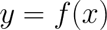

然而，在机器学习中，我们有一大组输入 ***x*** 和相应的输出 ***y*** 但没有函数 ***f(x)*** 。这里的目标是找到将输入*转换为输出*的 ***f(x)*** 嗯，这可不是件容易的事。在本文中，我们将了解这是如何发生的。**

# **资料组**

**为了可视化数据集，让我们制作我们的合成数据集，其中每个数据点(输入 ***x*** )是三维的，使其适合绘制在 3D 图表上。我们将在以原点(0，0，0)为中心的簇中生成 250 个点**(簇 0)** 。生成一个类似的 250 个点的群集**(群集 1)** ，但不以原点为中心。两个集群都相对接近，但有一个清晰的分离，如下图所示。这两个聚类是两类数据点。大绿点代表整个数据集的质心。**

**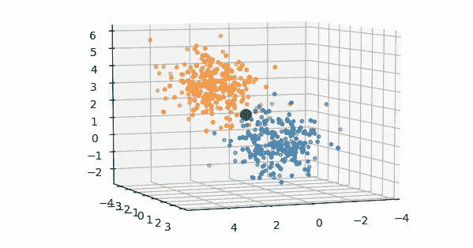**

**作者图片**

**生成数据集后，我们将通过减去平均值并除以标准差来对其进行归一化。这样做是为了使数据以零为中心，并将数据集中每个维度的值映射到一个公共比例。这加快了学习的速度。**

**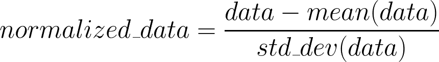**

**数据将保存在数组 **X** 中，其中包含标准化点的 3D 坐标。我们还将生成一个数组 **Y** ,根据 3D 点属于哪个簇，每个索引的值为 0 或 1。**

# **可学习功能**

**现在我们已经准备好了数据，我们可以说我们有了 ***x*** 和 ***y.*** 我们知道数据集是线性可分的，这意味着有一个平面可以将数据集分成两个聚类，但是我们不知道这样一个最优平面的方程是什么。现在，我们就随便坐一架飞机吧。**

**函数 f(x)应该将一个 3D 坐标作为输入，并输出一个介于 0 和 1 之间的数字。如果该数字小于 0.5，则该点属于聚类 0，否则，它属于聚类 1。让我们为这个任务定义一个简单的函数。**

**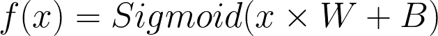**

*****x*** :形状的输入张量(num_points，3)
W:随机选择的形状(3，1)的权重(参数)
B:随机选择的形状(1，1)的偏差(参数)
Sigmoid:映射 0 和 1 之间的值的函数**

**让我们花一点时间来理解这个函数的含义。在应用 sigmoid 函数之前，我们只是创建了一个从 3D 坐标(输入)到 1D 输出的线性映射。因此，**该功能会将整个 3D 空间挤压到一条线上**，这意味着原始 3D 空间中的每个点现在都会位于这条线上的某个位置。由于这条线将延伸到无穷大，我们使用 **Sigmoid** 函数将其映射到 **[0，1]** 。因此，对于每个给定的输入， ***f(x)*** 将输出一个介于 0 和 1 之间的值。**

**记住 W 和 B 是随机选择的，所以 3D 空间会被挤压到一条随机的线上。这个变换的判定边界是使 ***f(x)* = 0.5** 的点集。想想为什么！当 3D 空间被挤压到 1D 线上时，整个平面被映射到线上的值 0.5。这个平面是 f(x)的判定边界。理想情况下，它应该将数据集分成两个集群，但是由于随机选择了 **W** 和 **B** ，因此该平面随机定向，如下所示。**

**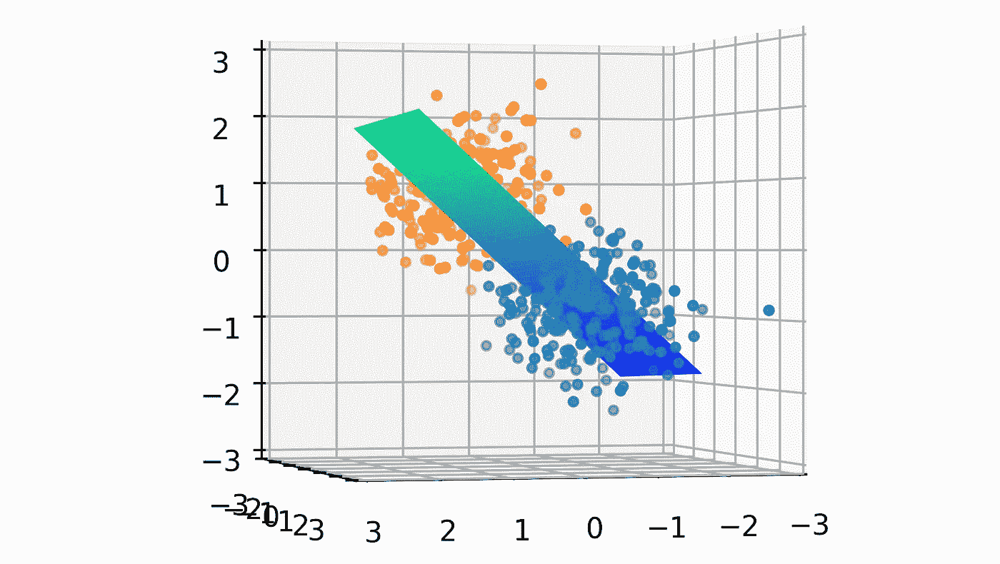**

**作者图片**

**我们的目标是为 **W** 和 **B** 找到正确的值，以将数据集划分为两个集群的方式来定位该平面(决策边界)。完成后，生成如下所示的平面。**

**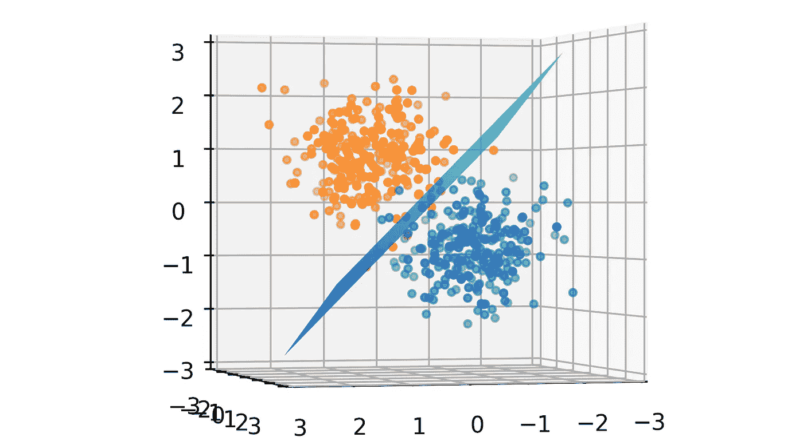**

**作者图片**

# **失败**

**所以，我们现在处于起点(随机决策边界)，我们已经定义了目标。我们需要一个指标来决定我们离目标有多远。分类器的输出是形状张量(num_points，1)，其中每个值在**【0，1】**之间。如果你仔细想想，这些值只是属于聚类 1 的点的概率。所以，我们可以说:**

*   **f(x) = P(x 属于簇 1)**
*   **1-f(x) = P(x 属于群集 0)**

**说[ ***1-f(x)，f(x)*** ]分别在簇 0 和簇 1 上形成概率分布也不会错。这是**预测的概率分布**。我们确切地知道数据集中的每个点属于哪个聚类(从 ***y*** )。所以，我们也有了**真实概率分布**为:**

*   **[0，1]当 x 属于簇 1 时**
*   **[1，0]当 x 属于群集 0 时**

**计算两个概率分布之间不一致的一个很好的度量是**交叉熵**函数。因为我们只处理两个类，所以我们可以使用**二元交叉熵(BCE)。**py torch 的 **torch.nn** 模块中有此功能。如果预测的概率分布与真实的概率分布非常相似，则该函数将返回一个小值，反之亦然。我们可以对所有数据点的这个值进行平均，并将其用作测试分类器性能的参数。**

**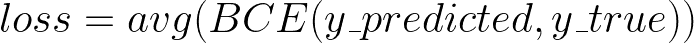**

**这个值称为损耗，从数学上讲，我们现在的目标是最小化这个损耗。**

# **培养**

**既然我们已经从数学上定义了我们的目标，那么我们如何实际地达到我们的目标呢？换句话说，我们如何找到 **W** 和 **B** 的最佳值？为了理解这一点，我们将看一看一些基本的微积分。回想一下，我们目前有随机值用于 **W** 和 **B** 。学习或训练或达到目标或减少损失的过程可以分为两步:**

1.  ****前向传播:**我们通过分类器 ***f(x)*** 输入数据集，并使用 **BCE** 找到**损失**。**
2.  ****反向传播:**利用损失，调整 **W** 和 **B** 的值，使**损失**最小。**

**以上两步会反复重复，直到损失停止减少。在这种情况下，我们说我们已经达到了目标！**

# **反向传播**

**前向传播很简单，上面已经讨论过了。然而，有必要花点时间来理解**反向传播**，因为它是机器学习的关键。回想一下，我们在 **W** 中有 3 个参数(变量),在 **B** 中有 1 个。因此，我们总共有 4 个值要优化。**

****

**一旦我们有了前向传播的损失，我们将计算损失函数相对于分类器中每个变量的梯度。如果我们为每个参数的不同值绘制损失图，我们可以看到，在每个参数的特定值处，损失最小。我绘制了每个参数的**损失与参数**的关系图。**

**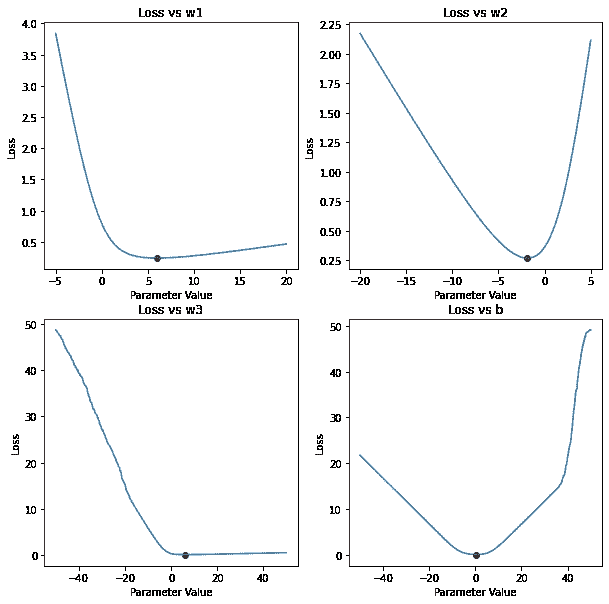**

**作者图片**

**这里需要注意的一点是，对于这些参数中的每一个参数，在特定值时损耗最小，如红点所示。**

**让我们考虑第一个情节，讨论 w1 将如何优化。对于其他参数，该过程保持不变。最初，W 和 B 的值是随机选择的，因此 **(w1，loss)** 将被随机放置在这条曲线上，如绿点所示。**

**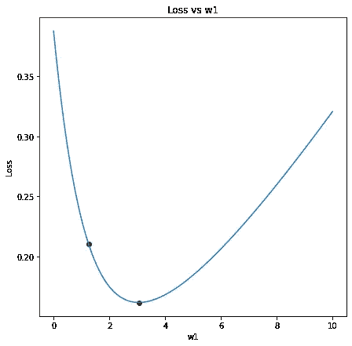**

**作者图片**

**现在，目标是到达红点，从绿点开始。换言之，我们需要走下坡路。观察曲线在绿点处的斜率，我们可以看出，增加 w1(向右移动)会降低损耗，从而使绿点更靠近红点。在数学术语中，如果损失相对于 w1 的梯度为负，则增加 w1 以向下移动，反之亦然。因此，w1 应更新为:**

**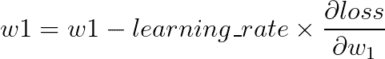**

**上面的方程被称为**梯度下降方程**。这里， **learning_rate** 控制我们想要增加或减少 w1 的多少。如果 learning_rate 很大，更新也会很大。这可能导致 w1 越过红点，从而错过最佳值。如果该值太小，w1 将永远无法到达红点。你可以尝试不同的学习速率值，看看哪个效果最好。一般来说，像 **0.01** 这样的小值在大多数情况下都适用。**

**在大多数情况下，单次更新不足以优化这些参数；因此，向前传播和向后传播的过程循环重复，直到损耗停止进一步降低。让我们来看看实际情况:**

**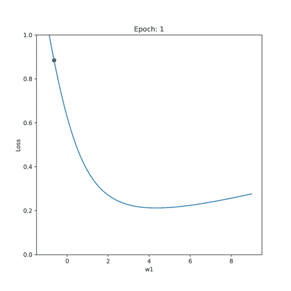**

**作者 Gif**

**要做的一个重要观察是，最初绿点移动很快，当它逐渐接近最小值时慢下来。最初几个时期(当绿点远离最小值时)期间的大斜率(梯度)是对参数的大更新的原因。随着绿点接近最小值，梯度减小，因此更新变得缓慢。其他三个参数以完全相同的方式并行训练。另一个重要的观察结果是，曲线的形状随时代而变化。这是因为其他三个参数 **(w2，w3，b)** 也在并行更新，并且每个参数都对损耗曲线的形状有贡献。**

# **设想**

**让我们看看决策边界是如何随着参数的更新而实时更新的。**

**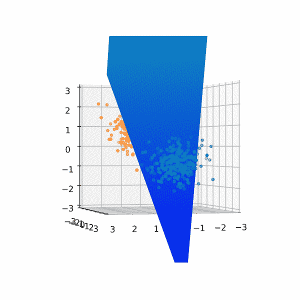**

**作者 Gif**

# **那都是乡亲们！**

**如果你成功了，向你致敬！在这篇文章中，我们采用了一种视觉方法来理解机器学习是如何工作的。到目前为止，我们已经看到了如何使用简单的 3D 到 1D 映射，***【f(x)***，来将决策边界(2D 平面)拟合到线性可分离数据集(3D)。我们讨论了如何使用前向传播来计算损耗，然后使用反向传播来计算损耗相对于参数的梯度，并在训练循环中重复更新参数。**

**有什么建议请留言评论。我定期写文章，所以你应该考虑关注我，在你的订阅中获得更多这样的文章。**

**如果你喜欢这篇文章，你可能也会喜欢这些:**

** [## 用 Pytorch 检测人脸标志点

### 想知道 Snapchat 或 Instagram 如何将惊人的滤镜应用到你的脸上吗？该软件检测你的关键点…

towardsdatascience.com](/face-landmarks-detection-with-pytorch-4b4852f5e9c4)  [## 主成分分析-可视化

### 使用主成分分析(PCA)的数据压缩

towardsdatascience.com](/principal-component-analysis-visualized-17701e18f2fa) 

访问我的[网站](http://arkalim.github.io/)，了解更多关于我和我的工作。**