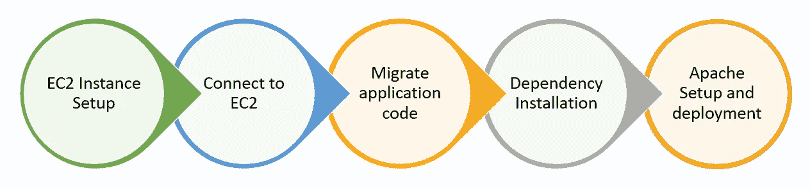
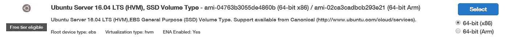
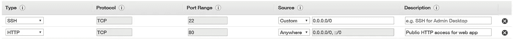
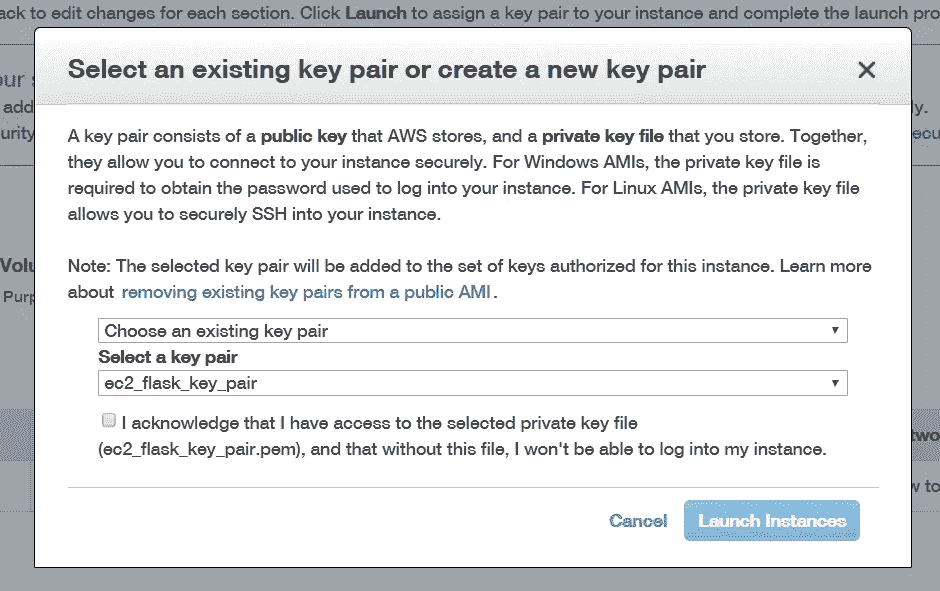
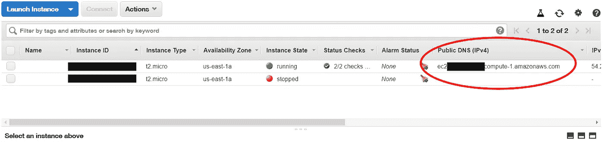
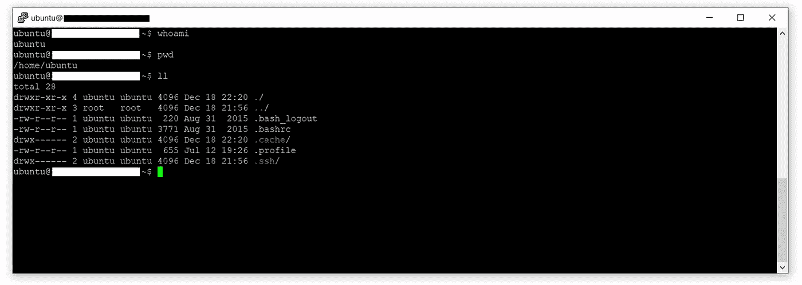
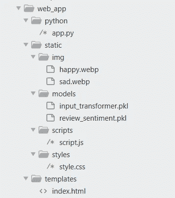
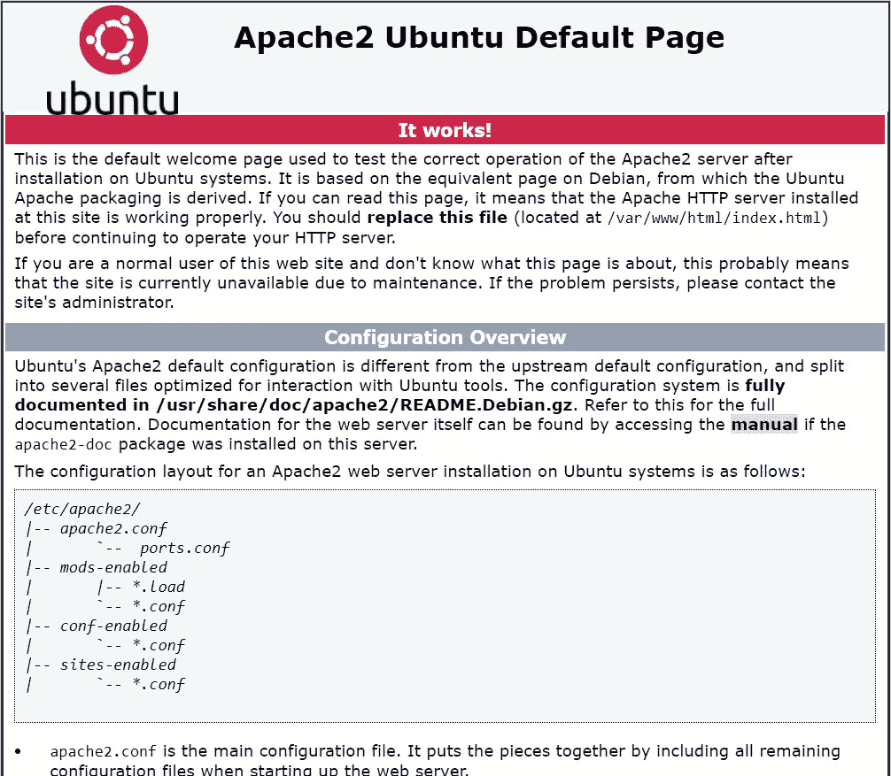
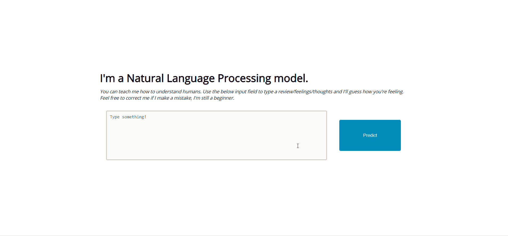

# 机器学习 Web 应用程序部署的 5 个步骤

> 原文：<https://towardsdatascience.com/machine-learning-web-application-deployment-in-5-steps-d8eb6a389cdd?source=collection_archive---------23----------------------->

## [数据科学冲刺](https://towardsdatascience.com/tagged/data-science-sprints)

## 你已经建立了一个模型和一个应用程序；现在是时候让世界看看了！学习使用 AWS 免费部署 ML web 应用程序。

让我给你描述一下:

*你花了两个月的时间在一个非常令人兴奋的数据科学应用上。它涉及高级数据收集、耗时的数据争论、数小时的培训和无尽的模型微优化。一旦你完成了，你就拥有了你真正满意的东西。但是今天，你的重磅炸弹模型已经完成 3 个月了，它只是和你的研究笔记本和半文档代码一起放在 GitHub 的仓库里。你已经获得了 12 颗星和 2 把叉子，但是你想知道，“是这个吗？这个世界上只有 14 个人关心我建造的这个伟大的东西吗？我应该做些不同的事情吗？如果有，是什么？”*

如果你有过这样的经历，创造了一些美好的东西，只有少数人与之互动，甚至更少人给你反馈，**你并不孤单**。我经常犯这种错误，我有很多从事数据科学的朋友也有类似的经历。现在，我不想贬低那些喜欢研究理论问题并在研究环境中茁壮成长的人们，但我确实认为有一些数据科学家需要向全世界展示他们的工作。这不仅有助于招聘人员等非技术人员看到并理解你的工作，还能打开接收项目真实反馈的大门。

**在本文中，我将分享如何在没有 Amazon Beanstalk 的情况下将机器学习 web 应用程序部署到 Amazon AWS EC2 实例，以保持我们的部署完全自由分层**。你可以点击 查看我们最终产品 [**的现场演示。**](http://ec2-54-145-145-48.compute-1.amazonaws.com)

虽然您可以使用自己的模型和应用程序来跟进，但我将使用我以前的一个项目，我首先构建了一个情感分析分类器，然后在此基础上构建了一个 flask web 应用程序。你可以在[这个库](https://github.com/hr23232323/nlp_medium_p1)中找到我的模型的所有代码，在[这个库](https://github.com/hr23232323/nlp_medium_p2)中找到我的 web 应用程序的所有代码。我强烈推荐基于 flask 的开发技术栈，因为它最容易部署到 AWS，并且应该足以满足任何基本的应用程序。

# 部署步骤

让我们现实一点，亚马逊网络服务(AWS)对于以前从未使用过网络技术和后端服务的人来说可能是超级可怕的。老实说，我是一名专业的全栈 web 开发人员，我仍然很难导航和开始使用 AWS，因为它提供了太多不同的服务！你需要 S3 水桶吗？负载管理器怎么样？你必须使用 Lambda 请求，对吗？

快速提示:**本指南并不针对生产或企业级解决方案，只应用于基本的个人项目**。如果您对更适合生产的部署指南感兴趣，请随意发表评论，这样我(或其他媒体读者)可以为您指出正确的方向。在本文中，我真正关注的是个人使用的精益应用程序部署。我们将使用 AWS EC2 实例，它基本上是一个虚拟服务器。它是 AWS 提供的免费层的一部分，因此通过下面提到的步骤部署您的项目将是绝对免费的。

说完这些细节，让我们来讨论一下如何通过 5 个简单的步骤在一个普通 EC2 实例上部署我们的基本应用程序。



ML web 应用部署的 5 个步骤

从很高的层面来看，我们的部署步骤可以在上图中看到。我们将从设置一个 EC2 实例开始，我们的应用程序将在该实例上运行。这将涉及利用一些指南，但我会帮助你通过这一点，并提到常见的错误，以节省您的时间和挫折。接下来，我们将连接到我们的实例，并将我们的代码迁移到它。在这里，我将分享我们今天将使用的应用程序，带您浏览我们的 Flask 目录设置和 API。之后，我们将安装项目依赖项，然后设置一个本地 Apache 服务器在我们的 EC2 实例上运行，该实例将用于在 EC2 服务器提供的公共端口上为我们的应用程序提供服务。我们开始吧！

# EC2 实例设置

在 AWS 上设置 EC2 实例并不太难，在 TDS 和其他领域的许多不同文章中都有介绍，所以我不会再浪费您的时间了。相反，我将指向对我帮助最大的指南，并浏览一些在安装过程中出现的常见错误/问题。请记住，这一步的目标是:

1.  创建一个 AWS 帐户(如果您还没有)
2.  使用我将在下面提到的教程和指南启动 EC2 服务器
3.  确保实例设置正确无误

下面是帮助你设置实例的官方指南: [AWS 官方 EC2 实例设置指南](https://docs.aws.amazon.com/AWSEC2/latest/UserGuide/EC2_GetStarted.html#ec2-launch-instance)。您需要对设置进行一些关键的更改，如下所示。

在*步骤 1:选择一个亚马逊机器镜像(AMI)* ，选择 **Ubuntu 服务器 16.04 LTS (HVM)。**



本文中使用的 AMI

坚持使用免费层选项(t2.micro ),因为它有足够的计算能力用于大多数小规模的个人项目。不要选择查看和启动按钮，点击不同的配置选项，并在*步骤 6:配置安全组停止。*在这里，使用以下设置添加一个新的安全组:



第一个安全组应该已经存在，添加具有相同设置的第二个安全组:HTTPTCP80;任何地方；违约；描述(可选)

这将允许世界上任何地方的用户能够使用 HTTP 访问正在运行的 EC2 实例上的端口，这对我们的 web 应用程序来说是完美的。现在，当您完成这一步后，查看并单击启动按钮，您将看到以下对话框:



密钥对屏幕

确保选择“创建新的密钥对”(如果您还没有)，并将此`.pem`文件保存在一个安全的位置。你以后会需要这个的。恭喜，您的 EC2 实例现在已经启动并运行了！是时候连接到它并迁移您的应用程序了。

# 连接到 EC2

现在我们的实例已经启动并运行，我们可以连接到它了。基于你的操作系统，连接过程会有所不同，所以我不能为 Mac/Linux 用户提供太多的帮助，但是这里有一个[很棒的页面](https://docs.aws.amazon.com/AWSEC2/latest/UserGuide/AccessingInstances.html)为你们提供资源。我将主要介绍 Windows 安装过程，并再次向您介绍一些好的资源，同时提到一些障碍和额外的步骤。我强烈建议使用 PuTTY 作为您的 SSH 客户端，因为它易于使用和简单。完成连接顺序的最佳指南还是 AWS 官方指南[，所以请随意完成。](https://docs.aws.amazon.com/AWSEC2/latest/UserGuide/putty.html)

一旦你完成了你的。您的 ppk 密钥。pem 键并准备好连接到您的实例，以下详细信息将有所帮助:

```
**Hostname**: ubuntu@*your_public_dns_name*
```

您可以在 AWS EC2 主页上点击“运行实例”找到您的公共 DNS 名称:



AWS EC2 运行实例页:用于查找您的公共 DNS

指南中涉及的连接到 EC2 实例的其余步骤相当简单，但是请确保将您的设置保存在 PuTTY 页面中，这样您就不必每次都进行设置。注意:您的连接类型是 SSH，在保存您的设置之前，请确保您的`.ppk`文件连接在 Connection > SSH > Auth 下。

如果一切顺利，在这一步之后，您将能够使用 PuTTY 客户机访问您的实例。这将是一个黑色的 70 年代 DOS 风格的屏幕，这正是我们要找的！



太好了，您已经在 EC2 实例中了！

# 将应用程序代码迁移到 EC2

正如我在文章前面提到的，我们将部署[一个机器学习 web 应用程序](/web-app-development-for-data-scientists-48e445e54d7b)，它是我在过去两周内构建的。在我们进入代码迁移之前，关于模型、应用程序和项目结构的一些知识是必要的。该模型是具有增量学习能力的基本情感分析分类器。我们在此基础上创建了一个单页面应用程序来帮助用户与我们的模型进行交互。我们有两个 Flask API 路径，允许用户输入评论/想法并接收情感分析，并向模型提供反馈，从而允许持续学习。



项目结构

项目结构可以在右图中看到。我们所有的资产(图像、模型等。)在同一个主文件夹`static`的不同子文件夹中，我们的 HTML 页面在`templates`文件夹中，我们的`app.py`文件在`python`文件夹中。

我们将使用`SCP`命令来帮助我们将文件从本地计算机(windows)传输到 EC2 实例。在此之前，使用以下命令在`/home/ubuntu`中创建一个目录(我称之为我的 web_app，我建议使用相同的名称以避免任何混淆)，您的应用程序将存在于该目录中

```
mkdir web_app
```

因此，您希望实例上的部署位置是`/home/ubuntu/web_app`。现在，您必须将上面提到的应用程序下载并解压缩到您的本地机器上。您可以在这个 [GitHub repo](https://github.com/hr23232323/nlp_medium_p2) 中找到项目代码。一旦在本地机器上有了项目文件，就可以使用下面的`SCP`命令(从 windows 终端)将文件从本地机器移动到 AWS EC2 实例:

```
scp -i **<path/to/pem/key>** -r **<local/path/to/project/folder>** [ubuntu@](mailto:ubuntu@ec2-54-235-0-36.compute-1.amazonaws.com)**<instance/public/DNS>**:/home/ubuntu/web_app
```

注意:如果您遇到一个错误，显示如下消息“对‘私有密钥’的权限太开放了”，请查看这篇[很棒的文章](https://superuser.com/questions/1296024/windows-ssh-permissions-for-private-key-are-too-open)来解决这个问题。

太好了！此时，您的项目文件应该都在 EC2 实例中了。确保文件夹结构/路径正确(例如:`/home/ubuntu/web_app/python/app.py`等)。)现在我们可以进入下一步了。

# 依赖安装

现在，这一步可能是人们最困惑的，因为 python 环境、模块和其他安装可能会很快变得复杂和相互依赖。为了简单起见，我们将这一部分分为两个主要步骤:

1.  安装 pip 和其他 python 依赖项
2.  在我们的 EC2 实例上安装 Apache 和 mod_wsgi

让我们从确保运行 Python 3 并安装正确版本的 Pip 开始。您的 EC2 实例应该预装了 python3。要进行检查，请使用以下命令:

```
python3 -V
```

您应该会看到高于 3.5 的版本。如果是这样，你可以继续下一步。如果没有，看看这个[官方指南](https://docs.aws.amazon.com/cli/latest/userguide/install-linux-python.html)。一旦安装了 python3，就需要下载并安装正确的 pip 版本。为此，请使用以下命令(按顺序):

```
curl -O [https://bootstrap.pypa.io/get-pip.py](https://bootstrap.pypa.io/get-pip.py) 
sudo python3 get-pip.py
```

现在，您应该已经安装了 python3 和 pip。在进入下一步之前，运行以下命令以确保所有内容都是最新的:

```
sudo apt-get update
```

我们将通过使用以下命令安装我们的 web 应用程序依赖项(Flask 和 Scikit-learn)来完成这一步:

```
sudo pip install Flask
sudo pip install scikit-learn
```

现在我们可以进入下一步:**安装 Apache 和 mod_wsgi** 。

要设置 Apache，您需要两个模块:Apache2 和 mod_wsgi。Apache2 是我们的简单 web 服务器，mod_wsgi 是用于基于 Python 的 web 应用程序的 Apache 模块。要安装 python3 的正确版本，请使用以下命令:

```
sudo apt-get install apache2
sudo apt-get install libapache2-mod-wsgi-py
```



Apache 默认页面。恭喜，您的服务器已经启动并运行了！

此时，Apache 服务器应该在 AWS EC2 公共 DNS 上提供默认页面。要验证这一点，请注意 AWS 控制台中的公共 DNS ( `ec2-xx-xxx-xx-xxx.compute-x.amazonaws.com/`)并在浏览器中访问它。您应该会看到一个类似左边的屏幕。

如果您可以看到 Apache 的默认屏幕，那就高兴吧，因为您就快到了！如果没有，请随意使用评论区，这样我和其他人可以帮助你。您还可以查看 Apache 日志文件(`/var/log/apache2/error.log`)来尝试调试自己。

您已经设置了 python3 和 pip，安装了 Apache 及其所需的模块，并且已经提供了一个页面。现在，剩下的就是设置 Apache，将它指向您的项目文件夹，并授予它访问这些文件的权限。

# Apache 设置和部署

为了让我们的应用程序在服务器上运行，我们需要设置一些 Apache 配置。这包括两个步骤:设置服务器配置/权限和设置 mod_wsgi 配置。

要设置您的服务器配置，您需要编辑以下文件:`/etc/apache2/sites-enabled/000-default.conf`。这是一个受限文件，因此你必须使用 sudo 来编辑它。使用以下命令:

```
sudo vi /etc/apache2/sites-enabled/000-default.conf
```

在第`ServerAdmin webmaster@localhost`行之后添加以下代码块:

```
DocumentRoot /home/ubuntu/web_appWSGIDaemonProcess flaskapp threads=5 python-home=/usr/local/lib/python3.5/site-packages/ user=ubuntu
        WSGIScriptAlias / /home/ubuntu/web_app/static/flaskapp.wsgi<Directory /home/ubuntu/web_app>
            WSGIProcessGroup flaskapp
            WSGIApplicationGroup %{GLOBAL}
            Require all granted
        </Directory><Directory python>
            Require all granted
        </Directory><Directory static>
            Require all granted
        </Directory><Directory static/models>
            Require all granted
        </Directory>
```

这些配置设置应该将 Apache 指向我们的 web 应用程序的位置，并给予它与我们的文件和模型进行交互所需的所有权限。

Apache 设置的最后一步是配置 mod_wsgi 来支持基于 Flask 的应用程序。为此，您必须在**静态文件夹**中创建一个名为`flaskapp.wsgi`的文件。将以下代码放入该文件:

```
import sys
import site
site.addsitedir(‘/home/ubuntu/.local/lib/python3.5/site-packages’)
sys.path.insert(0, ‘/home/ubuntu/web_app/python’)
from app import app as application
```

这些是 Apache 定位 python 依赖项和项目文件夹所需的配置。一旦您创建/修改了这些文件并输入了适当的代码，您的应用程序就可以运行了。使用以下命令重新启动服务器，以查看更改是否生效:

```
sudo apachectl restart
```

希望在这一点上，您的 web 应用程序成功地运行在您的 EC2 公共 DNS 上，并准备好与外界进行交互！如果您看到 403 或 500 错误代码，请尝试查看 Apache 日志文件(`/var/log/apache2/error.log`)来寻找出错的线索。和往常一样，你也可以在评论区分享错误，我会尽力帮忙。如果一切顺利，当您在浏览器中访问您的公共 DNS 时，您应该会看到我们的应用程序:



你可以点击 查看[T5 的现场演示。](http://ec2-54-145-145-48.compute-1.amazonaws.com)

# 结束语

我认为互联网应该充满真实世界的项目，这些项目是人们为了公开交流他们最感兴趣的想法而建造的。学习如何[从零开始构建一个模型](/building-and-deploying-a-data-science-project-in-two-weeks-3c63f0acdab1)，[围绕它设计和开发一个 web 应用](/web-app-development-for-data-scientists-48e445e54d7b)并最终部署到网上让全世界看到，这是朝着那个目标迈出的一大步。我希望你们中的一些人受到启发，建立并分享自己的东西，如果你这样做了，不要忘记通过鼓励其他人做同样的事情来回报它。

我希望你喜欢读这篇文章，就像我喜欢把它放在一起一样。如果您有任何问题、反馈或意见，请随时通过 [LinkedIn](https://www.linkedin.com/in/harshrana1997/) 或我的[网站](http://www.harshrana.com/)与我联系。此外，如果您最终构建并部署了自己的应用程序，请与我分享，因为我很想看到它！