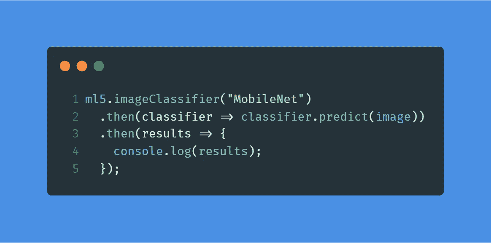
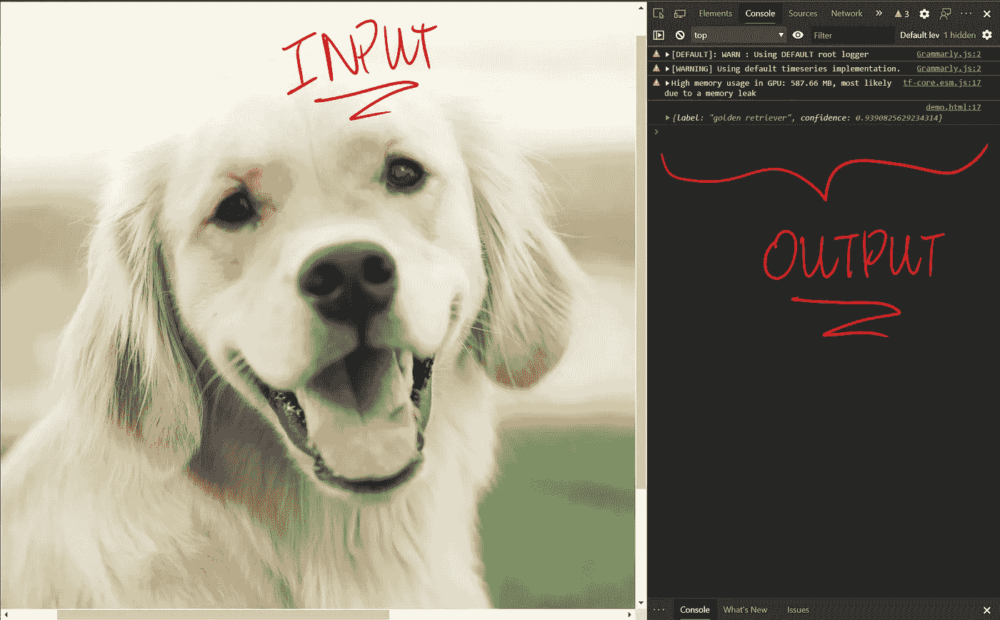
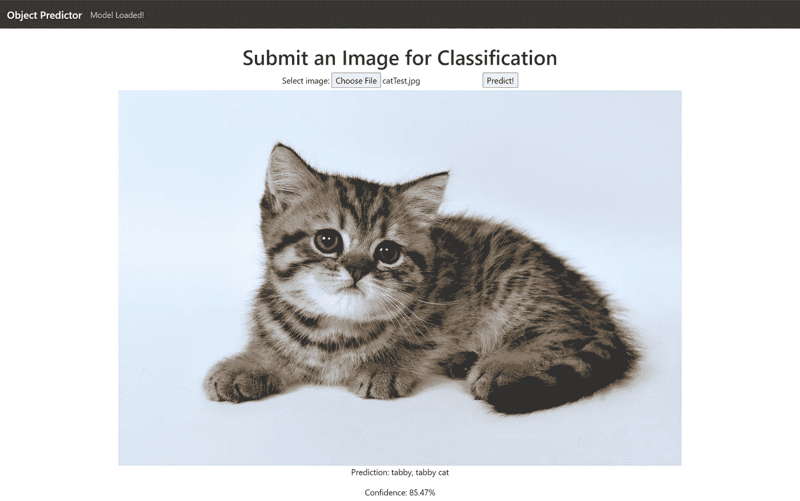

# 用 5 行 JavaScript 实现机器学习

> 原文：<https://towardsdatascience.com/machine-learning-with-5-lines-of-javascript-5daa0727a25?source=collection_archive---------58----------------------->

## 是的，你没听错。



就是这样。嗯，如果你想成为超级雄心勃勃的人，那应该是三行😅

# 介绍

我想，与其让你(读者)通读整篇文章，**我现在就兑现承诺(**[](https://developer.mozilla.org/en-US/docs/Web/JavaScript/Reference/Global_Objects/Promise)****)**。**

**极其简单，到了近乎恐怖的地步…**

## **但是，什么是“ml5”？**

> **ml5，或`[**ml5.js**](https://ml5js.org/)`，是一个建立在`**tensorflow.js**`之上的*高级机器/深度学习框架。***

*****最好把** `**ml5.js**` **比作 Keras**；两者都是高级 API，使 ML/DL 比以往任何时候都更容易，并且主要使用 TensorFlow 作为后端框架，但仍然在抽象级别和(当然)编程语言上有所不同。***

# ***深入调查***

***考虑到 JS 的简单性，使用 JS 可能看起来就像是用预先训练好的模型将你的输入发送到服务器。预训练模型的概念是正确的，**但不是服务器。*预训练模型的所有计算都在用户计算机的浏览器上完成*** 。尽管这可能导致基于 JavaScript(例如 [V8 vs SpiderMonkey](https://stackoverflow.com/questions/2137320/javascript-engines-advantages) )引擎&用户设备的不一致和/或较慢的性能，但这也意味着**开发者不需要创建或维护**后端服务器来处理分类查询。***

## ***你实际上是如何使用 ml5.js 的？***

***如前所述，`**ml5.js**`脚本旨在嵌入**网站**中，通过浏览器执行。访问`**ml5.js**` API 非常简单，只需**使用 CDN 并将其插入你的 html** `<head>`:***

```
*<script src="https://unpkg.com/ml5@0.4.3/dist/ml5.min.js"></script>*
```

***从那里，你可以做一些非常简单的分类任务。例如，您可以将一幅图像作为输入传递给预先训练好的 ***MobileNet*** ，并在 JavaScript 控制台上输出该图像的预测。这是一个 HTML 网页的例子:***

***只有一张图片的非常简单的 HTML 网页***

******

***网页在左边，结果在右边。看起来模型预测的很正确。照片由[约翰·普莱斯](https://unsplash.com/@johnprice?utm_source=unsplash&utm_medium=referral&utm_content=creditCopyText)在 [Unsplash](https://unsplash.com/s/photos/dog?utm_source=unsplash&utm_medium=referral&utm_content=creditCopyText) 上拍摄***

# ***应用程序***

***让我们把之前的东西，变成一个简单的互动网站，好吗？事实上，我已经这么做了:去 https://ml5demo.netlify.app/看一看😋***

******

***由“`ml5.js`”支持的示例网站；一个简单的具有可信度的目标检测分类器。谢尔盖·塞明在 [Unsplash](https://unsplash.com/s/photos/kitten?utm_source=unsplash&utm_medium=referral&utm_content=creditCopyText) 上拍摄的照片***

> ***作为参考，下面的 github repo 中提供了这方面的所有代码(无论如何，它相对较短)。***

***[](https://github.com/richardso21/ml5_demo) [## 理查德森 21/ml5 _ 演示

### 在 GitHub 上创建一个帐户，为 richardso21/ml5_demo 开发做贡献。

github.com](https://github.com/richardso21/ml5_demo) 

考虑到在`**ml5.js**`中只需要 5 行代码就可以拥有一个工作的预训练分类器，很明显，对于这样一个功能性网站来说，使用这个库是非常容易的。现在我再次提醒您，分类是在浏览器的机器上进行的，而不是在远程服务器上！如果你访问[网站](https://ml5demo.netlify.app/)，你发现网站先“加载”几秒钟。 ***这是因为这个库实际上正在将实际的预训练 MobileNet(及其所有的权重和参数)加载到您的浏览器实例中。*** 确实很酷！

除了图像分类，`**ml5.js**` 还**支持大量不同的图像相关的 DL/ML 架构**，如 UNET、DCGAN 和 FaceAPI。`**ml5.js**`也不限于图像；它支持声音分类模型以及基于文本的数据的 rnn。最后，如果你没有从他们的预置中找到你需要的，你总是可以用他们的 API 从头开始构建一个神经网络。

## 潜在的

考虑到**它可能是深度学习框架/库的下一个“Keras”**，T2 拥有很大的潜力。与使用`**tensorflow.js**`相比，**高级 API** 使得在网站上直接开发简单的分类器变得不那么令人生畏，并且**这可能意味着在尝试部署分类器模型上花费更少的时间和金钱**。尽管如此，不用说，深度学习模型将完全依赖于它运行的硬件和网络引擎。

> 尽管如此，去给`**ml5.js**`一个自己的尝试，看看你能从中得到什么！***