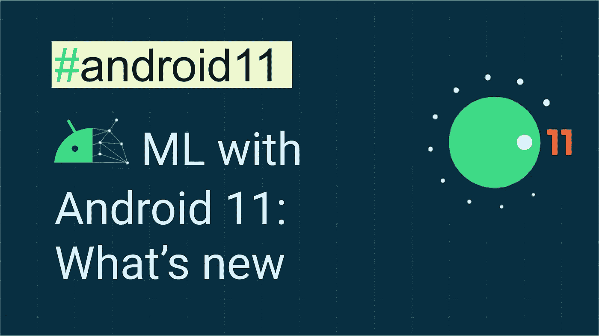
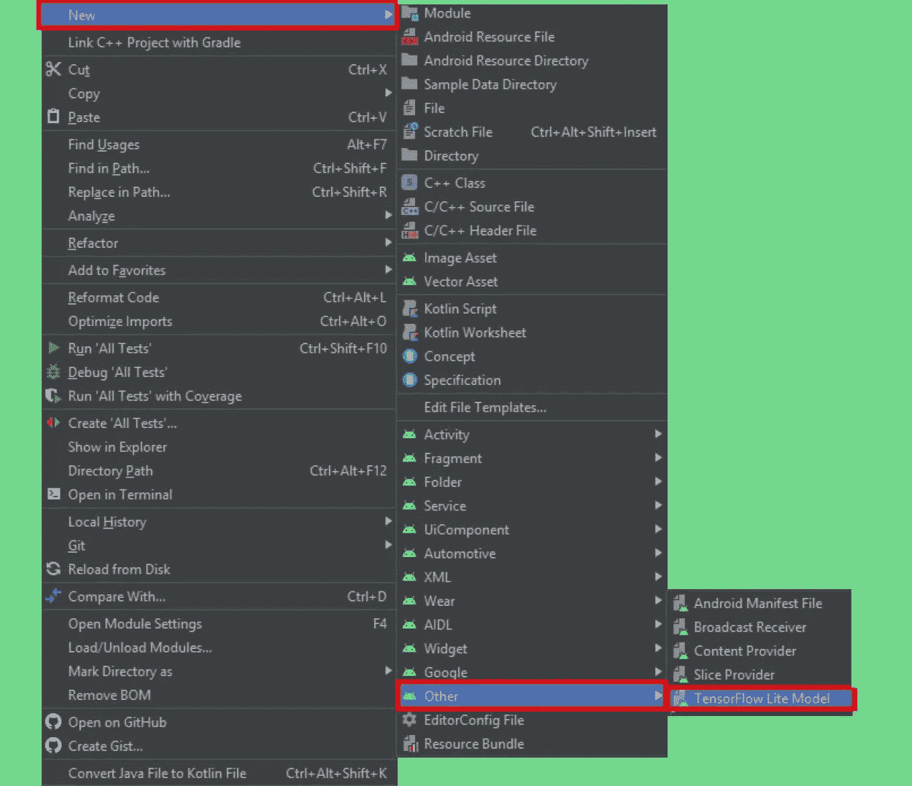
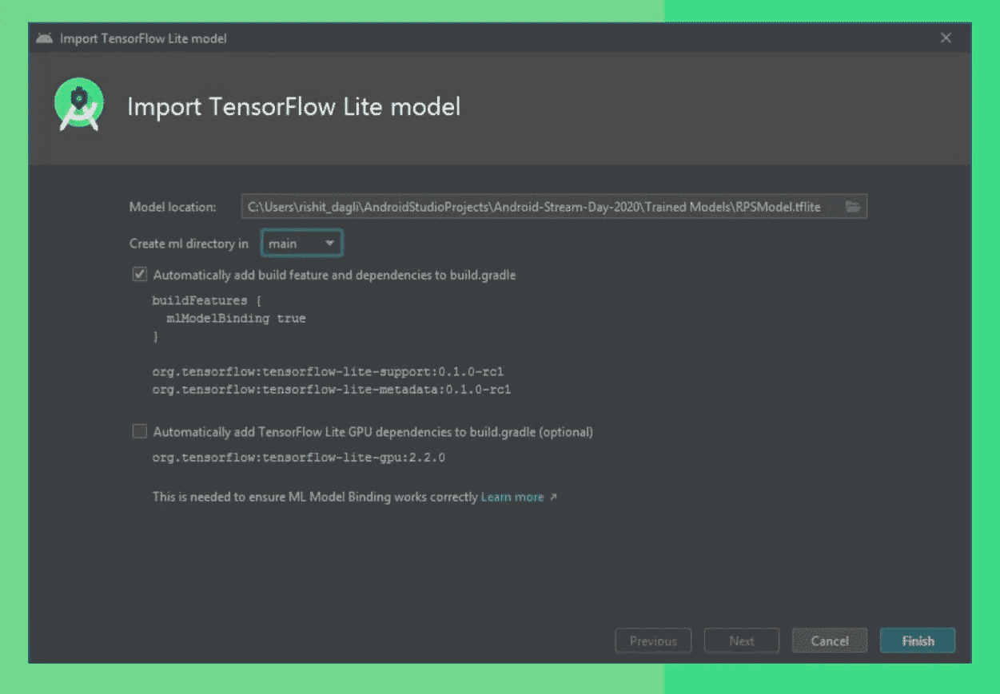
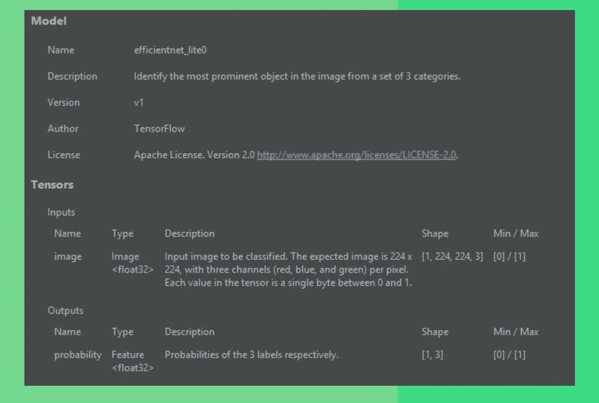
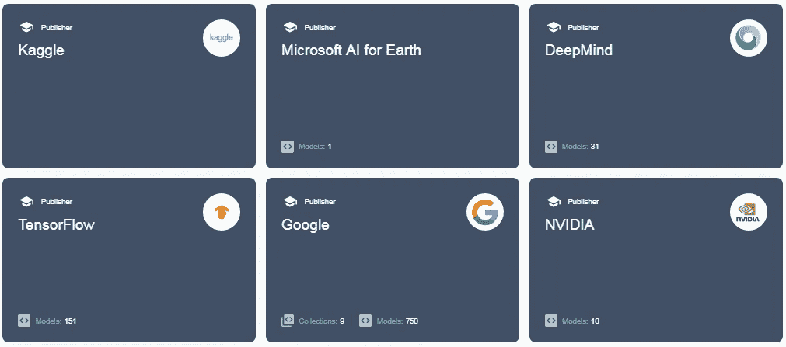
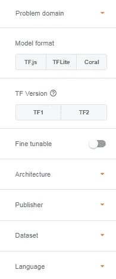

# Android 11 的机器学习:新功能

> 原文：<https://towardsdatascience.com/machine-learning-with-android-11-whats-new-e8c829e9452?source=collection_archive---------40----------------------->



带 Android 11 的 ML:有什么新功能

这篇博客展示了你如何使用专门随 [Android 11](https://developer.android.com/11) 推出的工具或插件开始使用设备上的 ML。如果您以前在 Android 中使用过 ML，您将会探索将 ML 应用程序与 Android 应用程序集成的更简单的方法。如果你以前没有在 Android 中使用过 ML，这可能是你这样做的一个起点，并开始用机器学习为你的 Android 应用程序提供强大的动力。在这篇博客中，我主要展示了 Android 11 的两个最大的更新: [ML 模型绑定插件](https://developer.android.com/studio/preview/features#tensor-flow-lite-models)和[新的 ML 套件](https://g.co/mlkit)。我们下面讨论的所有示例应用程序代码都出现在 GitHub repo 中。

你也可以在这里查看我关于这个话题的演讲。

[](https://github.com/Rishit-dagli/ML-with-Android-11/blob/master/talks.md) [## rishit-dagli/ML-with-Android-11

### 特别感谢-谁帮助我整理和回顾了演讲的幻灯片。我在 Android 上的会话…

github.com](https://github.com/Rishit-dagli/ML-with-Android-11/blob/master/talks.md) 

# 为什么要关心 Android 中的 on-device ML？

你可能已经注意到，我们在这里主要关注设备上的 ML，Android 11 对设备上的 ML 有很多很酷的更新，但让我们简单地谈谈为什么你应该关心它，你也会理解为什么会有这样一个关于设备上的 ML 或 ML on edge 的炒作。

**设备上 ML 背后的理念**

这里的想法是使用 ML，这样与传统的方法相反，我不再将我的数据发送到服务器或一些基于云的系统，然后这些系统执行 ML，然后将输出返回给我。相反，我从设备本身的 ML 模型中获得输出或推断，即我不再从设备本身发送数据。我还在移动设备上完成所有的处理和推理。


设备上 ML 背后的理念

您不会直接将该模型用于您的边缘设备。您需要压缩它或优化模型，以便可以在边缘设备上运行它，因为它具有有限的计算能力、网络可用性和磁盘空间。然而，在本文中，我们将不讨论优化过程。我们将部署一个`.tflite`模型文件。你可以阅读更多关于 TensorFlow Lite 的[和 TensorFlow Lite 的](https://www.tensorflow.org/lite/)[模型优化过程](https://www.tensorflow.org/lite/performance/model_optimization)。

**片上 ML 的优势**

这里我列出了使用设备上 ML 的一些优点:

*   功率消耗

因此，您首先想到的是功耗，您需要花费大量的电力向服务器连续发送或传输视频数据，有时这样做是不可行的。然而，同样值得一提的是，当您使用大量预处理时，有时反过来也是正确的。

*   推理时间

另一个需要考虑的重要事情是我获得输出或者运行模型所花费的时间。对于实时应用程序，这是一个需要考虑的非常重要的方面。不用发送数据和接收数据，我也加快了我的推理时间。

*   网络可用性

就网络可用性而言，使用传统方法也很昂贵。我应该有带宽或网络来持续发送数据并从服务器接收推断。

*   安全性

最后是安全性，我不再向服务器或基于云的系统发送数据，也不再从设备中发送数据，因此加强了安全性。

# ML 模型绑定插件

> *注意:你需要 Android Studio 4.1 或以上版本才能使用模型绑定插件*

**模型绑定插件关注什么？**

你可以从“模型构建”这个名字中做出一个合理的猜测，那么 [ML 模型绑定插件](https://developer.android.com/studio/preview/features#tensor-flow-lite-models)将会做什么来允许我们非常容易地使用定制的 TF Lite 模型。这使得开发人员可以导入任何 TFLite 模型，读取模型的输入/输出签名，并通过调用开源 TensorFlow Lite Android 支持库的几行代码来使用它。

ML 模型绑定插件让你在应用中使用 TF 模型变得非常简单。您需要编写的调用 TensorFlow Lite Android 支持库的代码要少得多。如果您使用过 TensorFlow Lite 模型，您可能知道您首先需要将所有内容转换为`ByteArray`,您不再需要使用 ML 模型绑定插件将所有内容转换为`ByteArray`。

我喜欢这个新插件的另一点是，你可以很容易地使用 GPU 和 NN API。有了模型绑定插件，使用它们变得前所未有的简单。使用它们现在仅仅是一个依赖调用，一行代码并不像你用模型绑定插件所做的那样酷。随着 Android 11 的神经网络 API，您还可以支持无符号整数权重和新的服务质量(QOS) API，也支持更多的边缘场景。当然，使用我们刚刚谈到的特性，这将使您的开发速度大大加快。

**使用模型绑定插件**

现在让我们看看我们如何能够实现我们谈到的所有内容。

所以第一步是导入一个带元数据的 TensorFlow Lite 模型。Android Studio 现在有了一个导入 TensorFlow 模型的新选项，只需右键单击要导入的模块，就会在`others`下看到一个名为`TF Lite model`的选项。



导入模型选项

您现在可以只传递您的`tflite`模型的路径，它将为您将模型导入到您之前选择的名为`ml`的模块的目录中，从那里您将能够使用该模型。添加依赖性和 GPU 加速也只是一个点击。



导入 tflite 模型

因此，现在从我的模型元数据，我也可以知道输入，输出形状，以及更多我需要使用它的信息，你可以通过在 Android Studio 中打开`tflite`模型文件来查看这些信息。所以在这张截图中，我正在使用我制作的开源模型来对石头、布、剪刀进行分类。所以你只要在摄像机前把手拿出来，它就能识别出是石头纸还是剪刀，这也是我在这里演示的。



查看模型元数据

让我们最后开始使用这个模型，所以对于一个流式推理，这是你最可能想要做的；现场图像分类。最简单的方法是使用摄像机 X，并将每一帧传递给一个可以执行推理的函数。所以我现在感兴趣的是做推理的函数。你将会看到做这件事是多么容易，当你导入一个你可以使用的 TF Lite 模型时，一个样例代码也是如此。

```
private val rpsModel = RPSModel.newInstance(ctx)
```

因此，我们将首先实例化一个`rps`模型(石头剪刀布模型的简称),并向其传递上下文。有了这个插件，我的模型名称是`RPS Model.tflite`，所以会为你创建一个完全相同名称的类，所以我有一个名为`RPS Model`的类。

```
val tfImage = TensorImage.fromBitmap(toBitmap(imageProxy))
```

一旦你这样做了，你需要把你的数据转换成我们可以使用的形式，所以我们将把它从`bitmap`转换成`Tensor Image`，如果你使用了 TF 解释器，你知道你需要把你的图像转换成`ByteArray`，你不需要再这样做了，你将输入一个图像代理

```
val outputs = rpsModel.process(tfImage)
    .probabilityAsCategoryList.apply {
        sortByDescending { it.score } // Sort with highest confidence first
    }.take(MAX_RESULT_DISPLAY) // take the top results
```

现在，我们将数据传入模型，首先我们将处理来自模型的图像并获得输出，我们基本上将获得一个概率数组，并对其执行降序排序，因为我们希望显示具有最大概率的标签，然后选择要显示的第一个`n`结果。

```
for (output in outputs) {
    items.add(
        Recognition(
            output.label,
            output.score
        )
    )
}
```

最后，我想向用户显示标签，所以我将在输出中添加对应于每个条目的标签。这就是你所需要的🚀

**利用 GPU 加速**

如果你想再次使用 GPU 加速，这对于你来说非常容易，所以你将创建一个`options`对象，我指定它使用 GPU 并构建它。在实例化部分，我将把它作为一个参数传入，你可以使用 GPU。这也使得使用 NN API 进行加速变得非常容易，甚至可以在 Android 11 上做更多的事情。

```
private val options = Model.Options.Builder().setDevice(Model.Device.GPU).build()
private val rpsModel = rpsModel.newInstance(ctx, options)
```

# 新的 ML 套件

> 你现在不再需要一个 Firebase 项目来使用 ML 工具包，它现在甚至可以在 Firebase 之外使用。

另一个值得注意的更新实现 TensorFlow Lite 模型的另一种方式是通过 [ML 工具包](https://g.co/mlkit)。在我继续之前，ML 工具包现在已经可以使用了，即使不使用 Firebase 项目，你也可以使用 ML 工具包。

正如我之前提到的，由于我之前提到的好处，Android 11 中的许多更新都集中在设备上的 ML。新的 ML 套件现在对设备上的 ML 具有更好的可用性。ML 套件[图像分类](https://developers.google.com/ml-kit/vision/image-labeling/custom-models/android)和[对象检测和跟踪(ODT)](https://developers.google.com/ml-kit/vision/object-detection/custom-models/android) 现在也支持定制模型，这意味着现在你也可以拥有一个`tflite`模型文件。这也意味着如果你正在处理一些通用的用例，比如一种特定的对象检测，ML 工具包是最好的选择。

**使用 ML 套件**

让我们在代码中看到这一点，并看到一个这样的例子。作为一个例子，我建立了一个模型，可以对不同的食物进行分类，

```
private localModel = LocalModel.Builder()
    .setAssetFilePath("lite-model_aiy_vision_classifier_food_V1_1.tflite").
    .build()
```

所以我将首先设置模型并为其指定`tflite`模型文件路径。

```
private val customObjectDetectorOptions = CustomObjectDetectorOptions
    .Builder(localModel)
    .setDetectorMode(CustomObjectDetectorOptions.STREAM_MODE) 
    .setClassificationConfidenceThreshold(0.8f) 
    .build()
```

这个`tflite`模型将在带有 ML 工具包的对象检测模型之上运行，因此您可以对这些选项进行一些定制。这里我特别使用了`STREAM_MODE`,因为我想处理流输入并指定置信度阈值。

```
private val objectDetector = ObjectDetection.getClient(customObjectDetectorOptions) objectDetector.process(image) 
    .addOnFailureListener(Log.d(...)) 
    .addOnSuccessListener{ 
        graphicsOverlay.clear() 
        for (detectedObject in it){ 
            graphicsOverlay.add(ObjectGraphic(graphicsOverlay, detectedObject))
        } 
        graphicsOverlay.postInvalidate()} 
    .addOnCompleteListenerl imageProxy.close() }
```

让我们进入运行模型的部分，你可能会看到一些类似于上一个例子的语法。我将处理我的图像，这里需要注意的是，所有这些失败或成功的监听器都是重要的任务，所以每次运行都需要连接它们。这就是你需要做的，我们完成了🚀

# 寻找模型

我们讨论了很多，在建立模型之后，让我们看看如何为你的用例找到模型。

*   TF Lite 模型制作工具

TensorFlow 团队在 2020 年早些时候宣布了 TF Lite 模型制造商。这使得制作好的模型非常容易使用，提供了高性能，并且还允许大量的定制。您可以简单地传入数据并使用很少的代码来构建一个`tflite`模型。你可以看看回购中出现的 [TensorFlow Lite 模型制作者示例](https://github.com/Rishit-dagli/ML-with-Android-11/blob/dev/TensorFlow_Lite_Model_Maker_example.ipynb)。

*   张量流集线器

TensorFlow Hub 是一个开源的存储库，其中存储了最新的和有据可查的模型。我们用 ML Kit 搭建的食品分类 app，TF Hub 上也有。你也可以使用社区的模型。你可以在 [tfhub.dev](https://tfhub.dev/) 找到这些。



tfhub.dev 上的一些出版商



TF Hub 中的过滤器

如果您只想查找基于图像或文本的模型，您可以在 TF Hub 中使用许多过滤器搜索模型，如问题域，如果您想在 web、edge 设备或 Corals 上运行模型格式，过滤架构、使用的数据集等等。

你还可以直接从 TF Hub 下载这些模型，或者用你自己的数据很容易地对它们进行迁移学习。然而，由于这个博客的范围，我们将不涉及 TF Hub 的迁移学习，你可以在[我的这个博客](/building-better-ai-apps-with-tf-hub-88716b302265)中了解更多。

还有更多！有很多服务，像[可教机器](https://teachablemachine.withgoogle.com/)、[自动](https://cloud.google.com/automl)等等，但这些是主要的。

所有的代码在这里展示了关于 TF Lite 模型制造商的例子是在这个报告。我还在回购中为您提供了一些经过培训的模型，供您开始使用和尝试。

[](https://github.com/Rishit-dagli/ML-with-Android-11) [## rishit-dagli/ML-with-Android-11

### 一个展示 Android 11 for ML 中所有新特性的存储库，以及如何在您自己的用例中试用它

github.com](https://github.com/Rishit-dagli/ML-with-Android-11) 

# 关于我

大家好，我是里希特·达格利。用回购里的内容或者这篇博文做了点东西，在 [Twitter](https://twitter.com/rishit_dagli) 上给我贴标签，分享给我！

[推特](https://twitter.com/rishit_dagli)

[网站](https://rishit.tech/)

如果你想问我一些问题，报告任何错误，建议改进，给我反馈，你可以发邮件给我

*   [rishit.dagli@gmail.com](mailto:rishit.dagli@gmail.com)
*   [hello@rishit.tech](mailto:hello@rishit.tech)