# 基于日期时间特征工程的机器学习:预测医疗预约失约

> 原文：<https://towardsdatascience.com/machine-learning-with-datetime-feature-engineering-predicting-healthcare-appointment-no-shows-5e4ca3a85f96?source=collection_archive---------0----------------------->

## 让我们根据日期和时间为我们的模型制作特写！


日期和时间是可用于机器学习模型的丰富信息源。然而，这些日期时间变量确实需要一些特性工程来将它们转换成数字数据。在这篇文章中，我将演示如何用内置的熊猫函数为你的机器学习模型创建日期时间特性。

当我在东北大学教授机器学习课程时，我的几个学生使用了一个非常有趣的数据集(医疗预约失约)，我将在这篇博文中探讨这个数据集。医疗预约失约是医疗保健领域的一个大问题，因为大约五分之一的患者会错过预约([来源](https://www.solutionreach.com/blog/which-wins-the-national-average-no-show-rate-or-yours))。这对每个相关的人来说都是一个问题:1)被安排的患者大概需要被看，否则他们不会有预约，2)其他患者希望有那个位置但是不能，3)医疗服务提供者必须花费额外的时间来联系和重新安排患者，以及浪费他们用于准备就诊的任何时间。

# 项目定义

给定排班日和预约日的日期和时间，预测患者是否会错过他们的医疗预约。

# 资料组

这里，我们将使用 Kaggle([https://www.kaggle.com/joniarroba/noshowappointments](https://www.kaggle.com/joniarroba/noshowappointments))上的医疗预约缺席。该数据集包含超过 110，000 个医疗预约。我们将为此项目使用的三个主要列是 ScheduledDay(安排约会的日期和时间)、AppointmentDay(约会的日期，不包括时间)、No-Show(指示他们是否未出现的二进制标志)。出于本文的目的，我们将忽略其余的数字特征(尽管老实说，它们没有增加 AUC 的价值)。

# 数据准备

让我们首先加载我们的数据集，创建一个输出列(1 =不显示，0=显示)，并将我们的 datetime(当前为字符串)转换为 python datetimes。

```
import pandas as pd
import numpy as np
import matplotlib.pyplot as plt
```

在这里，我假设您从 Kaggle 下载了数据，并将其放在“data”文件夹中:

```
df = pd.read_csv(‘data/KaggleV2-May-2016.csv’)
```

我们可以用`value_counts`调查未出现的列

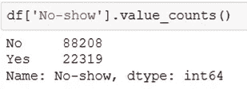

让我们定义一个二进制列 OUTPUT_LABEL 来表示 Yes = 1，No = 0。

```
df[‘OUTPUT_LABEL’] = (df[‘No-show’] == ‘Yes’).astype(‘int’)
```

我们可以检查我们的 OUTPUT_LABEL 的流行程度:

```
def calc_prevalence(y):
 return (sum(y)/len(y))
```

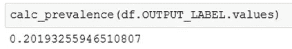

这意味着五分之一的病人将错过他们的预约。

现在，让我们通过查看 ScheduledDay 和 AppointmentDay 的前 5 行来处理 datetime 列

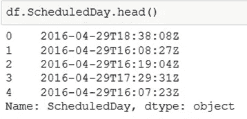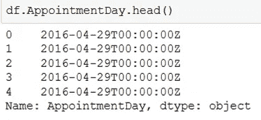

如您所见，两列的 dtype 都是`object`，这意味着 pandas 当前将这些值视为字符串。需要指出的另一点是，ScheduledDay 中的约会日的所有时间都是 00:00:00。我们也许应该处理这个问题，但是我发现他们没有把约会的时间包括在数据集中有点奇怪。据推测，约会的时间也是可以预测的。

要将这些字符串转换成内部日期时间，我们可以使用 pandas 函数`to_datetime`。我喜欢用 format 参数来明确表示格式。如果使用 format 参数，则必须指定如何处理错误。在这里，我将把任何错误转换成非日期时间(NaT)。一般来说(虽然这里不是这样)，使用 format 参数会加快这一行的执行速度。

```
df[‘ScheduledDay’] = pd.to_datetime(df[‘ScheduledDay’], 
 format = ‘%Y-%m-%dT%H:%M:%SZ’, 
 errors = ‘coerce’)
df[‘AppointmentDay’] = pd.to_datetime(df[‘AppointmentDay’], 
 format = ‘%Y-%m-%dT%H:%M:%SZ’, 
 errors = ‘coerce’)
```

我以前没有见过标准格式的 T 和 Z，所以我只是把它们放在格式字符串中。如果有人知道如何更好地处理这些，请告诉我。

每当我使用 format 参数时，如果我假设所有行都应该有日期，我喜欢放一个断言语句来验证我没有得到不正确的格式。

```
assert df.ScheduledDay.isnull().sum() == 0, ‘missing ScheduledDay dates’
assert df.AppointmentDay.isnull().sum() == 0, ‘missing AppointmentDay dates’
```

如果您现在检查 dtype，您将看到它是 datetime64，这正是我们想要的，因为它向我们展示了 pandas 中的所有 datetime 属性。

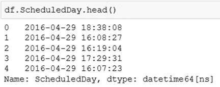

我注意到的一件事是，目前大约有 40k 个约会被安排在约会日期之后。

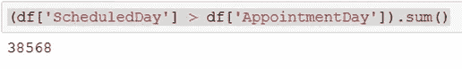

我认为这是因为所有的预约时间都设置在最早的时间(00:00:00 ),而这些时间包含在 ScheduledDay 中。为了适应这种情况，让我们把所有的约会时间移到一天的最后。如果我是为了工作而做这个项目，我会去了解预约时间。

```
df[‘AppointmentDay’] = df[‘AppointmentDay’] +pd.Timedelta(‘1d’) — pd.Timedelta(‘1s’)
```

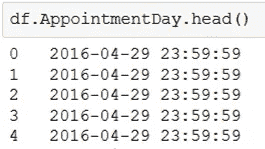

通过这一更改，只有 5 行的计划日期时间在约会日期之后。我们把这几行删掉吧。

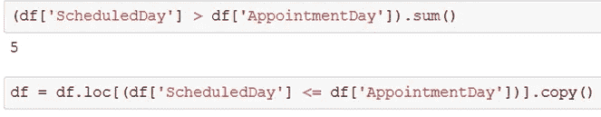

# 工程师日期时间功能

通过将字符串转换为 datetimes，这将公开所有熊猫 dt 属性。

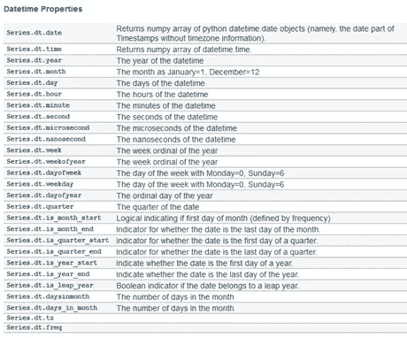

来源:[https://pandas . pydata . org/pandas-docs/version/0.23/API . html # datetime like-properties](https://pandas.pydata.org/pandas-docs/version/0.23/api.html#datetimelike-properties)

基本上你可以把日期分开，得到年、月、周、日、小时、分钟、秒等。还可以得到星期几(星期一= 0，星期日= 6)。请注意一年中的第几周，因为如果该周开始于前一年，则一年的第几天可能是 53。让我们将其中一些属性应用到我们的两个 datetime 列中。

```
df[‘ScheduledDay_year’] = df[‘ScheduledDay’].dt.year
df[‘ScheduledDay_month’] = df[‘ScheduledDay’].dt.month
df[‘ScheduledDay_week’] = df[‘ScheduledDay’].dt.week
df[‘ScheduledDay_day’] = df[‘ScheduledDay’].dt.day
df[‘ScheduledDay_hour’] = df[‘ScheduledDay’].dt.hour
df[‘ScheduledDay_minute’] = df[‘ScheduledDay’].dt.minute
df[‘ScheduledDay_dayofweek’] = df[‘ScheduledDay’].dt.dayofweekdf[‘AppointmentDay_year’] = df[‘AppointmentDay’].dt.year
df[‘AppointmentDay_month’] = df[‘AppointmentDay’].dt.month
df[‘AppointmentDay_week’] = df[‘AppointmentDay’].dt.week
df[‘AppointmentDay_day’] = df[‘AppointmentDay’].dt.day
df[‘AppointmentDay_hour’] = df[‘AppointmentDay’].dt.hour
df[‘AppointmentDay_minute’] = df[‘AppointmentDay’].dt.minute
df[‘AppointmentDay_dayofweek’] = df[‘AppointmentDay’].dt.dayofweek
```

您可以验证这是否有效:

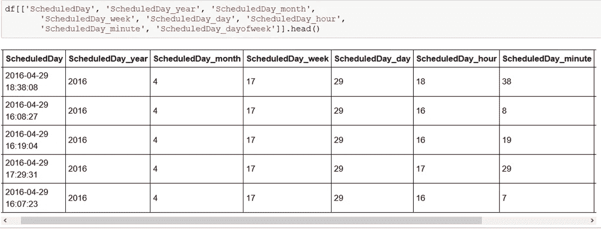

在这一点上，这将是一个很好的探索我们的日期了。

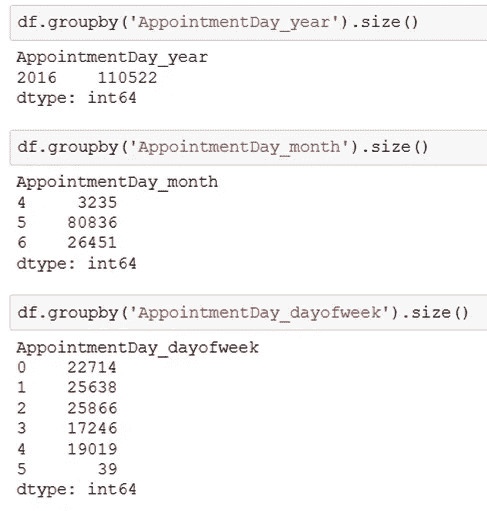

正如你在这里看到的，约会是在 2016 年的 4 月、5 月和 6 月，从周一到周六，周日没有约会。我永远不会使用年份作为一个特征(但还是显示了它)，因为我们可能希望在未来使用这个预测模型，而这些未来的年份不会包含在数据集中。然而，我有点失望，这几个月只是一年中的几个月。这意味着月(以及一年中的周)可能也不应该被用作一个特性。如果我是为了工作而这样做，我会回到数据库，得到一整年(或许多年)的数据。我可以想象，一年中的某些时候(即假期前后)会影响不露面的比率。

让我们快速检查一下 dayofweek 是否预示着失约:

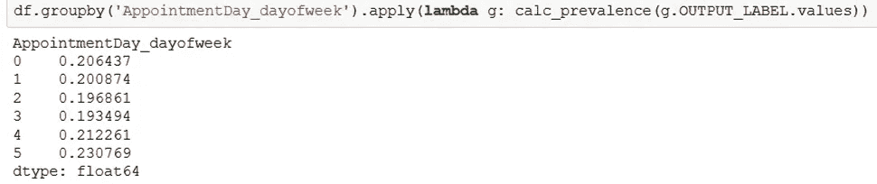

看起来更多的人在周五和周六跳过他们的约会，尽管效果不大。

熊猫日期时间表示的另一个好处是你可以计算日期时间之间的“时间”。让我们创建一个新特性，即计划日期和约会日期之间的天数。

```
df[‘delta_days’] = (df[‘AppointmentDay’]-df[‘ScheduledDay’]).dt.total_seconds()/(60*60*24)
```

注意这里我用的是`total_seconds`。有一个函数 dt.days，但是我习惯使用 total_seconds，因为 1) dt.days 舍入到最近的一天，2) dt.days 过去花费的时间比 total_seconds 长得多。第二点似乎在熊猫后期版本中已经修复。

我们可以在这个变量上绘制两个类的直方图:

```
plt.hist(df.loc[df.OUTPUT_LABEL == 1,’delta_days’], 
 label = ‘Missed’,bins = range(0,60,1), normed = True)
plt.hist(df.loc[df.OUTPUT_LABEL == 0,’delta_days’], 
 label = ‘Not Missed’,bins = range(0,60,1), normed = True,alpha =0.5)
plt.legend()
plt.xlabel(‘days until appointment’)
plt.ylabel(‘normed distribution’)
plt.xlim(0,40)
plt.show()
```

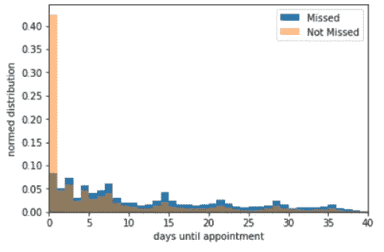

这种分布对我来说有点奇怪，因为大多数没有错过预约的患者都在同一天安排了预约。我有点想知道这个数据集中是否包括预约。我的猜测是，这个模型只会在 1 天画一条线，并说如果你在同一天安排它，就不会错过。

我们现在准备分割我们的样本并训练一个模型！

# 分割样本

为了简单起见，我只分成两个数据集:训练(70%)和验证(30%)。打乱你的样本是很重要的，因为你可能是按照日期顺序得到数据的。

```
# shuffle the samples
df = df.sample(n = len(df), random_state = 42)
df = df.reset_index(drop = True)df_valid = df.sample(frac = 0.3, random_state = 42)
df_train = df.drop(df_valid.index)
```

我们可以查一下每个地区的患病率约为 20%:

```
print(‘Valid prevalence(n = %d):%.3f’%(len(df_valid),calc_prevalence(df_valid.OUTPUT_LABEL.values)))
print(‘Train prevalence(n = %d):%.3f’%(len(df_train), calc_prevalence(df_train.OUTPUT_LABEL.values)))
```

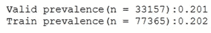

鉴于该数据仅来自 2016 年 4 月至 6 月，且无预约时间，我们将仅使用这些列:

```
col2use = [‘ScheduledDay_day’, ‘ScheduledDay_hour’,
 ‘ScheduledDay_minute’, ‘ScheduledDay_dayofweek’, 
 ‘AppointmentDay_day’,
 ‘AppointmentDay_dayofweek’, ‘delta_days’]
```

“日”特征甚至可能是可疑的，但是现在让我们离开。

如果我们具备以下条件，这一范围还可以扩大:

*   整个日历年的约会
*   约会时间

现在，我们可以构建用于训练和验证的 X(输入)和 Y(输出):

```
X_train = df_train[col2use].values
X_valid = df_valid[col2use].valuesy_train = df_train[‘OUTPUT_LABEL’].values
y_valid = df_valid[‘OUTPUT_LABEL’].valuesprint(‘Training shapes:’,X_train.shape, y_train.shape)
print(‘Validation shapes:’,X_valid.shape, y_valid.shape)
```

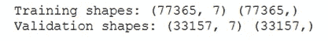

# 训练一个机器学习模型

因为这篇文章的重点是关于日期时间的特性，我们将在这里训练一个随机的森林模型。注意如果要使用其他类型的模型，可能需要对数据进行缩放或规范化。您可能想做的另一件事是通过一键编码将 dayofweek 转换成分类变量。但是对于基于树的方法，我们不需要做这些事情。

```
from sklearn.ensemble import RandomForestClassifier
rf=RandomForestClassifier(max_depth = 5, n_estimators=100, random_state = 42)
rf.fit(X_train, y_train)
```

然后我们可以得到我们的预测:

```
y_train_preds = rf.predict_proba(X_train)[:,1]
y_valid_preds = rf.predict_proba(X_valid)[:,1]
```

# 评估绩效

在这里，我们将评估模型的性能。如果你是分类指标的新手，我推荐你看看我关于这些指标的帖子([技术帖子](/understanding-data-science-classification-metrics-in-scikit-learn-in-python-3bc336865019)或[非技术帖子](/data-science-performance-metrics-for-everyone-4d68f4859eef))。

```
from sklearn.metrics import roc_auc_score, accuracy_score, precision_score, recall_score
def calc_specificity(y_actual, y_pred, thresh):
 # calculates specificity
 return sum((y_pred < thresh) & (y_actual == 0)) /sum(y_actual ==0)def print_report(y_actual, y_pred, thresh):

 auc = roc_auc_score(y_actual, y_pred)
 accuracy = accuracy_score(y_actual, (y_pred > thresh))
 recall = recall_score(y_actual, (y_pred > thresh))
 precision = precision_score(y_actual, (y_pred > thresh))
 specificity = calc_specificity(y_actual, y_pred, thresh)
 print(‘AUC:%.3f’%auc)
 print(‘accuracy:%.3f’%accuracy)
 print(‘recall:%.3f’%recall)
 print(‘precision:%.3f’%precision)
 print(‘specificity:%.3f’%specificity)
 print(‘prevalence:%.3f’%calc_prevalence(y_actual))
 print(‘ ‘)
 return auc, accuracy, recall, precision, specificity
```

使用这个`print_report` 函数，我们可以评估训练和验证的性能。在这里，我将阈值设置为患病率 0.201

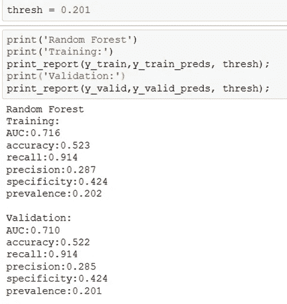

我们可以用它来绘制 ROC

```
from sklearn.metrics import roc_curvefpr_train, tpr_train, thresholds_train = roc_curve(y_train, y_train_preds)
auc_train = roc_auc_score(y_train, y_train_preds)fpr_valid, tpr_valid, thresholds_valid = roc_curve(y_valid, y_valid_preds)
auc_valid = roc_auc_score(y_valid, y_valid_preds)plt.plot(fpr_train, tpr_train, ‘r-’,label =’Train AUC:%.3f’%auc_train)
plt.plot(fpr_valid, tpr_valid, ‘b-’,label =’Valid AUC:%.3f’%auc_valid)
plt.plot([0,1],[0,1],’k — ‘)
plt.xlabel(‘False Positive Rate’)
plt.ylabel(‘True Positive Rate’)
plt.legend()
plt.show()
```

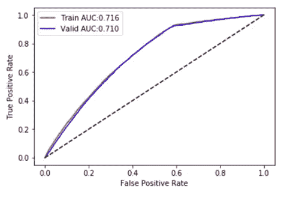

这表明，仅使用日期时间特征，我们就可以获得 0.71 的 AUC。这条摇摆曲线有点奇怪，因为它有肘部。

我们可以通过查看主要特性来对此进行一些研究

```
feature_importances = pd.DataFrame(rf.feature_importances_,
 index = col2use,
 columns=[‘importance’]).sort_values(‘importance’,
 ascending=False)num = min([50,len(col2use)])
ylocs = np.arange(num)
# get the feature importance for top num and sort in reverse order
values_to_plot = feature_importances.iloc[:num].values.ravel()[::-1]
feature_labels = list(feature_importances.iloc[:num].index)[::-1]plt.figure(num=None, figsize=(6, 6), dpi=80, facecolor=’w’, edgecolor=’k’);
plt.barh(ylocs, values_to_plot, align = ‘center’)
plt.ylabel(‘Features’)
plt.xlabel(‘Importance Score’)
plt.title(‘Feature Importance Score — Random Forest’)
plt.yticks(ylocs, feature_labels)
plt.show()
```

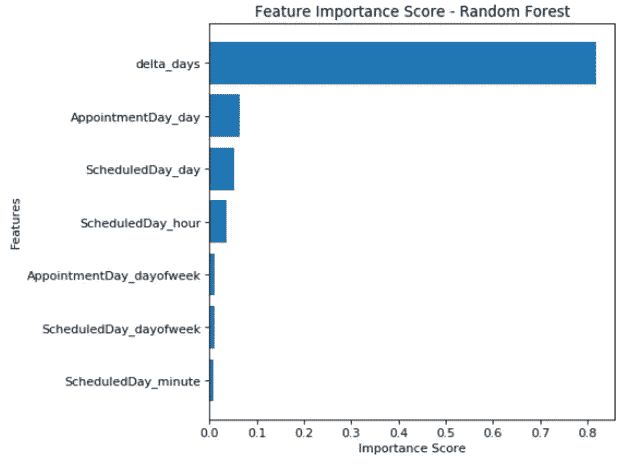

这表明 delta_days 基本上是模型中使用的唯一特征。这证实了我们上面的怀疑，即模型可能会因为那些同一天的约会而陷入困境。

由于我们的训练和验证分数非常相似，这意味着我们处于高偏倚的情况下。为了改进这个模型，我们将需要额外的功能，所以我将在这里结束这个项目。

# 结论

在这个项目中，我们通过解包日期时间变量来预测患者是否会缺席，从而创建了许多新功能。根据我的经验，日期时间功能对医疗保健机器学习模型有很大的影响。我强烈建议在你的下一个项目中尝试一下。如果你对这篇文章有任何问题或疑虑，请联系我们。