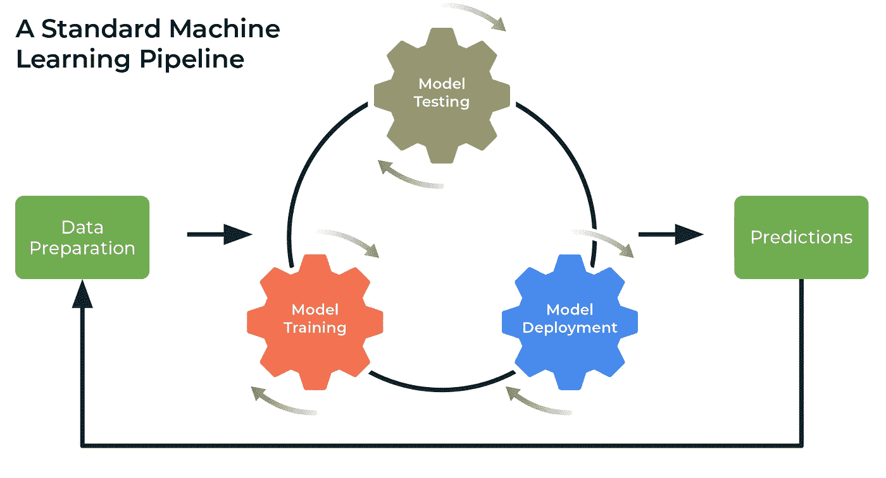
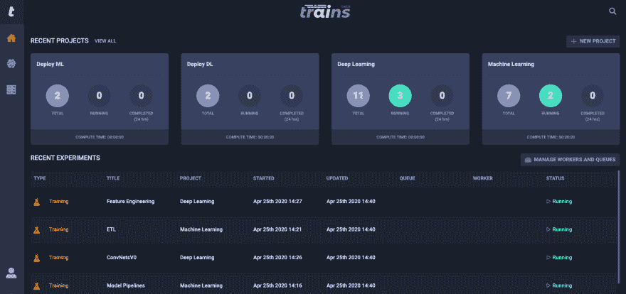

# Jupyter 机器学习:使用开放平台解决工作流管理问题

> 原文：<https://towardsdatascience.com/machine-learning-with-jupyter-solving-the-workflow-management-problem-using-open-platforms-e1cb70ba85ef?source=collection_archive---------36----------------------->

臭名昭著的数据科学工作流程包含数据获取、争论、分析和报告的相互关联的循环，低估了这些组件的多重连接性和非线性。机器学习和深度学习工作流也是如此。我理解在陈述和执行摘要中过度简化的必要性。然而，它可能会描绘出不切实际的画面，隐藏 ML 开发的复杂性，并掩盖混乱的现实。这让我想到了行业工具，或者更通常被称为人工智能的基础设施，它是所有图书馆、实验、设计和创造性思维相遇的载体。这些简陋的基础设施往往被忽视和低估，但它们的重要性怎么强调都不为过。我将解释这些工具中的几个，它们可以协同使用来改进您的工作流、数据探索的责任，并减少从概念验证(POC)到部署的时间和资源。

简化的 ML/DL 管道

# **开源软件**

在你穿着高领衬衫和休闲蓝色牛仔裤上台展示你的数据密集型突破性产品之前，第一步是选择软件来应对机器学习的复杂地形。幸运的是，有优秀的开放软件平台，如 Apache Spark、Jupyter、TensorFlow、PostgreSQL，以及更多可以帮助您入门的平台。我的清单上最近增加了[快板列车](http://t.allegro.ai/git_trains_h1)，我是它的大力支持者。作为一名工作数据科学家，在选择使用开源软件之前，我有五个标准。这些是:

1.  POC 的可用性和易用性
2.  再现性和协作
3.  跨平台兼容性
4.  资源优化
5.  相对于学习率的生产力提升。

本着这些标准的精神，让我们来探索 Jupyter 和 Trains。

# **Jupyter 和 Allegro 火车**

Jupyter 笔记本是有抱负的数据科学家和工程师实现交互式计算的事实上的门户。它以错误或视觉显示的形式提供快速反馈，并允许用户测试他们的基本想法。除了语言无关性和通过 Markdown 单元格提供文本之外，它无疑是 POC 的完美工具。Jupyter Lab 为笔记本电脑增加了模块化，因此您不必为每台笔记本电脑打开多个标签。还有 [JupyterHub](https://jupyterhub.readthedocs.io/en/stable/) ，允许多个用户共享笔记本。这些都是获得一些实践经验的好平台。

当您处理复杂的项目时，问题就来了，其中需要大量的迭代和试验、关键的代码和资源优化、版本控制和协作，以及数据集成和部署。这些是将数据驱动产品推向市场的瓶颈。因此，除了上述五个标准之外，结合这些功能的人工智能架构成为加快 R&D 上市速度、提高投资回报率的必要条件。

图 1:通过 Trains 进行机器学习项目管理

# **为什么快板火车？**

看看**图 1** 中的虚拟四个项目，想象一下如果你在 Jupyter 上运行这些项目，保持每个笔记本目的的难度很快就变成了它自己的任务。您可以通过建立一个 git 存储库来处理您的版本需求和管理您的进度，从而解决这个问题。您还可以安装一个内存分析器来管理每个任务的资源分配。自动化你的 ML 模型怎么样？你可以探索越来越多的[汽车](https://mljar.com/blog/automl-software-list/)。如果你开始意识到你的 ML 项目的复杂性随着每一步的完成而增加，那么你不是唯一的一个。这是一个常见的问题，解决方案应该由一个单独的项目中心来解决。这正是为什么快板火车被开发。

Allegro Trains 解决了这些常见的基础设施问题。与其用无数的模块来修补你的问题，不如用一个包容的解决方案来使 ML 成熟。Trains 提供了一个简单的 MLOps 和 AI 基础设施解决方案，以加快机器/深度学习项目从 R&D 到部署的速度。它允许数据专业人员负责实施创造性的见解，而无需担心凌乱的笔记本、解决版本问题的中断、模型比较、自动日志记录、性能跟踪，甚至 CPU/GPU/IO 资源分配。简而言之，它符合我使用开源软件的五个标准。它还具有自动加速实验的功能，以及从 Web 用户界面终止资源密集型或性能不佳的任务的能力。

我想留给你最后一句话。利用开放平台将你激动人心的想法和 R&D 推向市场的能力已经变成了一个简单的安装问题。Jupyter 可以满足您的探索需求，而 [Allegro Trains](https://allegro.ai/trains-open-source/?utm_source=h_blog&utm_medium=referral&utm_campaign=trains_c) 可以跟踪您的每一个进展，从概念验证到优化和跨团队协作，再到使用 [Trains 服务器](http://t.allegro.ai/git_trains_server_h1)进行部署。