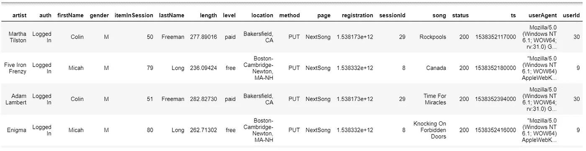
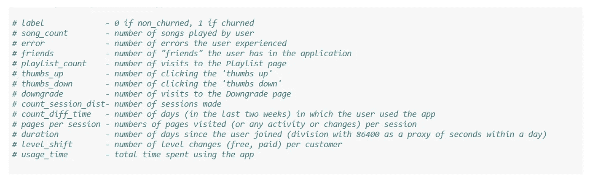
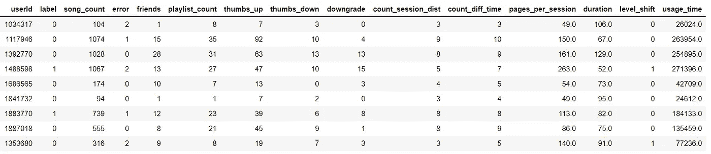
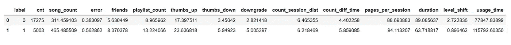
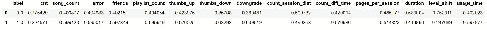
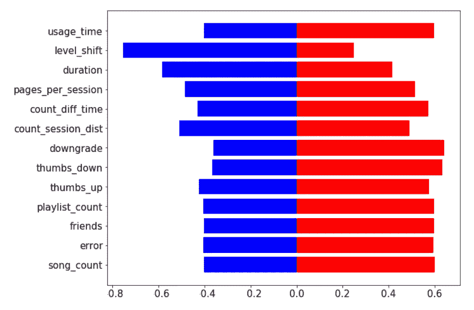
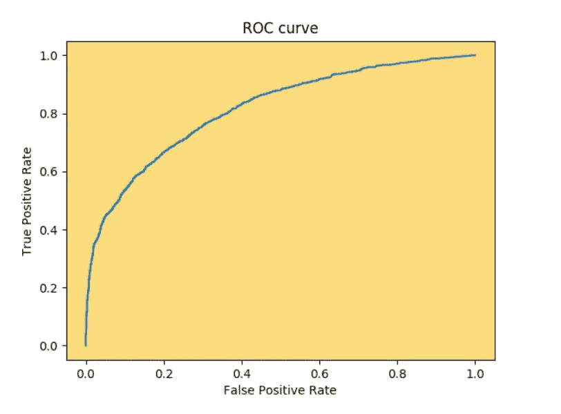

# 用 PySpark 和亚马逊 EMR 进行机器学习

> 原文：<https://towardsdatascience.com/machine-learning-with-pyspark-and-amazon-emr-3149dbc847ae?source=collection_archive---------22----------------------->

想象一下，你有客户如何与你的在线服务互动的详细数据。数据包括客户访问过的页面、他们在每个页面上花费的时间以及客户人口统计数据。一切都在那里。

现在你的老板想利用这些数据。你的公司最近失去了相当多的客户，他希望你提供一个关于剩余客户的预测，这些客户很可能会流失。

熊猫，Scikit-learn，Matplotlib 没什么搞不定的吧？

不对。

在您查看了数据集之后，您会注意到一个重要的细节。该数据有 1 亿行。没有一台机器能处理这么多数据。那你是做什么的？

推荐的方法是使用多台机器。这就是 PySpark 和 EMR 非常有用的地方。

在本文中，我将指导您如何分析一个非常大的数据集(大数据),以及如何针对这些数据运行一些计算量很大的 ML 算法。最终目标是将数据转化为有用的见解，例如，提供关于客户流失的预测。

# 分析

## 1.建立

本文中执行的分析依赖于 PySpark 和 AWS EMR 技术。您可能需要遵循和复制分析的所有技术信息都可以在本[文本](/big-data-in-10-minutes-bead3c012ba4)中找到。该文本是如何设置 AWS EMR(创建您的集群)、启用 PySpark 和启动 Jupyter 笔记本的分步指南。

## 2.数据

用于分析的数据是用户日志的集合。这些日志来源于用户与一家名为 Sparkify 的虚拟在线音乐流媒体公司的互动。数据集有 12 GB，超过 2000 万行，来自 [Udacity](https://www.udacity.com/) ，在亚马逊 S3 服务器上公开提供:

" s3n://uda city-dsnd/spark ify/spark ify _ event _ data . JSON "

数据集预览

数据集中大多数列的名称都是不言自明的。*注册*是客户加入服务的时间。ts 是客户进入特定网页时的时间戳。*注册*和 *ts* 都以 Unix 时间给出(自 1970 年以来的秒数)。l *ength* 是用户在特定页面上花费的秒数。每个会话是用户活跃的特定时间段。 *itemInSession* 是客户在会话期间的页面/网络互动数量。列*级别*显示用户是否为服务付费。

数据集中最重要的列可能是第*页*。它保存了客户访问过的所有 Sparkify 页面。

页面总访问量

通过统计单个页面的访问量，我们可以注意到页面 *NextSong* 是最常被访问的(这是有道理的，因为 Sparkify 是一个在线音乐流媒体服务)。然而，更重要的是了解到达*取消确认*页面的客户。这些都是客户，任务是建立一个可以识别他们的预测模型。

在解释了项目的目标和数据集的基本特征之后，现在开始分析的一切都准备好了。

## 3.预处理

上述数据需要一些预处理。在我的 g [ithub 库](https://github.com/maleckicoa/Sparkify-Project/blob/master/Sparkify_Big.ipynb)中的 Sparkify_Big.ipynb 文件中详细记录了通常的第一步，如包安装、包导入、数据清理、数据标记和重命名。我将跳过这里的预处理，而是专注于:

*   如何将给定的庞大数据集转化为对预测模型有用的输入(**特征工程)**
*   如何对数据集应用分类算法(**机器学习)**

## 4.特征工程

为了获得好的预测结果，适当的特征工程通常比 ML 模型的后续选择更重要。理解数据集并强调最有判别潜力的特征(在分类的情况下)非常重要。

最终，我们的模型应该预测潜在的流失客户，因此日志数据应该聚合到 UserId 级别。我将原始数据集(经过预处理后)转换成 13 个特征，这些特征按每个用户 Id 聚合(大部分是平均的),并将作为模型的输入。下面列出了这些功能:

功能列表

如果您对我如何将原始数据从日志级别提升到 UserId 级别感兴趣，这里有一些好消息:PySpark 支持 SQL 语法。在运行模型之前，我广泛地使用它来准备数据。SQL 语法的替代方法是本机 PySpark 语法。PySpark 语法也很直观，但它允许更多的自由。最好能很好地掌握这两种语法。

预处理数据然后聚合数据的完整代码在前面提到的 [github 库](https://github.com/maleckicoa/Sparkify-Project)中。在这里，我只是想证明，如果您对 SQL 有基本的了解，PySpark 中的数据操作确实是轻而易举的事情。

PySpark 中使用 SQL 的特征工程

经过这种操作后，数据现在是适当的格式，并从大约 2000 多万行减少到大约 22K 行(用户 id 的数量)。

聚合和特征工程后的数据

*标签*是因变量，目的是通过使用提供的 13 个特征来预测它。

我的假设是，在客户流失发生前不久，流失客户和非流失客户的行为应该是不同的。对于每个用户，我丢弃了自上次交互以来超过 14 天的所有数据。我想在客户流失前抓住他们的行为。

我的期望是流失客户经历更多的错误，发起更多的“反对”,并且通常与非流失客户不同。以下是 13 个特征的平均值，分别针对有不良反应和无不良反应的客户(0 表示无不良反应，1 表示有不良反应):

流失和非流失客户的平均特征值

我将上表中的数据按列**标准化，为蝴蝶图准备数据。**

****

**按列标准化的平均特征值**

**下图显示了两个用户类别之间存在的差异。对于流失客户来说，错误、降级和否决的数量更高，这是有道理的。然而，起初，我发现大多数其他功能对客户流失有更高的价值是不寻常的。一个看似合理的解释是，流失客户确实是更活跃的用户，他们离开了 Sparkify，用更好的音乐替代了它。换句话说，也许顾客在离开之前对 Sparkify 并不完全满意。或许 Sparkifys 的竞争更胜一筹。**

****

**用户特征的蝶形图**

**该图证明了这两个用户群之间确实存在明显的差异，因此分类模型可能会成功预测流失的客户。**

## **5.建模**

**我们准备试用一些精选的型号。PySpark 有一个非常好的[机器学习库](https://spark.apache.org/docs/latest/api/python/pyspark.ml.html)，它支持一系列的 [ML 算法](https://spark.apache.org/docs/2.2.0/ml-classification-regression.html)。**

**对于客户流失分析，以下软件包就足够了:**

**导入一些 PySpark ML 包**

**在第一行中，我们导入 VectorAssembler。这是 PySpark 特有的步骤，因为 Pyspark 要求将所有特征值作为一个列表添加到一个输入列中，输入到模型中。**

**然后，我们导入我们想要尝试的模型，以及它们的评估者。还引入了流水线方法，这有助于训练过程更加连贯。最后导入 CrossValidator、ParameterGridBuilder 等模型训练优化的工具。**

**我们可以开始构建 ML 基础设施。**

**PySpark 中的 ML 设置步骤**

**此阶段通常的设置步骤是:**

*   **将数据分为训练和测试。**
*   **创建保存所有特征值的列( *inputFeatures)* 。**
*   **特征值然后被归一化并传递到输出列(*特征)***
*   **模特被称为**
*   **这些步骤都被连接成一个管道**

**我们已经准备好训练模型，让我们从简单的**逻辑回归**开始**

**逻辑回归的模型训练**

**在 ML 流程的这一部分，我们正在运行模型训练并优化参数。**

**步骤:**

*   **创建参数网格(可选，但推荐)**
*   **将评估指标传递给分类评估员**
*   **定义交叉验证器中的折叠数(可选，但推荐)**

**ParamGridBuilder 对象可以保存特定 ML 算法支持的所有参数值。在上面的逻辑回归的例子中，我决定设置正则化参数和最大迭代次数的值。您可以设置许多其他值和参数，但请注意，对于给定的每个参数值，模型训练都将再次运行(这可能代价很高)。**

**为手头的任务选择的度量是 F1。**

**在交叉验证步骤中，我加入了前面的两个步骤，并设置了 K 倍交叉验证参数的值。K-fold 参数定义了训练将被重复多少次，每次使用不同的测试数据子集。**

**模型被训练和拟合。最终结果是，我们的 F1 指标产生了 **0.69****

**对于第一次尝试来说还不错。**

**让我们使用更高级的模型，比如**随机森林分类器****

**随机森林的 F1 度量**

**随机森林产生更好的结果 F1= **0.8****

**这次我跳过了参数网格的输入，因为(即使在 AWS EMR 上)训练过程相当慢。加快速度的一个方法是增加集群的大小。你可以随意自己做，你可以在这里找到要调整的参数。**

**我尝试的最后一个模型是**梯度提升树分类器****

**GBT 分类器的 F1 度量**

**GBT 分类器的表现略好于随机森林，F1= **0.81****

**看起来我们有一个赢家！**

## **6.形象化**

**让我们可视化我们获胜模型的 ROC 曲线，只是为了证明 AWS EMR 上的 Jupyter 笔记本可以支持可视化，正如预期的那样。**

**我们将使用 Matplotlib 进行可视化，但是我们需要首先在 AWS EMR 上安装这个包。这里需要注意的一点是，软件包安装不能与通常的 *pip 安装*一起工作。相反，软件包的安装如下所示:**

**PySpark 上的软件包安装**

**最后要考虑的是，AWS EMR 上 Jupyter 中的 plot 命令需要括在***PLT . clf()****和 ***%matplot plt*** 魔法函数之间。***

***注意 plt.clf()和%matplot plt 神奇函数***

***这是我们的 ROC 曲线***

******

***GBT 分类器的 ROC 曲线***

## ***结论***

***我们的分析已经结束了！***

***我们设法利用 PySpark 和 AWS EMR 的强大功能，通过庞大的数据集，对其进行压缩并提取有用的特征。最后，我们训练了一个模型，预测客户流失与体面的表现！***

***但是没有一个 ML 过程是完全结束的，并且总是有改进的空间。我们的分析也可以在几个方面得到加强:***

*   ***一些共享强相关性的特征应该被排除在模型之外***
*   ***新的和更复杂的特征可以被设计并添加到模型中***
*   ***尝试其他 ML 算法***
*   ***在参数网格中包含更多参数值***

***我希望这篇文章能让你更熟悉在处理大数据时可以采用的分析/ML 方法。PySpark 和 AWS EMR 是强大的技术，使大数据处理对更广泛的公众可用且负担得起。下次这个庞大的数据集出现时，您将做好准备！***

****本文有意省略了一些数据处理部分，以便更加关注围绕模型训练的 PySpark 步骤。如果您希望详细查看客户流失分析，您可以在此* *找到代码* [*。*](https://github.com/maleckicoa/Sparkify-Project)***